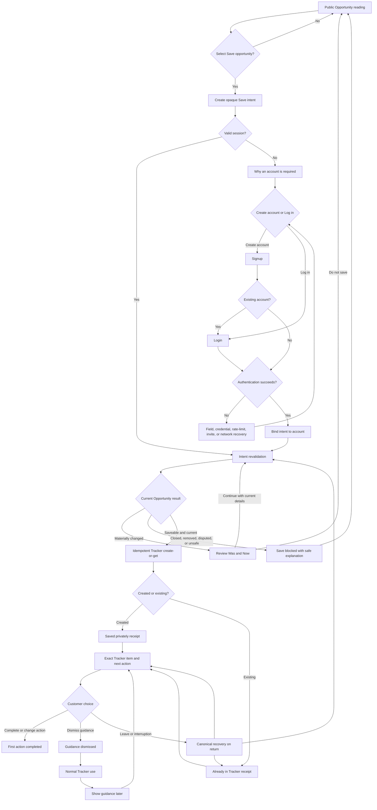

# Missa first-Save onboarding journey specification

**Journey:** Public Opportunity → Save intent → signup or login → intent revalidation → private Tracker item → first useful next action

**Evidence date:** 16 August 2026

**Specification status:** Recommendation; ready for low-fidelity design and research, not approved for product promotion

**Repository baseline:** local checkout at `cc4fba6f8` on `codex/spacing-system`; production parity not verified

This specification separates repository fact, local implementation, approved design contract, recommendation, hypothesis, and domain blocker. A rendered screen or passing component test is not evidence that the complete service journey is production-ready.

## 1. Executive decision

Design the first onboarding slice as a resumable **first-Save service lifecycle**, attached to one real Opportunity. A person reads the public record, explicitly asks Missa to save it privately, authenticates only because persistence requires an account, returns to the same Opportunity, reviews any material change, receives an idempotent Tracker result, and sees one state-derived next action.

This slice comes first because it satisfies the primary job with the least data and the smallest consequential surface. Current code already provides public Opportunity reading, a bounded Save intent, authentication return paths, a private Tracker write, database uniqueness for an account–Opportunity pair, and a task-oriented Tracker. External research also supports public value before signup, contextual guidance, data minimization, and complete-process accessibility: [Nielsen Norman Group on mobile onboarding](https://www.nngroup.com/articles/mobile-app-onboarding/), [Microsoft Fluent 2 onboarding](https://fluent2.microsoft.design/onboarding), [European Commission data minimization](https://commission.europa.eu/law/law-topic/data-protection/information-business-and-organisations/principles-gdpr/how-much-data-can-be-collected_en), and [W3C WCAG 2.2](https://www.w3.org/TR/WCAG22/).

Deliberately defer mandatory Profile setup, public Profile publication, preference collection, Work or File upload, Saved Answers, integrations, Calendar and notification permission, Organization work, reviewer setup, paid-plan prompts, and a general product tour. After first trustworthy value, a separate, skippable “Improve future suggestions” action may collect explicit private preferences under its own purpose and control contract.

The most important unresolved risk is **canonical revalidation**. The current Tracker Save checks that a relational Opportunity is published and deduplicates the write, but it does not compare the intent-time Opportunity version with current deadline, status, fee, source, eligibility, destination, or dispute state. Without that domain contract, Missa can preserve an action while allowing the person to rely on stale facts.

## 2. Evidence audit

Reviewed source baseline: `_bmad-output/planning-artifacts/research/domain-missa-onboarding-customer-experience-research-2026-08-16.md`, `DESIGN.md`, `docs/missa-content-style-guide.md`, `docs/missa-auth-onboarding-contract-2026-08-08.md`, `docs/missa-auth-onboarding-visual-directions-2026-08-08.md`, `docs/missa-profile-screen-contract-2026-08-08.md`, and `docs/missa-tracker-submissions-screen-contract-2026-08-08.md`, reconciled against the current public Opportunity, Save, auth redirect, auth UI/API, Tracker UI/API/domain, database constraint, invite, and analytics implementations. “Verified” below means verified in this repository baseline unless the row expressly says production; no production inspection was performed.

| Claim                                                                                                                                                                                                      | Evidence source                                                                                                                                  | Current implementation status              | Confidence                                 | Design implication                                                                                                                                                       |
| ---------------------------------------------------------------------------------------------------------------------------------------------------------------------------------------------------------- | ------------------------------------------------------------------------------------------------------------------------------------------------ | ------------------------------------------ | ------------------------------------------ | ------------------------------------------------------------------------------------------------------------------------------------------------------------------------ |
| Public Opportunity details are readable without an account for public lifecycle states.                                                                                                                    | `apps/web/app/opportunities/[id]/page.tsx`; `apps/web/components/opportunity-detail-view.tsx`                                                    | Implemented and verified                   | High, repository                           | Preserve public reading. Authentication starts only after explicit Save.                                                                                                 |
| Signed-out Save carries a same-origin return path and a bounded `save:<opportunityId>` intent through login/signup.                                                                                        | `apps/web/lib/authRedirect.ts`; Opportunity detail; login/signup pages                                                                           | Implemented and verified                   | High, repository                           | Keep typed intent, but replace semantic URL payload with an opaque, expiring server-held intent.                                                                         |
| `safeAuthRedirect` rejects missing, non-root-relative, and protocol-relative destinations, but does not implement the dated contract’s full route allowlist or encoded/control-character/backslash checks. | `apps/web/lib/authRedirect.ts`; auth contract section 5                                                                                          | Partial                                    | High, repository                           | Harden and test return-path normalization before implementation promotion.                                                                                               |
| Successful auth attempts the Tracker Save in the browser and then redirects to the Opportunity even when the Save response fails.                                                                          | `apps/web/components/auth-form.tsx`                                                                                                              | Implemented locally, production unverified | High, dirty checkout                       | Move resume/revalidation/write orchestration to a server-authoritative endpoint; surface an unresolved result instead of relying on a toast.                             |
| The current auth form requires name, email, password, and password confirmation for signup, plus an optional waitlist email. Errors are one form-level alert.                                              | `apps/web/components/auth-form.tsx`; signup API                                                                                                  | Implemented locally, production unverified | High, dirty checkout                       | Question whether name is necessary for first private Save; associate errors with fields; separate invite/waitlist recovery from ordinary signup.                         |
| Local auth changes add rate limiting and an optional Neon Auth compatibility bridge.                                                                                                                       | dirty diffs in login/signup APIs, `auth-form.tsx`, `lib/neon-auth/*`                                                                             | Implemented locally, production unverified | High, repository; low for runtime          | Treat provider, rate-limit, and compatibility-session states as distinct; do not claim deployment or real-account parity.                                                |
| Generic login failure is intended to avoid account enumeration, but current local paths contain inconsistent punctuation/provider fallbacks.                                                               | login API; `auth-form.tsx`; current auth security contract                                                                                       | Partial                                    | High                                       | Preserve a single reviewed customer contract across providers and tests.                                                                                                 |
| Waitlist invite storage distinguishes sent, redeemed, expired, revoked, already-used, not-found, and unavailable conditions.                                                                               | migration `0027_waitlist_invites.sql`; `waitlistInvites.ts`; invite redeem API                                                                   | Implemented locally, production unverified | High, repository; low for deployed schema  | Project these states safely without revealing another account; invite failure must not erase a valid account or Save intent.                                             |
| Relational Tracker creation is idempotent for an account and Opportunity.                                                                                                                                  | unique index `tracked_opportunities_account_opp_idx`; `saveCanonicalOpportunityToTracker()`                                                      | Implemented and verified                   | High, code/schema                          | Make this uniqueness key the canonical duplicate boundary; return `created` or `already-present` with the existing item ID.                                              |
| `/api/me/tracker` rejects an authenticated account without the internal `userId` mapping as `Profile is not available`, before either repository path runs.                                                | `apps/web/app/api/me/tracker/route.ts`                                                                                                           | Partial                                    | High, repository                           | First Save must require an account-to-Tracker ownership mapping, not customer Profile completion or Profile fields; provisioning/recovery must be atomic or supportable. |
| The relational Save stores status `interested`, while the approved Tracker projection treats `Interested` as a compatibility alias for customer stage `Saved`.                                             | `canonicalTracker.ts`; Tracker status mapping; Tracker screen contract                                                                           | Partial                                    | High                                       | API, event, and analytics output must use the approved `Saved` projection while engineering reconciles storage vocabulary without destructive history rewrite.           |
| The fallback in-memory Tracker also checks for an existing item, but persistence and concurrency guarantees differ from PostgreSQL.                                                                        | `/api/me/tracker`; engine store                                                                                                                  | Partial                                    | High                                       | Production acceptance must verify the configured repository; do not infer relational guarantees from fallback behaviour.                                                 |
| Save currently checks publication existence only; lifecycle status and material fact differences are not compared.                                                                                         | `canonicalTracker.ts` Save transaction                                                                                                           | Partial                                    | High                                       | Add revalidation projection and material-diff policy before the write.                                                                                                   |
| The Tracker locally offers Active/Next Actions, deadline attention, status changes, Work linking, and accessible live updates.                                                                             | Tracker page and `tracker-product.tsx`; Tracker screen contract                                                                                  | Implemented locally, production unverified | High for code; medium for complete process | Return to the exact item and expose one next action; validate full journey with assistive technology and real devices.                                                   |
| Current first action for a newly Saved item is normally “Review opportunity”; no dedicated first-Save receipt/guidance state exists.                                                                       | `itemAction()` and Tracker rendering                                                                                                             | Partial                                    | High                                       | Specify a deterministic next-action projection and a replayable guidance receipt.                                                                                        |
| Public Opportunity analytics and auth success events exist; Save intent, revalidation, Tracker creation, recovery, and first-action events do not form a lifecycle taxonomy.                               | analytics provider, event API, platform event ledger, auth APIs                                                                                  | Partial                                    | High                                       | Instrument domain transitions, with server authority for canonical states and schema allowlists for properties.                                                          |
| The browser analytics provider can send full page URLs to PostHog pageviews while auth intent lives in query parameters.                                                                                   | `analytics-provider.ts`; current auth URL model                                                                                                  | Partial                                    | High                                       | Remove sensitive/semantic intent from URLs and configure analytics URL/query redaction before pilot.                                                                     |
| Profile setup and public publication are separate contracts; Profile completion must not gate Opportunities or Tracker.                                                                                    | Profile screen contract; current product boundaries                                                                                              | Implemented locally, production unverified | High for contract; deployment unverified   | No Profile questionnaire or public publication in this journey.                                                                                                          |
| The approved auth direction is task return, not a tour; the dated contract uses “Create account,” not “Create Profile.”                                                                                    | auth contract and visual directions                                                                                                              | Recommendation                             | High                                       | Use **Create account**. Account creation neither completes nor publishes a Profile.                                                                                      |
| Generic tours can add interaction and memory cost; contextual guidance should solve an observed obstacle.                                                                                                  | onboarding research; NN/g; Fluent 2                                                                                                              | Recommendation                             | Medium for Missa until tested              | Attach guidance to the saved Opportunity and let people dismiss/reopen it.                                                                                               |
| WCAG 2.2 adds complete-process obligations relevant to focus, redundant entry, target size, and accessible authentication.                                                                                 | [WCAG 2.2](https://www.w3.org/TR/WCAG22/); [re-authentication understanding](https://www.w3.org/WAI/WCAG22/Understanding/re-authenticating.html) | Recommendation                             | High, standard                             | Test auth, interruption, retry, mutation, and return as one process; automated scans are insufficient.                                                                   |
| Global naming, direction, locale, and time presentation require data-model support, not translation alone.                                                                                                 | [W3C internationalization quick tips](https://www.w3.org/International/quicktips/index); Missa research                                          | Recommendation                             | High, standard                             | Store source timezone and instant separately; accept Unicode names; use logical layout properties and locale-aware display.                                              |
| Opportunity version comparison, intent persistence, next-action authority, support routing, and retention policy are not complete services.                                                                | current audit and code                                                                                                                           | Blocked by domain/service work             | High                                       | These are promotion gates, not visual-design tasks.                                                                                                                      |

### Classification boundary

- **Current implemented behaviour:** public Opportunity reading, query-carried bounded Save intent, auth return, client-triggered post-auth Save, and relational Tracker deduplication exist in the inspected checkout.
- **Local or unverified implementation:** the dirty auth/Neon/rate-limit changes and the locally promoted Profile/Tracker compositions have not been verified against the production deployment in this task.
- **Existing design contracts:** the dated auth, Profile, Tracker, design-system, and content documents govern language, ownership, accessibility, and promotion boundaries; they are not evidence that the complete journey runs in production.
- **Proposed target behaviour:** the opaque intent service, account binding, material revalidation, persistent receipt, exact-item return, deterministic next action, recovery projection, and lifecycle analytics are recommendations in this specification.
- **Domain or service blockers:** Opportunity version/materiality, auth authority, cross-device intent recovery, Tracker action ownership, analytics redaction/retention, support routing, and minors policy require named owners and evidence before promotion.

### Unvalidated hypotheses

1. Showing the exact private-Save purpose at the moment of Save will preserve more qualified intent than sending people directly to generic Login.
2. A persistent canonical receipt and exact Tracker-item link will improve result comprehension over a toast plus page refresh.
3. Thirty-minute anonymous and 24-hour account-bound intent windows will provide useful recovery without creating disproportionate privacy/security risk.
4. A deterministic Opportunity-derived next action will be more useful than a generic `Review opportunity` action without being interpreted as eligibility advice.
5. Was/Now material-change review will prevent stale reliance without causing people to abandon beneficial deadline extensions unnecessarily.
6. Deferring the chosen-name field will reduce data burden without creating an unacceptable account, support, or auth-provider problem.
7. Offering **Improve future suggestions** only after first value will produce better-understood, more voluntary preference data than asking before the first Save.

These hypotheses require the research and prototype tests in sections 15–16. None authorizes product code or promotion.

## 3. Actor and job definition

**Primary actor.** A creator or applicant who has found one potentially relevant Opportunity and wants to preserve it privately. They may be new to Missa or returning, signed out or signed in, highly systematic or currently relying on email, bookmarks, notes, spreadsheets, or memory. This is a job definition, not a fictional persona.

**Entry contexts.** Web search, social link, partner or Organization referral, Missa search/filter/recommendation, a shared link, or a return to a previously viewed Opportunity. Entry may occur on mobile, desktop, a shared device, a low-bandwidth connection, or assistive technology.

**Functional job.** Save the exact Opportunity once, understand its current facts, and identify the next useful task without learning the whole product or supplying unrelated information.

**Emotional job.** Reduce uncertainty and cognitive load without artificial reassurance or urgency. The person should feel in control of whether to create an account, what becomes private, and whether to continue.

**Trust job.** Know what Missa saved, what it did not do, which source is authoritative, whether facts changed, who can see the item, and how to undo or recover. Save must not imply eligibility, application intent, submission, recipient acknowledgement, or public publication.

**Accessibility and global circumstances.** The journey must work with screen readers, keyboard, voice input, magnification, 200–400% zoom, reduced motion, password managers, extra time, cognitive-support needs, Unicode names, mononyms and professional names, right-to-left layout, non-US date orders, different source/customer timezones, daylight-saving transitions, mobile-only and intermittent connectivity, expensive data, and privacy-sensitive shared devices.

**Reasons to refuse or abandon.** The Opportunity is not useful; the account request feels disproportionate; name or identity feels unsafe; password creation or invite state blocks progress; the person already tracks elsewhere; Missa’s source or deadline looks unreliable; the connection fails; the person cannot tell whether Save is private; the form is inaccessible; the person fears marketing, public Profile creation, eligibility inference, or lost work; or the time cost exceeds the expected value.

## 4. Current-state journey

| Step                   | Customer action                                           | Interface                                                                                                                        | System action                                                                               | Data created                                               | Customer question                                                      | Friction                                                                                                       | Risk                                                                                                         | Evidence confidence                                         |
| ---------------------- | --------------------------------------------------------- | -------------------------------------------------------------------------------------------------------------------------------- | ------------------------------------------------------------------------------------------- | ---------------------------------------------------------- | ---------------------------------------------------------------------- | -------------------------------------------------------------------------------------------------------------- | ------------------------------------------------------------------------------------------------------------ | ----------------------------------------------------------- |
| 1. Read                | Opens a public Opportunity.                               | Public detail with title, Organization, summary, key facts, eligibility, requirements, source, and signed-out `Sign in to save`. | Loads canonical Opportunity for public statuses; records public view.                       | Public analytics event; no account data.                   | Is this current, relevant, and trustworthy?                            | Date formatting is fixed to `en`; time/timezone can be absent; closed records disappear for signed-out people. | Missing timezone or unknown facts may be misread.                                                            | High, current code.                                         |
| 2. Express Save intent | Selects `Sign in to save`.                                | Direct link to login; no dedicated explanation before navigation.                                                                | Encodes same-origin Opportunity return and `save:<id>` in query.                            | URL-carried intent only.                                   | Why must I sign in, and will this stay private?                        | New customers land on Login first and must find Create account.                                                | Intent has no expiry, durable receipt, or server ownership; query may enter analytics/history.               | High, current code.                                         |
| 3. Authenticate        | Logs in or switches to signup.                            | Split auth page with generic product story; signup asks name, optional waitlist email, email, password, confirmation.            | Validates mostly at form level; calls legacy auth or local Neon bridge.                     | Account/session; possible waitlist redemption; auth event. | Will I return to this Opportunity? What does account creation publish? | Return context and Opportunity identity are not shown in the auth hierarchy; errors are not field-associated.  | Provider divergence, account enumeration/copy inconsistency, inaccessible recovery, unnecessary data burden. | High for checkout; production unverified where dirty.       |
| 4. Resume Save         | Waits after auth.                                         | Pending submit; then toasts.                                                                                                     | Client posts Opportunity ID to `/api/me/tracker`; redirects regardless of Save success.     | Tracker item if write succeeds.                            | Was it actually saved?                                                 | A transient toast is the main result; redirect and mutation are coupled in the browser.                        | Auth may succeed while Save fails; response loss creates ambiguous status.                                   | High, current code.                                         |
| 5. Deduplicate         | Repeats Save or another tab sends the same request.       | Toast says `Already in Tracker` if response arrives.                                                                             | Relational path uses unique account–Opportunity index; fallback checks existing array item. | No second relational item.                                 | Did Missa create another copy?                                         | Existing Tracker item is not directly returned/focused in the interface.                                       | Different configured repositories offer different concurrency guarantees.                                    | High for relational code/schema; runtime config unverified. |
| 6. Return              | Arrives back at the Opportunity.                          | Opportunity now shows `In Tracker` if the refreshed projection contains the item.                                                | Reloads Opportunity with personal projection.                                               | No journey receipt or material-change acknowledgement.     | Did anything change while I was signing in?                            | No explicit revalidation/loading/review state.                                                                 | Closed, changed, disputed, or altered Opportunity can be saved or relied on without review.                  | High, current code.                                         |
| 7. Open Tracker        | Selects `In Tracker` or navigates to Tracker.             | Active view; rows/cards and deadline attention.                                                                                  | Loads private Tracker and hosted submissions from configured stores.                        | Page view only; no first-Save journey state.               | What should I do now?                                                  | The saved item is not guaranteed to be first, anchored, or highlighted.                                        | Generic navigation can dilute first value; local design is not production proof.                             | High for code; production unverified.                       |
| 8. Take next action    | Selects `Review opportunity` or changes status/Work link. | Opportunity link or Tracker control with live status for mutations.                                                              | Updates status or Work relation; rolls back local optimistic change on failure.             | Tracker status event or Work link.                         | Is this the right next action for this Opportunity?                    | `Review opportunity` is generic; no action source/version/dismiss/replay contract.                             | The product can mark interaction without proving meaningful first value.                                     | High for local code; medium for end-to-end accessibility.   |
| 9. Recover             | Retries after failure or reopens the browser.             | Generic auth or canonical pages.                                                                                                 | Relies on session, URL, and canonical Tracker uniqueness.                                   | Depends on where failure occurred.                         | What completed, and what should I retry?                               | No unresolved-journey projection or cross-device resume receipt.                                               | Duplicate attempts are partly safe, but ambiguous outcomes and stale intent are not explicitly reconciled.   | High gap confidence.                                        |

## 5. Target journey

### Happy path

1. The person reads the full public Opportunity. The page shows current lifecycle state, deadline in source timezone and local timezone where available, fee, location, eligibility, requirements, application destination ownership, source, unknowns, and correction/report path.
2. They select **Save opportunity**. This explicit action creates one anonymous, opaque, server-held Save intent. The interface immediately explains: an account is required only to keep a private Tracker item; Save does not apply, prove eligibility, notify the Organization, or publish a Profile.
3. If unauthenticated, the person chooses **Create account** or **Log in**. The auth surface names the Opportunity and intended result. It asks only for the minimum authentication data and preserves the intent across mode switch, recoverable errors, password-manager use, and re-authentication.
4. Authentication success binds the unresolved intent to the account. Auth alone is not journey success. A server orchestrator enters `intent_revalidating` and reads the current Opportunity plus the intent-time material-fact snapshot.
5. If no material fact changed, the Tracker domain performs an idempotent create-or-get. The response includes canonical Tracker item ID, result `created` or `already_saved`, current Opportunity version, and next-action projection.
6. Missa returns to the exact Opportunity with a persistent inline receipt: **Saved privately** or **Already in Tracker**. The receipt links to the exact Tracker item and states the first next action. A toast may supplement but never replace it.
7. The person opens the exact Tracker item. Focus lands on its heading/receipt, the item remains private, and one actual next action is visible. They may do it, change it, dismiss guidance, remove the Save, or leave.
8. Completion is recorded only when a meaningful Tracker action changes canonical state: for example, a sourced requirement is reviewed, a preparation task is created/completed, the person changes status to Preparing, or they deliberately replace/dismiss the proposed action.

### Alternate, failure, and return paths

| Scenario                                       | Target behaviour                                                                                                                                                                                                       | Canonical result                                                                                           |
| ---------------------------------------------- | ---------------------------------------------------------------------------------------------------------------------------------------------------------------------------------------------------------------------- | ---------------------------------------------------------------------------------------------------------- |
| A. Signed-out new visitor                      | Save explanation → Create account → intent bind → revalidation → create/get → exact Opportunity receipt → exact Tracker item/action.                                                                                   | `tracker_item_created` then `next_action_presented`.                                                       |
| B. Signed-out returning customer               | Save explanation → Log in → same orchestration. Email may persist when switching modes; passwords never do.                                                                                                            | Same as A.                                                                                                 |
| C. Existing email in signup                    | Use a safe, abuse-resistant response that offers **Log in** without exposing account details. Preserve Opportunity, journey ID, and entered email only; clear password/confirmation/name unless policy says otherwise. | `authentication_required` with reason `existing_account_recovery`.                                         |
| D. Incorrect credentials                       | Associate summary and password/email form state; retain email, clear neither pasted password nor password-manager control automatically; announce error; do not consume intent.                                        | `authentication_in_progress`; no Tracker write.                                                            |
| E. Waitlist/invitation                         | Project valid, expired, revoked, already-used, not-found-safe, and unavailable separately. A valid account can still be created when policy permits; unresolved Save survives. Never name another invitee/account.     | Auth or invite substate; journey remains resumable until intent expiry.                                    |
| F. Already authenticated                       | No auth interstitial. Save directly enters revalidation, then create/get.                                                                                                                                              | `intent_revalidating` → created/already saved.                                                             |
| G. Already saved                               | Read existing item under account–Opportunity uniqueness. Say **Already in Tracker** and link to it; do not emit a created event.                                                                                       | `already_saved`.                                                                                           |
| H1. Deadline extended                          | Show old and new absolute deadline/timezone before reliance. Offer **Keep saved** (or continue Save) and **Review source**.                                                                                            | `material_change_requires_review`; explicit acknowledgement permits create/get.                            |
| H2. Deadline passed or Opportunity closed      | Explain the current state and source. Do not create a normal active Save. If product authority approves archival saving later, make it a separately labelled **Save for reference** action.                            | `save_blocked`; existing items remain accessible.                                                          |
| H3. Fee/source/eligibility/destination changed | Show labelled `Was`/`Now` facts and source. Require explicit review before create/get. A destination host change receives elevated warning.                                                                            | `material_change_requires_review`.                                                                         |
| H4. Disputed/removed/unsafe                    | Withhold unsafe destination; explain at the safest permitted level; offer report/support and public browsing.                                                                                                          | `save_blocked`.                                                                                            |
| I1. Timeout before auth                        | Keep the server intent and same-device HttpOnly token until anonymous expiry; offer Retry or Return to Opportunity.                                                                                                    | `journey_recovered` on retry.                                                                              |
| I2. Auth succeeds, redirect fails              | Account-bound unresolved intent appears on re-entry and another authenticated device. Server resumes from revalidation, not auth.                                                                                      | `journey_recovered`.                                                                                       |
| I3. Redirect succeeds, Save fails              | Opportunity receipt says account is active but Save is unresolved; Retry calls create-or-get with same idempotency key.                                                                                                | `journey_recovered` or `save_blocked`.                                                                     |
| I4. Write succeeds, response is lost           | Retry reads by unique account–Opportunity and returns existing item; UI says **Already in Tracker**.                                                                                                                   | `already_saved`; no duplicate created event.                                                               |
| I5. Multiple tabs                              | All intents for same account/opportunity converge on one Tracker item. Later responses reconcile to canonical item/version.                                                                                            | One created event; subsequent already-saved events.                                                        |
| I6. Browser closed/reopened                    | Same device resumes anonymous intent within 30 minutes; after auth, account-bound unresolved intent is discoverable for 24 hours across devices. Expired intent returns to the public Opportunity without writing.     | `journey_recovered` or `journey.abandoned` reason `intent_expired`.                                        |
| J. Declines signup                             | Return to exact public Opportunity. Suppress repeated blocking prompts until the person selects Save again; explain public reading remains available.                                                                  | No account/write; explicit `journey.abandoned` reason `declined_auth` only if analytics basis is approved. |
| K. Assisted use                                | Same states and receipts through semantic forms, stable focus, live status, no inaccessible challenge, copy/paste/password manager support, extra time, and no motion dependence.                                      | Task parity required; any blocker prevents promotion.                                                      |
| L. Global/resilience                           | Text-first loading, Unicode-safe account field, logical layout, source/local timezone, localized date order, shared-device controls, and no mandatory US identity/address/phone fields.                                | Same canonical outcome across locale/device/connectivity.                                                  |

### Materiality and next-action rules

Capture at intent creation: Opportunity ID, canonical version ID or immutable fact digest, publication/lifecycle state, deadline kind/instant/source timezone, fee status/amount/currency, eligibility digest, application destination origin and path digest, source ID/origin, Organization ID, dispute/safety state, and taxonomy/source snapshot for recommendation provenance.

A change is material when it can alter whether, when, where, at what cost, under which rule, or with what trust basis the person acts. Copyediting, imagery, and non-consequential summary changes do not block Save, but the saved item should reference the current version.

Next-action priority is deterministic:

1. unresolved conflict or missing consequential fact → **Check the official source**;
2. changed fact acknowledged → **Review what changed** until acknowledgement is recorded;
3. known eligibility rules not reviewed → **Review eligibility** (never **Check eligibility** as an automated verdict);
4. known required materials → **Review requirements** or the first required preparation task;
5. otherwise → **Open the official source**.

The person can replace the action, mark it not relevant, or dismiss the guidance. Dismissal removes coaching, not the Tracker item or the action’s underlying state. **Show guidance** remains available from the item menu/help.

## 6. State and transition table

### Canonical state runtime contract

| State                             | Entry trigger; canonical authority; required data                                                                                                              | Visible interface; primary and secondary actions                                                                                                                               | Exit conditions                                                                  | Recoverable failures                                                                                                 | Terminal failures                                                                                    |
| --------------------------------- | -------------------------------------------------------------------------------------------------------------------------------------------------------------- | ------------------------------------------------------------------------------------------------------------------------------------------------------------------------------ | -------------------------------------------------------------------------------- | -------------------------------------------------------------------------------------------------------------------- | ---------------------------------------------------------------------------------------------------- |
| `opportunity_viewed`              | Public page load; Opportunity repository reconciled to named source; Opportunity/version/source/status/deadline/timezone/fee/location/eligibility/destination. | Public record. Primary **Save opportunity**; secondary **Official source**, **Report issue**, browse.                                                                          | Save selected, leave, or record becomes unavailable.                             | Repository timeout, partial fields, stale cache: retry/text fallback/source link.                                    | Removed/unsafe record may show safe not-available state.                                             |
| `save_intent_created`             | Explicit Save; journey-intent service; random journey ID, account absent/present, Opportunity ID, material snapshot, created/expiry, safe return.              | Compact explanation and auth choice or revalidation status. Primary **Create account**/**Continue saving**; secondary **Log in**, **Keep reading**.                            | Auth required, revalidation for signed-in person, decline, or expiry.            | Cookie blocked, service timeout: retry without duplicate intent.                                                     | Invalid/missing Opportunity or policy-blocked creation.                                              |
| `authentication_required`         | No valid session; auth service plus intent service; journey ID, safe return context, Opportunity display identity.                                             | Why-account explanation and auth choices. Primary **Create account** or **Log in**; secondary **Return to Opportunity**.                                                       | Auth starts, customer declines, intent expires.                                  | Mode switch, provider unavailable, session recovered.                                                                | Account creation prohibited by policy (for example unresolved age policy) with safe public return.   |
| `authentication_in_progress`      | Form/provider submit; auth service; minimum credentials, provider state, invite state, rate-limit state.                                                       | Signup/login form, pending, validation, rate-limit, invite, network recovery. Primary submit/retry; secondary switch mode/return.                                              | Auth succeeds, retry, cancel, hard policy denial.                                | Invalid credentials, existing email, timeout, rate limit, provider/invite outage.                                    | Suspended/blocked account only with reviewed safe copy/support route.                                |
| `authentication_succeeded`        | Valid session created/confirmed; auth service; account ID, session ID, journey ID binding, timestamp.                                                          | Brief server-driven `Returning to [Opportunity]` status. No celebration. Secondary **Open Opportunity** if automatic continuation stalls.                                      | Intent revalidation starts or no valid intent returns to safe destination.       | Redirect loss, cross-device re-entry, expired client state.                                                          | Account lacks required product identity mapping: supportable service error, no Save claim.           |
| `intent_revalidating`             | Bound intent resumed; Opportunity repository is authoritative for current facts, intent service for snapshot.                                                  | Exact Opportunity identity and `Checking current details…`. No destructive action. Secondary **Return to Opportunity**.                                                        | Unchanged → create/get; material change → review; blocked → save blocked.        | Repository timeout, source service degradation: retry later; do not use stale snapshot as authority.                 | Record removed/unsafe or target identity mismatch.                                                   |
| `tracker_item_created`            | Idempotent transaction returns inserted item; Tracker domain; Tracker item ID, account ID, Opportunity ID/version, status Saved, event/idempotency keys.       | Persistent **Saved privately** receipt with item title and next action. Primary next action; secondary **View Tracker**, **Undo Save**.                                        | Next action shown, undo, or leave.                                               | Response loss reconciles through create-or-get/read-after-write.                                                     | Ownership mismatch is a security incident; never show another item.                                  |
| `already_saved`                   | Create-or-get finds unique existing item; Tracker domain.                                                                                                      | Persistent **Already in Tracker** receipt, existing status/context, exact item link. Primary **Open Tracker item**; secondary **Keep reading**.                                | Item opened, action shown, leave.                                                | Existing item temporarily unavailable: retry canonical read.                                                         | Existing item inaccessible due to policy/account state: safe support path.                           |
| `material_change_requires_review` | Current material digest differs; Opportunity repository/change history.                                                                                        | `Was`/`Now`, source, consequence, current date/timezone. Primary **Continue with current details** when allowed; secondary **Official source**, **Do not save**.               | Acknowledge and revalidate again; decline; change becomes blocking.              | Additional concurrent change restarts comparison; network retry preserves acknowledgement only for reviewed version. | Closed/removed/unsafe becomes blocked.                                                               |
| `save_blocked`                    | Policy/material state prevents normal active Save; Opportunity/safety policy authority.                                                                        | Exact safe reason, current source when safe, what remains available. Primary **Return to Opportunity** or **Browse open Opportunities**; secondary report/support.             | State later changes and person explicitly retries; otherwise ends without write. | Temporary repository/safety review outage can retry.                                                                 | Removed/unsafe/forbidden target; no active Tracker creation.                                         |
| `next_action_presented`           | Tracker item read returns deterministic action projection; Tracker + current Opportunity facts.                                                                | Exact item, privacy boundary, one action and its reason. Primary action; secondary **Change action**, **Dismiss guidance**, **Remove from Tracker**.                           | Action completed/changed, guidance dismissed, item removed, leave.               | Projection unavailable: item remains saved; retry without losing receipt.                                            | No valid action: show `No action suggested` plus official source, not fabricated advice.             |
| `first_action_completed`          | Canonical Tracker mutation or explicit action replacement; Tracker domain.                                                                                     | Inline result with current item state and next relevant information. Primary continue normal Tracker use; secondary undo where safe.                                           | Journey first-value lifecycle closes; future states belong to Tracker.           | Mutation response loss reconciled to domain event/idempotency key.                                                   | None for onboarding; invalid action is recoverable and does not erase Save.                          |
| `guidance_dismissed`              | Explicit dismiss; guidance preference/projection authority, not Tracker status.                                                                                | Coaching removed; item/action remains. **Show guidance** available in item menu/help.                                                                                          | Reopen manually or material context change invites, never forces, review.        | Preference sync failure: keep guidance visible and explain.                                                          | None; dismissal never blocks product.                                                                |
| `journey_recovered`               | Re-entry after expiry boundary, timeout, response loss, tab/device change, or re-auth; journey orchestrator reads canonical auth/Opportunity/Tracker state.    | `We found your Save request` plus actual result: continue auth, review change, saved, already saved, or expired. Primary state-specific continuation; secondary public return. | Routes to the correct canonical state.                                           | Reconciliation timeout; retry with same journey ID.                                                                  | Expired anonymous intent ends without write; unsafe/mismatched ownership routes to support/security. |

### State operations contract

| State                             | Analytics event                                                                        | Support responsibility                                                                 | Accessibility announcement and focus                                                              | Retention or expiry                                                                                            |
| --------------------------------- | -------------------------------------------------------------------------------------- | -------------------------------------------------------------------------------------- | ------------------------------------------------------------------------------------------------- | -------------------------------------------------------------------------------------------------------------- |
| `opportunity_viewed`              | `public.opportunity_view`; not an activation event.                                    | Editorial/source operations owns corrections; Organization/source owns official facts. | H1 receives focus only on direct navigation; source status is text, not color.                    | Public record per Opportunity policy.                                                                          |
| `save_intent_created`             | `discovery.opportunity_save_intent_created` (client request, server accepted).         | Product support for intent failure; security for abuse.                                | `Save request started. An account is required to keep this private.` Focus explanation heading.   | Anonymous: 30 minutes proposed; opaque cookie same lifetime.                                                   |
| `authentication_required`         | `auth.authentication_required` server projection.                                      | Auth support; public reading remains self-service.                                     | Focus H1; reason associated with form; no surprise modal focus trap.                              | Journey TTL continues.                                                                                         |
| `authentication_in_progress`      | `auth.authentication_attempted` remains security telemetry, not funnel success.        | Auth/security; invite operations for invite state.                                     | Field error association and alert summary; focus first invalid field after summary action.        | Credentials per auth policy; passwords never retained in journey/analytics.                                    |
| `authentication_succeeded`        | `auth.authentication_succeeded` server.                                                | Auth service; journey support if bind fails.                                           | Polite `Account ready. Returning to [Opportunity].`; focus moves on navigation, not toast.        | Session per auth policy; unresolved account-bound intent 24 hours proposed.                                    |
| `intent_revalidating`             | `journey.intent_revalidated` only when result known.                                   | Opportunity operations for source failures.                                            | `Checking current Opportunity details.` then announce result; preserve focus.                     | Attempt logs per security/ops policy; material snapshot until resolution plus proposed 30-day incident window. |
| `tracker_item_created`            | `tracker.opportunity_created` server, once per item creation.                          | Tracker support owns write/result; source ops owns facts.                              | `Opportunity saved privately. [Action] is next.` Focus persistent receipt.                        | Tracker item until person removes/account policy; creation event per analytics policy.                         |
| `already_saved`                   | `tracker.opportunity_already_saved` server.                                            | Tracker support.                                                                       | `This Opportunity is already in Tracker.` Focus receipt/existing item link.                       | No new item; journey receipt proposed 30 days.                                                                 |
| `material_change_requires_review` | `journey.material_change_presented` server fact + client presentation acknowledgement. | Source/editorial ops; Organization for official fact.                                  | Alert heading, then `Deadline changed from…to…`; focus change summary.                            | Acknowledgement tied to exact version; expires on any newer material version.                                  |
| `save_blocked`                    | `journey.intent_revalidated` with result `blocked`; no Tracker created event.          | Source/safety/support based on reason code.                                            | Assertive only for immediate safety; otherwise polite. Focus reason heading.                      | Intent closes; minimum incident/audit retention requires legal decision.                                       |
| `next_action_presented`           | `tracker.next_action_presented` server projection/presentation receipt.                | Tracker product/content; source ops for action facts.                                  | Announce action and reason once; no repeated live-region noise.                                   | Action until completed/replaced/invalidated; presentation event per analytics policy.                          |
| `first_action_completed`          | `tracker.next_action_completed` server for canonical mutation.                         | Tracker support.                                                                       | Announce actual saved state; focus stays on initiating control or resulting heading.              | Tracker event history per domain policy.                                                                       |
| `guidance_dismissed`              | `journey.guidance_dismissed`; do not call completion.                                  | Product support/help content.                                                          | `Guidance dismissed. You can show it again from this item.` Focus returns to item.                | Until reopened or context materially changes; account-scoped sync.                                             |
| `journey_recovered`               | `journey.state_recovered` server with bounded reason.                                  | Owning domain plus support case escalation.                                            | `Your Save request was recovered.` Then announce canonical result; focus recovered-state heading. | Recovery receipt proposed 30 days; no credentials/private content.                                             |

### Transition contract

| From → to                                    | Trigger                                                                    | Guard and authority                                   | Consequence and receipt                                         | Expiry                                     | Recovery                                                       |
| -------------------------------------------- | -------------------------------------------------------------------------- | ----------------------------------------------------- | --------------------------------------------------------------- | ------------------------------------------ | -------------------------------------------------------------- |
| Viewed → intent created                      | Explicit Save                                                              | Public, saveable object identity; intent service      | Create opaque journey and material snapshot; inline explanation | 30 min anonymous                           | Retry returns same active intent for same browser/opportunity. |
| Intent → auth required                       | No valid session                                                           | Auth service                                          | No private write; auth context names Opportunity                | Intent TTL                                 | Return to public reading without punishment.                   |
| Auth required → in progress                  | Submit/provider choice                                                     | Valid mode/provider/invite state                      | Pending receipt; duplicate submit disabled                      | Intent TTL; rate-limit window separate     | Correct fields, wait, change mode, or return.                  |
| Auth in progress → succeeded                 | Valid session                                                              | Auth service authoritative                            | Bind journey to account; auth receipt                           | 24h unresolved after bind                  | Re-entry/cross-device account resume.                          |
| Auth succeeded/intent created → revalidating | Bound intent or already signed in                                          | Intent ownership; current Opportunity read            | Comparison result with version IDs                              | Immediate; no stale fallback               | Retry; public return remains.                                  |
| Revalidating → material review               | Material digest differs                                                    | Opportunity repository/change policy                  | Human-readable `Was`/`Now`; no write                            | Until reviewed version changes             | Re-fetch on continue.                                          |
| Revalidating/review → blocked                | Closed, passed, removed, disputed/unsafe, missing destination under policy | Opportunity/safety policy                             | Safe reason; zero active write                                  | Intent closes                              | Later explicit Save creates new intent if state reopens.       |
| Revalidating/review → created                | Current/acknowledged version saveable                                      | Tracker transaction + unique key                      | Created item ID/status/version and read-after-write receipt     | Idempotency key at least journey retention | Lost response becomes already-saved read.                      |
| Revalidating/review → already saved          | Unique item exists                                                         | Tracker read by account/opportunity                   | Existing item receipt, never fake creation                      | No new item                                | Retry exact item read.                                         |
| Created/already saved → action presented     | Item and action projection readable                                        | Tracker item + Opportunity facts                      | Action ID/type/reason/source version                            | Invalidated by item/fact change            | Reproject without changing item.                               |
| Action presented → action completed          | Canonical mutation or deliberate replacement                               | Tracker transition rules/idempotency                  | Domain event/receipt                                            | Domain retention                           | Reconcile retry against event/item.                            |
| Action presented → guidance dismissed        | Explicit dismiss                                                           | Guidance preference only                              | Dismiss receipt; action/item unchanged                          | Until reopen/material context              | Show guidance control.                                         |
| Any recoverable state → recovered            | Re-entry/retry                                                             | Read auth, intent, Opportunity, Tracker in that order | Route to one canonical result                                   | Anonymous/account-bound TTL                | Never replay a write blindly.                                  |

## 7. Service blueprint

| Stage             | Customer-visible experience               | Frontstage Missa interface                        | Authentication service                                                           | Opportunity repository                                    | Tracker domain                                                          | Analytics/event system                                    | Support and operations                                         | External source or Organization responsibility                    | Authoritative system                                                               |
| ----------------- | ----------------------------------------- | ------------------------------------------------- | -------------------------------------------------------------------------------- | --------------------------------------------------------- | ----------------------------------------------------------------------- | --------------------------------------------------------- | -------------------------------------------------------------- | ----------------------------------------------------------------- | ---------------------------------------------------------------------------------- |
| Public reading    | Reads facts and source without account.   | Public Opportunity detail.                        | None.                                                                            | Serves public version/status and named source provenance. | None.                                                                   | Public view only.                                         | Editorial/source ops correct records.                          | Owns official rules, deadline, fee, eligibility, destination.     | Opportunity repository for Missa projection; official source for underlying facts. |
| Save intent       | Selects Save and learns private boundary. | Inline explanation/auth choice.                   | Reports session presence only.                                                   | Supplies intent-time material snapshot.                   | No item yet.                                                            | Server records accepted intent.                           | Product support for intent errors.                             | No recipient action.                                              | Journey-intent service for intent; Opportunity repository for snapshot.            |
| Authentication    | Creates account or logs in.               | Task-return form with Opportunity context.        | Owns credentials, session, rate limit, account/provider/invite-compatible state. | No mutation.                                              | No mutation.                                                            | Server auth success; security events separately governed. | Auth/security and invite ops.                                  | None.                                                             | Auth service.                                                                      |
| Revalidation      | Sees checking state or material changes.  | Revalidation/change review.                       | Confirms account/journey ownership.                                              | Re-reads current version, lifecycle, facts, safety.       | Reads existing item only after ownership confirmed.                     | Server records result/presentation.                       | Source/safety ops own discrepancy resolution.                  | Organization/source owns official current facts and corrections.  | Opportunity repository plus change/safety policy.                                  |
| Save transaction  | Receives Saved or Already saved.          | Persistent receipt; retry-safe loading.           | Supplies account identity.                                                       | Confirms referenced current version.                      | Atomic create-or-get; unique account–Opportunity key; read-after-write. | Server writes created or already-saved with idempotency.  | Tracker support reconciles ambiguous outcomes.                 | Not notified; receives nothing.                                   | Tracker domain.                                                                    |
| First next action | Sees exact item and one reasoned action.  | Tracker item/action, dismiss/replay.              | Maintains session; re-auth preserves work.                                       | Supplies facts that shape action.                         | Owns item, action projection, status, completion.                       | Server events for presented/completed.                    | Tracker/content and source ops split by issue.                 | Official source remains authority for external application rules. | Tracker for private action; Opportunity repository for call facts.                 |
| Return/recovery   | Resumes from actual state.                | Recovery receipt and state-specific continuation. | Session/account state.                                                           | Current fact/version state.                               | Existing item/event state.                                              | Recovery event with bounded reason.                       | Owning domain routes support; incident process for mismatches. | Corrects official facts; no Missa Save receipt authority.         | Reconciliation order: auth → intent → Opportunity → Tracker.                       |

No notification, browser client, analytics store, toast, redirect URL, or guidance layer is authoritative for authentication, Opportunity facts, Tracker creation, eligibility, application submission, or Organization receipt.

## 8. Information and data requirements

Proposed retention periods are design defaults pending legal/privacy approval. “Private” means visible to the account owner and authorized Missa operations under policy; it does not mean the value is absent from secured service logs.

| Name                                      | Purpose                                                     | Required/optional                                                                     | Source                                            | Visibility                                                                  | Recipient                                                    | Retention                                             | Editable                                                  | Deletable                                                   | If skipped                                                          | Legal/policy question                                                            |
| ----------------------------------------- | ----------------------------------------------------------- | ------------------------------------------------------------------------------------- | ------------------------------------------------- | --------------------------------------------------------------------------- | ------------------------------------------------------------ | ----------------------------------------------------- | --------------------------------------------------------- | ----------------------------------------------------------- | ------------------------------------------------------------------- | -------------------------------------------------------------------------------- |
| `journey_id`                              | Correlate/resume one Save lifecycle.                        | Required for signed-out Save.                                                         | Random server generation.                         | Opaque; private/operational.                                                | Intent, auth, analytics correlation services.                | 30 min anonymous; proposed 30-day resolved receipt.   | No.                                                       | Expires/deletes by policy.                                  | Save cannot survive auth interruption.                              | Is 30-day receipt necessary/minimal?                                             |
| Intent kind                               | Bound action `save_opportunity`.                            | Required.                                                                             | Explicit Save.                                    | Operational; interface may say Save.                                        | Journey orchestrator.                                        | With journey.                                         | No; a new action creates new intent.                      | With journey.                                               | No resumed action.                                                  | None beyond purpose limitation.                                                  |
| Opportunity ID                            | Identify exact public object.                               | Required.                                                                             | Opportunity repository.                           | Public ID; privately linked to account only after Save.                     | Intent/Tracker.                                              | Journey then Tracker lifetime.                        | No.                                                       | Removed with Tracker item/account subject to exceptions.    | Cannot Save.                                                        | Behavioural signal status and export/deletion.                                   |
| Intent-time material snapshot/version     | Detect stale reliance.                                      | Required.                                                                             | Opportunity repository.                           | Private operational digest; human diff only if changed.                     | Revalidation service.                                        | Until resolved plus bounded audit/incident period.    | No.                                                       | Per retention policy.                                       | Must re-fetch without comparison; promotion blocked.                | Whether hashes/versions are personal data when account-bound.                    |
| Safe return path                          | Return to exact same-origin public object.                  | Required.                                                                             | Server allowlist from canonical route.            | URL may show canonical public path only.                                    | Router.                                                      | Request/session only.                                 | No.                                                       | On resolution.                                              | Default to canonical Opportunity.                                   | Route classes allowed for ordinary customers.                                    |
| Opaque intent cookie/token                | Resume anonymous same-device intent.                        | Required for interruption resilience.                                                 | Server.                                           | HttpOnly, Secure, SameSite=Lax; never analytics.                            | Journey service only.                                        | 30 min.                                               | Rotated, not edited.                                      | On resolve/expiry.                                          | Person must restart Save.                                           | Cookie notice/classification by jurisdiction.                                    |
| Email address                             | Account authentication and essential service communication. | Required under current password model.                                                | Customer.                                         | Private account data.                                                       | Auth provider/Missa account service; no Organization.        | Account/auth policy.                                  | Yes with verification policy.                             | Account/right request subject to security/legal exceptions. | Cannot create password account; login alternatives may apply later. | Lawful basis, verification, breach and transfer controls.                        |
| Password                                  | Authenticate.                                               | Required under password model.                                                        | Customer/password manager.                        | Never visible to Missa product/analytics/support; hashed by auth authority. | Auth service only.                                           | Per auth security policy; plaintext never retained.   | Reset/change.                                             | Replaced/removed with account policy.                       | Use another approved auth method if available.                      | Provider/security/recovery policy.                                               |
| Chosen/display name                       | Provider/account display if genuinely necessary.            | **Current required; target recommendation: optional/deferred.**                       | Customer; Unicode string, one field.              | Private until separately published.                                         | Account/Profile only.                                        | Account/Profile policy.                               | Yes.                                                      | Yes subject to account constraints.                         | First Save still works in target.                                   | Can auth provider support no name? No legal-name implication; minors/pseudonyms. |
| Password confirmation                     | Error prevention during signup.                             | Required only for manual password creation UI; not stored.                            | Customer.                                         | In-memory form only.                                                        | Browser/auth submit validation.                              | Until submit/navigation.                              | Yes.                                                      | Automatic.                                                  | Cannot submit until match.                                          | Accessible authentication and paste/password-manager compatibility.              |
| Invite token/hash/state                   | Apply access/waitlist policy without revealing invitee.     | Optional, journey-specific.                                                           | Invite service/email.                             | Token secret; safe state visible.                                           | Invite/auth service.                                         | Single-use and time-bound; audit per policy.          | State only by authorized ops.                             | Token expires; audit retention policy.                      | Ordinary signup/Save continues where policy permits.                | Account enumeration, lawful messaging, retention.                                |
| Waitlist email                            | Reconcile prior waitlist priority.                          | Current optional; target remove from ordinary signup and handle in separate recovery. | Customer.                                         | Private.                                                                    | Waitlist/invite service.                                     | Per waitlist policy.                                  | Correct through support.                                  | Rights policy.                                              | No effect on first Save.                                            | Safe matching and account-enumeration risk.                                      |
| Account/session IDs                       | Own private item and authorize requests.                    | Required after auth.                                                                  | Auth service.                                     | Operational/private.                                                        | Intent/Tracker/analytics with access controls.               | Session/account policy.                               | No.                                                       | On account lifecycle subject to audit/legal needs.          | Cannot persist privately.                                           | Cross-service identifier minimization.                                           |
| Revalidation result and material diff     | Explain change/blocking.                                    | Required before result.                                                               | Comparison service from two Opportunity versions. | Private journey receipt; facts may be public.                               | Customer, support if escalated.                              | Proposed 30 days; longer only for incident.           | Acknowledgement only.                                     | Policy-controlled.                                          | Save remains unresolved/blocked.                                    | Audit necessity and source copyright.                                            |
| Tracker item ID and status                | Canonical private Save.                                     | Required for value.                                                                   | Tracker transaction.                              | Private to account.                                                         | Customer; authorized Missa support.                          | Until removed/account lifecycle.                      | Status editable.                                          | Item removable; event retention decision required.          | Journey cannot reach first value.                                   | Export/deletion and legitimate-interest audit.                                   |
| Opportunity version on Tracker item       | State which facts shaped Save/next action.                  | Required target field/reference.                                                      | Opportunity repository at commit.                 | Private operational; changes shown in plain language.                       | Tracker/revalidation.                                        | With item/history.                                    | No; later versions append/reconcile.                      | With item per policy.                                       | Stale incidents cannot be reconstructed.                            | Retention minimization.                                                          |
| Next-action ID/type/reason/source version | Present one deterministic task and measure completion.      | Required when valid action exists.                                                    | Tracker projection.                               | Private.                                                                    | Customer; product analytics receives bounded type, not text. | Until completed/replaced; history per Tracker policy. | Customer can replace/dismiss.                             | Yes with item/history policy.                               | Show no suggested action and source link.                           | Avoid inferred eligibility/sensitive reasoning.                                  |
| Save signal provenance                    | Support later recommendation ranking without overclaiming.  | Required if Save is used as signal.                                                   | Tracker creation event.                           | Private preference/behaviour data.                                          | Recommendation service only under approved purpose.          | Decay/expiry policy required.                         | Person can undo Save/disable behavioural personalization. | Clear history where appropriate.                            | Recommendations may not use this signal.                            | Lawful purpose, profiling notice, objection/opt-out.                             |
| Opportunity taxonomy/source snapshot      | Preserve what the Save signal referred to.                  | Required for permitted recommendation use.                                            | Opportunity repository.                           | Private operational.                                                        | Recommendation/evaluation system.                            | Versioned; proposed decay aligned with signal.        | Source facts corrected through Opportunity process.       | With signal/history policy.                                 | Recommendation cannot explain historical input reliably.            | Source accuracy, taxonomy change, profiling.                                     |
| Coarse locale/timezone/device class       | Evaluate global and access parity.                          | Optional/minimized.                                                                   | Browser/account setting.                          | Analytics only, coarse.                                                     | Authorized analytics team.                                   | Proposed 13 months aggregate/raw review required.     | Locale/timezone editable at product level.                | Analytics deletion policy.                                  | Core journey unaffected.                                            | Consent/lawful basis, re-identification and small cohorts.                       |
| Marketing consent                         | Not needed for first Save.                                  | Optional and **not requested here**.                                                  | Customer if later asked.                          | Private consent record.                                                     | Messaging service.                                           | Evidence per law/policy.                              | Yes.                                                      | Yes/withdrawable.                                           | No effect.                                                          | Jurisdictional direct-marketing rules.                                           |

Do not collect or send biography, discipline, genre, career stage, location, identity attributes, eligibility declarations, public handle, Work, File, Saved Answer, Calendar access, notification permission, Gmail/file-provider access, precise location, or payment data in this journey.

## 9. Screen and interaction specification

| Surface                        | Purpose and hierarchy                                                                                                                                      | Actions and required content                                                                                                                                                 | Focus, loading, empty, error, success                                                                                                                                                | Mobile and accessibility requirements                                                                                                                |
| ------------------------------ | ---------------------------------------------------------------------------------------------------------------------------------------------------------- | ---------------------------------------------------------------------------------------------------------------------------------------------------------------------------- | ------------------------------------------------------------------------------------------------------------------------------------------------------------------------------------ | ---------------------------------------------------------------------------------------------------------------------------------------------------- |
| Public Opportunity state       | Establish trust before account: H1/title → Organization/source → status/deadline/timezones/fee/location → eligibility/requirements → destination boundary. | Primary **Save opportunity** when saveable; secondary **Official source**, report, browse. Say unknowns exactly and distinguish recommendation from eligibility.             | Focus H1 on direct navigation. Text skeleton first; preserve layout. Not-found/removed/closed states have safe explanation. Success is comprehension, not an event animation.        | One column; first useful facts before media; 44px controls; semantic headings/dl; no hover dependence; source/local dates wrap/reflow.               |
| Save control                   | Capture explicit intent once and reflect current account/Tracker state.                                                                                    | States: Save opportunity, Saving…, Saved, Already in Tracker, unavailable. Accessible description: private persistence, no application.                                      | Pending preserves width and blocks duplicate activation. Network error inline beside control; retry. Success links exact item.                                                       | Full label, not icon alone on first use; 44×44; voice-input name unique; status not color-only.                                                      |
| Authentication explanation     | Explain why account is proportionate and what follows. Hierarchy: `Save [title] privately` → account reason → non-effects → auth choices.                  | Primary **Create account**; secondary **Log in**, **Return to Opportunity**. Required: Opportunity title/Organization, private boundary, intent expiry/recovery if relevant. | Focus heading. Loading only when checking session. Error preserves public return. Success moves to auth heading or revalidation.                                                     | Inline page/section, not obstructive modal; Opportunity identity truncates accessibly; no marketing story before task.                               |
| Signup                         | Create minimum account and preserve Save. Hierarchy: H1 → return context → fields → privacy/terms as policy requires → submit.                             | **Create account**; secondary **Log in**, return. Target fields: email/password/confirmation; chosen name only if human authority retains requirement.                       | Focus H1 then first field. Pending says Creating account…. Field errors plus linked summary; existing account route. Success goes to revalidation, not a generic dashboard.          | Correct autocomplete; paste/password manager allowed; show password maintains focus/value; one-column form; no inaccessible CAPTCHA.                 |
| Login                          | Return to the Save task.                                                                                                                                   | **Log in**; secondary Create account, working recovery if implemented, return. Show exact Opportunity context.                                                               | Invalid credential error associated with form and announced once; email retained; rate-limit wait rendered as text/time. Success → revalidation.                                     | Same field/target/focus requirements as signup; keyboard submit; no forced pointer gesture.                                                          |
| Existing-account recovery      | Move signup → login without losing safe context.                                                                                                           | **Log in** primary; **Use another email** secondary. Retain entered email only. Copy does not expose provider/account details.                                               | Focus recovery heading, then login email. Provider/recovery unavailable gives public return.                                                                                         | No color-only warning; password manager sees login semantics after switch; back does not erase intent.                                               |
| Auth error states              | Distinguish field validation, invalid credentials, rate limit, provider/network, invite state, session conflict.                                           | State what failed, what remains, and next action. Never render provider secrets.                                                                                             | Field error `aria-describedby`; summary links first invalid field; `role=alert` for submitted failure; pending changes use status. Recovery success returns to same intent.          | Errors remain at 400% zoom; extra time; countdown not sole path; copy/paste and voice correction supported.                                          |
| Return/revalidation state      | Show that auth is complete but Save is still being checked.                                                                                                | Opportunity identity, current-source check, private intent. Secondary open Opportunity if delayed.                                                                           | Focus H1 after redirect; `Checking current details…` status. Timeout preserves account/intent and offers Retry. Success routes to change/created/existing receipt.                   | Text-only; no spinner-only communication; reduced motion; live region announces start and outcome once.                                              |
| Material-change review         | Prevent reliance on stale facts. Hierarchy: changed-state heading → consequence → Was/Now rows → current source/date/timezone → choices.                   | Primary **Continue with current details** only when saveable; secondary **Official source**, **Do not save**. Destination origin shown in full readable form.                | Focus alert heading. Re-fetch pending disables acknowledgement. New concurrent version resets review. Success records exact acknowledged version.                                    | Semantic list/table that reflows to labelled rows; not red/green diff alone; dates spoken unambiguously; no horizontal scroll at 400%.               |
| Save success                   | Provide durable canonical receipt, not celebration.                                                                                                        | `Saved privately`; Opportunity; current version status; one next action; **Open Tracker item**; **Undo Save** secondary. State Save≠eligibility/application/submission.      | Focus receipt heading. If read-after-write fails, show reconciliation state, not success. Empty not applicable.                                                                      | Receipt appears near returned object and is reachable by skip link/heading; no confetti/motion; announce once.                                       |
| Already-saved state            | Reconcile retry/duplicate truthfully.                                                                                                                      | `Already in Tracker`; existing status/action; exact item link; no newly-created language.                                                                                    | Focus receipt. Load canonical item; failure offers Retry without create claim.                                                                                                       | Same receipt requirements; multiple tabs converge without repeated assertive announcements.                                                          |
| Tracker first-action state     | Make first value actionable. Hierarchy: privacy label → item identity/current facts → one action/reason → secondary controls.                              | Primary state-derived action; secondary Change action, Dismiss guidance, Remove from Tracker, Official source.                                                               | Focus exact item heading/receipt on deep link. Loading uses item skeleton. If action unavailable, item remains saved and says no action suggested. Mutation success persists inline. | First viewport at 390px includes item and action; semantic article/heading; 44px controls; keyboard and screen-reader complete; no board dependency. |
| Dismissed and returning states | Let normal Tracker use continue and guidance return by choice.                                                                                             | `Show guidance` in item menu/help. On meaningful source change, show change notice independently of dismissed coaching.                                                      | Dismiss returns focus to its trigger/item; sync error keeps state visible. Return recovery focuses actual receipt or item, not global top.                                           | Preference sync across devices; no repeated popover; accessible menu alternative; reduced motion.                                                    |

No decorative component, stepper, carousel, illustration, or premium block is selected by this specification. Components must first prove the state, hierarchy, responsive, and accessibility contracts above.

**Empty-state rule for conditional surfaces:** Save explanation, existing-account recovery, auth errors, revalidation, material-change review, created receipt, and already-saved receipt are not rendered without their triggering state. They never show a generic empty card. Signup/Login without a valid Save intent use the ordinary approved auth contract and are outside this journey. A missing material diff proceeds to create-or-get; a missing existing Tracker item is an error/reconciliation state; no projected next action leaves the item saved and offers the official source; no unresolved return journey opens normal Tracker. Every loading state names the operation, every error preserves the last canonical safe state and a recovery, and every success is persistent enough to find after the announcement.

## 10. Content and microcopy matrix

| Moment                            | Production-quality draft                                                                                                                              | Notes                                                                                                                                                                                           |
| --------------------------------- | ----------------------------------------------------------------------------------------------------------------------------------------------------- | ----------------------------------------------------------------------------------------------------------------------------------------------------------------------------------------------- |
| Save control                      | **Save opportunity**                                                                                                                                  | When saved: **Saved** with accessible description `Saved privately to Tracker`.                                                                                                                 |
| Why an account is required        | **Save this Opportunity privately**<br>Create an account or log in to keep it in Tracker. Saving does not apply or send anything to the Organization. | Name the actual Opportunity above or below the heading.                                                                                                                                         |
| Private-state reassurance         | **Only you can see this Tracker item.** It is not part of your public Profile.                                                                        | Do not say “secure” without a defined claim.                                                                                                                                                    |
| Signup heading                    | **Create an account to save this Opportunity**                                                                                                        | Use **Create account**, not **Create Profile**. The approved auth contract and current UI treat account creation separately from private Profile setup and explicit public Profile publication. |
| Signup support                    | We’ll return to {{opportunity_title}} and check its current details before saving it.                                                                 | One job: continuity and revalidation.                                                                                                                                                           |
| Login heading                     | **Log in to save this Opportunity**                                                                                                                   | Returning customer path.                                                                                                                                                                        |
| Login support                     | We’ll return to {{opportunity_title}} after you log in.                                                                                               | Do not say “pick up where you left off” without naming the object.                                                                                                                              |
| Existing account                  | **This email may already be connected to an account.** Log in to continue saving {{opportunity_title}}.                                               | Exact account-existence disclosure requires security approval; safest public wording remains non-enumerating.                                                                                   |
| Invalid credentials               | **Invalid email or password**                                                                                                                         | Preserve the established generic contract consistently across providers. No account-existence detail.                                                                                           |
| Field email                       | **Enter an email address.**                                                                                                                           | Associate with email field.                                                                                                                                                                     |
| Password length                   | **Use a password between 8 and 200 characters.**                                                                                                      | If provider policy changes, update client/server/help together.                                                                                                                                 |
| Rate limit                        | **Too many login attempts. Try again after {{local_time}}.** Your Save request is still available.                                                    | Use `Retry-After`; do not run a forced live countdown.                                                                                                                                          |
| Expired invite                    | **This invite has expired.** You can still return to {{opportunity_title}}.                                                                           | Add account/signup option only if access policy permits.                                                                                                                                        |
| Revoked invite                    | **This invite is no longer active.** Your Opportunity and Save request have not been removed.                                                         | Do not identify who revoked it.                                                                                                                                                                 |
| Already-used invite               | **This invite has already been used.** Log in with your account or return to the Opportunity.                                                         | Never reveal the account.                                                                                                                                                                       |
| Invite unavailable                | **Invites are temporarily unavailable.** Your account and Save request remain available. Try again later.                                             | Separate invite failure from auth result.                                                                                                                                                       |
| Network failure before auth       | **We could not start account access.** The Opportunity is still open in this browser. Try again.                                                      | Do not claim server-held intent unless confirmed.                                                                                                                                               |
| Revalidation                      | **Checking current Opportunity details…**                                                                                                             | Status, not heading-only spinner.                                                                                                                                                               |
| Opportunity changed               | **This Opportunity changed while you were signing in**<br>Review the current details before saving it.                                                | Follow with explicit Was/Now rows.                                                                                                                                                              |
| Deadline extended                 | **The deadline changed**<br>It was {{old_datetime_source_zone}}. It is now {{new_datetime_source_zone}}.                                              | Show local conversion separately.                                                                                                                                                               |
| Destination changed               | **The application destination changed**<br>The current destination is {{current_origin}}. Review it before continuing.                                | Do not expose arbitrary full URL in analytics.                                                                                                                                                  |
| Opportunity closed                | **This Opportunity is closed**<br>It closed on {{absolute_datetime_source_zone}}. It was not added as an active Tracker item.                         | If already saved, say the existing item remains.                                                                                                                                                |
| Opportunity removed/disputed      | **This Opportunity cannot be saved right now**<br>The record is under review. You can return later or browse other Opportunities.                     | Safety/legal review owns exact reason depth.                                                                                                                                                    |
| Already saved                     | **Already in Tracker**<br>Open the existing item to continue with {{next_action_label}}.                                                              | Never fake a new write.                                                                                                                                                                         |
| Save succeeded                    | **Saved privately**<br>{{opportunity_title}} is in Tracker. Saving does not confirm eligibility or send an application.                               | Persistent receipt.                                                                                                                                                                             |
| Tracker next action: conflict     | **Check the official source**<br>The deadline or requirements need confirmation before you prepare work.                                              | Reason derives from current facts.                                                                                                                                                              |
| Tracker next action: eligibility  | **Review eligibility**<br>Read the Organization’s stated rules before deciding whether to apply.                                                      | No automated eligibility claim.                                                                                                                                                                 |
| Tracker next action: requirements | **Review requirements**<br>Confirm the Work, Files, and answers the Organization asks for.                                                            | Does not require upload.                                                                                                                                                                        |
| Dismiss guidance                  | **Dismiss guidance**                                                                                                                                  | Confirmation: `Guidance dismissed. You can show it again from this Tracker item.`                                                                                                               |
| Return after interruption         | **We found your Save request**<br>{{canonical_result_sentence}}                                                                                       | Result examples: checking, changed, saved, already saved, or expired.                                                                                                                           |
| Decline signup                    | **Keep reading**<br>This Opportunity remains public. An account is required only to save it privately.                                                | Do not prompt again until a new Save action.                                                                                                                                                    |

## 11. Low-fidelity wireflow



### Annotated mobile wireframe

```text
┌──────────────────────────────────────┐
│ Missa                         Menu │  landmark header
├──────────────────────────────────────┤
│ Open call                          │
│ Opportunity title                  │  H1; source identity follows
│ Organization name                  │
│ Open · 18 September 2026, 17:00 │  source zone, then local conversion
│ Europe/London                       │
│ Your time: 09:00 America/Los_Angeles│
│ Fee not stated · International     │
│                                      │
│ [ Save opportunity ]                │  44px+, one primary action
│ [ Open official source ]            │
├──────────────────────────────────────┤
│ Save this Opportunity privately     │  appears after Save; focus here
│ Create an account or log in to keep  │
│ it in Tracker. Nothing is sent.      │
│ [ Create account ]                   │
│ [ Log in ]  [ Keep reading ]         │
└──────────────────────────────────────┘
```

After authentication, the same page position is restored. A persistent receipt is inserted immediately before the Opportunity actions, focus moves to its heading, and it contains **Open Tracker item**. On a material change, the receipt area becomes a full-width change review with vertically stacked `Was` and `Now` rows. No bottom sheet is required; if a dialog is used, it must be a focus-managed consequence review, not a routine Save confirmation.

```text
┌──────────────────────────────────────┐
│ Saved privately                     │  H2, role=status after render
│ Opportunity title is in Tracker.     │
│ Saving does not confirm eligibility  │
│ or send an application.              │
│                                      │
│ Next: Review eligibility             │  action + reason
│ [ Open Tracker item ]                │
│ [ Undo Save ]                        │
└──────────────────────────────────────┘
```

### Annotated desktop wireframe

```text
┌─ Public Opportunity: readable without account ─────────────────────────────────────────────────────┐
│ Back to Opportunities                                                                    │
│                                                                                            │
│ Opportunity title                                                     [ Save opportunity ] │
│ Organization name                                               [ Open official source ] │
│ Short factual summary                                                                     │
│                                                                                            │
│ ┌─ Key facts / decision rail ─┐   ┌─ Reading column ───────────────────────────────┐ │
│ │ Deadline + source zone    │   │ Eligibility, requirements, source boundary        │ │
│ │ Local conversion          │   │ Unknowns and conflicts remain explicit             │ │
│ │ Fee, location, status     │   └──────────────────────────────────────────────────┘ │
│ └───────────────────────────┘                                                           │
│                                                                                            │
│ After Save: an inline task-return panel spans the content column. Auth uses a focused page,    │
│ not a side marketing narrative. After success, the receipt returns here and deep-links to item.│
└───────────────────────────────────────────────────────────────────────────┘
```

Desktop auth uses a single task column no wider than the readable form measure. The Opportunity title, Organization, private boundary, and return consequence outrank product marketing. Desktop Tracker deep-links to `item=<opaque-or-safe-item-id>` or an equivalent route/fragment that the server authorizes; it must not expose an account identifier.

## 12. Accessibility contract

WCAG 2.2 AA applies to the **complete process**, including public reading, Save, mode switch, authentication, re-authentication, revalidation, change review, mutation, receipt, Tracker action, dismissal, and recovery. Relevant criteria include Reflow (1.4.10), Focus Visible/Not Obscured (2.4.7, 2.4.11), Target Size Minimum (2.5.8), Consistent Help (3.2.6), Redundant Entry (3.3.7), Error Identification/Suggestion (3.3.1, 3.3.3), and Accessible Authentication Minimum (3.3.8). Missa's design target remains 44×44 CSS px on touch, stronger than the WCAG minimum.

### Interaction requirements

- Every Save control has an accessible name that includes the action; compact/icon variants also expose current state through name or description.
- Each form field has a persistent visible label, correct `autocomplete`, `required`/optional state, useful description, and programmatically associated error. Placeholder text never serves as the label.
- On submit failure, an error summary receives programmatic attention without trapping focus; its links move focus to the first invalid field. Field errors remain next to their fields.
- Auth errors, revalidation status, Save reconciliation, and Tracker mutation results use appropriately scoped live regions. Routine progress is polite; only immediate safety/security failure is assertive.
- After navigation, focus moves to the new H1. After auth return, focus moves to revalidation/change/receipt heading. After an inline mutation, focus remains on the initiating control unless a consequential review surface opens. Closing a dialog/sheet restores focus.
- Keyboard order follows reading order. There are no positive `tabindex` values. Every pointer action has keyboard and touch equivalents; Escape closes dismissible overlays.
- Password reveal preserves value, selection, focus, and changing accessible name. Copy/paste, browser autofill, password managers, passphrases, and external authentication aids are not blocked.
- Re-authentication preserves valid entered work and the bound Save intent. No cognitive-function test is the only authentication path; any challenge has an accessible alternative and support route.
- Status, change, warning, saved/existing result, and required/optional state never rely on color, position, icon, animation, sound, or shape alone.
- At 200% zoom, text and controls remain usable; at 400%/320 CSS px equivalent, the journey reflows to one dimension without two-axis page scrolling. Was/Now facts become labelled stacked rows.
- Controls meet 44×44 on touch, have visible focus with at least the design-system contrast, and are not obscured by sticky headers, keyboards, cookie banners, or safe-area controls.
- `prefers-reduced-motion` removes nonessential transitions. No state waits for animation, and no progress/receipt uses celebration or looping motion.
- Long titles, Organization names, translated labels, and large text wrap without hiding the action or causing focus loss.
- Expiry and rate-limit time are not communicated by a countdown alone. People requiring extra time receive preserved intent/re-authentication recovery within the approved security boundary.
- The same help entry point and wording remain available throughout auth/recovery; dismissing guidance does not remove support.

### Error prevention and recovery

- Prevent duplicate submits while pending, but keep reading, back, and support available.
- Use server idempotency and canonical read-after-write; disabled buttons alone are not duplicate protection.
- Preserve entered email on safe mode switch; never retain password in URL, analytics, support logs, or journey storage.
- Confirm only consequential choices: continuing after a material change, undo/removal where history may be affected, or leaving with unsafe unsaved auth data. Routine Save needs no confirmation dialog.
- A session timeout resumes at the same intent and never requires redundant re-entry of Opportunity information already held by Missa.
- Ambiguous outcomes resolve by reading canonical Tracker state before offering Retry.

### Manual assistive-technology test cases

1. VoiceOver + Safari on iOS: complete signed-out Save → signup → revalidation → Tracker action; verify rotor headings, form labels, password reveal, status announcements, and restored focus.
2. VoiceOver + Safari on macOS: login path, existing account, change review, already-saved receipt, and guidance dismissal/reopen.
3. NVDA + Firefox and NVDA + Chrome on Windows: invalid credentials, error summary/field association, rate limit, network retry, and response-loss reconciliation.
4. TalkBack + Chrome on Android: mobile reflow, touch target spacing, virtual keyboard, browser close/reopen, and exact item deep link.
5. Keyboard-only at desktop and 400% zoom: all controls, no focus trap/obscuration, logical order, visible focus, and no two-dimensional scrolling.
6. Voice Control/Dragon-style speech input: uniquely activate Save, auth mode, password reveal, Continue with current details, Open Tracker item, and Dismiss guidance by visible name.
7. Reduced-motion and high-contrast/forced-colors: change/success/error distinctions remain understandable.
8. Cognitive walkthrough with extra time: explain Save/private/application distinctions after interruption; recover without a timed-memory dependency.

Automated Axe/ARIA checks, unit tests, and snapshots are useful regression evidence but cannot establish complete-process conformance or task parity.

## 13. Globalization and resilience contract

### Date, time, language, and identity

- Store the official deadline as a source-supplied local date/time, IANA timezone identifier, normalized UTC instant when determinable, precision, and provenance. Do not infer a timezone from the customer, Organization name, IP address, or country alone.
- Present the source deadline first: `18 September 2026, 17:00 Europe/London`. When the customer timezone is known, add `Your time: 18 September 2026, 09:00 America/Los_Angeles`. If only a date is supplied, do not invent a time or conversion.
- Use an unambiguous absolute date/time in consequential states. Localize display order and month names with `Intl`, while preserving the source's authoritative value. Relative text such as `tomorrow` appears only beside the absolute value.
- Resolve daylight-saving transitions using the IANA zone and the rules applicable to the deadline instant. Test spring-forward gaps, fall-back ambiguity, zones without daylight saving, and source edits across a boundary. If the source itself is ambiguous, label the deadline unconfirmed.
- Separate content language, interface locale, customer timezone, and Opportunity source timezone. None should silently overwrite another.
- Use UTF-8 end to end. A single chosen-name field, if retained, accepts non-Latin scripts, combining marks, diacritics, mononyms, multi-part names, and professional names; it does not require given/family name or imply legal identity.
- Use logical CSS properties, start/end alignment, direction-aware icons, and bidirectional isolation for embedded dates, currencies, URLs, and IDs. Test full RTL layout; do not merely mirror screenshots.
- No first-Save field assumes US address, state, ZIP code, phone number, SSN, currency, date order, English fluency, or Western naming.
- Nigeria is one important market, not the default locale, identity, payment, timezone, or eligibility model. The same rule applies to every single-country assumption.

### Connectivity and device resilience

- Render title, status, deadline, fee, source, and Save control before nonessential images, recommendation modules, or decorative media.
- Use progressive loading with stable skeleton dimensions and text fallbacks. The official source remains a normal link even if enhanced scripts fail.
- Save intent creation, auth, revalidation, and create-or-get each have explicit timeouts and retryable states. A service worker/offline cache may preserve public text, but must not claim currentness or queue a consequential Save without later revalidation.
- If connectivity is lost after the write, the next online action performs canonical reconciliation; it does not replay blind POSTs.
- Low-data mode avoids automatic video, high-resolution media, and nonessential prefetch. The core journey must work with JavaScript enhancement failures where technically feasible; at minimum public reading and auth recovery remain legible.
- Account-bound unresolved intent enables another authenticated device to resume within the approved 24-hour window. A different device must re-authenticate; it never receives intent details from a bearer URL.
- On shared devices, avoid Opportunity titles in browser notifications, auth-provider error URLs, or analytics query strings. Provide visible Log out, do not preselect public publication/marketing, and avoid showing another account's unresolved intent after account switch.
- Browser Back returns to the exact public Opportunity without duplicating Save. History entries do not expose credentials or semantic intent.

## 14. Analytics and measurement

The measurement objective is first trustworthy value and safe recovery, not signup completion. Canonical transitions are recorded server-side, preferably from the same transaction or an outbox tied to the domain mutation. Client events record presentation or explicit customer choice only. Event schemas use allowlisted properties; arbitrary URLs, query strings, free text, and spread browser objects are rejected.

### Event contract

| Event                                       | Trigger and authority                                                                                                 | Required properties                                                                                                                                                                      | Prohibited properties                                             | Deduplication/idempotency                                                                    | Journey correlation                              | Proposed retention                                                         | Metric supported                                  |
| ------------------------------------------- | --------------------------------------------------------------------------------------------------------------------- | ---------------------------------------------------------------------------------------------------------------------------------------------------------------------------------------- | ----------------------------------------------------------------- | -------------------------------------------------------------------------------------------- | ------------------------------------------------ | -------------------------------------------------------------------------- | ------------------------------------------------- |
| `discovery.opportunity_save_intent_created` | Server accepts explicit Save intent; client click alone is insufficient.                                              | `event_id`, `journey_id`, Opportunity ID, intent version, signed-in boolean, coarse entry context, occurred_at.                                                                          | URL/query, referrer path, identity, source text, preferences.     | One per active journey/opportunity; repeated click returns same intent.                      | Opaque `journey_id`.                             | 13 months raw proposed; review by privacy/legal.                           | Save-intent volume, data burden start.            |
| `auth.authentication_required`              | Server projects no valid session for accepted intent.                                                                 | journey ID, auth reason `private_persistence`, allowed modes, occurred_at.                                                                                                               | Email, invite token, provider error, password, Opportunity title. | One per journey per auth-required episode.                                                   | journey ID.                                      | 13 months proposed.                                                        | Intent-resumption denominator.                    |
| `auth.authentication_succeeded`             | Auth service creates/confirms valid session and binds journey.                                                        | event ID, journey ID, pseudonymous account ID, method category, new/returning account boolean, occurred_at.                                                                              | Email, name, credentials, token, provider response text.          | Auth transaction/session ID; retries do not duplicate.                                       | journey ID bound server-side.                    | Security and product retention separated; product copy 13 months proposed. | Auth-to-revalidation reliability, not activation. |
| `journey.intent_revalidated`                | Revalidation completes. Server authority.                                                                             | journey ID, Opportunity ID, intent/current version IDs or opaque hashes, result `unchanged`, `material_change`, `blocked`, `not_found`, or `unavailable`; bounded reason codes; latency. | Full source/destination URLs, eligibility text, free-form diff.   | One per `(journey,current_version,result)`; new version may emit new result.                 | journey ID.                                      | 13 months proposed.                                                        | Revalidation rate, stale exposure prevention.     |
| `journey.material_change_presented`         | Change UI is rendered and acknowledged by client against a server-issued review receipt.                              | journey ID, change categories, current version, presentation timestamp, acknowledgement result.                                                                                          | Old/new free text, arbitrary URLs, sensitive eligibility values.  | One presentation per journey/version/category set; acknowledgement separately idempotent.    | journey ID.                                      | 13 months proposed.                                                        | Change comprehension/exposure.                    |
| `tracker.opportunity_created`               | Tracker transaction inserts unique item. Server/domain authority.                                                     | event ID, journey ID, account ID, Tracker item ID, Opportunity ID/current version, initial status, source `first_save`, occurred_at.                                                     | Opportunity title, private notes, Work, answers, identity.        | Unique account–Opportunity creation plus event idempotency key; exactly once.                | journey ID and item ID.                          | Domain event per Tracker policy; analytics projection 13 months proposed.  | Tracker-item creation, duplicate-write guard.     |
| `discovery.opportunity_saved`               | Transactional outbox projection from `tracker.opportunity_created`; explicit positive behavioural signal.             | signal ID, account ID, Opportunity ID, taxonomy snapshot ID, source version ID, explicit classification, lawful-purpose code, allowed uses, occurred_at.                                 | Eligibility inference, identity, Work content, private answers.   | Same idempotency key as Tracker creation; undo appends removal signal, not silent overwrite. | journey ID where applicable.                     | Signal decay/retention requires recommendation/privacy approval.           | Recommendation evaluation and provenance.         |
| `tracker.opportunity_already_saved`         | Create-or-get returns existing item. Server authority.                                                                | journey ID, account ID, item ID, Opportunity ID, existing stage category, reconciliation reason `repeat`, `response_loss`, `multi_tab`, or `unknown`.                                    | Titles, notes, Work, arbitrary client reason.                     | One per journey/item/reconciliation episode.                                                 | journey ID/item ID.                              | 13 months proposed.                                                        | Already-saved reconciliation rate.                |
| `tracker.next_action_presented`             | Server action projection is successfully rendered; server creates presentation receipt, client confirms presentation. | journey/item/action IDs, bounded action type/reason code, Opportunity version, occurred_at.                                                                                              | Action free text, requirement text, eligibility attributes.       | One per action version/presentation session; suppress repeated rerender.                     | journey ID/item ID.                              | 13 months proposed.                                                        | Time to first trustworthy value.                  |
| `tracker.next_action_completed`             | Canonical Tracker mutation completes or deliberate replacement is recorded. Server authority.                         | item/action IDs, action type, result `completed`, `changed`, or `not_relevant`; domain event ID; elapsed band.                                                                           | Notes, Work/File/answer content, raw time-on-page.                | Domain event/idempotency key.                                                                | journey ID if still retained, otherwise item ID. | Tracker policy; analytics projection 13 months proposed.                   | First-action completion.                          |
| `journey.state_recovered`                   | Orchestrator resolves an interrupted/ambiguous journey to canonical state. Server authority.                          | journey ID, interruption reason, recovered-to state, device-same/different coarse flag, elapsed band.                                                                                    | IP, raw user agent, URL, provider error, support text.            | One per interruption episode/recovered state.                                                | journey ID.                                      | 13 months proposed.                                                        | Recovery rate.                                    |
| `journey.abandoned`                         | Explicit Keep reading/decline is a client choice; expiry is derived by a server job.                                  | journey ID, last canonical state, bounded reason `declined_auth`, `intent_expired`, `customer_cancelled`, or `unknown`; occurred_at/derived_at.                                          | Free-form explanation, email, identity, URL.                      | One terminal abandonment per journey; later explicit Save creates new journey.               | journey ID.                                      | 13 months proposed.                                                        | Abandonment by state without blaming person.      |

Never send application answers, Work content, passwords, private Files, arbitrary URLs, unnecessary identity information, sensitive eligibility data, invite/auth tokens, full referrers, raw provider errors, or customer-entered names. Configure PostHog and first-party capture so query strings are stripped before any pageview; the current full `window.location.href` pageview behaviour is a pilot blocker while semantic intent remains in URLs.

### Measures

| Measure                           | Definition                                                                                                                                                                                          |
| --------------------------------- | --------------------------------------------------------------------------------------------------------------------------------------------------------------------------------------------------- |
| Time to first trustworthy value   | Median and distribution of server `next_action_presented` minus server-accepted Save intent. Report auth, revalidation, and write latency separately; do not count public reading time before Save. |
| Intent-resumption rate            | Auth-required journeys reaching a completed revalidation / accepted auth-required journeys, excluding documented policy denial; report expiry and customer-decline separately.                      |
| Tracker-item creation rate        | Unique `tracker.opportunity_created` / saveable, revalidated first-Save intents. Already-saved is a separate successful reconciliation, not creation.                                               |
| Already-saved reconciliation rate | Already-saved/retry journeys that surface the existing canonical item / all known duplicate or ambiguous-write journeys.                                                                            |
| First-action completion           | Items with `next_action_completed` within 24 hours and 7 days / items with first action presented; include changed/not-relevant separately from completed.                                          |
| Recovery rate                     | Interrupted journeys that reach a valid canonical state without duplicate/lost item / journeys entering a recoverable interruption.                                                                 |
| Data burden                       | Median required fields completed, repeated fields, permissions requested, and bytes transferred before first value. Target: no preference/integration/publication fields and no permissions.        |
| Privacy comprehension             | In research, proportion who can accurately explain who sees the item and distinguish account, private Tracker, public Profile, application, and Organization receipt. Do not infer from clicks.     |
| Accessibility task parity         | Difference in completion, critical errors, recovery, and median time between assisted-use contexts and baseline, interpreted qualitatively for small samples. Zero critical blockers.               |
| Support-contact rate              | Journey-related support cases / resolved Save journeys, by bounded reason and state. No private case text in product analytics.                                                                     |
| Duplicate-write rate              | More than one Tracker row for an account–Opportunity pair / attempted unique saves. Target exactly 0; monitor unique-constraint conflicts and reconciliation.                                       |
| Stale-information incidents       | Saves/next actions presented without required material-change review when current version differs / revalidated journeys. Target exactly 0 in pilot.                                                |

### First-Save recommendation boundary

The first Save creates a useful explicit behavioural signal, not a complete recommendation model. Record signal type, source, timestamp, explicit classification, customer-editable status, expiry/decay rule, Opportunity version, taxonomy snapshot, lawful purpose, and whether ranking, filtering, notifications, or analytics may use it. Default permissions require product/privacy approval; do not silently enable every use.

A Save means only that the person chose to keep the Opportunity. It is not proof of eligibility, artistic fit, application intent, submission, identity, or outcome. Do not infer sensitive attributes or permanent identity from it. Undoing Save records a negative/removal signal and updates recommendation use according to the approved decay policy.

Only after the next action is presented may Missa offer the skippable action **Improve future suggestions**. That separate journey may collect permitted explicit preferences, explains how each answer changes discovery, supports edit/clear/disable, and never removes chronological or filtered browsing. Future recommended Opportunities must show a reason, distinguish declared preferences from behavioural inference, preserve unknown facts, label sponsorship, and offer **Not relevant** plus correction controls.

Permitted later Profile inputs include Opportunity types; disciplines, genres, or specific practice areas; preferred/excluded locations and remote/local/national/global availability; career stages; no-fee and maximum-fee preferences; funding/award expectations; deadline horizon; language and simultaneous-submission requirements; participation-accessibility requirements; Organizations followed; and topics/saved searches followed. Each is optional, private, editable, purpose-labelled, and separate from application-specific eligibility declarations.

Permitted explicit behavioural signals include Save/remove, shortlist, Organization follow/unfollow, saved search, checklist/preparation start, customer-confirmed submission, and recommendation relevant/irrelevant or selected reason such as wrong discipline/location, not eligible, fee too high, deadline too soon, career-stage mismatch, not interested, already seen, or unreliable. The signal must retain whether it was explicit or inferred. Do not infer or use race/ethnicity, religion, sexual orientation, disability/health, political affiliation, immigration status, precise location, private answers, unpublished Work, reviewer comments, financial-account information, identity documents, public Profile popularity, or AI-inferred artistic quality without a separately approved lawful purpose; the recommendation contract prohibits these by default.

Recommendation outputs must show a short inspectable reason such as `Open internationally and has no application fee` or `Similar to Opportunities you saved`; distinguish recommendation from eligibility, strong from weak evidence, declared preference from behavioural inference, organic from sponsored placement, and current from uncertain facts; and let the customer view/correct the reason, edit preferences, mark irrelevant, disable behavioural personalization, clear appropriate history, and continue chronological/filtered discovery.

Downstream recommendation evaluation must include relevant rate, Save rate by reason, irrelevant/dismissal rate, reason comprehension, preference-edit rate, false-eligibility interpretation, stale/closed exposure, Organization/Opportunity-type diversity, sponsored-placement comprehension, and differences across countries, languages, devices, connectivity, and accessibility contexts. Do not optimize only for clicks or Saves; evaluate source quality, freshness, customer control, application suitability, correction, and narrowing of exposure.

## 15. Research plan

### Initial round and recruitment

Recruit 8–10 adult creators/applicants. This is purposive formative research, not a prevalence sample. Include:

- 3–4 first-time or infrequent applicants and 4–6 experienced applicants;
- at least 4 who track systematically and at least 3 who rely on email, notes, bookmarks, spreadsheets, or memory;
- at least 2 who recently missed or abandoned an application;
- at least 3 mobile-first, low-bandwidth, intermittent-network, or expensive-data participants;
- at least 4 countries and 4 source/customer timezone combinations;
- at least 2 people with relevant accessibility needs using their normal assistive technology;
- at least 2 privacy-, safety-, pseudonymity-, or professional-name-sensitive creators;
- a mix of disciplines and application fee/no-fee experiences.

Do not recruit minors until Missa has approved safeguarding, age, consent, publication, payment, and research procedures.

### Recruitment screener

1. In the past six months, have you found or considered a grant, residency, fellowship, commission, award, publication call, exhibition, pitch, or other creative Opportunity?
2. Tell us the most recent month and type. Did you save, apply, abandon, or miss it?
3. How did you first find it: search, social, newsletter, Organization, referral, directory/platform, or other?
4. How did you keep the link, deadline, and requirements: spreadsheet, calendar, email, notes, bookmarks, dedicated platform, memory, or another method?
5. Which device did you use most? How reliable/affordable was the connection?
6. Which country/timezone were you in, and was the Opportunity in another timezone?
7. Do you use a screen reader, magnification, keyboard/voice input, reduced motion, captions, reading support, extra time, or another access adaptation? Participation does not require disclosure of a diagnosis.
8. Do you use a chosen, professional, single-part, or non-Latin-script name online? Optional.
9. Have privacy, shared-device use, identity disclosure, or public-profile concerns affected whether you made an account? Optional.
10. Are you 18 or older? Recruit adults only for this round.

Exclude employees/contractors directly involved in Missa design and anyone unable to consent. Do not exclude people for not having applied; recent Save/abandon/miss behaviour is valuable.

### Consent and privacy

- Explain purpose, session length, incentive, recording options, observers, data recipients, retention, withdrawal, and contact route in plain language before consent.
- Offer no recording, audio-only, camera-off, captions, interpreter, text chat, breaks, and extra time without reducing incentive.
- Ask participants not to reveal passwords, identity documents, unpublished Work, private application answers, sensitive eligibility evidence, or another person's data. Use synthetic fixtures for prototype tasks.
- Redact real Opportunity/account identifiers from notes. Keep recruitment contact details separate from research data; use participant IDs.
- Obtain separate consent for recording and for quotation. Do not treat research consent as marketing or product-analytics consent.
- Decide retention and deletion before recruitment; restrict raw recordings to the research team and share synthesized evidence.
- Provide the same incentive regardless of task completion or withdrawal.

### 45–60 minute guide

**0–5 minutes — consent and setup**

- Confirm consent, recording choice, access needs, device/connection, breaks, and that there are no right answers.

**5–25 minutes — recent episode before Missa concepts**

1. Tell me about the last Opportunity you seriously considered. Where did you first see it?
2. Walk me through what you did from first opening it to saving, applying, abandoning, or missing it.
3. Which facts did you check elsewhere? What made you trust or distrust them?
4. How did you keep the link, deadline, timezone, fee, and requirements?
5. What did you have to enter or remember more than once?
6. Where did you switch device/tool, lose connection, stop, or ask for help?
7. How did you know anything was saved or submitted? What evidence did you keep?
8. What account/profile questions felt necessary, premature, unsafe, or confusing?
9. Tell me about a time a deadline, fee, destination, or eligibility rule changed.
10. If you declined an account, what led to that decision?

**25–45 minutes — prototype tasks**

- Open a supplied public Opportunity and decide what you would check.
- Save it while signed out; think aloud through account explanation and signup/login.
- Handle existing email or invalid credentials.
- Review a material deadline/destination change.
- Resolve a lost confirmation response and a duplicate Save.
- Find and act on the Tracker next action; dismiss and reopen guidance.
- If relevant, complete using normal assistive technology and simulated intermittent network.

**45–55 minutes — comprehension and comparison**

- What exactly did Missa save? Who can see it?
- Did anything get sent to the Organization? Did Missa decide eligibility?
- What would you do next, and why?
- Which requested data could have waited?
- What result would make this worth using instead of your current method?

**55–60 minutes — close**

- Ask what was missing, explain no product commitment, confirm incentive and data-withdrawal route.

### Observer note template

```text
Participant ID / date / researcher / observers:
Context: country, timezone, device, connection, access setup, applicant experience
Recent episode: trigger, Opportunity, tools, outcome

For each state:
- State / task:
- Observed action (not interpretation):
- Verbatim phrase (consented, short):
- Expected authority/result:
- Actual interpretation:
- Error, hesitation, workaround, abandonment:
- Privacy/public/recipient understanding:
- Accessibility or global-context effect:
- Recovery outcome:
- Severity: critical / high / medium / low
- Evidence type: observed / stated / inferred
- Follow-up question:

Researcher synthesis after session:
- First trustworthy value reached? Evidence:
- Critical blocker(s):
- Contradictory evidence:
- Hypothesis affected:
- Do not generalize beyond:
```

### Analysis tags and confidence

Tag by `actor:new|returning`, `episode:save|apply|abandon|miss`, `tracking:systematic|improvised`, `state:*`, `authority:auth|opportunity|tracker|source`, `change:deadline|fee|source|eligibility|destination|status|safety`, `failure:network|session|provider|duplicate|response_loss`, `trust:private|public|recipient|eligibility|submission`, `access:screen_reader|keyboard|zoom|voice|cognitive|reduced_motion`, `resilience:mobile|low_bandwidth|shared_device`, `global:timezone|dst|date_order|unicode|rtl`, `evidence:observed|stated|inferred`, and `severity:critical|high|medium|low`.

- **High confidence:** behaviour is observed across methods or several contrasting participants and aligns with domain/standard evidence.
- **Medium confidence:** repeated within a relevant subgroup or observed consistently in one method.
- **Low confidence:** isolated, prompted, concept-dependent, or contradicted.
- **Unknown:** no evidence; do not convert absence into a recommendation.

Preserve outliers and contradictions. Do not report qualitative counts as population rates. Every resulting requirement links to an observation, governing contract, external standard, domain fact, or explicit risk.

## 16. Prototype-validation plan

| Test                                   | Research question                                            | Fixture and task                                                                            | Evidence collected                                                             | Success criterion                                                                                                 | Critical failure                                                                         | Design response                                                          |
| -------------------------------------- | ------------------------------------------------------------ | ------------------------------------------------------------------------------------------- | ------------------------------------------------------------------------------ | ----------------------------------------------------------------------------------------------------------------- | ---------------------------------------------------------------------------------------- | ------------------------------------------------------------------------ |
| 1. New customer through signup         | Is account need proportionate and is exact intent preserved? | Open/current Opportunity; signed out; create account and Save.                              | Field burden, return accuracy, private/Save comprehension, time/errors.        | Exact Opportunity returns; canonical created receipt; person explains private and not applied; no unrelated data. | Lost intent, accidental publication/recipient belief, inaccessible auth, duplicate item. | Stop promotion; simplify data; fix orchestration/focus before retest.    |
| 2. Returning customer through login    | Can an existing customer resume without navigation repair?   | Signed-out Opportunity; valid credentials; existing Tracker has other items.                | Mode choice, credential handling, exact return/item focus.                     | Revalidation and exact item/action reached without search.                                                        | Redirect to generic page, lost intent, password-manager blocked.                         | Make task context and deep link authoritative; retest.                   |
| 3. Existing email signup → login       | Is recovery safe and does it retain only appropriate data?   | Signup email mapped to an account; synthetic name/password.                                 | Account-disclosure interpretation, retained/cleared fields, intent continuity. | Moves to login; email retained; passwords safely handled; no account details revealed.                            | Enumeration, password exposure, intent loss.                                             | Security/content review; adjust provider response and field lifecycle.   |
| 4. Opportunity changes during auth     | Can the person identify the changed fact and consequence?    | Deadline extended, fee added, destination/source/eligibility changed in separate variants.  | Was/Now comprehension, source use, continue/decline choice.                    | Identifies change before Save, names current fact, acknowledgement tied to version.                               | Stale fact presented as current; change hidden; unsafe destination opened.               | Block promotion; revise materiality/diff and revalidation.               |
| 5. Opportunity closes during auth      | Does the service prevent a misleading active Save?           | Opportunity becomes closed/passed after auth starts.                                        | Closed-state comprehension, public return, absence of write.                   | No active item created; person understands closure and can browse/return.                                         | Save success shown or active item created without separately approved reference mode.    | Block; enforce transaction guard and copy.                               |
| 6. Save succeeds, response interrupted | Does retry reconcile instead of duplicate?                   | Server insert succeeds; client response/redirect dropped; reopen/retry.                     | Canonical queries, receipt language, item count.                               | One row; Already in Tracker/recovered receipt; next action reachable.                                             | Duplicate row, false failure leading to different state, lost item.                      | Block; fix idempotency/read-after-write/recovery.                        |
| 7. Same Opportunity saved twice        | Is already-saved truth clear across tabs?                    | Two tabs/journeys fire near-simultaneously.                                                 | Database item/event count, both UI receipts, focus/live regions.               | One created event/item; later request says Already in Tracker and links same item.                                | Two items or two created analytics events.                                               | Block; enforce uniqueness and event idempotency.                         |
| 8. Resume on another device            | What can safely resume after auth, and is privacy preserved? | Auth succeeds on device A then closes; log in on device B within 24h.                       | Account-bound intent discovery, revalidation, shared-device exposure.          | Device B resumes unresolved intent after auth; device A signed-out view reveals no private result.                | Bearer URL exposes intent/item; wrong account sees it; blind write replays.              | Block; bind intent/account and clear tokens/session context.             |
| 9. Screen-reader completion            | Does the complete process have semantic/focus/status parity? | Screen reader participant uses normal AT through Save, auth error, change, receipt, action. | Speech output, focus log, task outcome, errors/support need.                   | Independent completion; all states/names/errors/results understood; no critical extra burden.                     | Unlabelled control, focus loss/trap, silent failure/change, inaccessible auth.           | Promotion blocker; remediate semantics/flow and retest with participant. |
| 10. Declines signup                    | Does Missa respect refusal and keep public value?            | Select Save, then Keep reading; continue browsing and revisit page.                         | Prompt recurrence, reading access, trust explanation.                          | Exact public page remains; no account/write; prompt returns only after new Save.                                  | Public content blocked/degraded, coercive repeat prompt, hidden decline.                 | Remove obstruction; test suppression and copy.                           |

Run deadline-passed, fee/source/eligibility/destination variants across tests 4–5; run timeout-before-auth, auth-success/redirect-failure, redirect-success/write-failure, response-loss, second retry, browser close, and multiple tabs across tests 1–8. Test at least one mobile-only/low-bandwidth participant, one non-Latin or mononym account fixture, RTL readiness, differing date orders, source/customer timezone plus DST boundary, reduced motion, keyboard-only, voice input, 200–400% zoom, extra time, password manager, copy/paste, and shared-device sign-out.

Critical privacy, access, data-loss, misleading-state, duplicate-write, deadline, destination-safety, and accessibility failures are promotion blockers regardless of aggregate completion. Do not set a conversion target before the baseline round.

## 17. Acceptance criteria

### Product and domain

- [ ] Public Opportunity reading requires no account and retains a safe official-source path.
- [ ] Save is the explicit trigger for authentication; reading, filtering, and source checking remain public.
- [ ] The exact Opportunity and Save action survive auth mode switch, recoverable error, redirect failure, re-authentication, browser reopen, and approved cross-device recovery.
- [ ] Redirects are normalized, route-allowlisted, same-origin, and tested against protocol-relative, external, encoded-external, control-character, backslash, Admin/Organization/reviewer, and malformed targets.
- [ ] Intents are typed, opaque, server-held, account-bound after auth, single-purpose, and expire at documented times. Credentials, semantic intent, private data, and arbitrary URLs do not appear in URLs.
- [ ] Authentication asks for no Profile preference, Work, Calendar, notification, integration, public handle, public publication, or application data.
- [ ] Human product/privacy authority has decided whether a chosen name is necessary before first Save; any name field supports Unicode, mononyms, and professional names and is private by default.
- [ ] Authentication success does not emit Save success or journey completion.
- [ ] Opportunity existence, publication/lifecycle state, deadline/timezone, fee, source, eligibility digest, destination, and dispute/safety state are revalidated against the intent-time version before Tracker result.
- [ ] Material changes are shown with current source and absolute facts before reliance; acknowledgement is bound to the reviewed version and invalidated by a newer version.
- [ ] Closed, passed, removed, disputed, or unsafe Opportunities follow the approved blocking/reference policy and never produce a misleading active Save.
- [ ] Tracker create-or-get is atomic and idempotent under retries/tabs/devices, with database uniqueness for account–Opportunity and event idempotency.
- [ ] Already-saved requests return the exact existing item and never claim a new write.
- [ ] Save success reflects a canonical Tracker read-after-write, not a toast, redirect, optimistic state, notification, or analytics event.
- [ ] The customer can undo/remove Save under a defined history and recommendation-signal policy.
- [ ] The person can accurately explain that the item is private, Save is not eligibility, Save is not application/submission, and no Organization received anything.
- [ ] One current, reasoned Tracker next action is visible on the exact item; no fabricated action appears when the domain has insufficient facts.
- [ ] Completing or changing the action mutates canonical Tracker state; route view or guidance completion alone is not first value.
- [ ] Guidance is optional, dismissible, replayable, and separate from source-change alerts and Tracker status.

### Failure, access, global, and measurement

- [ ] Existing email, invalid credentials, field errors, rate limit, valid/expired/revoked/already-used/unavailable invite, provider outage, and session conflict are distinguishable and recoverable without losing a valid intent.
- [ ] Auth success plus redirect failure, redirect success plus write failure, write success plus response loss, second retry, browser close, multiple tabs, and account/device switch reconcile from canonical state.
- [ ] Re-authentication does not lose valid entered work or bound intent and does not require redundant Opportunity entry.
- [ ] All errors state what failed, what remains safe, and what to do next; they are field-associated or state-associated and announced appropriately.
- [ ] Complete-process tests pass on mobile, keyboard, screen reader, voice input, 200–400% zoom/reflow, reduced motion, high contrast, password manager/copy-paste, low bandwidth, interrupted connectivity, and shared-device fixtures.
- [ ] Dates preserve source timezone and show a correct local conversion where known; DST, date-only, ambiguous, conflicting, and locale date-order cases pass.
- [ ] Unicode and RTL fixtures render, save, and reflow without identity or layout assumptions.
- [ ] Analytics events use domain transitions, server authority for canonical outcomes, schema allowlists, idempotency, and opaque journey correlation.
- [ ] Analytics never receive passwords, application answers, Work/File content, arbitrary URLs, invite tokens, names/emails, sensitive eligibility data, or unnecessary identity information.
- [ ] `discovery.opportunity_saved` records explicit signal provenance and source/taxonomy version without inferring eligibility or identity; recommendation use is editable/disableable under approved policy.
- [ ] Time to first trustworthy value, intent resumption, Tracker creation, already-saved reconciliation, first action, recovery, data burden, privacy comprehension, accessibility parity, support contact, duplicate writes, and stale incidents can be calculated and reconciled to domain records.
- [ ] Production configuration, schema, auth provider, Tracker repository, analytics redaction, support routing, and exact public/auth/Tracker route are verified independently of local visual/test evidence.

## 18. Open decisions

Only decisions requiring human product, legal/privacy, operational, security, accessibility, editorial, or engineering authority appear here.

| Decision                                                      | Why it matters                                                                                  | Available options                                                                              | Recommended option                                                                                                                              | Consequence of delay                                                               | Owner                                           | Required evidence                                                                  |
| ------------------------------------------------------------- | ----------------------------------------------------------------------------------------------- | ---------------------------------------------------------------------------------------------- | ----------------------------------------------------------------------------------------------------------------------------------------------- | ---------------------------------------------------------------------------------- | ----------------------------------------------- | ---------------------------------------------------------------------------------- |
| Anonymous and account-bound intent expiry/receipt retention   | Balances recovery, privacy, support, and cross-device use.                                      | 15/30/60 min anonymous; 4/24/72h bound; resolved receipt 0/30/90 days.                         | 30 min anonymous, 24h account-bound, 30-day minimal resolved receipt pending review.                                                            | Cannot finalize data model/copy/recovery tests.                                    | Product + Privacy + Security.                   | Threat model, support need, abandonment timing, applicable cookie/retention rules. |
| Whether signup requires a chosen name                         | Name is unnecessary for private persistence but current auth paths require it.                  | Required single chosen name; optional; defer entirely.                                         | Defer/optional for first Save; never legal-name framing.                                                                                        | Auth/API/provider contract remains misaligned with minimization and global naming. | Product + Auth engineering + Privacy.           | Provider constraint, account/support need, research reaction, legal purpose.       |
| Production authentication authority                           | Legacy compatibility and local Neon bridge can produce divergent copy/session/invite behaviour. | Legacy only; Neon Auth + compatibility session; full migration.                                | Select one production authority and one tested compatibility boundary before pilot.                                                             | Cannot claim consistent auth/recovery or run reliable pilot.                       | Engineering + Security.                         | Production config, real-account tests, rollback/recovery plan.                     |
| Existing-account disclosure wording                           | Helpful recovery can enable enumeration.                                                        | Explicit `account exists`; generic `may be connected`; always generic failure plus login link. | Generic `may already be connected`, rate-limited and security-reviewed.                                                                         | Content and API cannot be finalized.                                               | Security + Product content.                     | Abuse testing, provider capabilities, usability comprehension.                     |
| Waitlist/invite relationship to ordinary account creation     | Invite failure must not destroy valid signup/Save, but access policy may restrict signup.       | Open signup; invite-only; account may exist without invite privilege.                          | Separate account creation from invite privilege where business policy permits.                                                                  | Scenario E remains ambiguous and support-heavy.                                    | Product leadership + Operations + Legal.        | Launch access policy, invite service states, support process.                      |
| Material-change taxonomy and acknowledgement policy           | Determines when Save pauses and what may continue.                                              | Any version change; enumerated consequential fields; risk-weighted categories.                 | Enumerated consequential fields in this spec, with safety/editorial override.                                                                   | Revalidation API and research fixtures cannot stabilize.                           | Product + Editorial/source ops + Legal/safety.  | Historical change incidents, source model, usability tests.                        |
| Closed/passed Opportunity handling                            | Some people may want archival reference, but active Save can mislead.                           | Block all; allow explicit Save for reference; auto-archive.                                    | Block normal active Save; research separately labelled Save for reference before building.                                                      | Closed-state copy/Tracker status remains unresolved.                               | Product + Tracker domain.                       | Creator research, status model, support cases.                                     |
| Canonical Opportunity version and material digest             | Current Save does not store enough to prove revalidation.                                       | Version row reference; computed digest; immutable snapshot; hybrid.                            | Version ID plus normalized material digest and human-readable change projection.                                                                | Engineering implementation and stale-incident audit blocked.                       | Opportunity + Tracker engineering.              | Schema/runtime audit, performance, correction/version semantics.                   |
| Next-action domain owner and action set                       | Guidance must not become a second status system or invent eligibility.                          | Tracker-owned deterministic projection; separate onboarding records; AI recommendation.        | Tracker-owned deterministic projection from Opportunity facts and private Tracker state; no AI initially.                                       | First value and completion analytics remain vague.                                 | Product + Tracker engineering + Content.        | Action mapping review, customer tasks, edge fixtures.                              |
| Recommendation use, decay, and lawful purpose for Save signal | Save is profiling input but not eligibility/identity.                                           | Ranking only; analytics only; notifications/filtering; opt-in/opt-out models.                  | Begin with analytics/evaluation and explainable ranking only after privacy review; behavioural personalization disable/clear controls required. | `discovery.opportunity_saved` cannot safely feed recommendations.                  | Product + Privacy/Legal + Recommendation owner. | DPIA/lawful-purpose review, source taxonomy versioning, customer research.         |
| Analytics vendor/redaction and retention                      | Current pageview can include full URL; property API is broad.                                   | PostHog with strict redaction; first-party only; dual pipeline.                                | Keep dual pipeline only with query stripping, schema allowlists, access control, and approved retention.                                        | Pilot risks intent/token leakage and unreliable metrics.                           | Privacy + Security + Analytics engineering.     | Data-flow audit, vendor config test, deletion/retention controls.                  |
| Support ownership and service levels                          | Recovery copy is unsafe if no team owns deadline, source, auth, or Tracker discrepancies.       | Central support; domain queues; hybrid.                                                        | One customer entry with domain-routed queues and urgent deadline/security escalation.                                                           | Failures remain technically recoverable but operationally unresolved.              | Operations leadership.                          | Volume forecast, escalation matrix, coverage, case tooling.                        |
| Minors policy                                                 | Account/publication/application/payment/safeguarding cannot be improvised.                      | Adults only; age-tiered access; guardian-supported model.                                      | Adults-only research and pilot until specialist policy is approved.                                                                             | Recruitment and launch scope remain legally/safeguarding uncertain.                | Legal + Safeguarding + Product leadership.      | Jurisdiction analysis, consent/support model, Organization requirements.           |
| Initial language/support boundary                             | Global discovery can exceed service localization/support.                                       | English interface globally; selected locales; country-limited pilot.                           | State supported interface/help languages without restricting public Opportunity geography; test global fixtures.                                | Copy, support, research, and incident expectations remain unclear.                 | Product leadership + Localization + Operations. | Target-market evidence, translation QA, support capacity.                          |

## 19. Implementation and promotion gates

### Ready to implement after explicit approval

- Low-fidelity prototype of public Save explanation, task-aware signup/login, revalidation, material-change review, persistent created/already-saved receipts, exact Tracker item, and dismiss/replay behaviour.
- Content fixtures and accessibility annotations in this specification.
- Test fixtures for deadline/fee/source/eligibility/destination/status changes, auth errors, response loss, duplicates, global dates/names, and assisted use.
- A typed API/event design review that does not mutate schema or production.
- Focused tests for the existing same-origin parser may be planned, but product code changes remain outside this authorization.

### Requires engineering/domain work

- Server-held opaque intent record, ownership/binding, expiry, idempotency, and recovery orchestrator.
- Hardened route allowlist/normalizer and analytics query redaction.
- Canonical Opportunity version/material digest and change projection.
- Transaction guard for lifecycle/safety status plus atomic Tracker create-or-get/read-after-write receipt.
- Tracker reference to saved Opportunity version and deterministic next-action/action-completion model.
- Transactional/outbox domain events, property schemas, journey correlation, signal provenance, and deduplication.
- Cross-device unresolved-intent projection, account-switch isolation, and support-safe diagnostic receipt.
- Consistent auth-provider, invite, rate-limit, existing-account, and field-error contracts.
- Any database migration requires a separate reviewed authorization and migration/rollback plan.

### Requires customer research

- Validate account-value/private-boundary comprehension, actual field burden, Save-versus-submit/eligibility distinctions, next-action usefulness, material-change decisions, decline behaviour, and current tracking substitutes with 8–10 creators/applicants.
- Validate whether Save for reference is useful or misleading.
- Validate the first post-value **Improve future suggestions** offer separately; do not add it to the first-Save prototype task until the core outcome is complete.

### Requires accessibility validation

- Manual complete-process testing with at least two disabled participants in the first cycle and the AT matrix in section 12.
- Keyboard, screen reader, voice input, 200–400% zoom/reflow, reduced motion, forced colors, extra-time, password-manager, and re-authentication tests.
- Automated accessibility checks remain regression support only.

### Requires legal/privacy review

- Field-level purpose and visibility, name necessity, cookie/intent classification, TTL/retention, auth/invite disclosure, analytics lawful basis and vendor flow, behavioural recommendation signal, rights/deletion/export, shared-device privacy, and minors policy.
- Exact removed/disputed/unsafe copy and source-link behaviour where legal/safety constraints apply.

### Requires production-state verification

- Exact deployed commit, auth authority/provider configuration, compatibility session, rate limiting, invite schema/state, Opportunity repository mode, Tracker relational uniqueness, analytics vendor redaction, first-party event table, source/version data, and support escalation.
- Real-account happy path and every ambiguous-write/retry branch on the exact production candidate.
- Mobile/desktop/AT route tests and current Opportunity fixtures; local screenshots or design-system routes do not satisfy this gate.

### Explicitly deferred

- Mandatory Profile completion; public handle or public Profile publication; biography, discipline, genre, career-stage, location, identity, or eligibility questionnaire; Work/File/Saved Answer upload; Calendar, notification, Gmail, or file-provider permission; Organization/reviewer setup; chatbot/tour/checklist; completion percentage; upsell; automatic eligibility, submission, or publication.
- Complete recommendation algorithm. This journey records a governed first-Save signal and may offer separate, skippable preference setup only after first value.

**Recommended next authorized action:** approve a low-fidelity, failure-rich prototype and recruit the 8–10-person creator/applicant study while engineering produces a read-only intent/revalidation/API design and migration impact assessment. Do not implement or promote the production journey until the material-change, auth authority, retention, accessibility, and support decisions above are resolved.
