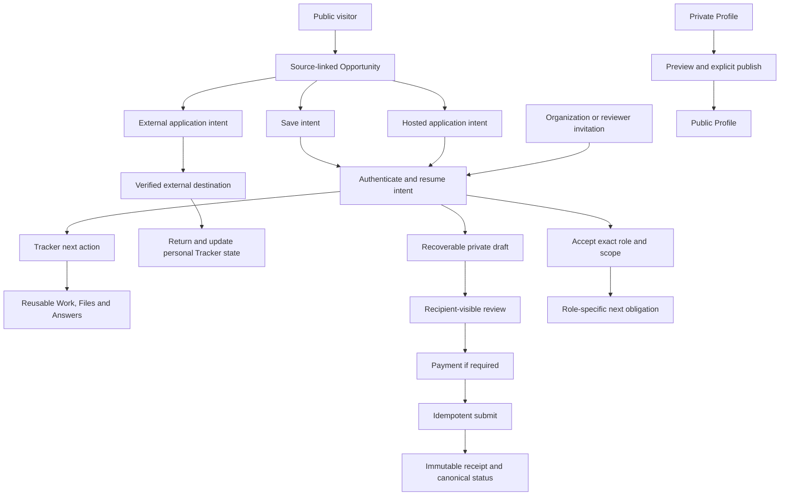

# From Signup Flow to Trusted Lifecycle: Missa Onboarding and Customer-Experience Research

**Date:** 2026-08-16
**Author:** Adedayo and Codex
**Research Type:** Domain and product-service research

---

## Executive Summary

Missa should not begin onboarding design with a welcome carousel, Profile-completion flow or universal post-signup wizard. The product serves a global, multi-role journey that crosses public discovery, private preparation, external and hosted applications, Organization operations, reviewing, decisions, delivery and support. The same person may move among creator, applicant, Organization and reviewer roles. The correct unit of design is therefore a **resumable task and its canonical lifecycle state**, not a permanent persona or one account-level `onboarding_complete` flag.

The external research is unusually consistent on one point: useful onboarding minimizes time to meaningful value, teaches in context, remains optional and returns at later lifecycle moments. The stronger evidence also supplies a warning: dedicated tutorials impose interaction and memory costs and do not reliably improve task performance. For Missa, this means guidance should be introduced only where research demonstrates a specific obstacle. Privacy, public/private visibility, eligibility, role scope, save/recovery, payment, submission, review and external-system handoff are not education problems alone; they are service contracts that the interface must represent truthfully.

The repository audit finds broad local capability but no production onboarding orchestrator. Public Opportunity discovery, authentication return paths, a bounded Save intent, private Profile, Tracker, Library, hosted-application foundations, Organization operations and a bounded reviewer projection already exist in current code. Dated contracts label many of these surfaces local-only or promotion-blocked, and production parity is unverified. The safest first design slice is the existing public Opportunity → Save → authentication → Tracker next-action journey. Hosted application, Organization invitation and reviewer onboarding should be designed as state/service contracts in parallel, but must not be promoted until authorization, versioning, recovery and immutable-evidence gaps are closed.

### Key findings

1. **There is no single onboarding audience or activation event.** Missa needs lane-specific first-value contracts for discovery, Tracker, preparation, hosted application, public Profile, Organization and review.
2. **Value can and should begin before signup.** Public reading and source verification are part of onboarding; authentication belongs at the moment a private or persistent action is requested.
3. **Profile is a private control plane, not a prerequisite checklist.** Preference setup, public Profile publication and application answers require separate purpose, visibility and consent.
4. **The most consequential gaps are lifecycle gaps.** Invitation acceptance, draft/form versions, conflict recovery, reviewer contracts, payment reconciliation and immutable receipts cannot be solved by better copy alone.
5. **Global and accessible conditions are core requirements.** Timezone, language, identity conventions, low bandwidth, assistive technology, privacy/safety needs and jurisdictional variation must appear in research fixtures from the beginning.
6. **AI should reduce preparation effort without deciding belonging.** Source-linked extraction, summarization and drafting are plausible; opaque eligibility, artistic judgment, automatic publication and submission are not.
7. **Current analytics cannot yet support onboarding optimization.** Page views and auth success do not measure first value, recovery, burden or trustworthy consequence.

### Strategic recommendations

1. Define canonical state, authority, recovery and event contracts before creating a production onboarding route.
2. Prototype the public Opportunity → Save → auth → Tracker path first, preserving intent and asking for no unrelated Profile data.
3. Treat invitation, hosted application, public publication and reviewer entry as separate high-consequence journeys with explicit preview/accept/receipt states.
4. Instrument domain transitions and guardrails before experimenting with tours, checklists, personalization or AI.
5. Run recent-episode research across creators, applicants, Organization operators, reviewers and platform operations, embedding global, accessibility, privacy and low-bandwidth contexts.
6. Use contextual next actions inside existing product surfaces; add a separate onboarding surface only where concentrated verification, recovery or consequence review is necessary.
7. Pilot deterministically, resolve critical safety/access/data-loss failures, and add adaptive assistance only after evidence shows a repeatable obstacle.

## Table of Contents

1. [Research Overview](#research-overview)
2. [Domain Research Scope Confirmation](#domain-research-scope-confirmation)
3. [Industry and Ecosystem Analysis](#industry-and-ecosystem-analysis)
4. [Competitive Landscape](#competitive-landscape)
5. [Regulatory, Rights, and Inclusion Requirements](#regulatory-rights-and-inclusion-requirements)
6. [Technical and Product-Experience Trends](#technical-and-product-experience-trends)
7. [Missa Current-State Product Audit](#missa-current-state-product-audit)
8. [Actor and Use-Case Inventory](#actor-and-use-case-inventory)
9. [Customer-Journey and Service Blueprint](#customer-journey-and-service-blueprint)
10. [Activation Model and Testable Hypotheses](#activation-model-and-testable-hypotheses)
11. [Research and Validation Plan](#research-and-validation-plan)
12. [Strategic Roadmap and Design Entry Point](#strategic-roadmap-and-design-entry-point)
13. [Future Outlook](#future-outlook)
14. [Method, Confidence and Limitations](#method-confidence-and-limitations)
15. [Source Index](#source-index)

## Research Overview

This report investigates onboarding as the full process by which a person understands Missa, decides whether it is suitable, establishes the minimum safe relationship with the product, reaches a useful outcome, and later returns, expands, changes role, or recovers from interruption. It does not treat onboarding as a one-time product tour or a generic sequence immediately after signup.

The research combines three evidence classes:

1. **Authoritative standards and public guidance:** W3C, ICO, GOV.UK, Apple, Android, Unicode, and Nielsen Norman Group.
2. **Primary product evidence:** current public documentation and flows from creative-opportunity, application-management, marketplace, and multi-role products.
3. **Missa product evidence:** current repository routes, contracts, code, domain boundaries, and documented gaps. Repository facts are classified separately from recommendations and unvalidated hypotheses.

Commercial onboarding-vendor articles are retained as pattern catalogues, not treated as independent proof that a pattern causes activation or retention.

### Synthesis of the seven seed readings

All seven supplied pages were read as the starting corpus. They converge on a useful core but differ in evidentiary strength:

| Seed source                                                                                                                                    | Useful contribution                                                                                                                                              | How this report uses it                                                                                            |
| ---------------------------------------------------------------------------------------------------------------------------------------------- | ---------------------------------------------------------------------------------------------------------------------------------------------------------------- | ------------------------------------------------------------------------------------------------------------------ |
| [Appcues: onboarding examples](https://www.appcues.com/blog/best-user-onboarding-examples)                                                     | a broad 2026 catalogue of goal-based paths, progressive disclosure, learn-by-doing, checklists, templates and contextual help                                    | pattern inventory only; examples and vendor/customer metrics are hypotheses, not transferable causal proof         |
| [DesignerUp: analysis of 200+ flows](https://designerup.co/blog/i-studied-the-ux-ui-of-over-200-onboarding-flows-heres-everything-i-learned/)  | emphasizes understanding user goals, defining success by user type and working backwards to a first win                                                          | reinforces actor/task research; the article's uncited aggregate growth/abandonment claims are not used as evidence |
| [Nielsen Norman Group: mobile onboarding](https://www.nngroup.com/articles/mobile-app-onboarding/)                                             | warns that dedicated onboarding adds interaction and memory cost and may not improve performance; recommends making the interface usable and teaching in context | high-weight counterbalance to vendor pattern catalogues; supports “skip onboarding whenever possible”              |
| [Microsoft Fluent 2: onboarding](https://fluent2.microsoft.design/onboarding)                                                                  | frames onboarding as multiple teaching points that should be relevant, non-distracting, optional, benefit-focused and coherent                                   | provides the contextual-guidance and re-entry principles used in the journey grammar                               |
| [User Interviews: onboarding with UX research](https://www.userinterviews.com/blog/how-to-design-successful-onboarding-flows-with-ux-research) | treats onboarding as continuous, beginning before signup and requiring research around specific friction and time to value                                       | supports the research-before-interface sequence and lane-specific measurement                                      |
| [User Interviews: journey-map templates](https://www.userinterviews.com/blog/best-customer-journey-map-templates-examples)                     | distinguishes current-state, future-state, day-in-the-life and service-blueprint maps and stresses research, ownership and actionable metrics                    | informs the current-state audit and the customer/service ownership blueprint                                       |
| [Userpilot: 2026 onboarding examples](https://userpilot.com/blog/best-user-onboarding-experience/)                                             | argues that cheaper AI-generated guidance increases the need for restraint and that contextual assistance should solve a real obstacle                           | pattern/trend signal only; AI recommendations are checked against NIST and human-autonomy research                 |

The combined conclusion is narrower than “use personalization, a checklist and a tour.” Good onboarding starts before signup, is organized around a user's desired result, defers unnecessary setup, uses the product itself when possible, appears again at new lifecycle moments, and is continuously researched. Dedicated guidance has a cost and should be introduced only when a specific obstacle is demonstrated. For Missa, privacy, authority, recovery, external-system handoffs and consequential receipts make that threshold especially important.

## Domain Research Scope Confirmation

**Research Topic:** Missa onboarding and customer experience for a global multi-role creative-opportunity platform.

**Research Goals:** Establish the complete actor and use-case landscape, lifecycle journeys, service dependencies, activation hypotheses, risks, and validation plan required before onboarding design begins.

**Research Scope:**

- onboarding and re-entry across creator, applicant, collective, publisher, reviewer, support, trust, and platform-administration roles;
- the complete customer journey from public discovery through account creation, first value, ongoing work, outcomes, and return;
- creator-opportunity and application-management market structure;
- accessibility, assisted digital support, privacy, consent, internationalization, and low-bandwidth conditions;
- role, permission, invitation, verification, and organization-membership dependencies;
- activation definitions and measurement risks;
- research recruitment, questions, prototype scenarios, and validation evidence.

**Methodology:**

- verify current external claims against live sources;
- prefer standards, regulators, research institutions, and primary product documentation;
- distinguish product facts, external evidence, inference, and recommendation;
- show source disagreement and uncertainty rather than collapsing it;
- preserve Missa's full global product scope rather than narrowing the research to a creator-only signup wizard.

**Scope Confirmed:** 2026-08-16, through the user's instruction to proceed into the research.

## Industry and Ecosystem Analysis

### Market definition

“User onboarding” is not a coherent standalone market for planning Missa. It appears inside several adjacent markets with materially different category definitions:

- digital-adoption software, which sells tours, contextual guidance, analytics, and training layers to software companies;
- identity and regulated customer-onboarding systems;
- application and submission-management platforms;
- creator discovery, portfolio, marketplace, and career-management products;
- service-design, user-research, customer-success, and implementation services.

Commercial market estimates are too inconsistent to support a credible onboarding TAM. For example, estimates for the adjacent digital-adoption-platform category place 2024–2025 value anywhere from about USD 0.9 billion to more than USD 5 billion, with sharply different forecasts and segment definitions. The disagreement is itself the useful finding: these figures should not drive Missa's product strategy.

Sources: [IMARC digital-adoption-platform estimate](https://www.imarcgroup.com/digital-adoption-platform-market), [Verified Market Research estimate](https://www.verifiedmarketresearch.com/product/digital-adoption-platform-dap-software-market/), [Research and Markets digital-onboarding estimate](https://www.researchandmarkets.com/reports/6246425/digital-onboarding-platform-market-share).

**Confidence:** High that the category is definitionally unstable; low confidence in any individual commercial market-size estimate.

### Relevant economic context: the global creative economy

Missa operates within a large, internationally uneven creative economy rather than a single software category. UN Trade and Development reports that creative industries contribute between 0.5% and 7.3% of GDP and between 0.5% and 12.5% of employment across surveyed countries. Creative-services exports reached USD 1.4 trillion in 2022, while creative-goods exports reached USD 713 billion. The range between countries matters more for onboarding than one global average: professional infrastructure, payment systems, institutional support, connectivity, language, and access to opportunity differ substantially by market.

UNCTAD also identifies digital tools as a means of lowering distribution costs and reaching global markets, while warning about platform concentration and the need for a level playing field. This creates a dual design requirement for Missa: reduce access friction without making creators dependent on opaque platform rules or hidden ranking systems.

Sources: [UNCTAD Creative Economy Outlook 2024](https://unctad.org/publication/creative-economy-outlook-2024), [UNCTAD chapter on market concentration and competition](https://unctad.org/system/files/official-document/ditctsce2024d2_ch04_en.pdf), [UNCTAD chapter on digitalization and AI](https://unctad.org/system/files/official-document/ditctsce2024d2_ch03_en.pdf).

**Confidence:** High for the cited UNCTAD figures and macro trends; medium for how those trends translate into Missa demand until validated with target users.

### Ecosystem structure

The opportunity journey is fragmented across products and institutions rather than owned end-to-end by one category. A creator may discover an opportunity on an institution's website, social network, newsletter, directory, or Missa; prepare materials in local files or portfolio tools; apply through email, a hosted form, Submittable, CaFÉ, FilmFreeway, or another portal; track the outcome in a spreadsheet or calendar; and receive status through email. An organization may use a different system for publishing, intake, review, decisions, payments, reporting, and public communication.

The ecosystem therefore has at least five functional layers:

1. **Discovery and trust:** finding an opportunity, establishing provenance, checking suitability, and understanding requirements.
2. **Preparation and reusable assets:** identity, Works, files, answers, collaborators, and eligibility evidence.
3. **Application and submission:** hosted or external forms, draft preservation, payments, declarations, confirmation, and withdrawal.
4. **Organization operations:** publishing, reviewer assignment, evaluation, decisions, communication, delivery, reporting, and recurring cycles.
5. **Personal continuity:** tracking deadlines, submissions, changes, reminders, outcomes, and future reuse regardless of where an application was submitted.

Primary platform documentation demonstrates the fragmentation and role separation. Submittable separates discovery, applicant profiles, organization profiles, application forms, programme members, and organization management. FilmFreeway separates reusable creator projects from festival submission-management and judging. CaFÉ separates a private reusable portfolio from call-specific applications. None of these product descriptions proves superior outcomes, but together they provide strong evidence that reusable identity/assets and application-specific answers are distinct domain objects.

Sources: [Submittable Discover](https://www.submittable.com/discover), [Submittable applicant profile forms](https://next.support.submittable.com/hc/en-us/articles/30263801078423-Set-Up-Profile-Forms), [FilmFreeway project creation](https://filmfreeway.com/help/article/15998/how-do-i-create-aproject), [FilmFreeway submission management](https://filmfreeway.com/help/article/15993/what-services-does-filmfreeway-offer-for-managing-submissions), [CaFÉ application process](https://artist-help.callforentry.org/col/intro).

**Confidence:** High that cross-system fragmentation and reusable/application-specific separation are real domain conditions; medium on the prevalence of each journey until Missa field research quantifies them.

### Market dynamics and growth drivers

The forces increasing the need for a continuity product like Missa are:

- more opportunity information and application activity moving online;
- creators participating across geography, discipline, and platform boundaries;
- repeated identity, Work, eligibility, and biography entry across disconnected forms;
- dynamic deadlines, requirements, fees, and programme status;
- institutions adopting hosted intake and reviewer workflows at different levels of maturity;
- growing expectations for personalization, reminders, status transparency, and accessible digital service;
- automation and AI increasing both discovery capacity and the risk of opaque, low-quality, or over-personalized results.

The principal barriers are:

- source freshness and opportunity legitimacy;
- incomplete or contradictory eligibility data;
- lack of shared identity and organization records across portals;
- trust costs around email, calendar, files, private identity, and automated inference;
- role and permission complexity inside collectives and organizations;
- fees, payouts, local regulation, and country-specific verification;
- connectivity, accessibility, language, timezone, device, and digital-confidence differences;
- switching costs when a creator's history and reusable assets are trapped in another product.

### Industry trends relevant to onboarding

The strongest cross-product trends are:

- **exploration before signup:** people can inspect public opportunities before committing to an account;
- **contextual rather than anticipatory guidance:** explanations appear near the task or permission that needs them;
- **progressive data collection:** products collect the minimum initial identity and defer detailed information;
- **reusable profiles, projects, and Work samples:** stable information is entered once and reused;
- **role-aware invitation:** administrators, members, guests, applicants, reviewers, and representatives receive different entry paths;
- **save, resume, and remediation:** onboarding is a state machine that continues after the first session;
- **localized and country-aware requirements:** identity, payments, verification, and compliance vary by jurisdiction;
- **lifecycle onboarding:** returning users encounter changed requirements, new roles, unfinished work, and feature-specific guidance rather than repeating first-run education.

Sources: [GOV.UK start-using-a-service pattern](https://design-system.service.gov.uk/patterns/start-using-a-service/), [Apple onboarding guidance](https://developer.apple.com/design/human-interface-guidelines/onboarding), [Stripe Connect hosted onboarding](https://docs.stripe.com/connect/hosted-onboarding), [Slack permissions by role](https://slack.com/help/articles/201314026-Permissions-by-role-in-Slack), [Notion members, admins, guests and groups](https://www.notion.com/help/add-members-admins-guests-and-groups).

### Competitive dynamics

The competitive field is not a simple list of direct substitutes:

- **submission systems** compete for hosted application and organization workflow;
- **discipline-specific platforms** compete through network density and established submission conventions;
- **directories and newsletters** compete for discovery attention;
- **spreadsheets, email, calendars, cloud storage, and local folders** compete by being flexible, familiar, and under the creator's direct control;
- **digital-adoption vendors** are pattern and tooling suppliers rather than direct competitors;
- **institution-owned forms and websites** remain authoritative destinations even when discovery occurs elsewhere.

Missa's defensible onboarding opportunity is therefore not “teach people every feature.” It is to demonstrate trustworthy continuity across discovery, preparation, tracking, hosted or external application, and outcome without requiring creators or organizations to surrender control of their data or existing processes.

### Industry-analysis implications for the research

1. The unit of analysis must be a **journey across systems**, not a signup funnel contained inside Missa.
2. Creators, organization applicants, publishers, reviewers, and internal operators cannot share one first-run path.
3. “First value” must be defined separately by role and entry intent.
4. Reusable Profile and Library information must remain distinct from opportunity-specific Tracker and application state.
5. Trust, provenance, privacy, accessibility, internationalization, and human recovery are primary onboarding concerns, not polish.
6. Competitor product claims can establish available patterns and domain vocabulary, but cannot establish which pattern Missa should adopt without user evidence.

---

## Competitive Landscape

### Category map

The competitive landscape is best understood by the job each product owns, not by a single ranked list.

| Category                                  | Representative products                                                       | Primary customer                                                           | Product centre of gravity                                                                         |
| ----------------------------------------- | ----------------------------------------------------------------------------- | -------------------------------------------------------------------------- | ------------------------------------------------------------------------------------------------- |
| Cross-sector application management       | Submittable, OpenWater                                                        | grantmakers, associations, institutions, programme teams                   | configurable intake, review, decisions, reporting, implementation support                         |
| Discipline-specific submission network    | FilmFreeway, CaFÉ                                                             | festivals, public-art and visual-art programmes; creators applying to them | networked discovery, reusable projects or portfolios, submission, judging, payments               |
| Creative submission management            | Zealous                                                                       | arts organizations, awards, residencies, competitions                      | quick programme creation, rich-media applications, judging, selection, transparent tiered pricing |
| Awards infrastructure                     | Award Force                                                                   | professional awards and high-volume programmes                             | configurable entry, multilingual operation, multi-stage judging, enterprise controls              |
| Creator discovery and profile network     | ArtConnect, The Dots and discipline-specific directories                      | creators and opportunity publishers                                        | discovery, profile visibility, recommendations, alerts, promoted listings                         |
| Institution-owned application destination | organization websites, email, general form tools and custom portals           | individual institutions                                                    | authoritative requirements and direct applicant relationship                                      |
| Personal continuity substitutes           | spreadsheets, email labels, calendars, cloud storage, notes and local folders | creators                                                                   | flexibility, familiarity, portability and low perceived switching cost                            |

This map prevents an important analytical error: a platform can be strong at hosted applications without being the place where a creator manages their whole opportunity life, and it can be strong at discovery without owning application state or outcomes.

### Key players and observable scale

No independent, current market-share dataset covers this mixed field. Available scale numbers are company-reported and use incompatible units, so they indicate reach rather than market share:

- FilmFreeway reports 3 million filmmakers, writers, and artists submitting to more than 15,000 festivals and contests. Its network is deep in film and adjacent screen disciplines, and it combines creator projects, discovery, submissions, judging, payments, festival communications, and optional marketing.
- CaFÉ reports access to more than 175,000 active registered artists and approximately 170 active call listings at a given time. It is particularly strong in visual art and public-art calls, with a free reusable artist portfolio and organization-side call and jury administration.
- ArtConnect reports more than 100,000 artists across more than 50 countries. It centres discovery, tailored opportunities, profile visibility, deadlines, editorial resources, and paid publisher visibility more than end-to-end application operations.
- Zealous reports more than 300 organizations and positions itself as creative-industry submission management spanning applications, rich media, fees, judging, selection, and programme analytics.
- OpenWater reports more than 750 organizations and positions around broad application-and-review processes in associations, foundations, and higher education.
- Submittable describes thousands of organizations using its platform and now positions primarily around grants, social-impact programmes, full-lifecycle oversight, implementation, and enterprise services.

Sources: [FilmFreeway submission-management overview](https://filmfreeway.com/help/article/15993/what-services-does-filmfreeway-offer-for-managing-submissions), [CaFÉ FY25 information packet](https://media.callforentry.org/2025/03/26141905/CaFE-Info-Packet-2025.pdf), [CaFÉ artist login overview](https://www.callforentry.org/login/), [ArtConnect for artists](https://www.artconnect.com/artists?page=1), [Zealous platform overview](https://zealous.co/), [OpenWater application-management overview](https://openwater.com/application-management-software/), [Submittable pricing and product scope](https://www.submittable.com/pricing).

**Confidence:** Medium for company-reported scale; low for cross-company comparison; insufficient evidence for numeric market-share claims.

### Positioning and onboarding model by competitor

#### Submittable

Submittable's applicant model separates account identity, individual or organization profiles, programme-specific forms, organization membership, and application state. Discovery can happen before account creation. Organization onboarding is sales- and implementation-oriented because the product includes configurable forms, multi-stage review, financial management, reporting, fraud prevention, and enterprise integrations.

**Onboarding lesson:** distinguish individual and organization applicants; search before creating a duplicate organization; reuse stable profile facts; make programme-specific answers explicit; clarify whether technical support or the programme owner controls an application status.

Sources: [Submittable Discover](https://www.submittable.com/discover), [applying as an organization](https://next.support.submittable.com/hc/en-us/articles/30263723674647-Applying-as-an-Organization), [Submittable organization help](https://www.submittable.com/help/organization).

#### FilmFreeway

FilmFreeway combines a strong discipline-specific network with a transaction model. Submitters create reusable projects and can pay for a creator subscription that reduces fees. Festivals can pay an activation fee, a commission on paid entries, processing costs, and optional marketing services. Public listing requires verification and legitimacy evidence; non-public listings can still use the hosted workflow.

**Onboarding lesson:** the creator project is reusable; the festival account requires a separate legitimacy and payout journey; verification, public discoverability, and the ability to receive submissions are related but not identical states. Visibility boosts also introduce a ranking-trust question that should never be hidden inside “recommended” results.

Sources: [FilmFreeway project creation](https://filmfreeway.com/help/article/15998/how-do-i-create-aproject), [festival pricing](https://filmfreeway.com/help/article/15994/how-much-does-filmfreeway-cost-for-festivals), [festival listing requirements](https://filmfreeway.com/help/article/16060/what-is-required-to-list-my-festival-on-filmfreeway), [FilmFreeway Gold for submitters](https://filmfreeway.com/help/article/16081/gold-faq-submitters).

#### CaFÉ

CaFÉ's creator journey is unusually legible: create a free account, create a reusable portfolio, find a call, answer call-specific questions, select work samples, pay when required, submit, and manage entries. Its recent product history also illustrates that onboarding quality depends on operational details: timezone display, email verification, error association, checkout accessibility, save placement, resubmission, and clear incomplete/exception states.

**Onboarding lesson:** the application journey must be tested as an ongoing service, not declared complete when its first screens ship. Timezone, saved state, required media, payment, status, and resubmission are part of onboarding because they determine whether a first-time applicant succeeds.

Sources: [CaFÉ application checklist](https://www.callforentry.org/applying-to-a-call-for-entry-on-cafe-a-checklist/), [CaFÉ product updates](https://www.callforentry.org/administrator-help-center/cafe-product-updates/), [CaFÉ call setup checklist](https://media.callforentry.org/2021/08/03190347/CaFE%CC%81-Call-Setup-Checklist-_-Admin-Help-Center-1.pdf).

#### Zealous

Zealous competes through low setup friction, transparent pricing, a free small-programme tier, rich-media submissions, autosave, applicant history, judging, selection, fees, and visible drop-off analytics. Organization pricing is based mainly on submission volume; creators can use the platform without charge.

**Onboarding lesson:** allow a programme owner to draft and test privately before publication; expose fee and capacity consequences; show applicant drop-off at the journey level; preserve drafts; and distinguish optional assisted onboarding from the product's self-service path.

Sources: [Zealous pricing](https://zealous.co/about/pricing/), [Zealous submission guidance](https://zealous.co/help/submitting-on-zealous/), [Zealous pricing philosophy](https://zealous.co/about/pricing/pricing-philosophy/).

#### ArtConnect

ArtConnect combines free creator profiles, tailored discovery, deadline tools, resources, and paid publisher visibility. Organizations can pay per opportunity, subscribe for ongoing visibility, or buy boosts that alter prominence.

**Onboarding lesson:** discovery personalization can produce quick value, but profile completion and paid placement can also bias what is visible. Missa must separate fit and provenance signals from paid promotion and must explain when an application leaves Missa for an external destination.

Sources: [ArtConnect artist proposition](https://www.artconnect.com/artists?page=1), [ArtConnect organization plans](https://www.magazine.artconnect.com/organizations), [example opportunity detail](https://www.artconnect.com/opportunity/xtFmWramTOi7C454zcvQx).

#### OpenWater and Award Force

OpenWater and Award Force represent organization-centred, configurable application infrastructure. Their product scope includes forms, roles, submission status, moderation, multiple review rounds, decisions, communications, reporting, payments, multilingual operation, data import, and enterprise support. Award Force charges a substantial annual platform fee and optional onboarding service; this makes implementation a commercial service as well as a product flow.

**Onboarding lesson:** high-complexity programme setup needs readiness checks, templates, preview, data import, staged publication, role-specific training, and human support. It should not be squeezed into the same pattern used to welcome an individual creator.

Sources: [OpenWater application management](https://openwater.com/application-management-software/), [OpenWater submission administration](https://help.getopenwater.com/en/collections/58953-manage-submissions), [Award Force pricing](https://awardforce.com/pricing/), [Award Force feature set](https://awardforce.com/features/).

### Business models and incentive risks

| Model                           | Examples                                      | Onboarding incentive                                        | Product risk for Missa to notice                                             |
| ------------------------------- | --------------------------------------------- | ----------------------------------------------------------- | ---------------------------------------------------------------------------- |
| Sales-led organization SaaS     | Submittable, OpenWater                        | qualify and configure an institutional buyer                | creator experience may be subordinated to programme flexibility              |
| Annual programme SaaS           | Award Force                                   | sell implementation, configuration, and operational control | first-run experience assumes administrator time and expertise                |
| Submission-volume subscription  | Zealous                                       | let small programmes start, then expand with volume         | product may optimize for more submissions rather than better-fit submissions |
| Transaction commission          | FilmFreeway                                   | increase paid entries and network participation             | recommendation and promotion can favour submission volume                    |
| Creator subscription            | FilmFreeway Gold, ArtConnect premium features | demonstrate recurring savings, access, or visibility        | profile completion and urgency can become conversion pressure                |
| Publisher listing and promotion | ArtConnect, FilmFreeway marketing             | sell reach, placement, and deadline promotion               | paid prominence can be mistaken for relevance or quality                     |
| Free personal tools             | spreadsheets, email, calendars                | no formal onboarding; value is immediate familiarity        | fragmented truth, manual upkeep, and weak provenance remain hidden costs     |

Missa should not import these incentives accidentally. “More applications” is not automatically a creator success metric; “more visible” is not the same as more relevant; “complete profile” is not the same as prepared; and “published opportunity” is not the same as verified opportunity.

### Competitive entry barriers

The principal barriers for Missa are:

1. **Trust and provenance:** creators must believe opportunity facts, deadlines, fees, and destination links are current and attributable.
2. **Network density without noise:** a large catalogue has little value if relevance, legitimacy, or freshness is weak.
3. **Cross-platform continuity:** external destinations do not expose a uniform application-state model.
4. **Reusable asset portability:** creators will resist recreating profiles, Works, and histories already stored elsewhere.
5. **Organization workflow depth:** forms, permissions, review, payments, communications, reporting, and recurring cycles compound quickly.
6. **Global operational variance:** languages, timezones, payment support, identity requirements, local regulation, and institutional maturity differ.
7. **Human service cost:** verification, support, appeals, duplicate organizations, and ambiguous outcomes cannot all be automated safely.

### Switching costs and the true substitute

The strongest substitute is often not another platform; it is the creator's existing improvised system. A spreadsheet, inbox, calendar, cloud drive, bookmarks, and memory have no coordinated onboarding, but each tool is familiar, flexible, inspectable, and individually replaceable. A creator can leave without exporting a proprietary graph.

Missa onboarding must therefore demonstrate value before asking for migration. Import should be previewable, reversible, and optional. A successful onboarding path may begin by tracking one opportunity manually, not by connecting an inbox or importing an entire history.

### Competitive opportunity for Missa

The differentiated position supported by the evidence is a **creator-owned continuity layer with trustworthy opportunity intelligence**, complemented by hosted application and organization operations where appropriate.

That position implies:

- public discovery and evidence before account creation;
- a private Profile that improves how Missa works without becoming an involuntary public identity;
- a Library of reusable Works and materials independent of any single application;
- a Tracker that preserves actions, deadlines, submissions, and outcomes across hosted and external destinations;
- organization and reviewer journeys that are explicit role-specific services;
- source, verification, paid-placement, and uncertainty signals that remain distinguishable;
- migration and integrations offered at the moment they remove known work, not as launch-time demands;
- human recovery for ambiguous organization, application, payment, invite, or verification states.

### Competitive research gaps

The following remain unverified and require primary research rather than more competitor screenshots:

- how often target creators apply through each external platform or channel;
- the real composition of their current tracking and file-management systems;
- which competitor experiences they trust or actively avoid;
- whether reusable application answers meaningfully reduce effort without increasing stale or inappropriate submissions;
- how organizations choose a submission system and what makes implementation fail;
- willingness to migrate historic applications and Works;
- how paid placement affects creator trust;
- country- and discipline-specific platform dominance outside the best-documented US and European ecosystems.

---

## Regulatory, Rights, and Inclusion Requirements

### Scope and limitation

Missa's exact legal obligations depend on its operating entity, establishment, target markets, revenue and processing thresholds, the role it plays for each organization, the type of opportunity, whether it processes payments, whether minors are allowed, and the jurisdictions of creators and organizations. This section is a product-research risk map, not legal advice or a substitute for jurisdiction-specific counsel.

The central product conclusion is nevertheless strong: compliance cannot be represented by one terms checkbox during signup. Different obligations are triggered by different capabilities and relationships throughout the journey.

### Functional regulatory map

| Missa function                    | Principal rights or regulatory concern                                                                     | Onboarding consequence                                                                                                          |
| --------------------------------- | ---------------------------------------------------------------------------------------------------------- | ------------------------------------------------------------------------------------------------------------------------------- |
| Account and private Profile       | privacy notice, lawful basis, minimization, access, correction, deletion, security                         | explain purpose at collection; default private; avoid collecting optional information merely to complete setup                  |
| Opportunity personalization       | profiling, inference, transparency, sensitive attributes, control over recommendations                     | show why something is recommended; permit preference editing; do not imply automated eligibility or artistic judgment           |
| Public Profile                    | copyright, privacy, publicity and visibility choice                                                        | publication must be a separate explicit act with preview and reversible privacy controls                                        |
| Email or calendar integration     | message and event content, third-party data, permission scope, retention                                   | request only at feature use; preview scope and imported data; support revocation and deletion                                   |
| Library and Work files            | copyright, confidentiality, access control, retention and secure delivery                                  | creator retains ownership; grant only necessary platform permissions; distinguish private, application-shared and public access |
| Hosted application                | organization/Missa controller and processor roles, applicant notice, sensitive eligibility data, retention | identify who receives each answer, why, for how long, and who controls correction, withdrawal and status                        |
| Reviewer workflow                 | confidentiality, conflict, least privilege, auditability                                                   | invitation must state assignment and scope; access starts only after acceptance and ends when removed or closed                 |
| Organization membership           | identity, role, seat/billing consequences, visibility and authorization                                    | invite acceptance must show organization, inviter, role, scope and consequences before mutation                                 |
| Fees and payouts                  | payment security, consumer disclosure, KYC/UBO verification, refunds and tax responsibilities              | show total costs before commitment; use country-aware provider onboarding; model remediation and restricted states              |
| Opportunity listing and promotion | intermediary duties, misleading claims, paid placement, content reporting and appeals                      | distinguish verification from publication and promotion; label paid placement; provide reporting and review mechanisms          |
| Notifications and email           | marketing consent, transactional necessity, unsubscribe and urgency accuracy                               | separate operational notifications from marketing; request channels contextually; retain preference controls                    |
| Research and analytics            | purpose limitation, minimization, consent where required, private-content leakage                          | do not send credentials, tokens, private answers, identity attributes or Work content to analytics by default                   |

### Data protection and privacy

#### Global baseline

The EU GDPR provides a useful minimum product model even when another jurisdiction ultimately controls. Its principles include lawfulness, fairness and transparency; purpose limitation; data minimization; storage limitation; accuracy; integrity and confidentiality; and accountability. Privacy by default means limiting collection, retention and access rather than expecting users to harden settings after signup.

Sources: [European Commission GDPR principles](https://commission.europa.eu/law/law-topic/data-protection/information-business-and-organisations/principles-gdpr_en), [data minimization](https://commission.europa.eu/law/law-topic/data-protection/information-business-and-organisations/principles-gdpr/how-much-data-can-be-collected_en), [data protection by design and default](https://commission.europa.eu/law/law-topic/data-protection/information-business-and-organisations/obligations/what-does-data-protection-design-and-default-mean_en).

This maps directly to onboarding:

- every requested field needs a defined purpose and owner;
- optional data cannot become a disguised completion requirement;
- Profile information should remain private unless separately published;
- integrations should use the smallest useful scopes;
- retention cannot be “forever because storage is cheap”;
- people need understandable access, correction, export and deletion paths;
- imported or inferred information must show its source and be correctable.

#### Regional frameworks

Missa's global research must not treat GDPR as the only applicable model:

- The California CCPA, when its applicability thresholds are met, includes rights to know, delete, correct, opt out of sale or sharing, limit certain uses of sensitive information, and receive notice at or before collection. It also treats inferences about preferences and characteristics as personal information.
- The Nigeria Data Protection Act 2023 establishes a national data-protection framework that requires a specific operational review for Nigerian users and processing; Nigeria is one important jurisdiction, not the default model for every user.
- Comparable obligations exist in other target markets. Before launch expansion, Missa needs a maintained jurisdiction matrix covering establishment, targeted users, controller/processor role, cross-border transfer, children's data, marketing, breach, and rights-request requirements.

Sources: [California Attorney General CCPA overview](https://oag.ca.gov/privacy/ccpa), [Nigeria Data Protection Act 2023](https://ndpc.gov.ng/wp-content/uploads/2024/03/Nigeria_Data_Protection_Act_2023.pdf).

**Research status:** The product implications are established; the full country-by-country legal matrix remains professional legal work and is not claimed complete here.

#### Controller and processor allocation

Missa may determine the purpose and means of processing for its own Profile, recommendation, Tracker, Library, security and product-analytics functions. For a hosted application, the opportunity organization may determine why applicant information is collected while Missa supplies processing infrastructure. Some decisions may create separate or joint-controller questions.

The interface must not make the applicant solve that legal distinction. It must state, in practical language:

- who is asking for the information;
- whether it becomes part of the creator's reusable Missa data;
- whether the organization receives it;
- who controls application status and decisions;
- how correction, withdrawal, deletion and support work;
- what information Missa retains independently for Tracker, fraud, audit or legal purposes.

Source: [European Commission explanation of controller and processor roles](https://commission.europa.eu/law/law-topic/data-protection/information-business-and-organisations/application-gdpr_en).

#### Sensitive and eligibility information

Opportunity eligibility can involve race or ethnicity, disability or health, religious belief, political context, sexual orientation, nationality, immigration status, age, financial hardship or other highly consequential information. Several of these are special categories under GDPR or sensitive personal information under CCPA.

Missa must not infer these characteristics from creative practice, language, location, name, Work content or browsing behaviour. Where an organization legitimately requests them, the application should identify purpose, required or optional status, recipient, visibility, retention and alternative path. Profile matching preferences and application declarations must remain separate data contexts.

Sources: [European Commission sensitive-data categories](https://commission.europa.eu/law/law-topic/data-protection/rules-business-and-organisations/legal-grounds-processing-data/sensitive-data/what-personal-data-considered-sensitive_en), [California Attorney General CCPA sensitive-information overview](https://oag.ca.gov/privacy/ccpa).

#### Profiling and automated decisions

Personalized opportunity ranking is profiling when it evaluates personal aspects to predict interests or fit. Under GDPR, solely automated decisions that produce legal or similarly significant effects receive particular protection. Most ordinary opportunity recommendations will not automatically meet that threshold, but the safe product posture is still to avoid claiming certainty or eligibility.

Recommendations should therefore expose understandable reasons, permit preference changes, distinguish explicit preferences from inferences, show uncertainty, and never prevent a person from finding an opportunity solely because the system predicted weak fit. If future automation screens applicants or materially affects access, it requires a separate legal and ethical review and potentially a DPIA before deployment.

Sources: [European Commission profiling and automated-decision rights](https://commission.europa.eu/law/law-topic/data-protection/information-individuals_en), [DPIA requirements](https://commission.europa.eu/law/law-topic/data-protection/information-business-and-organisations/obligations/when-data-protection-impact-assessment-dpia-required_en).

#### Transparency and rights

Privacy information must be concise and understandable at the point of collection, not only linked from a long policy. Required disclosures can include the organization responsible, purposes, legal basis, retention, recipients, transfers, rights, complaint route, and applicable automated processing.

Missa's Data controls should be designed as an ongoing service with:

- inspectable stored Profile, preference, integration, Work and Tracker information;
- correction of inaccurate or inferred data;
- export in useful formats;
- deletion with clear exceptions and consequences;
- integration revocation and imported-data cleanup;
- public/private controls independent of account deletion;
- a documented rights-request and identity-verification process.

Sources: [European Commission collection transparency](https://commission.europa.eu/law/law-topic/data-protection/information-business-and-organisations/principles-gdpr/what-information-must-be-given-individuals-whose-data-collected_en), [California Attorney General CCPA rights](https://oag.ca.gov/privacy/ccpa).

#### International transfers

A global product will transfer or make data accessible across jurisdictions through hosting, support, analytics, email, payment, file storage and organization access. EU personal data transferred outside the EEA can require an adequacy mechanism, Standard Contractual Clauses or another lawful safeguard. A vendor location list is not sufficient; Missa needs a maintained data-flow and subprocessors inventory.

Sources: [European Commission international-transfer rules](https://commission.europa.eu/law/law-topic/data-protection/international-dimension-data-protection/rules-international-data-transfers_en), [EU Standard Contractual Clauses](https://commission.europa.eu/law/law-topic/data-protection/international-dimension-data-protection/standard-contractual-clauses-scc_en).

### Accessibility and assisted digital use

WCAG 2.2 is the appropriate technical baseline for Missa's onboarding and task flows. It adds criteria directly relevant to onboarding, including focus not being obscured, minimum target size, consistent help, avoiding redundant entry, and accessible authentication. Conformance still requires human evaluation; automated checks cannot establish that an application journey works with assistive technology.

The US Department of Justice states that inaccessible web content can deny equal access under the ADA and cites WCAG as useful technical guidance. The European Accessibility Act has applied since June 2025 to covered products and services including e-commerce platforms. Exact applicability requires counsel, but accessible design is already a product requirement for equal creator access independent of statutory coverage.

Sources: [W3C WCAG 2.2](https://www.w3.org/TR/WCAG22/), [W3C summary of new WCAG 2.2 criteria](https://www.w3.org/WAI/standards-guidelines/wcag/new-in-22/), [US DOJ web-accessibility guidance](https://www.ada.gov/resources/web-guidance/), [European Commission Accessibility Act update](https://commission.europa.eu/news-and-media/news/eu-becomes-more-accessible-all-2025-07-31_en).

For onboarding research and design, this means:

- recruit disabled creators, reviewers and organization staff using their normal assistive technology;
- support keyboard-only completion, zoom/reflow, screen readers, voice input, reduced motion and high contrast;
- associate field instructions and errors programmatically;
- avoid cognitive-function tests in authentication where an accessible alternative is possible;
- preserve status messages and focus through asynchronous saves;
- provide non-drag alternatives, sufficient targets and persistent labels;
- keep help consistent and available throughout long applications;
- avoid repeated entry of known information unless confirmation is necessary;
- include low digital confidence, interrupted connectivity and human-support needs under assisted digital research.

### Internationalization and localization

W3C internationalization guidance recommends UTF-8 throughout, declared language, local name/address/date/time formats, translatable content, right-to-left support, and culturally reviewed imagery and examples. These requirements affect data models as well as copy.

Missa onboarding should not require Western first-name/last-name structures, one-line addresses, US phone formats, ASCII-only Works or biographies, one calendar convention, or an inferred timezone. Store standardized values where needed while displaying local forms. A deadline must include the organizer's authoritative timezone and a clear local conversion.

Source: [W3C internationalization quick tips](https://www.w3.org/International/quicktips/index).

### Online-platform transparency and content governance

If Missa hosts or distributes organization-supplied listings, profiles, applications, reviews, comments or promotional placement, intermediary and consumer-protection obligations may apply. In the EU, the Digital Services Act includes rules concerning illegal-content reporting, content-moderation explanations and appeals, recommender transparency, advertising labels, dark patterns, minors, and—where applicable—business-user traceability.

Applicability and exemptions depend on the exact service and scale, but the product architecture should preserve:

- the source and owner of an opportunity record;
- a way to report misleading, unlawful, expired or unsafe listings without creating an account where feasible;
- human review and an auditable decision;
- notice when content or access is limited;
- a correction or appeal route;
- separation between verified status, editorial recommendation, algorithmic relevance and paid placement;
- plain-language explanation of the main recommendation controls.

Sources: [European Commission Digital Services Act overview](https://digital-strategy.ec.europa.eu/en/policies/digital-services-act), [DSA questions and answers](https://digital-strategy.ec.europa.eu/en/faqs/digital-services-act-questions-and-answers), [DSA impact on platforms](https://digital-strategy.ec.europa.eu/en/policies/dsa-impact-platforms).

### Consumer protection and dark patterns

The FTC identifies hidden costs, drip pricing, forced continuity, false hierarchy, pressured upselling, disguised ads and misleading rankings as dark-pattern risks. The DSA also prohibits deceptive interface practices for covered online platforms.

Missa should therefore prohibit these onboarding patterns:

- preselected marketing or public-profile consent;
- hiding application fees or service charges until the final step;
- styling the privacy-preserving choice as an inferior link;
- implying account creation is required to read public eligibility information;
- converting a free trial into a paid subscription without clear affirmative agreement;
- making cancellation or data deletion materially harder than signup;
- presenting sponsored Opportunities as neutral fit rankings;
- using artificial urgency or completion pressure to increase applications.

Source: [FTC report, Bringing Dark Patterns to Light](https://www.ftc.gov/system/files/ftc_gov/pdf/P214800%20Dark%20Patterns%20Report%209.14.2022%20-%20FINAL.pdf).

### Children and young creators

Whether minors can create accounts, upload Works, publish Profiles, join organizations, apply, pay fees, or receive targeted recommendations is an unresolved product-policy decision. It must be resolved before onboarding design, not delegated to an age field added later.

COPPA imposes requirements on covered US online services directed to children under 13 or with actual knowledge they collect personal information from a child under 13. Under GDPR, the consent threshold for certain online services varies from 13 to 16 by EU member state. Child-directed information must be clear and age appropriate, and other child-safety regimes may also apply.

Sources: [FTC COPPA rule](https://www.ftc.gov/legal-library/browse/rules/childrens-online-privacy-protection-rule-coppa), [European Commission safeguards for children's data](https://commission.europa.eu/law/law-topic/data-protection/information-business-and-organisations/legal-grounds-processing-data/are-there-any-specific-safeguards-data-about-children_en).

Until policy, safeguarding, consent, contracting, payment, publication and support requirements are resolved, research should classify minors as a high-priority scope decision rather than silently including or excluding them.

### Communications and notification consent

Transactional messages required to verify an account, deliver an invite, confirm a submission, report a security event or communicate an organization-controlled application update are not interchangeable with product marketing. Under UK PECR, unsolicited electronic marketing to individuals normally requires specific consent, with a limited existing-customer exception; consent must be separate, informed, affirmative and recorded.

Missa onboarding should:

- separate essential service communications from marketing;
- let people choose useful categories and channels;
- explain examples before requesting notification permission;
- avoid bundling consent into terms or account creation;
- provide in-product controls and unsubscribe where applicable;
- preserve do-not-contact state;
- avoid exposing sensitive application content in lock-screen notifications or email subject lines.

Sources: [ICO electronic-mail marketing guidance](https://ico.org.uk/for-organisations/direct-marketing-and-privacy-and-electronic-communications/guidance-on-direct-marketing-using-electronic-mail/how-do-we-comply-with-the-pecr-electronic-mail-marketing-rules/), [Apple notification guidance](https://developer.apple.com/design/human-interface-guidelines/notifications).

### Creative Works, ownership, and confidentiality

Copyright protects a wide range of literary, artistic, musical, audiovisual and other creative works. Creators commonly hold rights controlling reproduction, distribution, adaptation and communication to the public, subject to jurisdiction-specific ownership, contracts and exceptions.

Uploading a Work to a private Library must not imply public publication, ownership transfer, AI training permission, marketing use or a broader licence than necessary to store, process, display to the creator, and transmit to recipients the creator deliberately selects. Public Profile use, hosted-application delivery, reviewer access and any promotional use need distinguishable permissions and visibility states.

Sources: [WIPO copyright FAQ](https://www.wipo.int/en/web/copyright/faq-copyright), [WIPO Copyright Treaty summary](https://www.wipo.int/en/web/treaties/ip/wct/summary_wct).

Research and design must cover:

- ownership and authority to upload, including collaborators and collectives;
- unpublished and embargoed Works;
- application-only disclosure versus public display;
- reviewer download, streaming and offline copies;
- deletion after withdrawal or programme closure;
- organization exports and retained copies;
- malware, unsafe files and format conversion;
- version replacement after submission;
- portfolio publication and takedown;
- future AI processing as a separately governed capability, not an assumed platform right.

### Payments, payouts, and organization verification

Payment and payout onboarding varies by country, capability, business type, structure and risk. Stripe states that connected-account requirements change over time and may require later remediation; verification by a provider does not satisfy every independent platform trust or legal obligation.

For Missa, payout onboarding should be a separate organization capability journey, preferably using Stripe-hosted or embedded components rather than duplicating identity documents in Missa. Return from Stripe is not proof of completion. Missa must read authoritative capability and requirement states, explain restrictions, and support re-entry when information becomes due.

Sources: [Stripe connected-account identity verification](https://docs.stripe.com/connect/identity-verification), [Stripe upcoming requirement changes](https://docs.stripe.com/connect/upcoming-requirements-updates), [Stripe-hosted onboarding](https://docs.stripe.com/connect/hosted-onboarding).

Fee-related applicant onboarding must also disclose total price, currency, refund ownership, payment state, receipt, failure recovery and whether submitting without payment is possible. Card details should remain with the payment provider wherever feasible; outsourcing processing reduces but does not automatically eliminate all payment-security responsibilities.

### Licensing, certification, and contractual requirements

There is no single “onboarding licence” or certification that makes the journey compliant. Relevant standards and assurances can include WCAG 2.2, payment-card security obligations, processor agreements, security controls, accessibility documentation, incident processes, data-residency commitments, and customer-specific procurement requirements.

The onboarding design must not display unsupported compliance badges or imply that payment-provider verification equals Missa opportunity verification. Each badge or status needs an owner, evidence source, scope, issue date or currency, and revocation/remediation model.

### Required implementation controls

Before onboarding promotion, Missa needs evidence for the following control set:

1. A field-level data inventory: purpose, source, controller, recipient, sensitivity, retention, public/private status and deletion behaviour.
2. A capability-by-jurisdiction review covering privacy, minors, accessibility, messaging, payments, consumer rules and platform obligations.
3. Explicit Profile publication separate from account creation and matching preferences.
4. Clear controller/processor and support ownership for hosted applications.
5. Role- and assignment-scoped organization and reviewer access with expiry and audit.
6. Recommendation reasons, preference controls and separation of paid placement from fit.
7. Consent records for optional marketing and integrations, with revocation and cleanup.
8. Rights-request workflows for access, correction, export, deletion and objection.
9. Retention schedules for drafts, submissions, reviews, decisions, messages, files, imports and audit evidence.
10. WCAG 2.2 AA acceptance criteria plus manual testing with disabled participants.
11. Country-, language-, timezone- and identity-aware data models and fixtures.
12. A minors policy with deliberate account, publication, application, payment and safeguarding rules.
13. Provider-hosted payment and payout data collection where practical, with lifecycle remediation.
14. Reporting, correction, appeal and takedown paths for opportunity and organization records.
15. A DPIA/risk-review trigger for sensitive profiling, large-scale eligibility data or materially consequential automation.

### Risk assessment

| Risk                                                           | Likelihood without control | Impact                                  | Required response before design promotion                           |
| -------------------------------------------------------------- | -------------------------- | --------------------------------------- | ------------------------------------------------------------------- |
| Private Profile or Work becomes public implicitly              | Medium                     | Critical trust and rights harm          | explicit publication, preview, private default, regression fixtures |
| Optional identity/eligibility fields become de facto mandatory | High                       | High exclusion and privacy harm         | purpose-by-field review, skip paths, application/Profile separation |
| Organization and Missa responsibility is unclear               | High                       | High support and rights failure         | plain-language ownership and controller/processor contract          |
| Recommendation implies eligibility or artistic judgment        | High                       | High unfairness and reputational harm   | reasoned fit, uncertainty, override and no automatic exclusion      |
| Reviewer or former member retains excessive access             | Medium                     | High confidentiality harm               | scoped grants, expiry, revocation, audit and access testing         |
| Paid Opportunity appears organically recommended               | Medium                     | High trust and consumer-protection harm | persistent sponsorship label and separate ranking signals           |
| Marketing consent is bundled with account creation             | Medium                     | High regulatory and trust harm          | separate affirmative consent and preference history                 |
| International deadline shown in the wrong timezone             | High                       | High lost-opportunity harm              | authoritative timezone, local conversion and boundary tests         |
| Creator Work licence is overbroad or ambiguous                 | Medium                     | Critical IP and trust harm              | narrow purpose-specific licence and visibility model                |
| KYC return is treated as completed payout onboarding           | High                       | High payment interruption               | authoritative requirement state and remediation journey             |
| Minor enters an adult-designed application/payment flow        | Unknown                    | Critical safeguarding and legal harm    | decide scope, age policy and guardian/safeguarding model            |
| Automated accessibility scan is treated as sufficient          | High                       | High exclusion and legal risk           | manual assistive-technology and disabled-user testing               |

### Regulatory research conclusion

The compliance model reinforces the broader onboarding finding: Missa needs a governed lifecycle state system, not a linear welcome flow. Privacy, visibility, role, verification, payment, recommendation, publication and application are independent states with different owners and evidence. The design must make those boundaries understandable without forcing users to read the legal architecture.

---

## Technical and Product-Experience Trends

### The relevant shift: from onboarding flow to onboarding orchestration

The most useful technical change is not a new interface pattern. It is the move from a one-time completion flag to a lifecycle model that can answer four questions at any moment:

1. What is the person trying to accomplish now?
2. What product or service state is preventing that outcome?
3. What is the smallest safe action that will remove the obstacle?
4. Who or what is authoritative for the resulting state?

For Missa, account creation, Profile preferences, public Profile publication, Tracker use, Work readiness, application eligibility, file readiness, payment, organization membership, reviewer assignment, notification consent and integration authorization are different states. A person can be ready in one and blocked in another. A single `onboarding_complete` field would erase this distinction and create misleading product behaviour.

The recommended underlying model is therefore an event-informed state graph. Events record meaningful transitions; canonical domain records remain authoritative; a guidance layer projects the next useful action. The guidance layer must never become the authority for submission, payment, publication, access or eligibility.

### Contextual guidance is better supported than universal tours

Apple recommends making onboarding fast and optional, teaching through interaction, and presenting help in the context where it is useful. Empirical research on visualization onboarding found no overall accuracy benefit from onboarding and found that effects depended on complexity; onboarding also increased completion time in aggregate. This does not mean guidance is ineffective. It means Missa should test guidance against a specific obstacle instead of assuming that a tour improves understanding. ([Apple Human Interface Guidelines](https://developer.apple.com/design/human-interface-guidelines/onboarding), [Visualization onboarding study](https://www.sciencedirect.com/science/article/pii/S2468502X2200064X))

Implications for Missa:

- Let a creator browse and understand an Opportunity before asking for an account.
- Explain Tracker when a person saves their first Opportunity, not on an abstract product tour.
- Ask for a Work only when it can be reused in an application, checklist or portfolio action.
- Explain public Profile publication at the publication decision, not during private preference setup.
- Teach organization roles when an owner invites or changes a member.
- Teach blind review, conflicts and rubric state when a reviewer opens an actual assignment.
- Keep help dismissible, replayable and available in a stable help location.

### Task-based segmentation, not identity performance

Adaptive onboarding is valuable when it uses declared intent and observed task state to reduce irrelevant work. It becomes risky when the product assigns opaque personas or infers protected or sensitive identity characteristics. Missa should segment by tasks such as “find opportunities,” “prepare an application,” “publish a call,” “review assigned work,” or “manage an organization,” and let people change those choices later.

This suggests a small, editable intent contract rather than a personality quiz. The product may infer that a checklist is useful because a deadline is approaching, but should not infer that a person is ineligible, unprofessional or a particular type of artist because Profile data is incomplete.

### AI should assist preparation, not decide belonging

The NIST AI Risk Management Framework organizes responsible AI work around Govern, Map, Measure and Manage. Its generative-AI profile emphasizes governance, pre-deployment testing, content provenance, incident disclosure and human review. A 2025 qualitative study of AI-supported onboarding similarly found that people value autonomy, active learning and transparency. These principles fit Missa particularly well because opportunity discovery and applications can affect consequential creative and financial outcomes. ([NIST AI RMF](https://www.nist.gov/itl/ai-risk-management-framework), [NIST GenAI Profile](https://nvlpubs.nist.gov/nistpubs/ai/NIST.AI.600-1.pdf), [AI-supported onboarding study](https://research.tue.nl/en/publications/support-autonomy-exploring-player-perspectives-on-ai-supported-on/))

Appropriate assistance candidates include:

- extracting structured facts from a person-provided CV or Work description;
- summarizing a long Opportunity in source-linked language;
- suggesting which already-owned Work may satisfy a requirement;
- drafting a reusable answer from facts the person has approved;
- translating or simplifying explanatory copy while preserving the source text;
- identifying missing application evidence without inventing it.

Every AI-assisted mutation should use a preview, source or rationale, explicit confirmation and an editable result. The system should preserve the original input and disclose uncertainty. It should be possible to continue manually.

Missa should not use AI to make an undisclosed eligibility decision, rank artistic merit for a creator, fabricate application evidence, auto-publish Work, submit an application, change an organization decision, or infer sensitive identity. Reviewer-facing AI requires a separate bias, confidentiality, provenance and contestability assessment.

### Recommendations need reasons, controls and uncertainty

Recommendation systems are a likely source of value, but a “match score” can easily be mistaken for eligibility or quality. A safer recommendation contract includes:

- the declared preferences and Opportunity facts that produced the suggestion;
- a short human-readable reason, such as discipline, location, deadline or career-stage fit;
- uncertainty or missing information where the source is incomplete;
- controls to edit or turn off preference signals;
- no automatic exclusion based solely on inferred or missing data;
- a persistent distinction between organic fit, saved/search history and paid placement;
- a route back to the canonical Opportunity and its first-party source.

### Integrations should be progressive, reversible and observable

Google's OAuth guidance recommends minimal scopes, incremental authorization, in-context permission requests, handling partial denial, and deleting or revoking tokens when they are no longer needed. Missa should therefore ask for Calendar access only when someone selects “Add to Calendar,” and ask for file-provider access only when they choose that provider. Signup is not the right moment for either. ([Google OAuth best practices](https://developers.google.com/identity/protocols/oauth2/resources/best-practices), [Google OAuth policy](https://developers.google.com/identity/protocols/oauth2/policies))

Imports need a `preview → diff → confirm → commit` contract. The operation should be idempotent, record provenance, tolerate partial failure and make duplicates understandable. A “magic import” that silently changes Profile, Work or Tracker state is not a safe onboarding shortcut.

### Autosave and resume are service guarantees, not decorative labels

Application and review journeys need server-authoritative save state, explicit status, conflict detection and recovery. Local persistence can protect against network loss but cannot be the only source of truth. The interface should distinguish “saved on this device,” “saved to Missa,” “syncing,” “conflict,” and “could not save.” It should never show a reassuring checkmark based only on an optimistic client state.

A minimum resume contract includes:

- stable draft identity and form/rubric version;
- idempotent writes and version or revision checks;
- last successful server-save time;
- recovery after authentication expiry or network interruption;
- explicit handling when an Opportunity closes or changes during a draft;
- cross-device reconciliation;
- immutable receipt or decision evidence after a consequential transition.

### Payment, identity and access onboarding are asynchronous lifecycles

Stripe Connect's hosted onboarding dynamically collects requirements based on country, business type and capabilities, and accounts can return to a restricted state when requirements change. Missa must project provider state without translating a redirect return into “verified” or “ready to receive funds.” ([Stripe Connect hosted onboarding](https://docs.stripe.com/connect/hosted-onboarding))

The same principle applies to invitations, reviewer assignments, email verification and organization access. These flows need explicit states such as invited, accepted, expired, revoked, restricted, action required and complete. They also need an owner, a recovery path and an audit event.

### Authentication trends reduce friction only when recovery remains accessible

WebAuthn Level 3 supports passkeys and passwordless multi-factor authentication through user-agent-mediated public-key credentials. It also emphasizes privacy, accessible timing and alternate verification methods. Passkeys could eventually reduce password friction for frequent applicants, organizers and reviewers, but Missa should not promote them until account recovery, device loss, cross-device use and accessible fallbacks work end to end. ([W3C WebAuthn Level 3](https://www.w3.org/TR/webauthn-3/))

### Notifications should project canonical events

Notifications are useful when timely, actionable, non-duplicative and user-controlled. They should deep-link to canonical Missa state and never be the only record of a deadline change, decision, access revocation or failed payment. Sensitive content should not appear in notification previews by default. Preferences should be organized around meaningful categories and urgency, not a single marketing/product toggle. ([Apple notification guidance](https://developer.apple.com/design/human-interface-guidelines/notifications))

### Interoperability and global resilience matter at first value

Missa can reduce lock-in and repeated work through standards-based outputs and source-linked records: iCalendar deadlines, exportable application receipts, portable Work metadata and direct links to first-party Opportunity sources. Internationalization requires Unicode-safe input, language and locale separation, direction-aware layouts, culturally neutral examples and authoritative timezones. ([W3C internationalization quick tips](https://www.w3.org/International/quicktips/index))

The first-value path must also work on low bandwidth and interrupted connections. Text and essential actions should precede decorative media. Drafting and save recovery must degrade safely. Deadline displays need source timezone, local conversion and an unambiguous date-time representation.

### Measurement architecture

Missa currently has narrow authentication-success analytics but not a customer-lifecycle measurement contract. The onboarding measurement layer should record privacy-safe domain transitions, not keystrokes or private creative content. Candidate events include:

- intent selected or changed;
- Opportunity viewed, saved and unsaved;
- Tracker first useful state reached;
- Work created, imported, reused or blocked;
- application draft started, resumed, reviewed and submitted;
- integration requested, granted, partially denied, revoked or failed;
- organization created, invited, accepted and first call published;
- reviewer assignment opened, conflict declared, draft saved and review submitted;
- help shown, dismissed, reopened and obstacle resolved;
- state recovery, conflict and support escalation.

Events should carry a pseudonymous actor/account identifier, role context, route, object type, transition result and reason code where appropriate. They should exclude Work content, application answers, identity documents, review text and unnecessary sensitive attributes. Analysis should be segmented by declared task, device, locale, connection quality and accessibility need only where lawful, consensual and statistically safe.

The primary measures are not tour completion or Profile percentage. They are time to first useful outcome, success rate, recovery rate, unnecessary-data burden, repeat value, transition reliability and support demand for each actor journey.

### Technical risk register

| Risk                     | How it appears in onboarding                                  | Required design and engineering control                                               |
| ------------------------ | ------------------------------------------------------------- | ------------------------------------------------------------------------------------- |
| AI hallucination         | fabricated eligibility fact or application evidence           | source binding, confidence, preview, confirmation, evaluation and incident path       |
| Inferred identity        | opaque persona or sensitive classification                    | declared task segmentation, prohibited inference list, editable preferences           |
| Automation bias          | recommendation treated as eligibility or quality              | reason codes, uncertainty, alternate discovery and no hard exclusion                  |
| Integration overreach    | broad file/calendar scope at signup                           | incremental authorization, partial-denial path, token inventory and revocation        |
| Stale recommendation     | closed or changed Opportunity remains promoted                | freshness state, source timestamp, canonical re-check and correction path             |
| Notification fatigue     | redundant deadline and marketing prompts                      | user-controlled categories, deduplication, urgency policy and quiet behaviour         |
| State drift              | UI says saved, verified or submitted when authority disagrees | canonical read-after-write, reconciliation, immutable receipts and incident telemetry |
| Lock-in                  | Work and deadline data cannot leave Missa                     | standards-based export, source links and account data portability                     |
| Accessibility regression | custom guidance or auth excludes assistive technology         | semantic primitives, focus management, reduced motion and manual testing              |
| Cross-device conflict    | newer draft is overwritten                                    | revision checks, conflict UI, recoverable versions and explicit save state            |

### Adoption sequence

1. **Deterministic lifecycle and measurement.** Define canonical states, transitions, ownership, recovery and privacy-safe events before adaptive guidance.
2. **Resumable preparation and imports.** Add trustworthy autosave, provenance, preview/confirm imports and incremental integrations.
3. **Contextual guidance and recommendation reasons.** Introduce help only at evidenced obstacles, with editable intent and clear recommendation explanations.
4. **Bounded AI assistance.** Pilot source-linked extraction, summarization and drafting behind human confirmation, evaluation and rollback gates.
5. **Adaptive or predictive guidance.** Consider only after task-level evidence shows that deterministic guidance leaves a repeatable, material obstacle.

### Patterns not to adopt without evidence

- a chatbot as the default entrance;
- an AI-generated persona quiz;
- a forced carousel or product tour;
- a universal “complete your Profile” progress meter;
- automatic publication or application submission;
- one-click imports without preview and provenance;
- notification permission prompts during signup;
- a single irreversible “onboarding complete” state.

### Technical research conclusion

The technical opportunity is to make Missa's already-rich product surface coherent through reliable lifecycle state and just-in-time guidance. The sequencing matters: deterministic state, recovery and measurement create the foundation; imports, recommendations and AI can then reduce effort without concealing uncertainty or taking control away from the person. The next research layer tests this conclusion against the repository's actual implementation and product contracts.

---

## Missa Current-State Product Audit

### Audit boundary and confidence

This audit describes the repository on 16 August 2026. It uses routes, components, APIs, domain packages and dated screen contracts as evidence. It does not claim that local code is deployed or that production data, integrations and operations behave identically. Several screen contracts explicitly say “implemented locally, not deployed” or “promotion blocked.” Production parity therefore remains **unverified** until the exact deployment and real-account journeys are tested.

The repository contains historical naming such as `passport` and `workspace` in route groups and package comments. These are implementation artefacts, not recommendations for customer-facing language. The current product boundary is Profile, Tracker, Library and Organization.

### What exists, what is partial, and what is absent

| Surface or capability             | Repository evidence                                                                                                                            | Current classification                                                             | Onboarding implication                                                                                                                                                                                                            |
| --------------------------------- | ---------------------------------------------------------------------------------------------------------------------------------------------- | ---------------------------------------------------------------------------------- | --------------------------------------------------------------------------------------------------------------------------------------------------------------------------------------------------------------------------------- |
| Public acquisition and discovery  | `/`, `/opportunities`, `/opportunities/[id]`, journals, guides, public Organization and hosted-call routes                                     | Implemented in current code; production parity unverified                          | A visitor can reach value before signup. Preserve public reading and ask for an account only when an action needs persistence or privacy.                                                                                         |
| Authentication                    | `/login`, `/signup`, compatibility auth, optional Neon Auth bridge, rate limiting, waitlist redemption, safe return path                       | Implemented but incomplete as a customer lifecycle                                 | Login/signup can return to a destination and can resume a bounded save action. There is no production onboarding orchestrator, password-recovery journey or observed email-verification journey in the audited interface.         |
| Auth error and consent experience | `components/auth-form.tsx` and auth APIs                                                                                                       | Partial                                                                            | Errors are principally form-level; a field-associated recovery contract and explicit terms/optional-marketing choices were not found in the audited form. These are launch research and accessibility questions.                  |
| Production onboarding route       | only `/design-system/auth-onboarding` and `/design-system/auth-onboarding-directions`; no `app/onboarding` directory                           | Absent                                                                             | The local onboarding composition is a design contract, not a product route. Signup normally returns to the requested path or `/opportunities`.                                                                                    |
| Private Profile                   | `/profile`; Profile API, privacy API, preferences, saved searches, following and handle state                                                  | Implemented locally; dated contract says not deployed                              | Profile already acts as a private control plane. Onboarding should request only the preference or identity fact needed for the current task.                                                                                      |
| Public Profile publication        | `/profile/[userId]`, handle planning/claiming and explicit publication state                                                                   | Implemented locally with gated namespace dependencies; production state unverified | Private setup and public publication must remain separate decisions with preview and explicit confirmation.                                                                                                                       |
| Tracker                           | `/tracker`; status/checklist/Work/import APIs; views for active work, submissions, calendar, Works and archive                                 | Implemented locally; dated contract says not deployed                              | Tracker is a strong candidate for creator first value: a saved Opportunity becomes a concrete next action. It should not be introduced as a generic dashboard.                                                                    |
| Library                           | `/library`, Work detail; Work, File and Saved Answer APIs                                                                                      | Implemented locally; dated contract says not deployed                              | Reuse can reduce application burden, but Work models are not yet one canonical lifecycle across all subsystems. Onboarding must not promise universal reuse until reconciliation is complete.                                     |
| Inbox and Calendar                | private routes plus inbox-read and calendar/ICS APIs; email-forwarding and Gmail-sync capabilities exist elsewhere in the repo                 | Implemented in parts; end-to-end production state unverified                       | Integration consent should happen in context. Imported status changes require preview/review and should not silently mutate Tracker.                                                                                              |
| External application handoff      | authenticated redirect endpoint validates current Opportunity state and HTTPS destination                                                      | Implemented                                                                        | The handoff needs a clear boundary: Missa can help a person prepare and track, but the destination owns the external application transaction.                                                                                     |
| Hosted application                | public hosted call, private draft API, session recovery, private uploads, payment handoff, idempotent submit, receipt and withdrawal           | Substantive but explicitly promotion-blocked                                       | Current interface admits missing Review, form-version comparison, upload progress/retry, deadline-race handling, conflict resolution and complete immutable receipt. Treat these as service blockers, not copy polish.            |
| Organization chooser and overview | `/organization`, role-aware overview and operational routes                                                                                    | Implemented locally; product promotion blocked in contracts                        | Existing members can see role and next operational action. A genuine create/join/invite lifecycle is not complete.                                                                                                                |
| Organization membership           | member list, direct grant by email to an existing account, role change and revocation                                                          | Partial administrative bridge                                                      | The POST endpoint explicitly says it is not an invitation system. Pending invite, acceptance, expiry, resend, domain verification and safe transfer-of-ownership journeys remain undefined or incomplete.                         |
| Organization operations           | Opportunity editor/publish, submissions, reviews, decisions, messages, delivery, people, insights, settings/billing and preview/commit imports | Broad local implementation with route-specific promotion gates                     | Do not make a new member tour the whole suite. Route by role and the immediate operational obligation, with permissions made visible before action.                                                                               |
| Reviewer experience               | `/reviews` and assignment detail show only owned assignment evidence                                                                           | Bounded local read-only projection; promotion blocked                              | Current UI deliberately withholds unsafe controls. Rubric version, draft, conflict, blind-mode policy, file authorization, submit/reopen and immutable review receipt remain required before reviewer onboarding can be complete. |
| Analytics                         | PostHog page views when configured; first-party page/public events; auth success and a small set of admin/organization events                  | Infrastructure present, lifecycle taxonomy sparse                                  | There is not yet enough event evidence to optimize onboarding or recruit behavioural cohorts reliably. Define events around domain transitions before running experiments.                                                        |
| Platform operations               | extensive admin routes for verification, ingestion, content, support, organizations, governance, audit and analytics                           | Implemented in varying maturity; excluded from customer launch claim               | Customer onboarding depends on operational response times, correction, claims, support and incident handling. These internal actors belong in the service blueprint even if they do not see customer onboarding UI.               |

### Current account-entry behaviour

`safeAuthRedirect` permits a same-origin path and defaults to `/opportunities`. `safeAuthIntent` supports one bounded resumable action: saving a specific Opportunity to Tracker. This is a good pattern—preserve a person's task through authentication—but the contract is too narrow for the full product. Hosted-application return paths are handled by a `next` URL, while other consequential intentions do not have a shared typed resume model.

The next version should preserve an allowlisted intent with explicit ownership and expiry, for example:

- save Opportunity;
- start or resume hosted application draft;
- accept an Organization or reviewer invitation;
- return to an assigned review;
- publish a Profile only after a separate confirmation;
- reconnect an interrupted Calendar, file or payment-provider flow.

The intent record should not contain private answers or arbitrary redirect URLs. After authentication, Missa should re-check whether the target object, permission and deadline are still valid before resuming.

### Existing strengths to preserve

1. Public Opportunity reading does not require account creation.
2. Authentication can return a person to the route they intended to use.
3. Saving an Opportunity can be resumed through a bounded intent.
4. Profile privacy and public publication are conceptually separate.
5. Tracker, Library and hosted submissions have explicit object boundaries rather than being presented as one vague dashboard.
6. Organization overview is role-aware and prioritizes consequences and next actions.
7. Reviewer routes scope evidence to the signed-in assignment owner and disclose missing controls.
8. Hosted applications disclose current limitations instead of pretending the flow is complete.
9. Import endpoints frequently use preview/commit pairs.
10. Submission writes include idempotency and provider payment state remains separate from submission status.

### Critical gaps before onboarding design promotion

#### 1. No canonical onboarding state model

The repository has domain states but no common projection that explains which task is active, which prerequisite is missing, why it is needed, whether it can be skipped, and where to resume. A production onboarding route should not be created until this model is defined.

#### 2. No first-class invitation lifecycle

Organization membership can be granted to an existing account, but there is no complete pending-invitation object and acceptance journey in the audited route. Reviewer assignment similarly assumes an existing account and membership context. Invitation is one of the highest-risk onboarding moments because a wrong or stale identity can expose confidential applications.

#### 3. Analytics measure entrances, not activation

Page views and authentication success cannot distinguish a creator who found a relevant Opportunity from one who bounced, or an organization member who safely completed a call from one who merely opened the overview. Without a lifecycle event taxonomy, “improving onboarding conversion” would optimize the easiest observable action rather than customer value.

#### 4. Hosted application reliability is not promotion-ready

The current flow combines local/session restoration and a current server draft, but it does not compare concurrent edits or form versions. It does not provide the complete Review, upload recovery, deadline race and receipt contracts required for a consequential submission system.

#### 5. Organization and reviewer capability models exceed their safe interaction models

The role projection is broad, but the membership invite model is deliberately minimal and the reviewer interface lacks a safe review mutation contract. Onboarding cannot compensate for missing authorization, concurrency and immutable evidence.

#### 6. Reuse is promising but not fully canonical

Library Work, Tracker Work links and submitted Work snapshots are related but not yet a single safe lifecycle. Missa should test the value of reuse while clearly stating when a copy or snapshot is created and which later edits propagate.

#### 7. Accessibility and recovery need end-to-end verification

The code contains many accessibility-aware patterns, but complete processes—not isolated components—must satisfy accessibility requirements. Auth errors, re-authentication without data loss, upload failure, session expiry, focus after mutation, deadline urgency, reduced motion and assistive-technology operation all require journey testing. WCAG 2.2 specifically adds redundant-entry and accessible-authentication requirements that apply directly to onboarding. ([W3C WCAG 2.2 changes](https://www.w3.org/WAI/standards-guidelines/wcag/new-in-22/), [W3C re-authentication guidance](https://www.w3.org/WAI/WCAG22/Understanding/re-authenticating.html))

### Current-state conclusion

Missa already has more post-signup capability than its onboarding layer reflects. The appropriate design task is not to invent a welcome sequence around an empty product. It is to expose the right existing capability at the right lifecycle moment, while refusing to guide people into routes whose authorization, recovery or evidence contracts are not yet safe.

---

## Actor and Use-Case Inventory

### Actor model

The same human can occupy several roles over time or simultaneously. A creator may also review for a journal; an Organization owner may submit to another Opportunity; a reviewer may have a private creator Profile. Missa should attach permissions and guidance to the active role and object, not freeze a person into a signup persona.

| Actor or state                    | Primary goals                                                           | First credible value                                            | Critical onboarding needs                                                                    | Important exclusions and edge cases                                                               |
| --------------------------------- | ----------------------------------------------------------------------- | --------------------------------------------------------------- | -------------------------------------------------------------------------------------------- | ------------------------------------------------------------------------------------------------- |
| Anonymous visitor                 | understand Missa; find a relevant Opportunity; judge trust              | a relevant, current, source-linked Opportunity                  | public browsing, transparent source/freshness, filters that work without identity collection | low bandwidth, screen reader, unfamiliar taxonomy, no matching results, closed or disputed record |
| Prospective creator               | decide whether an account is worth it                                   | confidence that saving/preparation will reduce future work      | value explanation at action point, minimal signup, task preserved                            | privacy concern, pseudonym, minor, shared device, password manager, marketing refusal             |
| Newly authenticated creator       | save and organize an Opportunity                                        | saved item with a clear next action in Tracker                  | immediate return to intent; explanation of private state; skip optional Profile data         | no Opportunity intent, accidental duplicate, expired invite, incomplete account verification      |
| Returning opportunity seeker      | discover and compare suitable calls                                     | a trustworthy shortlist or changed-deadline signal              | preferences that are editable; recommendation reasons; saved-search continuity               | changing discipline/location, cross-border eligibility, false positive, no-fee constraint         |
| Preparing applicant               | assemble reusable Work, answers, files and checklist evidence           | one real requirement completed and safely reusable              | clear object ownership, provenance, privacy, autosave and gaps                               | large files, mobile-only, interrupted network, inaccessible document, collaborator-owned Work     |
| External applicant                | leave Missa for a first-party application                               | safe handoff plus a Tracker plan and return point               | clear responsibility boundary, canonical source, deadline/timezone, return tracking          | changed destination, external account, payment off-platform, no confirmation from recipient       |
| Hosted applicant                  | complete and submit privately through Missa                             | recoverable draft, then an immutable receipt                    | form/version clarity, Work/file reuse, review, payment state, deadline race, recovery        | fee waiver, duplicate payment, upload failure, withdrawal, form change, simultaneous devices      |
| Public Profile publisher          | selectively make identity or Work discoverable                          | intentional publication that looks as expected                  | private-by-default setup, preview, audience/visibility choice, reversible publication        | pseudonym, legal name mismatch, takedown, collaborator consent, rights/licence, harassment risk   |
| Organization prospect or claimant | decide whether Missa can operate a call; connect the right Organization | verified route to create, claim or join                         | plain-language product scope, authority verification, support owner                          | organization not listed, domain mismatch, sole proprietor, regional chapter, duplicate entity     |
| Organization owner/admin          | establish account, team and control                                     | verified Organization with recoverable ownership                | owner verification, billing boundary, invite and transfer safeguards, audit                  | only owner leaves, compromised email, multi-entity group, data residency/procurement needs        |
| Program or team operator          | publish and run an Opportunity                                          | valid draft or safely published call                            | role-scoped next action, taxonomy and deadline support, preview, approval states             | seasonal staff, multiple programs, imported calls, recurring forms, last-minute change            |
| Submission manager                | triage, communicate and move valid submissions                          | trustworthy queue and next obligation                           | confidential data boundary, status model, bulk safety, audit and correction                  | duplicates, spam, incomplete payment, withdrawal, data request, sensitive applicant data          |
| Reviewer                          | understand assignment and submit a defensible review                    | access to the correct evidence and rubric with conflict handled | invite/accept, scope, blind-mode explanation, conflict, autosaved draft, immutable submit    | external reviewer, expiring access, offline reading, bias concern, recusal, late reassignment     |
| Decision maker                    | record item-level outcomes and communicate them                         | auditable decision against the right Work                       | decision authority, review evidence, preview and two-person controls where needed            | mixed packet outcome, reversal, appeal, embargo, legal review, missing reviewer                   |
| Finance or legal member           | verify fee/payment or policy obligations                                | exact scoped issue requiring action                             | least-privilege access, terminology, audit and safe escalation                               | should not see review content, KYC restriction, refund/dispute, tax/residency issue               |
| Delivery operator                 | complete post-acceptance obligations                                    | clear task tied to accepted Work                                | distinction between Missa status and external completion evidence                            | rights paperwork, missing files, partial delivery, external contract, late change                 |
| Platform support/operations       | correct records, restore access, investigate failure                    | accurate case context without unnecessary private content       | auditable support tools, impersonation boundary, escalation and service ownership            | rights request, suspected abuse, deadline incident, payment dispute, corrupted state              |
| Source or Organization subject    | correct or claim a public listing                                       | accountable correction or verified claim                        | provenance, response expectation, evidence upload and appeal                                 | adversarial claim, defamation risk, duplicate identity, no digital access                         |
| Parent/guardian where permitted   | understand and support a minor's participation                          | safe, lawful participation or a clear refusal                   | age policy, consent authority, privacy and payment boundary                                  | jurisdiction-specific age, unsafe contact, public Work, guardian conflict                         |
| Former, suspended or deleted user | leave safely or regain lawful access                                    | understandable export, revocation, retention and appeal outcome | confirmation, dependency warnings, recovery and rights path                                  | active submission, organization sole owner, legal hold, unpaid balance, reviewer record retention |

### Cross-cutting circumstances are not personas

These conditions can affect any actor and should be recruited and tested across roles:

- screen reader, switch, keyboard-only, voice input, magnification or reduced-motion use;
- cognitive or learning disability and need for plain language or extra time;
- mobile-only use, shared devices, low bandwidth, intermittent connectivity or expensive data;
- right-to-left language, non-Latin name, multiple names, mononym or chosen/professional name;
- timezone far from the Opportunity owner and daylight-saving differences;
- undocumented or changing residency, nationality or work-authorization status;
- privacy or safety need for pseudonymity and controlled publication;
- multiple professional disciplines, roles, organizations or collaborator relationships;
- first-time applicant versus experienced grant/application administrator.

### Use-case catalogue

#### Discover and decide

- browse without an account;
- search, filter and compare Opportunities;
- understand source, freshness, deadline, fee, geography, eligibility and application destination;
- report incorrect or unsafe information;
- follow an Organization or save a search;
- decide whether to save, prepare, apply or ignore.

#### Establish and recover an account

- create an account from a known task;
- sign in and return to that task;
- verify contact method where required;
- recover credentials or use an accessible alternative;
- accept or reject an invitation;
- change email, secure the account, export or delete;
- resume safely after timeout, device change or provider failure.

#### Configure private fit and public identity

- declare/edit Opportunity preferences;
- choose notification categories and frequency;
- connect or revoke an integration;
- configure Profile field visibility;
- claim a handle;
- preview, publish, unpublish or correct a public Profile;
- understand how preference data differs from application answers.

#### Prepare and track

- save/unsave an Opportunity;
- set or infer a next action with confirmation;
- build a checklist from sourced requirements;
- create/import/edit/archive Work, Files and Saved Answers;
- associate reusable assets without accidental propagation;
- add deadline to Calendar;
- review an imported email/status candidate;
- return after a gap and understand what changed.

#### Apply externally

- confirm the authoritative destination and current deadline;
- prepare required material in Missa;
- open the external service safely;
- record that an application was started or submitted;
- retain a personal receipt or note without claiming recipient confirmation;
- update outcome and preserve evidence.

#### Apply through Missa

- start, autosave, resume and abandon a draft;
- select or snapshot reusable Work and files;
- answer conditional and required fields;
- request a fee waiver where supported;
- upload, retry, replace and remove files;
- review exactly what the recipient will receive;
- pay, submit idempotently and receive a durable receipt;
- withdraw, respond to requests and receive a decision.

#### Establish and operate an Organization

- create, claim or join an Organization;
- verify owner authority;
- invite, remind, expire, revoke or change a member;
- preserve at least one recoverable owner;
- create teams/programs and role scope;
- create/import, validate, preview, publish, amend and close an Opportunity;
- configure a form, categories, fees, waivers, privacy and retention;
- triage submissions, manage reviews, record decisions, communicate and complete delivery;
- manage billing, payout/KYC remediation, exports and audit.

#### Review and decide

- accept/decline assignment;
- declare conflict or request reassignment;
- understand blind-mode and confidentiality rules;
- access authorized files and rubric version;
- save draft across devices;
- compare evidence without seeing prohibited identity or other reviewers;
- submit, receive receipt and understand reopen/expiry state;
- aggregate reviews and record item-level decisions with correct authority.

#### Support, rights and governance

- report an Opportunity, Organization, message or access problem;
- correct public data and track resolution;
- request access, export, correction, deletion, objection or appeal;
- investigate failed save, payment, invitation or notification;
- revoke access and integration tokens;
- preserve legally necessary evidence without retaining everything indefinitely;
- disclose and remediate incidents.

### Actor/use-case conclusion

The actor inventory changes the design brief. Missa should not ask “which kind of user are you?” once and branch permanently. It should ask or infer the immediate job, verify the authority and object involved, and provide a resumable next action. Role and task can change without a new account; high-risk state changes require a fresh explanation and confirmation.

---

## Customer-Journey and Service Blueprint

### A shared journey grammar

Every Missa journey should use the same high-level grammar while allowing different states and authorities:

1. **Encounter:** understand the object and its provenance before committing.
2. **Intent:** take a meaningful action or accept a bounded invitation.
3. **Access:** authenticate or authorize only when the intent requires it.
4. **Orientation:** see the current task, authority, state and next safe action.
5. **Preparation:** create or reuse the minimum information needed, with save and recovery.
6. **Consequence:** preview and confirm any submission, publication, payment, permission or decision.
7. **Evidence:** receive a durable receipt and a truthful status.
8. **Return:** know what changed, what needs attention and how to continue or leave.

This grammar is deliberately not a screen sequence. Some journeys begin at an invitation, a notification, an imported status candidate or a support incident rather than the homepage.

### Journey 1: Discover, trust and save an Opportunity

| Phase       | Customer experience                                       | Visible state and copy obligation                                                              | Behind-the-scenes service                                        | Failure and recovery                                                                    |
| ----------- | --------------------------------------------------------- | ---------------------------------------------------------------------------------------------- | ---------------------------------------------------------------- | --------------------------------------------------------------------------------------- |
| Encounter   | Arrives from search, social, a partner or Missa discovery | title, Organization, source, freshness, deadline/timezone, fee, location and application route | source ingestion, verification, freshness and correction systems | stale/closed/disputed record is labelled; official source remains reachable             |
| Evaluate    | Filters and reads without an account                      | distinguish fact, unknown, estimate and recommendation                                         | search/taxonomy, jurisdiction and availability checks            | empty results explain filters and provide recovery, not false matches                   |
| Intent      | Selects Save                                              | explain that Save creates a private Tracker item                                               | create bounded `save` intent                                     | if unauthenticated, preserve object and return path without storing private data in URL |
| Access      | Signs up or logs in                                       | minimum fields, field-level recovery, no bundled marketing                                     | auth, rate limit, verification and session                       | existing account, expired waitlist invite and provider failure have clear next steps    |
| First value | Returns to saved Opportunity and Tracker action           | “Saved privately”; next deadline-related task; undo                                            | canonical Tracker write, deduplication and opportunity re-check  | if Opportunity changed during auth, show change before saving                           |
| Return      | Comes back later                                          | what changed, next action and source timestamp                                                 | event projection and freshness reconciliation                    | stale notification deep-links to current canonical record                               |

**Activation candidate:** a person saves a genuinely relevant Opportunity, reaches Tracker, and can correctly explain the next action and deadline—not merely completes signup.

### Journey 2: Set private preferences and receive explainable discovery

| Phase     | Customer experience                                                              | Service responsibility                                     | Guardrail                                                 |
| --------- | -------------------------------------------------------------------------------- | ---------------------------------------------------------- | --------------------------------------------------------- |
| Trigger   | Too many irrelevant results or person chooses “Improve suggestions”              | identify a real relevance obstacle                         | never block browsing on preference setup                  |
| Configure | Selects only useful types, disciplines, locations, career stages and constraints | store declared preferences with provenance and update time | explain why each field matters; allow skip and “not sure” |
| Result    | Sees changed results and a reason for each suggestion                            | recommendation projection                                  | separate fit from eligibility and sponsorship             |
| Correct   | Edits or disables a signal                                                       | invalidate or re-run projection                            | no penalty for changing identity, discipline or location  |
| Return    | Sees what is new and why                                                         | freshness and source reconciliation                        | do not imply exhaustive coverage                          |

**Activation candidate:** a person finds at least one relevant Opportunity faster or dismisses an irrelevant suggestion with a reason they understand.

### Journey 3: Prepare reusable application material

| Phase         | Customer experience                                              | Service responsibility                                         | Failure and recovery                                                       |
| ------------- | ---------------------------------------------------------------- | -------------------------------------------------------------- | -------------------------------------------------------------------------- |
| Trigger       | Checklist or application asks for Work, file or recurring answer | translate sourced requirement into a reusable preparation task | missing/ambiguous requirement links back to source                         |
| Create/import | Adds a Work, file or answer manually or through previewed import | private storage, malware/content checks, provenance and quotas | unsupported/large file keeps other work safe; no silent import             |
| Classify      | Adds only taxonomy needed for reuse or discovery                 | shared taxonomy with private assignment                        | optional identity/classification stays optional                            |
| Reuse         | Selects an existing object for a new task                        | show snapshot/link semantics and affected references           | edits do not silently rewrite past submissions                             |
| Ready         | Requirement is marked satisfied with evidence                    | canonical checklist and reference graph                        | if the source changes, mark the item for review rather than overwriting it |

**Activation candidate:** one real requirement is completed with an object the person can find, understand and reuse later.

### Journey 4: Leave Missa for an external application

| Phase     | Customer experience                                   | Service responsibility                                       | Failure and recovery                                                   |
| --------- | ----------------------------------------------------- | ------------------------------------------------------------ | ---------------------------------------------------------------------- |
| Verify    | Reviews deadline, official source and destination     | re-check Opportunity availability and HTTPS destination      | changed or unsafe destination blocks handoff and offers report/support |
| Prepare   | Uses Tracker/Library/checklist as desired             | preserve private preparation state                           | no requirement to complete Profile                                     |
| Handoff   | Opens the named first-party or partner service        | state plainly that the external service owns the transaction | do not claim submission based on redirect                              |
| Return    | Records started/submitted status and optional receipt | user-confirmed Tracker state with provenance                 | email import becomes a review candidate, never automatic authority     |
| Follow-up | Tracks response expectation and outcome               | reminders and source-linked status                           | notification does not assert recipient action without evidence         |

**Activation candidate:** safe handoff plus a return state the person trusts. Submission confirmation remains external unless Missa has verified evidence.

### Journey 5: Complete a hosted application

| Phase     | Customer experience                                                            | Service responsibility                                               | Promotion gate                                                              |
| --------- | ------------------------------------------------------------------------------ | -------------------------------------------------------------------- | --------------------------------------------------------------------------- |
| Readiness | Understands eligibility, form version, deadline, fee/waiver and data recipient | Organization publication contract plus Missa service boundary        | no draft until published form and responsibility are clear                  |
| Draft     | Starts private draft; sees save status and expiry                              | server-authoritative draft, local recovery, version and revision     | current implementation lacks full conflict/form-version contract            |
| Assemble  | Reuses or snapshots Work/files/answers; completes conditional fields           | authorization, quotas, upload progress/retry and reference semantics | current implementation lacks complete upload recovery and conditional model |
| Review    | Sees exactly what recipient will receive                                       | frozen preview using current form version                            | absent in current implementation; promotion blocker                         |
| Pay       | Uses provider-hosted checkout if required                                      | idempotent checkout, waiver, refund/dispute and return state         | provider redirect is not proof of paid status                               |
| Submit    | Confirms once; receives unambiguous success                                    | deadline re-check, idempotent write, immutable submitted snapshot    | deadline race and duplicate retry must be deterministic                     |
| Receipt   | Opens durable receipt with Work/file/answer/payment/event facts                | canonical submission record and audit                                | current receipt projection is incomplete                                    |
| Aftercare | withdraws where permitted; receives requests and decision                      | role-aware communication, retention and Work-level outcome           | changes after submission require explicit policy and event history          |

**Activation candidate:** a recoverable draft with a real section completed. **Consequential success:** immutable submission receipt—not button click, checkout return or optimistic toast.

### Journey 6: Create, claim or join an Organization

| Phase     | Customer experience                                          | Service responsibility                                | Failure and recovery                                                       |
| --------- | ------------------------------------------------------------ | ----------------------------------------------------- | -------------------------------------------------------------------------- |
| Intent    | Chooses create, claim or accept invite                       | route to the correct authority model                  | do not ask every creator whether they represent an Organization            |
| Verify    | proves domain, legal/operational authority or invite control | verification evidence, risk rules and manual review   | domain mismatch and unlisted Organization receive a trackable support path |
| Establish | confirms Organization identity and initial owner             | create canonical Organization and recoverable owner   | prevent duplicate entity and ownerless state                               |
| Scope     | creates or joins team/program only as needed                 | scoped membership and capability projection           | broad Organization role must not silently grant all-program access         |
| Orient    | sees role, accessible destinations and one next obligation   | role-aware overview                                   | do not tour inaccessible or irrelevant modules                             |
| Expand    | invites members, configures billing/integrations later       | invitation lifecycle, seat policy, transfer and audit | current direct membership endpoint is not a safe invite system             |

**Activation candidate:** verified membership and successful completion of the first role-appropriate task. Account creation alone is not Organization activation.

### Journey 7: Create and publish an Opportunity

| Phase           | Customer experience                                                         | Service responsibility                                | Consequence control                                            |
| --------------- | --------------------------------------------------------------------------- | ----------------------------------------------------- | -------------------------------------------------------------- |
| Start           | chooses team/program and call purpose                                       | authorization and draft identity                      | correct scope is visible before editing                        |
| Import/create   | enters facts or previews source import                                      | provenance, duplicate detection and field mapping     | import uses preview/diff/confirm                               |
| Configure       | separates public facts, eligibility, taxonomy, dates, fee, form and privacy | validation and jurisdiction-aware policy              | required/excluded terms and unknown facts are explicit         |
| Preview         | sees public page and application exactly as applicants will                 | render current draft with accessibility checks        | no public side effects                                         |
| Approve/publish | authorized person confirms                                                  | publish transaction, audit and notifications          | two-person approval where risk/organization policy requires it |
| Amend/close     | changes material fact with impact shown                                     | versioning, affected-draft analysis and communication | deadline/form changes do not silently rewrite applicant state  |

**Activation candidate:** a valid draft that another authorized member can understand and review. **Consequential success:** safely published Opportunity with verified destination and accountable owner.

### Journey 8: Invite and onboard a reviewer

| Phase    | Customer experience                                                                        | Service responsibility                                                  | Failure and recovery                                                                   |
| -------- | ------------------------------------------------------------------------------------------ | ----------------------------------------------------------------------- | -------------------------------------------------------------------------------------- |
| Invite   | receives named Organization, Opportunity, round, expected work, confidentiality and expiry | single-use invitation tied to exact account/assignment                  | wrong recipient, expired invite and already-used token reveal no confidential evidence |
| Accept   | authenticates and accepts or declines                                                      | establish assignment-scoped access, not blanket Organization visibility | new account and existing multi-role account both return correctly                      |
| Contract | acknowledges conflict, confidentiality and blind-mode rules                                | policy version and audit                                                | conflict routes to reassignment without exposing more evidence                         |
| Review   | reads authorized Work/files and rubric; autosaves                                          | file authorization, rubric version, draft/revision                      | offline/session expiry preserves work and re-checks access                             |
| Submit   | previews and confirms recommendation                                                       | immutable review snapshot, receipt and deadline                         | reopen requires explicit authorized event                                              |
| Exit     | access expires or is revoked                                                               | token/session revocation and retention policy                           | reviewer can retain permitted receipt, not applicant files                             |

**Activation candidate:** reviewer accepts a valid assignment, clears conflict/confidentiality state, and opens the correct evidence with an understandable rubric.

### Journey 9: Decide, communicate and complete delivery

| Phase          | Customer experience                                     | Service responsibility                                       | Guardrail                                                                 |
| -------------- | ------------------------------------------------------- | ------------------------------------------------------------ | ------------------------------------------------------------------------- |
| Readiness      | authorized operator sees complete review/evidence state | aggregation without collapsing Work-level distinctions       | missing/recused reviews and conflicts are visible                         |
| Decide         | records outcome for each Work                           | authority, version and audit                                 | packet summary is derived, not hand-set                                   |
| Preview        | reviews recipient, message, outcome and embargo         | template/version and recipient validation                    | decision email cannot be the only authoritative record                    |
| Send/release   | confirms controlled batch                               | idempotent send, failure reconciliation and canonical status | partial batch failure is visible and retry-safe                           |
| Deliver        | creates/updates tasks for accepted Work                 | distinguish internal task from external delivery evidence    | “complete” in Missa does not fabricate contract or publication completion |
| Correct/appeal | handles error, reversal or appeal                       | constrained state transition and full event history          | never overwrite prior consequential evidence                              |

**Activation candidate:** the operator can identify the next missing evidence before making a decision. **Consequential success:** auditable Work-level outcome with reconciled communication.

### Journey 10: Return, switch role, recover or leave

| Moment                                       | Required experience                                                          | Service requirement                                                              |
| -------------------------------------------- | ---------------------------------------------------------------------------- | -------------------------------------------------------------------------------- |
| Return after days or months                  | show meaningful changes and next obligation, not a generic welcome-back tour | event projection, freshness and priority rules                                   |
| Switch from creator to Organization/reviewer | clearly announce active context, role and data boundary                      | explicit role context; no leaked private creator data into Organization surfaces |
| Lose session mid-task                        | re-authenticate without losing valid input                                   | protected draft, safe return intent and access re-check                          |
| Lose integration permission                  | explain what stopped, what remains and how to reconnect or remove data       | token lifecycle and cleanup audit                                                |
| Lose Organization/reviewer access            | block immediately, explain at a safe level and provide appeal/support        | canonical revocation, session invalidation and evidence retention                |
| Delete account                               | show active submissions, sole-owner obligations and retention consequences   | dependency-aware deletion/transfer, export and rights fulfilment                 |
| Request correction or appeal                 | provide case identifier, owner and expected next step                        | support workflow, audit and lawful access control                                |

**Activation is not applicable as one event here.** The success measure is recovery without lost work, accidental disclosure or misleading state.

### Service ownership map

| State                            | Canonical authority                                                 | Missa's onboarding responsibility                                                   |
| -------------------------------- | ------------------------------------------------------------------- | ----------------------------------------------------------------------------------- |
| Opportunity fact and destination | Missa canonical record reconciled to named first-party source       | show provenance, freshness, uncertainty, correction and re-check before consequence |
| Private preference               | creator Profile                                                     | explain purpose, allow edit/delete and keep separate from public/applicant data     |
| Tracker status                   | creator-controlled Tracker unless verified external evidence exists | label user-reported, imported and recipient-verified facts differently              |
| External submission              | external application service/recipient                              | facilitate handoff and personal tracking without claiming receipt                   |
| Hosted draft/submission          | Missa hosted-application domain                                     | save, version, recover, submit idempotently and preserve receipt                    |
| Public Profile                   | explicit publication record                                         | private default, preview, publish/unpublish and rights controls                     |
| Organization access              | canonical membership/invitation record                              | verify exact role/scope, expiry and revocation before showing data                  |
| Reviewer access/review           | assignment, policy/rubric version and immutable review record       | disclose scope, handle conflict, autosave and receipt                               |
| Payment/KYC                      | provider state plus Missa reconciliation                            | translate action required accurately; never equate return URL with completion       |
| Notification                     | projection of canonical event                                       | provide timely deep link and preference control; never become authority             |
| Support/rights case              | case system and underlying canonical domain                         | give owner/status, minimize exposed data and reconcile final outcome                |

### Journey blueprint conclusion

The best onboarding surface may often be a small “next action” block inside an existing route rather than a separate onboarding page. A separate entry surface is justified for account recovery, invitations, Organization verification and explicit public Profile publication because those moments require concentrated explanation and consequence review. Everything else should be tested as contextual guidance attached to a real object.

---

## Activation Model and Testable Hypotheses

### Activation is a portfolio of contracts

Missa should not adopt a single account-level activation event. A single number would overvalue creators who happen to need a hosted application, undercount visitors who obtain useful public information, and mix Organization/reviewer behaviour with creator behaviour. The product needs a small family of lane-specific activation contracts plus a shared quality model.

| Journey lane         | First-value event                                                             | Stronger activation evidence                                           | Retention or expansion evidence                                      | Must not be used as a proxy                                 |
| -------------------- | ----------------------------------------------------------------------------- | ---------------------------------------------------------------------- | -------------------------------------------------------------------- | ----------------------------------------------------------- |
| Public discovery     | views a current Opportunity and can evaluate source/deadline/fit              | saves, follows source, or opens verified destination with clear intent | returns to another current Opportunity or saved search               | page view, scroll depth or account creation alone           |
| Creator Tracker      | saves an Opportunity and reaches its next action                              | completes/edits a meaningful checklist or status action                | returns after a change/deadline signal and continues                 | Tracker route view or “tour complete”                       |
| Preparation/Library  | creates or imports one real reusable object                                   | reuses it safely in a second requirement                               | maintains a useful set without duplicate/conflicting objects         | Profile percentage or number of uploads                     |
| External application | completes safe handoff with personal return state                             | records recipient-confirmed evidence or a clearly labelled self-report | tracks outcome or reuses preparation                                 | redirect click as submission                                |
| Hosted application   | server-saved recoverable draft with one real section complete                 | immutable submitted receipt                                            | returns for status, request, decision or reuse                       | checkout return, button click or optimistic success message |
| Public Profile       | completes preview and explicit publication                                    | public result matches intended fields/audience                         | edits, unpublishes or selectively adds Work without privacy incident | handle claim or private Profile completion                  |
| Organization         | verifies membership and completes first role-specific task                    | publishes/operates a valid Opportunity safely                          | invites team, runs next round or resolves obligations                | Organization page view or seat creation                     |
| Reviewer             | accepts valid assignment, clears conflict contract and opens correct evidence | submits immutable review                                               | completes future assignment without excess access                    | invitation click or generic Organization membership         |

### Shared outcome measures

Every lane should report:

1. **Time to first trustworthy value:** elapsed time from intent to the lane's first-value event, excluding time the person deliberately spends reading source material.
2. **Task success:** whether the intended outcome is achieved in the canonical domain, not only in the interface.
3. **Comprehension:** whether the person can state what is private/public, who receives data, what happened and what comes next.
4. **Recovery:** whether interrupted, denied, expired or failed states can be resolved without lost work or duplicate consequence.
5. **Burden:** fields, permissions, repeated entries and context switches required before value.
6. **Trust:** correction, undo, provenance and willingness to rely on Missa for a future consequential task.
7. **Equity:** material differences in completion, time, errors and support demand by device, locale, connectivity and accessibility circumstances where measurement is lawful and safe.

### Guardrail measures

- accidental publication, wrong-recipient or excess-access incidents;
- duplicate payment/submission/review/decision rate;
- stale Opportunity or incorrect-deadline exposure at consequence time;
- failed save, conflict and unrecoverable draft rate;
- recommendation reason disagreement and false-eligibility interpretation;
- optional-field completion under perceived coercion;
- consent withdrawal and integration revocation success;
- accessibility blocker count and task parity;
- support contacts per consequential transition;
- unsubscription, notification disablement and complaint rate;
- rights-request and correction resolution time.

### Instrumentation contract

Events should follow the pattern `domain.object_transition` rather than screen or button names. A minimal event envelope is:

| Property                             | Purpose                                                | Constraint                                              |
| ------------------------------------ | ------------------------------------------------------ | ------------------------------------------------------- |
| `event_id`                           | deduplication and audit correlation                    | random, never derived from content                      |
| `occurred_at`                        | ordering                                               | server timestamp for canonical transitions              |
| `actor_id` / `account_id`            | lane analysis                                          | pseudonymous identifier; access-controlled              |
| `active_role`                        | distinguish creator, reviewer and Organization context | declared/current capability, not inferred persona       |
| `object_type` / `object_id`          | connect transition to canonical object                 | no private answer or Work content                       |
| `from_state` / `to_state`            | lifecycle reliability                                  | enum from domain contract                               |
| `result` / `reason_code`             | success, failure, denial, conflict, expiry             | bounded codes plus separately protected diagnostic data |
| `source`                             | UI, import, provider webhook, admin or API             | supports provenance                                     |
| `journey_id`                         | measure resumable intent across auth/devices           | short-lived and revocable; no arbitrary URL             |
| `locale`, `timezone`, `device_class` | experience-quality analysis                            | coarse and minimized                                    |

Candidate events include `discovery.opportunity_saved`, `tracker.next_action_completed`, `library.work_reused`, `application.draft_saved`, `application.submission_receipted`, `profile.publication_confirmed`, `organization.invitation_accepted`, `organization.opportunity_published`, `review.assignment_conflict_declared`, `review.review_submitted`, `integration.authorization_partially_denied` and `journey.state_recovered`.

### Hypothesis backlog

The confidence labels below describe confidence that the question is worth testing, not confidence that the proposed design will win.

| ID  | Hypothesis                                                                                                                                             | Evidence and rationale                                                                | Primary test                                                               | Success signal                                                                   | Main risk                                                          |
| --- | ------------------------------------------------------------------------------------------------------------------------------------------------------ | ------------------------------------------------------------------------------------- | -------------------------------------------------------------------------- | -------------------------------------------------------------------------------- | ------------------------------------------------------------------ |
| H1  | Keeping Opportunity reading public and asking for an account only at Save/Application intent will improve qualified activation without lowering trust. | Strong standards and product-pattern support; Missa already behaves this way in part. | instrument public-to-intent path; prototype account gate at action point   | more people resume the exact intent; comprehension of account value remains high | low-quality signup may still rise if value copy is vague           |
| H2  | A typed resumable-intent contract will materially reduce auth interruption.                                                                            | Current bounded Save intent works conceptually; other lanes use ad hoc return URLs.   | usability test Save, hosted draft, invite and reviewer return paths        | participants return to the intended object/state without navigation repair       | stale or malicious intents if validation is weak                   |
| H3  | Asking “What are you here to do today?” as an optional, editable task choice will orient people better than role/persona selection.                    | Multi-role actor evidence; task segmentation avoids identity lock-in.                 | compare task-choice concept with direct destination/no question            | faster first useful action and accurate expectation                              | extra question becomes friction when intent is already known       |
| H4  | Contextual guidance at the first real object will outperform a general tour.                                                                           | Apple guidance and mixed empirical results for generic onboarding.                    | task-based usability test and later controlled experiment                  | fewer errors/help opens with no increase in time burden                          | guidance can obscure content or become stale                       |
| H5  | Progressive Profile requests will produce higher-quality data and lower privacy concern than a Profile-completion sequence.                            | Privacy-minimization standards and Missa's private-control-plane boundary.            | prototype preference, application and publication moments separately       | people understand purpose and provide task-relevant data voluntarily             | insufficient data for recommendations if value is not demonstrated |
| H6  | Showing a short reason and editable signals for every recommendation will reduce false eligibility interpretations.                                    | Regulatory, trust and competitive-gap evidence.                                       | comprehension test with high/low-confidence matches and sponsorship        | participants distinguish fit from eligibility and can correct signals            | reason may oversimplify a complex source rule                      |
| H7  | Reusing a Work or answer through explicit snapshot/link semantics will reduce preparation time without creating version confusion.                     | Repetition is a core burden; current object models remain split.                      | observed application-preparation tasks with change-after-reuse scenarios   | faster completion and correct prediction of what later edits affect              | users accidentally update past or future packets                   |
| H8  | Server-save state plus visible recovery will create more trust than background autosave with a generic checkmark.                                      | Hosted application gaps and accessibility re-authentication guidance.                 | interrupted-network, session-expiry and second-device prototype tasks      | correct recovery and accurate statement of what is saved                         | additional state language can feel technical                       |
| H9  | A role-scoped Organization overview with one consequence-first next action will reduce time to operational value.                                      | Current local overview already embodies this pattern.                                 | test owner, program manager, reviewer, finance and limited viewer fixtures | participants select the correct next action and avoid inaccessible modules       | priority rule may hide lower-frequency urgent work                 |
| H10 | A detailed, assignment-scoped reviewer invitation and conflict checkpoint will improve acceptance quality and confidentiality.                         | Current reviewer surface intentionally lacks safe mutation; high access risk.         | invitation/accept/recusal concept testing                                  | correct assignment understanding; no confidential evidence before contract       | too much policy text discourages legitimate reviewers              |
| H11 | Delaying notification and integration prompts until their first task-specific value will improve grant quality and reduce disablement.                 | Platform and OAuth guidance support in-context permission.                            | sequential concept test and later opt-in experiment                        | higher purposeful opt-in, lower immediate revocation                             | missed reminders if value moment is poorly timed                   |
| H12 | A first-value checklist based on the person's selected Opportunity will be more motivating than generic sample data.                                   | Real-object context is central to the seed literature and journey evidence.           | new-creator prototype with real versus sample Opportunity                  | faster meaningful checklist action and stronger return intent                    | real Opportunity may be too complex for early learning             |
| H13 | Import preview/diff/confirm will preserve trust while still saving meaningful time.                                                                    | Current preview/commit endpoints and OAuth/data safety research.                      | import task with duplicates, partial errors and revocation                 | people can predict committed changes and recover partial failure                 | preview complexity cancels time benefit                            |
| H14 | Explicit public Profile preview and a separate publish event will prevent mistaken visibility without materially reducing desired publication.         | Current product boundary and privacy requirements.                                    | private-setup/publication usability test                                   | zero mistaken-publication errors; accurate field/audience comprehension          | too much friction suppresses legitimate publication                |

### Hypothesis prioritization

Use a risk-adjusted sequence rather than an impact-confidence-effort score alone:

1. **Prove safety and comprehension:** H2, H5, H8, H10, H14.
2. **Prove first value:** H1, H3, H4, H9, H12.
3. **Prove repeated-work reduction:** H7, H13.
4. **Prove adaptive value:** H6 and H11.
5. **Only then test AI assistance** against a deterministic baseline for a specific preparation obstacle.

### Activation conclusion

The activation model preserves a hard distinction between product engagement and consequential truth. A person may be product-activated before submitting or publishing anything. Conversely, a button click is never enough to claim that a payment, submission, review, decision or publication succeeded.

---

## Research and Validation Plan

### Research decisions to make

The next research program should answer decisions, not gather general sentiment:

1. Which pre-signup intents are common and valuable enough to preserve?
2. What is the smallest truthful first value for each actor lane?
3. Which information is actually needed before that value, and which can wait?
4. How do people distinguish Profile preferences, public identity and application answers?
5. When do creators expect Work reuse to create a snapshot versus a live link?
6. Which Opportunity facts establish trust, and how do people react to unknown or disputed facts?
7. What language helps people distinguish recommendation, eligibility and paid placement?
8. How do applicants understand Missa's responsibility in external versus hosted applications?
9. What save/recovery evidence is sufficient for consequential drafts?
10. How should Organization authority, invitations, roles and role switching be explained?
11. What must a reviewer know before confidential evidence becomes available?
12. Which failure states cause abandonment, unsafe workarounds or support contact?
13. Which accessibility, locale, device and connectivity conditions materially change the journey?
14. What notification is urgent enough to justify interruption, and through which channel?
15. What must be exportable, correctable, revocable or deletable for people to trust continued use?

### Phase 0: establish research infrastructure

Before recruiting broad behavioural cohorts:

- define the lifecycle event taxonomy and verify events in a non-production environment;
- inventory current customer/support data and lawful recruitment permission;
- map existing waitlist, creator, Organization, reviewer and support populations without exposing private creative content;
- define research consent, recording, retention, incentive and accessibility-support procedures;
- prepare prototype fixtures for different countries, languages, deadlines, fees, roles, assistive technologies and failure states;
- decide whether minors are in scope. Do not recruit minors until safeguarding, consent and ethics review are complete.

The user-interview planning workflow recommends resolving behavioural audiences from events that actually exist rather than guessing event names. Missa's current lifecycle instrumentation is too sparse for reliable heavy-user/drop-off/at-risk cohorts, so early recruitment should combine explicit customer records, waitlist segments and purposive screening. Behavioural cohort recruitment can follow after event validation.

### Phase 1: generative interviews and workflow reconstruction

Run 45–60 minute recent-episode interviews. Ask participants to reconstruct the last real Opportunity, application, call publication, review or access problem. Do not begin with a Missa concept or ask whether they “like onboarding.”

#### Recommended core sample

| Segment                                                       | Target | Contrast required                                                     |
| ------------------------------------------------------------- | -----: | --------------------------------------------------------------------- |
| Opportunity seekers who have not used Missa or are waitlisted |      6 | first-time and experienced applicants; varied disciplines/geographies |
| Creators/applicants who actively track or reuse material      |      6 | highly organized and improvised workflows                             |
| People who recently abandoned or missed an application        |      5 | include failure, trust, accessibility and external-platform causes    |
| Creators who manage public professional identity              |      4 | public-facing and privacy/pseudonymity-sensitive                      |
| Organization owners/admins                                    |      4 | small independent group and multi-program institution                 |
| Program/submission operators                                  |      5 | recurring and one-off calls; high and low volume                      |
| Reviewers                                                     |      5 | internal/external, experienced/first-time, blind/non-blind            |
| Platform support/content/operations staff                     |      4 | correction, access, deadline, payment and data-rights cases           |

This produces 39 interviews. If resources require a smaller discovery round, begin with 24–28 while retaining at least four participants in every primary lane and successful/abandoned contrasts. Do not collapse Organization operators and reviewers into a generic “professional user” group.

#### Embedded recruitment quotas

Participants can satisfy several quotas. Across the sample, deliberately include:

- at least four world regions and six timezones;
- non-native-English and multilingual participants;
- non-Latin naming and address conventions;
- at least six participants who use assistive technology or have cognitive/motor/visual accessibility needs;
- at least six mobile-first, low-bandwidth or intermittent-connectivity participants;
- privacy/pseudonymity-sensitive creators;
- first-time and experienced applicants;
- people with multiple roles or organizations;
- people who paid a fee, requested a waiver, or experienced a payment problem;
- participants who encountered a stale deadline, unclear eligibility or misleading recommendation elsewhere.

These are minimum diversity checks, not statistically representative quotas. Findings must be reported by context and confidence rather than generalized to all global creators.

#### Core interview guide

1. “Tell me about the last time you looked for an Opportunity like this. Where did you begin?”
2. “Walk me through what you did from first seeing it to deciding whether to continue.”
3. “What information did you trust? What did you verify somewhere else?”
4. “Show or describe how you kept track of the deadline and requirements.”
5. “What information or material did you have to enter again?”
6. “Where did you stop, switch tools, ask for help or create a workaround?”
7. “What did the service ask to know about you? Which requests felt necessary or unnecessary?”
8. “How did you know your work was saved, submitted, received or decided?”
9. “Tell me about a time the process changed, failed or timed out.”
10. “What would you need to see before trusting a service to help with this next time?”

#### Actor-specific modules

**Creators/applicants**

- How do you decide that an Opportunity is relevant versus actually eligible?
- Which Work, files and answers are reusable, and what changes per application?
- What makes a public portfolio/profile useful or unsafe?
- What happens after leaving for an external application service?

**Organization operators**

- Who has authority to publish, change forms, view submissions, assign reviews and send decisions?
- How are seasonal staff, external reviewers and departing owners handled?
- What breaks when a call changes after applications start?
- What evidence is required for audit, support and applicant disputes?

**Reviewers**

- What do you need before accepting an assignment?
- How are conflict, confidentiality, blind review, bias and late reassignment handled?
- How do you save, compare, submit and prove completion today?

**Support/operations**

- Which failures are most time-sensitive or harmful?
- What evidence is missing when a person asks for help?
- Where do UI status and authoritative state diverge?
- Which correction, access and rights cases require human judgment?

#### Interviewer context

- Be warm, neutral and specific; ask about real behaviour before opinion.
- Do not pitch Missa, promise features or defend the current product.
- Avoid asking participants to reveal unpublished Work, private application answers or identity documents.
- Offer screen-off, text-chat, interpreter, captioning, breaks and extra time.
- Let participants skip any question without explanation.
- Treat the ordered questions as anchors, not a script.

### Phase 2: contextual inquiry and diary research

Interviews will under-report repeated work and interruption. Follow with:

- **8–10 creators/applicants for 3–4 weeks:** lightweight diary entries when they discover, save, prepare, submit, receive a message or abandon an Opportunity. Capture time, tools, handoffs, uncertainty and recovery—not private content.
- **4–6 Organization operators:** observe one real or safely staged call from draft through publish/change, including another team member's review.
- **4–6 reviewers:** observe invitation, conflict decision, evidence navigation, draft/recovery and submit using consented or synthetic material.
- **support-case review:** code a bounded sample of current access, correction, deadline, payment and save issues if lawful and available.

Diary prompts should take under two minutes. Participants should be able to redact screenshots and submit text-only entries.

### Phase 3: concept and prototype validation

Test concepts in increasing fidelity:

1. **State and language cards:** recommendation versus eligibility; private Profile versus public Profile; saved versus submitted; Organization role versus reviewer assignment.
2. **Journey skeletons:** direct-to-task, optional intent choice, invitation acceptance and recovery.
3. **Interactive prototypes:** Save through auth, Profile progressive request, Work reuse, hosted draft/review/submit, Organization publish and reviewer assignment.
4. **Failure fixtures:** expired invite, stale deadline, partial OAuth denial, upload retry, session expiry, second-device conflict, payment return without confirmation and revoked access.
5. **Accessibility validation:** screen reader, keyboard-only, zoom/reflow, voice input, reduced motion and cognitive walkthrough across complete processes.

Use 5–8 participants per primary lane in each formative iteration, adding participants when findings remain divergent. This is a discovery heuristic, not a statistical claim. Include disabled participants in the first prototype cycle, not only a final audit.

### Prototype task set and decision criteria

| Task                                                   | Evidence to collect                                                  | Minimum promotion criterion                                                 |
| ------------------------------------------------------ | -------------------------------------------------------------------- | --------------------------------------------------------------------------- |
| Save a public Opportunity through signup               | intent retention, data burden, destination and privacy comprehension | no lost intent; clear private state; no critical auth/accessibility failure |
| Improve suggestions without declaring a fixed identity | reason comprehension, skip/edit behaviour                            | participants distinguish fit from eligibility and can reverse signals       |
| Reuse a Work then edit it                              | snapshot/link expectation and error                                  | no participant unknowingly changes a past submission or public Profile      |
| Resume hosted draft after timeout/device change        | canonical save understanding and recovery                            | no lost valid work; current server state and conflict are understandable    |
| Review and submit hosted packet                        | recipient/payload/payment/deadline comprehension                     | no accidental submission; durable receipt found and interpreted correctly   |
| Accept Organization invitation                         | Organization, role, scope and inviter comprehension                  | wrong/stale/expired states disclose no confidential content; decline works  |
| Publish or amend an Opportunity                        | source/form/deadline/change impact                                   | applicant-facing consequences are previewed before publish                  |
| Accept/recuse/complete review                          | scope, conflict, blind mode, save and receipt                        | no excess evidence; conflict can be handled without unsafe workaround       |
| Publish public Profile                                 | visibility and licence comprehension                                 | zero mistaken-publication errors; preview matches public result             |
| Revoke integration/delete account                      | dependency and retention comprehension                               | tokens/access revoked; active obligations clearly resolved or blocked       |

Critical safety, privacy, access-control, data-loss and consequential-action failures are zero-tolerance promotion blockers regardless of aggregate task completion. For non-critical usability issues, set lane-specific thresholds after the first baseline round rather than inventing a conversion target in advance.

### Phase 4: instrumented pilot and experimentation

After qualitative and accessibility gates:

1. release to an explicitly bounded pilot cohort;
2. verify canonical event accuracy against domain records and support logs;
3. compare first-value, recovery, burden and guardrail measures by lane;
4. interview successful, dropped-off and at-risk participants for contrast;
5. test one change at a time where causal attribution matters;
6. stop or roll back on privacy, access, data-loss, deadline, payment or receipt incidents;
7. expand only when the service operation—not just the interface—can support the volume.

A balanced behavioural interview sample should normally include successful users, drop-offs and previously active but dormant users. PostHog cohorts must be resolved from validated event names and snapshotted with consented contact details; do not infer a campaign audience from page views or arbitrary activity.

### Analysis and evidence standards

- Tag evidence by actor, task, jurisdiction/context, device/access circumstance and journey state.
- Separate observed behaviour, participant interpretation, researcher inference and product recommendation.
- Preserve contradictory cases; do not erase them through a majority persona.
- Use confidence labels: **high** (triangulated across methods/segments), **medium** (repeated within a relevant segment), **low** (isolated or concept-dependent).
- Maintain a decision log linking every onboarding requirement to evidence, risk or governing product contract.
- Do not quantify qualitative samples as population prevalence.
- Revisit the map after launch using support, lifecycle analytics, accessibility feedback and incident evidence.

### Research outputs

The research program should produce:

1. evidence-backed job and actor map;
2. current and target journey maps by lane;
3. canonical state/transition and service-ownership catalogue;
4. opportunity/source trust and vocabulary model;
5. progressive-data and visibility matrix;
6. invitation, recovery and offboarding blueprints;
7. activation event dictionary and dashboard requirements;
8. prioritized obstacle/hypothesis backlog;
9. prototype usability/accessibility findings with promotion gates;
10. unresolved policy decisions and explicit out-of-scope list.

### Research-plan conclusion

The first research round should not ask customers to choose among polished onboarding screens. It should reconstruct real work, trust, interruptions and authority. Prototype testing should begin only once Missa can state the canonical object, owner, recovery path and evidence for each proposed onboarding action.

---

## Strategic Roadmap and Design Entry Point

### The immediate design brief

Begin with a **task-resumption system**, not a production `/onboarding` wizard. The first design brief should be:

> Help a person move from a trustworthy public Opportunity to a private saved state and one useful Tracker action, through minimal authentication, without losing intent or requiring unrelated Profile completion.

This slice has four advantages: it demonstrates value before signup; it builds on current public discovery, safe return paths and Save intent; it establishes the intent/state/event patterns every later lane needs; and it avoids pretending that hosted application or reviewer mutation is already promotion-ready.

#### First-slice state contract

1. `opportunity_viewed` — public, current source and deadline visible.
2. `save_intent_created` — bounded to Opportunity, journey and short expiry.
3. `authentication_required` — minimum account step, preserving return.
4. `intent_revalidated` — Opportunity, deadline and permission checked again.
5. `tracker_item_created` or `already_saved` — canonical private result.
6. `next_action_presented` — derived from actual Opportunity state.
7. `first_action_completed`, `dismissed` or `blocked` — reason recorded.
8. `return_change_presented` — source or deadline change reconciled later.

No discipline, location, career stage, biography, public handle, Calendar permission, notification permission or Work upload is required for this path unless the person deliberately chooses the related value.

### Five contracts to define before wireframes are approved

| Contract            | Required questions                                                                                   | Output                                               |
| ------------------- | ---------------------------------------------------------------------------------------------------- | ---------------------------------------------------- |
| Intent              | What exact task brought the person here? How long is it valid? What can change during auth?          | typed allowlist and resume/revalidation rules        |
| State               | What are the canonical states, transitions, owners and terminal/recoverable failures?                | domain transition table and state projection         |
| Data and visibility | Which data is required, why, who can see it, how long is it retained, and can it be skipped/revoked? | progressive-data and publication matrix              |
| Service ownership   | What does Missa own versus Organization, source, payment provider or external application service?   | service blueprint, support routing and receipt rules |
| Evidence            | How will first value, comprehension, recovery, burden and harm be observed?                          | event dictionary, research plan and promotion gates  |

### Parallel foundation work

While the first creator slice is researched and prototyped, resolve three high-consequence domain contracts:

1. **Invitation and access:** pending invitation object, exact role/scope, single-use acceptance, expiry, resend, decline, revocation, transfer-of-ownership, session invalidation and audit.
2. **Hosted application:** form and draft versions, server save/revision, conflict recovery, upload lifecycle, conditional fields, fee/waiver/payment reconciliation, deadline race, recipient-visible Review and immutable receipt.
3. **Reviewer:** assignment acceptance, confidentiality/policy version, conflict/recusal, blind projection, authorized files, rubric version, draft/revision, submit receipt, reopen and access expiry.

These tracks can produce research prototypes before implementation, but customer-facing onboarding should not promote unavailable or unsafe controls.

### Phased plan

| Stage                     | Work                                                                                                            | Exit evidence                                                                                     |
| ------------------------- | --------------------------------------------------------------------------------------------------------------- | ------------------------------------------------------------------------------------------------- |
| 0. Truth foundation       | reconcile current product/deployment state; state, data, role, source and service inventories; lifecycle events | no unresolved authority for first-slice transitions; production baseline verified separately      |
| 1. Generative research    | interviews, contextual inquiry, support review and vocabulary mapping                                           | repeated task/obstacle evidence across primary lanes and edge contexts; contradictions documented |
| 2. Journey concepts       | low-fidelity state/language tests and service blueprints                                                        | public/private, fit/eligibility, save/submit and role/scope comprehension                         |
| 3. Interactive validation | failure-rich prototypes with accessibility testing                                                              | zero critical privacy/access/data-loss/consequence failures; recovery works                       |
| 4. Bounded implementation | first creator slice plus deterministic event and support contracts                                              | canonical analytics reconcile with records; pilot support can resolve failures                    |
| 5. Pilot and expand       | cohort pilot, successful/drop-off/at-risk follow-up, iterate                                                    | first-value and recovery improve without guardrail regression                                     |
| 6. Additional lanes       | Organization invitation, reviewer and hosted application only after their domain gates                          | lane-specific promotion evidence and operational capacity                                         |
| 7. Adaptive assistance    | explainable recommendations, contextual automation and bounded AI                                               | deterministic baseline, evaluation set, human confirmation and rollback                           |

### Product-surface recommendation

- Keep public discovery and Opportunity details outside authentication.
- Keep authentication visually simple and task-aware.
- Route directly back to the object that created intent.
- Put contextual “next action” and help inside Tracker, Library, hosted application, Organization and Reviews.
- Provide a stable, replayable help location; dismissed guidance stays dismissed until context materially changes.
- Use dedicated interstitials only for invitation acceptance, access recovery, public publication, payment/KYC remediation and consequential preview/confirmation.
- Provide a cross-product “resume” projection based on canonical unfinished states, not an onboarding percentage.

### Now, next, later and deliberately excluded

| Horizon                      | Include                                                                                                                                                                                                |
| ---------------------------- | ------------------------------------------------------------------------------------------------------------------------------------------------------------------------------------------------------ |
| Now                          | state and event contracts; public Opportunity → Save → auth → Tracker research; progressive data matrix; current production audit; invitation/hosted/reviewer domain decisions                         |
| Next                         | contextual guidance, Work reuse semantics, recommendation reasons, reliable save/resume, role-aware invitation prototypes, accessibility and global fixtures                                           |
| Later                        | incremental Calendar/file integrations, standards-based export, passkeys with complete recovery, bounded AI extraction/summarization                                                                   |
| Exclude without new evidence | forced tour, permanent signup persona, universal Profile meter, chatbot-first entry, opaque match score, automatic eligibility/exclusion, auto-publish, auto-submit, broad permission prompt at signup |

### Strategic risk and response

The largest program risk is that a polished onboarding composition creates pressure to expose capabilities whose domain contracts remain incomplete. Every design review should therefore label each control as **implemented and verified**, **implemented locally/unverified**, **prototype**, **recommendation**, or **blocked by domain/service work**. Visual completeness is not promotion evidence.

---

## Future Outlook

### Near term: deterministic continuity

The next 12–18 months should favor trustworthy continuity: source-linked Opportunities, resumable intent, progressive private data, reliable Tracker/Library objects, explicit role scope, recoverable drafts and domain-level measurement. The strongest strategic position is not the most animated first run; it is the service that remembers what the person is trying to do without confusing saved, submitted, verified, paid, accepted or published.

### Medium term: interoperable preparation and explainable assistance

Once lifecycle foundations work, Missa can reduce repeated labour through previewed imports, standards-based Calendar/export, reusable application assets and recommendation reasons. Bounded AI can assist extraction, translation, summarization and drafting where a source and human confirmation are available. UNCTAD identifies digital tools and AI as major forces in the creative economy while also warning about copyright, privacy, quality and concentration; those risks make portability and provenance central to Missa's differentiation. ([UNCTAD Creative Economy Outlook 2024](https://unctad.org/publication/creative-economy-outlook-2024))

### Longer term: a portable opportunity continuity layer

Missa's most defensible long-term role is not to force every application into its own form. It is to become the trustworthy continuity layer across first-party sources, creator-owned preparation, hosted and external applications, Organization operations and outcomes. That requires interoperable records, accountable corrections, portable evidence and clear separation between personal state and institution-authoritative state.

Adaptive systems may eventually identify likely obstacles and propose a next action. They should remain inspectable, editable and subordinate to canonical state. Human agency, accessibility, contestability and the ability to leave with one's data should remain product capabilities, not policy footnotes.

---

## Method, Confidence and Limitations

### Method

Research was conducted on 16 August 2026 using:

- complete reading of the seven user-supplied onboarding/journey sources;
- live web verification of current standards, regulators, primary product documentation and selected research papers;
- comparison of direct and adjacent products by customer job and observable public workflow;
- repository audit of current Missa pages, APIs, components, domain models and dated screen contracts;
- explicit separation of external fact, repository fact, inference, recommendation and unvalidated hypothesis;
- source triangulation where a claim could materially affect the product decision.

Representative search families included: creator opportunity platform application workflow; user onboarding contextual guidance empirical research; creative-economy digitalization; accessible authentication and redundant entry; privacy by default and data minimization; role invitation/reviewer workflow; payment/KYC onboarding lifecycle; OAuth incremental authorization; AI onboarding autonomy and risk management.

### Confidence model

- **High:** current code or contract directly establishes a repository fact; regulator/standard/primary product documentation directly establishes an external fact; multiple sources converge.
- **Medium:** a pattern repeats across products or relevant participant research but has not been tested with Missa's users and service conditions.
- **Low:** commercial market estimate, vendor case study without independent validation, inferred prevalence or future-looking product hypothesis.

### Limitations

1. No Missa customer, waitlist, Organization, reviewer or support interviews were conducted in this research pass.
2. Current PostHog and first-party lifecycle data were not sufficient to establish behavioural baselines or segment prevalence.
3. Repository evidence does not prove production deployment, real-account configuration, data quality, provider availability or operational readiness.
4. Several competitor sources are marketing/help materials; they establish observable patterns and claims, not comparative outcomes.
5. Commercial onboarding-market estimates use inconsistent category definitions and are not suitable for strategic sizing.
6. The regulatory section is a product-risk map, not jurisdiction-specific legal advice.
7. Accessibility guidance and code evidence do not replace testing complete journeys with disabled participants.
8. Minors, guardian consent and safeguarding remain a policy decision requiring specialist review before research or launch.
9. No private application, support or payment records were inspected; failure prevalence is unknown.
10. The recommended sample is purposive qualitative research and cannot estimate population prevalence.

### Open decisions

- Are minors allowed to create accounts, publish a Profile, apply or receive payments?
- Which countries and languages define the initial supported service, versus discoverable but unsupported Opportunities?
- Which hosted-application responsibilities belong to Missa and which to the Organization under each jurisdiction?
- What is the canonical relationship among Library Work, Tracker-linked Work and submitted Work snapshots?
- Is self-serve Organization creation in launch scope, or is verified claim/manual provisioning the deliberate model?
- Which Organization roles are launch roles, and when does program/team scope become enforceable?
- What constitutes recipient-verified evidence for external submissions and outcomes?
- Which notification channels are transactional, optional product reminders or marketing?
- What retention and export rules apply to drafts, submissions, reviews, messages, files and event evidence?

---

## Source Index

All web sources were accessed or re-verified on 16 August 2026. Inline citations identify the claim each source supports.

### User-supplied seed corpus

- [Appcues — 26 Best User Onboarding Examples by Tactic](https://www.appcues.com/blog/best-user-onboarding-examples)
- [DesignerUp — UX/UI of over 200 onboarding flows](https://designerup.co/blog/i-studied-the-ux-ui-of-over-200-onboarding-flows-heres-everything-i-learned/)
- [Nielsen Norman Group — Mobile-App Onboarding](https://www.nngroup.com/articles/mobile-app-onboarding/)
- [Microsoft Fluent 2 — Onboarding](https://fluent2.microsoft.design/onboarding)
- [User Interviews — Designing onboarding flows with UX research](https://www.userinterviews.com/blog/how-to-design-successful-onboarding-flows-with-ux-research)
- [User Interviews — Customer journey-map templates and examples](https://www.userinterviews.com/blog/best-customer-journey-map-templates-examples)
- [Userpilot — Best onboarding experiences in 2026](https://userpilot.com/blog/best-user-onboarding-experience/)

### Service design, accessibility and internationalization

- [GOV.UK Design System — Start using a service](https://design-system.service.gov.uk/patterns/start-using-a-service/)
- [Apple Human Interface Guidelines — Onboarding](https://developer.apple.com/design/human-interface-guidelines/onboarding)
- [Apple Human Interface Guidelines — Notifications](https://developer.apple.com/design/human-interface-guidelines/notifications)
- [W3C — Web Content Accessibility Guidelines 2.2](https://www.w3.org/TR/WCAG22/)
- [W3C — What's New in WCAG 2.2](https://www.w3.org/WAI/standards-guidelines/wcag/new-in-22/)
- [W3C — Re-authenticating without data loss](https://www.w3.org/WAI/WCAG22/Understanding/re-authenticating.html)
- [W3C — Internationalization Quick Tips](https://www.w3.org/International/quicktips/index)
- [W3C — WebAuthn Level 3](https://www.w3.org/TR/webauthn-3/)
- [US Department of Justice — Web accessibility and the ADA](https://www.ada.gov/resources/web-guidance/)
- [European Commission — European Accessibility Act update](https://commission.europa.eu/news-and-media/news/eu-becomes-more-accessible-all-2025-07-31_en)

### Privacy, consumer protection, platform and rights

- [European Commission — GDPR principles](https://commission.europa.eu/law/law-topic/data-protection/information-business-and-organisations/principles-gdpr_en)
- [European Commission — Data protection by design and default](https://commission.europa.eu/law/law-topic/data-protection/information-business-and-organisations/obligations/what-does-data-protection-design-and-default-mean_en)
- [European Commission — Data minimization](https://commission.europa.eu/law/law-topic/data-protection/information-business-and-organisations/principles-gdpr/how-much-data-can-be-collected_en)
- [European Commission — DPIA requirements](https://commission.europa.eu/law/law-topic/data-protection/information-business-and-organisations/obligations/when-data-protection-impact-assessment-dpia-required_en)
- [European Commission — Digital Services Act](https://digital-strategy.ec.europa.eu/en/policies/digital-services-act)
- [California Attorney General — CCPA](https://oag.ca.gov/privacy/ccpa)
- [Nigeria Data Protection Commission — Nigeria Data Protection Act 2023](https://ndpc.gov.ng/wp-content/uploads/2024/03/Nigeria_Data_Protection_Act_2023.pdf)
- [UK ICO — Electronic-mail marketing rules](https://ico.org.uk/for-organisations/direct-marketing-and-privacy-and-electronic-communications/guidance-on-direct-marketing-using-electronic-mail/how-do-we-comply-with-the-pecr-electronic-mail-marketing-rules/)
- [US FTC — Dark Patterns report](https://www.ftc.gov/system/files/ftc_gov/pdf/P214800%20Dark%20Patterns%20Report%209.14.2022%20-%20FINAL.pdf)
- [US FTC — Children's Online Privacy Protection Rule](https://www.ftc.gov/legal-library/browse/rules/childrens-online-privacy-protection-rule-coppa)
- [WIPO — Copyright FAQ](https://www.wipo.int/en/web/copyright/faq-copyright)

### Technology, AI, identity and payments

- [NIST — AI Risk Management Framework](https://www.nist.gov/itl/ai-risk-management-framework)
- [NIST — Generative AI Profile](https://nvlpubs.nist.gov/nistpubs/ai/NIST.AI.600-1.pdf)
- [Google — OAuth 2.0 best practices](https://developers.google.com/identity/protocols/oauth2/resources/best-practices)
- [Google — OAuth 2.0 policies](https://developers.google.com/identity/protocols/oauth2/policies)
- [Stripe — Connect hosted onboarding](https://docs.stripe.com/connect/hosted-onboarding)
- [Stripe — Identity verification](https://docs.stripe.com/connect/identity-verification)
- [Stripe — Upcoming requirements updates](https://docs.stripe.com/connect/upcoming-requirements-updates)
- [UNCTAD — Creative Economy Outlook 2024](https://unctad.org/publication/creative-economy-outlook-2024)
- [UNCTAD — Digitalization and AI chapter](https://unctad.org/system/files/official-document/ditctsce2024d2_ch03_en.pdf)
- [UNCTAD — Market concentration chapter](https://unctad.org/system/files/official-document/ditctsce2024d2_ch04_en.pdf)
- [CHI 2025 — Player perspectives on AI-supported onboarding](https://research.tue.nl/en/publications/support-autonomy-exploring-player-perspectives-on-ai-supported-on/)
- [International Journal of Human-Computer Studies — visualization onboarding experiment](https://www.sciencedirect.com/science/article/pii/S2468502X2200064X)

### Primary product and competitor documentation

- [Submittable Discover](https://www.submittable.com/discover), [organization accounts](https://next.support.submittable.com/hc/en-us/articles/30263723674647-Applying-as-an-Organization), [Profile forms](https://next.support.submittable.com/hc/en-us/articles/30263801078423-Set-Up-Profile-Forms), [pricing](https://www.submittable.com/pricing)
- [FilmFreeway — creator projects](https://filmfreeway.com/help/article/15998/how-do-i-create-aproject), [festival submission management](https://filmfreeway.com/help/article/15993/what-services-does-filmfreeway-offer-for-managing-submissions), [festival listing requirements](https://filmfreeway.com/help/article/16060/what-is-required-to-list-my-festival-on-filmfreeway)
- [CaFÉ — applicant process](https://artist-help.callforentry.org/col/intro), [2025 information packet](https://media.callforentry.org/2025/03/26141905/CaFE-Info-Packet-2025.pdf), [call setup checklist](https://media.callforentry.org/2021/08/03190347/CaFE%CC%81-Call-Setup-Checklist-_-Admin-Help-Center-1.pdf)
- [Zealous — submitting](https://zealous.co/help/submitting-on-zealous/), [pricing](https://zealous.co/about/pricing/), [pricing philosophy](https://zealous.co/about/pricing/pricing-philosophy/)
- [ArtConnect — artist directory](https://www.artconnect.com/artists?page=1), [organization guidance](https://www.magazine.artconnect.com/organizations)
- [OpenWater — application management](https://openwater.com/application-management-software/), [submission-management help](https://help.getopenwater.com/en/collections/58953-manage-submissions)
- [Award Force — features](https://awardforce.com/features/), [pricing](https://awardforce.com/pricing/)
- [Slack — permissions by role](https://slack.com/help/articles/201314026-Permissions-by-role-in-Slack)
- [Notion — members, admins, guests and groups](https://www.notion.com/help/add-members-admins-guests-and-groups)

### Missa repository evidence

Primary repository inputs include `ONBOARDING.md`; the auth-onboarding, Profile, Tracker, Library, hosted-application, Organization and reviewer contracts under `docs/`; current pages under `apps/web/app`; customer components under `apps/web/components`; authorization and product projection code under `apps/web/lib`; and the domain models under `packages/radar-engine` and `packages/workspace-engine`.

Repository classifications in this report are time-bound to the audited checkout and must be re-verified before implementation or release.

---

## Research Conclusion

Missa's onboarding opportunity is not to make people complete a setup ritual. It is to help each person reach a trustworthy result across a fragmented creative-opportunity ecosystem while preserving their agency, privacy, work, time and evidence. The product already contains much of the surface area needed to do this. The missing layer is governed continuity: intent that survives authentication, state that tells the truth, guidance that appears only when useful, and recovery that works when real life interrupts the happy path.

The immediate next move is to validate the public Opportunity → Save → auth → Tracker journey with real users and failure-rich prototypes while completing the invitation, hosted-application and reviewer state contracts. Onboarding interface design should follow that evidence—not substitute for it.

**Research completion date:** 16 August 2026
**Current confidence:** High in the domain, standards and repository-state conclusions; medium in the strategic design hypotheses; deliberately unvalidated for customer prevalence and conversion impact.
