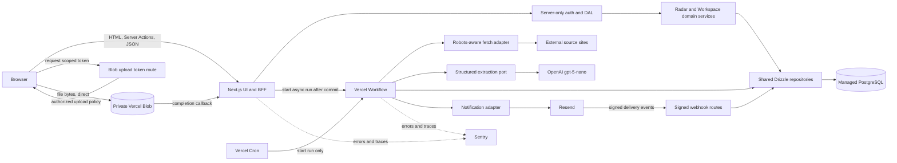

# Research Report: technical

**Date:** 2026-07-29
**Author:** Adedayo
**Research Type:** technical

---

## Research Overview

## Technical Research Scope Confirmation

**Research Topic:** Missa production dependencies, skills, MCPs, and development tools
**Research Goals:** Identify the smallest current installation stack that closes the reviewed persistence, authorization, ingestion, UI, testing, file-storage, email, observability, and deployment gaps without overlapping tools.

**Technical Research Scope:**

- Architecture Analysis - design patterns, frameworks, system architecture
- Implementation Approaches - development methodologies, coding patterns
- Technology Stack - languages, frameworks, tools, platforms
- Integration Patterns - APIs, protocols, interoperability
- Performance Considerations - scalability, optimization, patterns

**Research Methodology:**

- Current web data with rigorous source verification
- Multi-source validation for critical technical claims
- Confidence level framework for uncertain information
- Comprehensive technical coverage with architecture-specific insights

**Scope Confirmed:** 2026-07-29

---

<!-- Content will be appended sequentially through research workflow steps -->

## Technology Stack Analysis

### Executive finding

Missa does not need a new frontend framework or a general-purpose agent framework. Its current foundation is capable: Node 22, TypeScript, Next.js 16, React 19, Tailwind 4, Base UI/shadcn, PostgreSQL, and Drizzle. The current Anthropic-specific adapter should be replaced because its cost does not fit the product. The build is blocked by missing production contracts around durable row-level state, tenant-scoped authorization, validated AI output, durable background work, file storage, and end-to-end verification.

The smallest coherent direction is therefore to **complete the existing stack**, not replace it. Package installation must accompany architectural changes; no dependency can make the current whole-store snapshot model or cross-tenant routes safe.

### Programming Languages

- **Keep TypeScript as the only application language.** The repo already uses TypeScript across the web, Radar, adapters, and Workspace packages. Adding Python for ingestion or AI orchestration would split domain types and operational tooling without solving a current requirement.
- **Standardize development and CI on Node 22 LTS.** CI already uses Node 22, while the inspected local runtime is Node 25.5.0. Playwright documents supported current Node release lines, and a single pinned runtime avoids native/runtime differences. Add an `engines.node`, `.nvmrc`, or Volta declaration before making browser tests a required gate. [Playwright installation requirements](https://playwright.dev/docs/intro)
- **Use the platform for IDs.** PostgreSQL/Drizzle `uuid().defaultRandom()` is appropriate for persisted identities; Node's `crypto.randomUUID()` is sufficient when an ID must exist before insertion. Do not add nanoid, CUID, ULID, or another ID library. [Drizzle PostgreSQL column types](https://orm.drizzle.team/docs/column-types), [Node crypto](https://nodejs.org/download/release/v22.16.0/docs/api/crypto.html)

### Development Frameworks and Libraries

#### Retain and consolidate

- **Next.js 16.2.10 + React 19.2.7** remain the production application platform. Route Handlers, Server Components, Server Actions, headers, and cookies already cover the app's transport and rendering needs.
- **Tailwind 4 + Base UI + shadcn source components + CVA** remain the UI foundation. Do not add MUI, Chakra, Radix alongside Base UI, or another token framework. The design-system problem is governance and composition: 46 primitives were imported but 31 remain unused, the 8px spacing rules are bypassed, and Passport/Workspace share the wrong navigation shell.
- **Drizzle ORM + `pg`** should become the only data-access stack. The existing hand-written DDL and snapshot persistence must be retired in favor of a shared schema, repositories, tenant-scoped row queries, constraints, and transactions. Do not add Prisma, TypeORM, or Kysely. [Drizzle PostgreSQL setup](https://orm.drizzle.team/docs/get-started-postgresql), [Drizzle transactions](https://orm.drizzle.team/docs/transactions)
- **A provider-neutral structured extraction port** should replace the Anthropic-specific `LlmExtractor`. The first implementation should use the official `openai` SDK with `gpt-5-nano`. OpenAI describes this model as its fastest, cheapest GPT-5 variant, supports Structured Outputs, and currently lists $0.05/M input, $0.005/M cached input, and $0.40/M output tokens. A page using the current 12k input cap and roughly 1k output is approximately $0.001 before deterministic skips, caching, or Batch discounts. Keep the model ID in `MISSA_AI_MODEL` because model generations change more quickly than application code. [GPT-5 nano model and pricing](https://developers.openai.com/api/docs/models/gpt-5-nano), [OpenAI structured outputs](https://developers.openai.com/api/docs/guides/structured-outputs)
- **Remove `@anthropic-ai/sdk` after the OpenAI adapter passes the extraction evaluation suite.** Do not install Google/Groq SDKs, LangChain, LlamaIndex, an agent framework, or Vercel AI SDK at the same time. The intelligence layer needs deterministic schemas, provenance, confidence thresholds, cost budgets, retries, evaluation fixtures, and a human verification queue—not an autonomous agent loop.

#### Install in the foundation repair phase

| Purpose | Install | Location | Why now |
|---|---|---|---|
| Versioned database migrations | `drizzle-kit@0.31.10` | root dev dependency | The repo currently has duplicate schema sources and boot-time DDL. Production changes need generated, reviewed, repeatable SQL migrations. [Drizzle Kit](https://orm.drizzle.team/docs/kit-overview) |
| Radar row-level queries | `drizzle-orm@0.45.2` | `@missa/radar-adapters` | Workspace already resolves this stable version; Radar needs it to replace whole-store snapshots with atomic row operations. Do not move to the Drizzle 1.0 release candidate. |
| Runtime boundary validation | `zod@4.4.3` | `@missa/web` and `@missa/radar-adapters` | Validate route bodies/params plus crawler, LLM, and persisted JSON before domain code sees them. [Zod 4](https://zod.dev/packages/zod) |
| Lower-cost structured extraction | `openai` | `@missa/radar-adapters` | Implement the provider adapter behind the existing engine `Extractor` port; remove `@anthropic-ai/sdk` only after fixture parity is proven. |
| Server module boundary | `server-only@0.0.1` | `@missa/web` | Make accidental imports of the DAL, secrets, and authorization code into client bundles fail early. [Next.js data security](https://nextjs.org/docs/15/app/guides/data-security) |
| Complex dynamic forms | `react-hook-form`, `@hookform/resolvers` | `@missa/web` | Use with Zod for the open-call builder, conditional fields, multi-work submission packet, and review forms. Keep simple forms native/React 19. [shadcn React Hook Form guide](https://ui.shadcn.com/docs/forms/react-hook-form) |
| Browser and tenant-flow tests | `@playwright/test`, `@axe-core/playwright` | `@missa/web` dev dependencies | The largest current test hole is real web behavior: onboarding, submit/track, publish/review, tenant isolation, mobile shell, dialogs, and accessibility. [Next.js Playwright guide](https://nextjs.org/docs/app/guides/testing/playwright), [Playwright accessibility testing](https://playwright.dev/docs/accessibility-testing) |
| Explicit web lint gate | `eslint`, `eslint-config-next@16.2.10`, `eslint-plugin-jsx-a11y` | `@missa/web` dev dependencies | Next 16 removed `next lint` and build-time linting, so CI needs a separate lint command. [Next.js ESLint config](https://nextjs.org/docs/app/api-reference/config/eslint) |
| Stable formatting | exact `prettier`, `prettier-plugin-tailwindcss`, `eslint-config-prettier` | root dev dependencies | Make source and Tailwind ordering deterministic without adding Biome alongside ESLint/Prettier. [Prettier installation](https://prettier.io/docs/install.html) |

#### Install in the first complete production workflow

| Purpose | Install/service | Why |
|---|---|---|
| Private submission files | `@vercel/blob` | Replace data-URI uploads with direct browser-to-private-blob uploads, metadata rows, size/type validation, authorization, and controlled downloads. Vercel recommends client uploads for files above the Function body limit. [Vercel Blob](https://vercel.com/docs/vercel-blob), [client uploads](https://vercel.com/docs/vercel-blob/client-upload) |
| Durable Radar ingestion | `workflow` | Run each source/batch as a checkpointed step with retries, timeouts, observability, and resumability. Keep Cron only as the trigger. Do not also install Inngest, Trigger.dev, BullMQ, and Vercel Queues. Vercel positions Workflow for stateful multi-step work; Queues are the lower-level primitive. [Vercel Workflows](https://vercel.com/workflows), [Vercel Queues](https://vercel.com/docs/queues), [Vercel Cron](https://vercel.com/docs/cron-jobs) |
| Transactional email | `resend`, `react-email` | Send decision, reminder, claim, and verification messages with idempotency keys and versioned templates. Current React Email 6 unifies components and rendering in `react-email`; do not start new code on the older `@react-email/components` package. [Resend send API](https://resend.com/docs/api-reference/emails/send-email), [React Email 6 changelog](https://react.email/docs/changelog) |
| Application error visibility | `@sentry/nextjs` | Capture application exceptions, source maps, and traces. Use Vercel Observability for deployment/function health; Sentry is for application failures, not a second log warehouse. [Sentry Next.js SDK](https://getsentry-sentry-javascript.mintlify.app/platforms/nextjs), [Vercel Observability](https://vercel.com/docs/observability) |

#### Defer until there is a feature that uses it

- **Vitest + Testing Library:** add after client-side form/state modules are extracted. Prioritize Playwright first because Next.js recommends end-to-end testing for async Server Components. [Next.js testing overview](https://nextjs.org/docs/app/guides/testing)
- **Storybook:** add only after unused primitives are pruned and the first 10–15 Missa-owned components/tokens have stable APIs. Storybook cannot repair a component inventory or navigation model. [Storybook for Next.js with Vite](https://storybook.js.org/docs/get-started/frameworks/nextjs-vite/)
- **WorkOS AuthKit:** defer to the enterprise roles/seats/SSO milestone. It is a credible later replacement for the current home-grown authentication and organization membership system, but migrating identity now would distract from fixing resource-scoped authorization. [WorkOS AuthKit Next.js SDK](https://workos.com/docs/sdks/authkit-nextjs), [roles and permissions](https://workos.com/docs/authkit/roles-and-permissions)
- **Stripe:** defer to the billing story. Do not add the SDK until products, entitlements, webhook ownership, and subscription states are defined.
- **Upstash Redis/rate limiting:** use Vercel WAF fixed-window limits first. Add `@upstash/ratelimit` and `@upstash/redis` only when limits must be account/plan-aware or portable beyond Vercel. [Vercel WAF rate limiting](https://vercel.com/docs/vercel-firewall/vercel-waf/rate-limiting), [Upstash Rate Limit](https://upstash.com/docs/redis/sdks/ratelimit-ts/overview)
- **Chromatic/Percy and a second browser-test framework:** defer. Playwright already supplies screenshots and cross-browser projects.

### Database and Storage Technologies

#### PostgreSQL remains the system of record

Use one managed PostgreSQL database, one authoritative Drizzle schema, and one migration history. A small internal `@missa/db` workspace is the cleanest home for schema definitions, pool construction, repositories, and migrations shared by Radar and Workspace.

The immediate data architecture requirements are:

1. Replace process-global Maps plus delete/reinsert snapshots with request-time row queries.
2. Use transactions for multi-row state transitions and persist progress after each ingestion step.
3. Generate database identities with UUID defaults and add real foreign keys, uniqueness rules, and tenant-bearing relationships.
4. Scope every nested read or mutation by both resource ID and organization ID.
5. Add PostgreSQL row-level security later as defense-in-depth, using a non-owner application role; RLS is not a replacement for correct queries. [Drizzle RLS](https://orm.drizzle.team/docs/rls)

For a new Vercel-connected database, Neon is the lowest-friction default because Vercel's former first-party Postgres product was retired and new databases are provisioned through Marketplace integrations. No Neon-specific runtime package is required while the existing `pg` driver and pooled connection URL meet the workload. [Postgres on Vercel](https://vercel.com/docs/postgres), [Neon for Vercel](https://vercel.com/marketplace/neon)

Use **Vercel Blob for binary submission files** and PostgreSQL for file metadata, ownership, hashes, scan state, and audit records. Do not store file bytes/data URIs in JSON or database rows.

### Development Tools and Platforms

#### Required local and CI tools

- Pin Node 22 and keep npm workspaces.
- Run Drizzle Kit from the repository, not as an untracked global install.
- Install Playwright Chromium first; add WebKit/Firefox gates after the primary flows are stable.
- Add explicit CI jobs for `lint`, type-check, package tests, migration validation, and Playwright E2E/axe.
- Use Playwright's built-in screenshots for a small set of stable shell, form, and table states before purchasing hosted visual regression.
- Use the Vercel CLI already associated with the project for environment/deployment inspection; add the Sentry wizard only when wiring its SDK.

#### AI/intelligence development discipline

The extractor should be treated as an untrusted adapter, not the owner of business truth:

- request structured output against a versioned Zod/JSON schema;
- keep raw source text, canonical URL, fetched time, model ID, prompt/schema version, token usage, and raw/parsed result references;
- separate deterministic normalization/scoring from LLM extraction;
- fail one source without failing the batch, and checkpoint each successful source;
- store confidence and evidence per field, not only one composite score;
- route low-confidence/conflicting records into the operator UI;
- maintain a labelled evaluation fixture set and run it before model/prompt changes.

This is enough for Missa's current intelligence layer. Adding MCP servers to the runtime crawler or allowing an agent to mutate product data autonomously would increase the attack surface and make evaluation harder.

### Cloud Infrastructure and Deployment

The coherent production topology is:

1. **Vercel** for the Next.js web application, Route Handlers, deployment previews, WAF, Cron trigger, and baseline observability.
2. **Managed PostgreSQL (prefer Neon through Vercel Marketplace)** for transactional product state.
3. **Vercel Workflow** for durable multi-step Radar ingestion and later reliable email/delivery jobs.
4. **Vercel Blob** for private user submission files.
5. **Resend** for transactional email.
6. **Sentry** for application errors and traces.
7. **OpenAI API using `gpt-5-nano`** for schema-constrained extraction only, behind a provider-neutral Radar adapter.

Each service has one responsibility. Do not simultaneously add Supabase Auth/Storage, Firebase, a second queue, a second ORM, or another LLM orchestration framework.

### Technology Adoption Trends and Project Implications

- **Managed Postgres integrations have replaced Vercel Postgres.** The current path is Marketplace provisioning; Neon is a sensible default, not a mandatory code dependency. [Vercel Marketplace storage](https://vercel.com/docs/marketplace-storage)
- **Durable execution is now available as a first-party Vercel primitive.** This makes a separate queue vendor unnecessary for the initial Radar workflow, provided Workflow's current platform constraints fit the batch design.
- **Async Server Components move confidence toward E2E testing.** Unit tests remain valuable for client logic, but Playwright should own the user/workflow and tenant-boundary gates.
- **Source-owned component systems require curation.** shadcn installs source code rather than a versioned visual system; Missa must define its own semantic components, allowed states, tokens, and review rules.
- **Structured model output reduces parser fragility but does not create truth.** The app still needs provenance, deterministic validation, evals, and human review.

### Step 2 recommendation snapshot

**Install first:** Drizzle Kit, Drizzle ORM in Radar adapters, Zod, `server-only`, React Hook Form/resolvers for complex forms, Playwright/axe, and the explicit lint/format toolchain.

**Install with the first production workflow:** Vercel Blob, Vercel Workflow, Resend + current React Email, and Sentry.

**Defer:** Vitest/Testing Library, Storybook/Chromatic, WorkOS, Stripe, Upstash, cross-browser CI expansion, and any runtime MCP/agent framework.

**Do not install:** a second ORM, a second UI library, a second schema library, a second form library, another E2E runner, a UUID package, LangChain/LlamaIndex/Vercel AI SDK, or overlapping queues/storage/auth providers.

**Confidence:** High for the stack consolidation and install order. Medium for choosing Vercel Workflow over an external durable-job provider until Radar's maximum execution volume, regional requirements, and pricing envelope are measured.

## Integration Patterns Analysis

### Integration topology

Missa should remain a **modular monolith**, deployed as one Next.js application with internal TypeScript package boundaries. External services connect through narrow server-side adapters; neither the browser nor the domain engines should know vendor SDK details.



The important boundary is that **PostgreSQL is product truth**. Workflow owns execution state, Blob owns bytes, the model proposes structured fields, Resend transports email, and Sentry observes failures. None of those services becomes a second product database.

### Where each dependency plugs in

| Dependency/service | Exact home | Called by | Must not own |
|---|---|---|---|
| `drizzle-kit` | repository root, build/dev only | CI and release migration commands | Runtime queries or boot-time schema mutation |
| `drizzle-orm` + `pg` | new internal `packages/db` (`@missa/db`) | server-only DAL, Radar/Workspace repositories, Workflow steps | UI state or domain policy |
| `zod` | boundary schemas in `packages/contracts`; domain-specific AI schema beside Radar adapter | Route Handlers, Server Actions, Blob callbacks, Resend webhooks, AI adapter | Database authorization or semantic truth |
| `server-only` | `apps/web/lib/server/*` and the database/DAL entry points | Next.js server code | Client-side form behavior |
| React Hook Form + resolver | complex client forms in `apps/web/components/forms/*` | form builder, submission packet, review and organization flows | Server validation; the same Zod contract must be checked again server-side |
| `openai` | `packages/radar-adapters/src/ai/openAiStructuredClient.ts` | `StructuredOpportunityExtractor` inside Workflow steps | Scoring, deduplication, publishing, or direct database writes |
| `workflow` | `apps/web/workflows/*`, deployed with the web app | Cron dispatcher and committed product events | Canonical domain state; workflow payloads carry IDs, not entire records/files |
| `@vercel/blob` | token/callback/download Route Handlers and upload UI | browser for bytes; server for policies and metadata | File ownership, review state, or submission truth |
| `resend` + `react-email` | `apps/web/lib/server/notifications/*` and `apps/web/emails/*` | notification Workflow steps | Decision state; email is an effect of a committed decision |
| `@sentry/nextjs` | Next.js instrumentation plus Workflow error boundaries | web and job runtime | Audit logs or user-visible workflow history |
| Playwright + axe | `apps/web/e2e/*`, CI only | CI and local verification | Runtime application bundles |
| ESLint/Prettier | root/web configuration, CI only | developers and CI | Runtime behavior |

### API Design Patterns

#### External browser API: REST-shaped Next.js BFF

Keep Route Handlers and Server Actions as Missa's public application boundary. Use JSON for client mutations and callbacks; use direct server-side repository calls from Server Components rather than making the server call its own HTTP routes. Next.js explicitly notes that Route Handlers are public endpoints, must validate untrusted input, and add an unnecessary round trip when called from Server Components. [Next.js Backend for Frontend guide](https://nextjs.org/docs/app/guides/backend-for-frontend)

Every mutation follows one sequence:

1. Parse content type and size.
2. Validate params/body with Zod.
3. Verify the session.
4. Resolve organization role and resource ownership in the DAL.
5. Execute one tenant-scoped repository operation/transaction.
6. Return a narrow DTO.
7. Start any asynchronous effect only after commit.

Do not add GraphQL, tRPC, gRPC, an API gateway, or a public microservice mesh. Missa has one web consumer and one deployment; those layers would duplicate contracts without fixing the current tenancy flaws.

#### Internal API: ports and application services

The domain engines remain vendor-free. Infrastructure packages implement ports such as `Fetcher`, `Extractor`, `FileStore`, and `NotificationSender`. The existing `Extractor` port is a good start, but `LlmExtractor` currently imports Anthropic types directly. Replace it with:

```ts
interface StructuredGenerationClient {
  generate<T>(request: {
    schemaName: string;
    jsonSchema: object;
    prompt: string;
    input: string;
    idempotencyKey: string;
  }): Promise<{
    data: T;
    provider: string;
    model: string;
    inputTokens: number;
    outputTokens: number;
  }>;
}
```

`OpenAiStructuredClient` implements this port. `StructuredOpportunityExtractor` performs Zod validation and conversion into `OpportunityCandidate`. The Radar engine then runs deterministic date/fee/status validation, scoring, deduplication, and verification routing. This preserves the rule: **the model proposes; Missa validates and decides**.

#### Webhook APIs

Only external services that genuinely push state should have webhooks. Initially this is Resend delivery/bounce events and Vercel Blob completion callbacks. Each handler must verify the provider signature/token, validate the payload, deduplicate by provider event ID, store the event, return quickly, and move heavier work to Workflow. Resend's reference ingester uses Svix signature verification and `svix-id` for idempotent storage. [Resend webhook ingester](https://resend.com/docs/webhooks/ingester)

### Communication Protocols

- **HTTPS request/response:** browser to Next.js, Next.js/Workflow to OpenAI, Resend, Blob, and external source sites.
- **Direct TypeScript calls:** Server Components, DAL, application services, and repositories inside the modular monolith.
- **Durable Workflow event log/queue:** asynchronous ingestion, notifications, reconciliation, and later delivery. Vercel Workflow isolates `"use step"` functions with retries, persistence, and observability. [Vercel durable execution model](https://vercel.com/blog/a-new-programming-model-for-durable-execution)
- **Signed HTTPS callbacks:** Blob completion and Resend delivery events.
- **No WebSockets initially:** polling or standard navigation is enough for operator queues. If ingestion progress later needs live updates, use a narrow Server-Sent Events or durable-stream endpoint rather than turning the entire application into a realtime system.
- **No general AMQP/Kafka broker:** Workflow plus a transactional Postgres outbox covers the current scale and consistency needs.

### Data Formats and Standards

- **JSON + Zod** for application requests, AI output, workflow inputs, and webhook payloads.
- **JSON Schema** at the model-provider boundary. Structured decoding controls response shape, not the factual correctness of extracted values, so every response still passes Zod and deterministic domain validation. [OpenAI structured outputs](https://developers.openai.com/api/docs/guides/structured-outputs)
- **Relational rows** for canonical product state; use JSONB only for genuinely variable form answers, raw provider metadata, or versioned evidence—not for whole-store snapshots.
- **Binary bytes in Blob; metadata in Postgres.** The browser uploads directly using a server-issued token, keeping large bodies out of Route Handlers. [Vercel Blob client uploads](https://vercel.com/docs/vercel-blob/client-upload)
- **CSV** only at import/export boundaries. Parse into validated commands and write through normal repositories; never make CSV a parallel data source.
- **iCalendar (`text/calendar`)** remains the calendar export format already present in the product.

Every cross-boundary record should carry `schemaVersion`, stable ID, organization ID where applicable, creation time, and idempotency key.

### System Interoperability Approaches

#### Shared database, separate ownership

Radar and Workspace use the same PostgreSQL database so a published hosted call can link to a Radar opportunity and a hosted submission can update the submitter's tracker transactionally. They must not keep separate in-memory copies. `@missa/db` owns schemas and repositories; engines own business rules.

Required atomic writes include:

- create Submission + Works + file links + audit entry + tracker status + outbox event;
- publish Open Call + public version + audit entry + outbox event;
- record Work review/decision + audit entry + notification outbox event;
- accept extraction + snapshot/provenance + opportunity upsert + verification task.

Drizzle transactions commit or roll back these multi-row changes as one logical unit. [Drizzle transactions](https://orm.drizzle.team/docs/transactions)

#### Transactional outbox between database and Workflow

A database commit and a remote `start(workflow)` call cannot be one atomic transaction. Therefore:

1. The domain transaction writes its state and an `outbox_events` row together.
2. After commit, the request attempts to start the workflow using the outbox event ID.
3. A scheduled dispatcher retries undispatched rows if the request dies between commit and start.
4. The Workflow claims the event idempotently, performs effects, and marks it processed.
5. Unique constraints on `(event_type, aggregate_id, version)` prevent duplicates.

This gives at-least-once delivery with idempotent effects without adding Kafka or another queue vendor.

#### Private file interaction

1. An authenticated draft asks `/api/files/upload-token` for a token.
2. The server verifies account/organization, allowed MIME type, maximum size, and generates an immutable namespaced pathname.
3. The browser uploads bytes directly to a **private** Blob store.
4. Blob calls the completion handler; the handler upserts `file_assets` metadata.
5. Submission creation accepts only owned `fileAssetId` values in `uploaded`/`clean` state—never arbitrary Blob URLs.
6. Downloads pass through an authorized server route that checks submission/reviewer access.

Vercel documents the browser-to-Blob token exchange and recommends it for payloads above the Function request limit. [Vercel Blob client upload](https://vercel.com/docs/vercel-blob/client-upload)

#### Lower-cost intelligence interaction

The model call must never sit on an interactive page request. It belongs in a Workflow source step:

1. Fetch with robots/terms enforcement, timeout, and response-size limit.
2. Store source snapshot metadata and content hash.
3. Skip unchanged content.
4. Run deterministic opportunity-likelihood and field extraction first.
5. Call `gpt-5-nano` only for changed pages that are likely opportunities but incomplete/ambiguous.
6. Request one schema-constrained extraction, then validate with Zod and domain rules.
7. Persist provider/model/prompt/schema versions, usage, estimated cost, source evidence, and result.
8. Route conflicts/low confidence to human verification; do not publish automatically.

Use the OpenAI Batch API for non-urgent scheduled extraction when its turnaround fits the source cadence; OpenAI documents a 50% discount and a separate rate-limit pool for Batch work. Add daily call/token/cost ceilings and a kill switch. If the budget is exhausted or OpenAI is unavailable, retain the deterministic result and queue verification—do not silently fall back to an expensive model. [OpenAI Batch API](https://developers.openai.com/api/docs/guides/batch), [GPT-5 nano pricing](https://developers.openai.com/api/docs/models/gpt-5-nano)

### Microservices Integration Patterns

Missa should **not** become microservices now. Its correct shape is packages inside one deployment:

- `@missa/db`: database/schema/repositories;
- `@missa/contracts`: Zod/API/event schemas;
- `@missa/radar-engine`: vendor-free Radar rules;
- `@missa/radar-adapters`: web fetch and provider-specific structured extraction adapters;
- `@missa/workspace-engine`: Workspace rules;
- `@missa/web`: UI, BFF, auth/DAL, workflows, emails and composition.

These boundaries can later become services only if independent scaling, ownership, or regulatory requirements appear. Today there is no need for service discovery, gRPC, a service mesh, distributed sagas, or an enterprise service bus.

For external dependencies use small resilience patterns instead:

- explicit timeouts and bounded retries with jitter;
- retry only transient `429`/`5xx`/network failures;
- idempotency keys for every effect;
- concurrency limits per source/provider;
- a circuit/kill switch after repeated provider failures;
- dead-letter/verification state in Postgres, visible to operators.

### Event-Driven Integration

Use domain events for **effects after committed facts**, not as the source of truth. Initial events include:

- `submission.created`
- `tracker.status_changed`
- `open_call.published`
- `review.completed`
- `decision.recorded`
- `organization.claim_requested`
- `opportunity.verification_required`
- `email.delivery_updated`

Workflow consumers receive an `outboxEventId`, load current state from Postgres, and perform an idempotent action. Never serialize whole user submissions, file bytes, secrets, or mutable aggregates into workflow inputs.

Email is a consequence of committed state. A `decision.recorded` transaction writes the decision, audit entry, and outbox row. The Workflow renders the current template and sends with an idempotency key such as `decision.recorded/<decision-id>/<version>`. Resend retains idempotency keys for 24 hours, while Missa's own unique outbox/effect record provides permanent deduplication. [Resend idempotency keys](https://resend.com/docs/dashboard/emails/idempotency-keys)

Do not adopt full event sourcing or CQRS. The current product needs a reliable audit log and outbox, not reconstruction of all state from events.

### Integration Security Patterns

- **Session authentication at the web boundary; secure authorization in the DAL.** Next.js recommends centralizing secure checks in a Data Access Layer and returning narrow DTOs. [Next.js authentication guide](https://nextjs.org/docs/app/guides/authentication)
- **Tenant scope is part of every repository method**, for example `publishOpenCall({ organizationId, openCallId, actorId })`. Never authorize an organization and then load a nested object by ID alone.
- **Secrets stay server-only:** database URL, OpenAI key, Blob token, Resend key, Sentry auth token, Workflow/Cron secrets. No provider SDK is imported by Client Components.
- **Upload tokens are short-lived and least-privilege**, bound to actor/draft/path, content type, and size.
- **Webhook signatures are verified against the raw body** before parsing; provider event IDs are unique in Postgres.
- **WAF/rate limits** protect authentication, upload-token, public submission, webhook, and ingestion-trigger endpoints.
- **Sensitive data minimization:** model inputs should contain only source-site text, never private submissions. Sentry must scrub cookies, tokens, file bodies, form answers, and source payloads. Workflow inputs should be IDs rather than private records even though Vercel encrypts Workflow event data. [Vercel Workflow encryption](https://vercel.com/changelog/workflow-encryption)
- **Audit logs and observability are separate:** the audit log records who changed product state; Sentry/Vercel record operational failures.

### Failure and recovery contract

| Failure | User-visible/product result | Recovery owner |
|---|---|---|
| Postgres transaction fails | No partial domain state or event exists | Request returns safe error; retry whole command |
| Workflow start fails after commit | Domain fact remains committed; outbox stays pending | dispatcher starts it later |
| Source fetch times out/fails | Only that source is marked failed; other sources continue | Workflow retry, then operator queue |
| OpenAI fails/rate-limits/budget stops | Deterministic candidate remains; nothing auto-publishes | bounded retry or verification queue |
| Blob upload completes but submit is abandoned | Unattached file asset remains temporary | scheduled garbage collection |
| Submission transaction fails after upload | Blob remains unattached; no false Submission exists | retry submission or garbage collect |
| Resend call fails | Decision/submission remains committed; email effect pending | Workflow retry with idempotency key |
| Duplicate webhook/event | Unique key makes processing a no-op | handler returns success |
| Sentry unavailable | Product continues; audit/domain writes unaffected | Vercel logs and later recovery |

### Integration sequence before installation

1. Create `@missa/db` and `@missa/contracts` boundaries on paper/code structure first.
2. Replace snapshot stores and ID counters; add constraints and tenant-scoped repositories.
3. Centralize DAL authorization and route validation.
4. Replace Anthropic adapter with `StructuredGenerationClient` + OpenAI implementation and extraction evals.
5. Introduce Workflow plus outbox for Radar ingestion.
6. Introduce private Blob with file-asset lifecycle.
7. Wire hosted submission to Radar tracker in one transaction.
8. Introduce notification outbox, Resend, and delivery webhooks.
9. Add Sentry and operational dashboards.
10. Make Playwright/axe, lint, type-check, migrations, and package tests release gates.

**Integration confidence:** High for the modular-monolith, DAL, row-level transaction, direct Blob upload, provider-port, and outbox patterns. Medium for Workflow capacity/cost until a representative 1,024-source tick is load-tested. Medium for `gpt-5-nano` extraction quality until Missa's labelled fixtures are evaluated; the adapter boundary keeps replacement inexpensive.

## Architectural Patterns and Design

### Architectural decision summary

Missa should be rebuilt toward a **stateless, server-rendered modular monolith with hexagonal boundaries**, a shared transactional PostgreSQL database, and durable asynchronous workflows. This shape keeps operational complexity low while separating product rules from Next.js, Vercel, storage, email, and model vendors.

The target is not a large rewrite. Each unsafe production seam can be replaced behind an existing or newly defined port while the product stays runnable.

### System Architecture Patterns

#### Pattern: modular monolith

One Next.js deployment remains the composition root. Packages provide compile-time boundaries, but do not become independently deployed services:

```text
@missa/contracts          Zod commands, events and boundary schemas
@missa/db                 Drizzle schema, migrations, pool and repositories
@missa/radar-engine       pure Radar domain rules and ports
@missa/radar-adapters     crawling and structured-model adapters
@missa/workspace-engine   pure Workspace domain rules and ports
@missa/web                UI, BFF, DAL, cross-domain use cases, workflows, email
```

Dependency direction:

```text
web composition ────────┬──> radar-engine
                        ├──> workspace-engine
                        ├──> radar-adapters
                        ├──> db
                        └──> contracts

radar-adapters ─────────┬──> radar-engine
                        ├──> db
                        └──> contracts

db ─────────────────────────> Drizzle + pg only
contracts ──────────────────> Zod only
domain engines ─────────────> no Next/Vercel/provider SDKs
```

This prevents the present failure mode where framework routes directly manipulate globally loaded stores. It also lets a model, storage, email, or job provider be replaced without rewriting domain rules.

Next.js already provides the appropriate application shell: Server Components for server rendering/reads, Client Components only where state or browser APIs are required, and public Route Handlers for external/client commands. [Next.js Server and Client Components](https://nextjs.org/docs/app/getting-started/server-and-client-components), [Backend for Frontend guide](https://nextjs.org/docs/app/guides/backend-for-frontend)

#### Pattern: hexagonal ports and adapters

The engine layer owns interfaces and business concepts; infrastructure owns implementations:

| Port | Initial adapter |
|---|---|
| `OpportunityRepository` | Drizzle/PostgreSQL |
| `WorkspaceRepository` | Drizzle/PostgreSQL |
| `SourceFetcher` | robots-aware HTTP, Playwright only when necessary |
| `StructuredGenerationClient` | OpenAI `gpt-5-nano` |
| `FileStore` | private Vercel Blob |
| `NotificationSender` | Resend |
| `WorkflowStarter` | Vercel Workflow |
| `ErrorReporter` | Sentry |

Domain services never import the adapter. The composition root constructs them and passes dependencies inward.

#### Rejected architectural patterns

- **Microservices:** no independent teams, deployment schedules, or scaling domains justify network boundaries yet.
- **Process-global state:** serverless Route Handlers cannot safely share state between requests or instances; Next.js documents that such deployments may not share memory and may terminate long-running handlers. [Next.js BFF deployment caveats](https://nextjs.org/docs/app/guides/backend-for-frontend#deployment-environment)
- **Full event sourcing/CQRS:** the product needs auditability and reliable effects, not state reconstruction from an event log.
- **Backend-as-a-service replacement:** Supabase/Firebase would duplicate the current Postgres, auth and storage decisions rather than repair the domain model.
- **Runtime MCP/agent architecture:** Radar is a bounded extraction pipeline, not an autonomous tool-using agent.

### Design Principles and Best Practices

#### Business rules remain deterministic

Model output is treated as one untrusted observation. The AI adapter may extract candidates and evidence, but cannot calculate authoritative trust, publish opportunities, approve claims, or change submission decisions. Those operations remain ordinary TypeScript domain code with explicit tests.

Use a pinned model snapshot after evaluation, a versioned prompt/schema, and a labelled fixture corpus. Any model/prompt change must compare accuracy, required-field recall, hallucination rate, latency, tokens, and cost on the same corpus. OpenAI's current guidance likewise recommends comparing configurations on representative tasks and accepting cost reductions only when the result still passes evaluation criteria. [OpenAI model guidance](https://developers.openai.com/api/docs/guides/latest-model)

#### One public boundary, one secure DAL

Route Handlers and Server Actions translate transport into validated commands. They do not contain domain policy. A server-only Data Access Layer verifies session, tenant, role and resource relationship, then calls a use case. Next.js recommends centralizing secure authorization in a DAL and returning narrow DTOs. [Next.js authentication and DAL](https://nextjs.org/docs/app/guides/authentication)

Every repository method makes tenant ownership explicit:

```ts
publishOpenCall({ actorId, organizationId, openCallId, expectedVersion })
assignReviewer({ actorId, organizationId, roundId, workId, reviewerId })
downloadFile({ actorId, organizationId, fileAssetId })
```

The API cannot prove membership in organization A and then mutate an ID from organization B.

#### Cross-domain use cases live at the composition layer

Radar and Workspace engines should not import each other to coordinate product journeys. Cross-domain operations live in `apps/web/lib/server/use-cases` and use both ports within one transaction. This is where hosted submission creates Workspace records and a Radar tracker event, or publishing a claimed open call updates its linked Radar opportunity.

#### Architecture decision records

Record these decisions before the implementation phase:

1. ADR-001: Modular monolith and dependency direction.
2. ADR-002: One PostgreSQL system of record and one Drizzle migration history.
3. ADR-003: Server-only DAL with relationship-aware tenant authorization.
4. ADR-004: Transactional outbox plus Vercel Workflow.
5. ADR-005: Provider-neutral structured extraction with an evaluated low-cost default.
6. ADR-006: Private Blob for bytes and Postgres for ownership metadata.
7. ADR-007: Two product shells and a governed semantic design system.
8. ADR-008: Test and release gates.

### UI and Design-System Architecture

The current UI problem is architectural rather than a missing component package. shadcn copies component source into the project, so Missa owns every imported primitive and must curate it. [shadcn source-code model](https://ui.shadcn.com/docs/new)

Use four UI layers:

```text
tokens/                  primitive and semantic design decisions
components/ui/           low-level Base UI/shadcn primitives
components/system/       Missa semantic components and states
features/passport/       Passport-specific compositions
features/workspace/      Workspace-specific compositions
```

#### Tokens

Define tokens in three levels:

- **Primitive:** raw palette, type scale, spacing multiples, radius, motion durations.
- **Semantic:** `surface-canvas`, `text-muted`, `border-critical`, `space-section`, `focus-ring`.
- **Component:** use sparingly for genuinely stable component contracts.

The 2025.10 Design Tokens Community Group format is its first stable version and provides a vendor-neutral JSON interchange format. Missa can model tokens compatibly without adding a token build tool immediately. [Design Tokens Format Module 2025.10](https://www.w3.org/community/reports/design-tokens/CG-FINAL-format-20251028/)

#### Two product shells

Use separate Next route-group layouts for Passport and Workspace. Next.js supports different layouts for route groups without changing URLs. [Next.js project structure and route groups](https://nextjs.org/docs/app/getting-started/project-structure)

- Passport shell: Opportunities, Tracker, Inbox, Library/Files later.
- Workspace shell: Overview, Open Calls, Submissions, Review, Decisions/Delivery later.
- Shared account switcher and organization context, but no six-link mixed navigation.
- Mobile navigation collapses intentionally; active route, loading, empty, error and disabled states are required system states.

#### Semantic component set before Storybook

Prune unused copied primitives, then stabilize the small Missa-owned set: `AppShell`, `RegisterHeader`, `DataTable`, `FilterBar`, `StatusBadge`, `ExplainedScore`, `EvidencePanel`, `EmptyState`, `FormField`, `MutationButton`, `FileItem`, `Timeline`, `DialogForm`, and `MobileNav`.

Only after those APIs stabilize should Storybook document and test states. Until then, Playwright screenshots and axe tests provide higher-value coverage of the actual flows.

### Scalability and Performance Patterns

#### Stateless request path

Each web request loads only the rows it needs. No request initializes or rewrites an entire engine snapshot. Server Components query repositories directly; Route Handlers perform bounded commands and return. Long work starts a Workflow and returns `202 Accepted` with a run/domain status ID.

#### Database query and indexing pattern

Index actual access paths, beginning with:

- `(organization_id, status, updated_at)` for Workspace registers;
- `(submitter_account_id, created_at)` for Passport submissions;
- `(reviewer_account_id, status, due_at)` for review queues;
- `(next_check_at, enabled)` for due sources;
- `(canonical_url)` and `(source_id, content_hash)` for ingestion dedupe;
- `(processed_at, available_at)` for outbox dispatch;
- `(opportunity_id, version_hash)` for immutable opportunity versions.

Use cursor/keyset pagination for growing registers and feeds. Avoid loading every source, submission or opportunity into memory.

#### Bounded concurrency

Radar should enumerate due source IDs, then process bounded batches with explicit per-host and model-provider concurrency. One source is one recoverable unit. Persist its result before another batch is allowed to erase or supersede it. Workflow provides isolated durable steps and observability without keeping a request open. [Vercel Workflow execution model](https://vercel.com/blog/a-new-programming-model-for-durable-execution)

#### Cost-aware extraction

The order is `fetch → hash → deterministic prefilter → model only when needed`. Cache by immutable content hash plus prompt/schema/model version, not merely URL. Store model usage and estimated cost as operational data. Use Batch for sources whose cadence tolerates the turnaround, with daily budgets and per-run ceilings.

#### Caching policy

- Cache only public, derived, safely invalidated views such as published organization/open-call pages.
- Keep authenticated organization registers request-scoped until authorization-aware caching is explicitly designed.
- Never cache session/membership results globally.
- Blob/CDN handles immutable file delivery after authorization.
- Do not install Redis for generic caching until measurements identify a database/read bottleneck.

### Integration and Communication Patterns

Use synchronous calls for reads and authoritative commands; use the outbox/Workflow path for effects and long work:

```text
request → validate/auth → DB transaction → response
                               └→ outbox → Workflow → external service
```

Transactions must remain short and contain database operations only. They never wait on source websites, OpenAI, Blob, Resend, Sentry or Workflow. The outbox closes the dual-write gap, while idempotency and unique constraints make at-least-once execution safe.

Workflow inputs carry stable IDs and schema versions. Steps reload current state from PostgreSQL. This limits sensitive payload duplication and prevents a long-running workflow from treating stale serialized aggregates as truth.

### Security Architecture Patterns

Authorization is relationship-aware, deny-by-default and checked on every request. OWASP explicitly recommends least privilege, deny by default, permission validation on every request, and protection against guessed/tampered object IDs. [OWASP Authorization Cheat Sheet](https://cheatsheetseries.owasp.org/cheatsheets/Authorization_Cheat_Sheet.html)

Apply defense in depth:

1. WAF/rate limits at the edge.
2. Zod validation and payload limits at Route Handlers.
3. Secure session verification in the DAL.
4. Tenant/role/resource checks in every use case/repository query.
5. PostgreSQL foreign keys, uniqueness and check constraints.
6. PostgreSQL RLS later, after scoped queries work, using a non-owner application role.
7. Append-only audit records for privileged product mutations.
8. Sentry/operational telemetry with PII scrubbing.

PostgreSQL RLS becomes default-deny when enabled without an applicable policy, but table owners normally bypass it; this is why application-role configuration is part of the design. [PostgreSQL row security](https://www.postgresql.org/docs/17/ddl-rowsecurity.html)

Specific trust boundaries:

- External source HTML is hostile input; enforce timeouts, byte limits, URL policy, robots/terms and HTML-to-text isolation.
- Model output is hostile input; enforce schema and domain validation.
- Uploads are quarantined assets until metadata and any required scanning complete.
- Webhooks are untrusted until raw-body signature verification succeeds.
- Client-supplied organization/resource IDs are lookup hints, never proof of access.
- Logs/traces must not contain file contents, application answers, session cookies or model source payloads.

### Data Architecture Patterns

#### One schema source, module-owned files

Use one Drizzle configuration and migration directory, with schema files divided by ownership rather than duplicate DDL:

```text
packages/db/src/schema/
  platform.ts       accounts, sessions, organizations, memberships, audit, outbox
  radar.ts          sources, snapshots, extraction runs, opportunities, tracker
  workspace.ts      entities, programs, calls, paths, submissions, works, reviews
  files.ts          upload intents, file assets, work/submission file links
  notifications.ts  notification intents and delivery attempts
```

Production never creates or mutates schema on application boot. Drizzle Kit generates reviewed SQL and applies versioned migrations. [Drizzle Kit generate](https://orm.drizzle.team/docs/drizzle-kit-generate), [Drizzle Kit migrate](https://orm.drizzle.team/docs/drizzle-kit-migrate)

#### Identity and integrity

- Use database-generated UUID primary keys.
- Preserve human-readable slugs separately; never use them as authorization.
- Add real cross-domain foreign keys.
- Make Review, Decision and Delivery point to `Work`, not only `Submission`.
- Add optimistic version columns where concurrent editor/reviewer updates are possible.
- Keep immutable snapshots and opportunity versions; update current projections transactionally.
- Store variable form answers in versioned JSONB whose schema/version is linked to the submission path.
- Store file bytes outside Postgres.

Foreign keys provide database-level integrity; Drizzle's relation helpers alone do not create those constraints. [Drizzle relations and foreign keys](https://orm.drizzle.team/docs/relations)

#### Audit, outbox and observability are distinct

- **Audit:** who changed what product state and when; durable/compliance-facing.
- **Outbox:** which committed fact still needs an external effect.
- **Operational telemetry:** latency, retries, failures and costs.
- **Workflow history:** execution debugging, not permanent business truth.

Do not collapse these into one generic events table.

### Deployment and Operations Architecture

#### Environment topology

- Local: local Workflow world, local/test Postgres, fake external adapters by default.
- Pull request: Vercel preview, isolated/branched Postgres when possible, fake email/model for automated tests.
- Staging: real infrastructure with non-production keys and capped provider budgets.
- Production: Vercel web/Workflow, managed Postgres, private Blob, Resend, OpenAI and Sentry.

The Vercel Neon integration supports database branching for preview deployments; use it if Neon is selected, rather than pointing previews at production data. [Neon for Vercel](https://vercel.com/marketplace/neon)

#### Release order

1. Validate migration SQL against a production-like snapshot.
2. Apply backward-compatible schema expansion.
3. Deploy code capable of reading old/new state during transition.
4. Backfill/checkpoint data where necessary.
5. Switch reads/writes.
6. Remove legacy columns/snapshot paths in a later release.

Never combine a destructive schema contraction, application cutover and provider migration in one deployment.

#### Operational signals

Start with a small set of actionable metrics:

- web request error/latency by route class;
- authorization denials and suspicious cross-tenant attempts;
- due sources, sources processed/failed, fetch/model latency;
- extraction validation failure and human-review rates;
- model tokens/cost per accepted opportunity;
- outbox pending age and Workflow retry/dead-letter counts;
- file upload/callback/orphan counts;
- email delivery/bounce rates.

Avoid user IDs, resource IDs and raw URLs as metric labels because high-cardinality attributes raise telemetry cost and memory use. OpenTelemetry specifically warns that high-cardinality attributes can create unbounded aggregation state. [OpenTelemetry metrics](https://opentelemetry.io/docs/concepts/signals/metrics/)

Use correlation IDs across request, transaction/outbox, Workflow run and external provider request. Preserve Sentry/Vercel for operations and PostgreSQL audit for product accountability.

### Architecture implementation boundary

Installing packages is authorized only after their owner and interface are clear. The installation phase should therefore create dependencies in this order:

1. Foundation boundaries: `@missa/contracts`, `@missa/db`, Drizzle Kit, Zod, `server-only`.
2. Data correctness: row repositories, constraints, UUIDs, migrations and DAL.
3. Provider-neutral extraction: `openai` adapter and eval fixtures; then remove Anthropic.
4. Durable work: Workflow and outbox dispatcher.
5. Files: private Blob lifecycle.
6. Notifications: Resend/React Email and webhooks.
7. Operations: Sentry, lint/format and CI gates.
8. UI confidence: Playwright/axe, then RHF migration for complex forms.

**Architecture confidence:** High. The largest uncertainty is not the dependency structure; it is the migration effort required to move existing in-memory engine methods onto row repositories without temporarily duplicating sources of truth. That migration should be implemented incrementally behind ports and guarded by real Postgres integration tests.

## Implementation Approaches and Technology Adoption

### Technology Adoption Strategies

Use an incremental replacement strategy rather than installing and wiring the entire stack in one unverified change. The existing engines remain runnable while one boundary at a time is redirected from in-memory/snapshot infrastructure to the new implementation. This follows the risk-reducing principle of the strangler pattern: establish a stable interface, route a bounded capability through the replacement, verify it, and then remove the legacy implementation. [AWS strangler fig guidance](https://docs.aws.amazon.com/prescriptive-guidance/latest/modernization-aspnet-web-services/fig-pattern.html)

The adoption sequence is:

1. Capture the current build/test baseline and pin Node 22.
2. Introduce packages and interfaces without changing behavior.
3. Replace persistence and authorization paths first.
4. Replace the Anthropic adapter with an evaluated low-cost provider adapter.
5. Move long-running effects onto Workflow/outbox.
6. Add file, email and observability adapters.
7. Turn web lint/E2E/accessibility checks into release gates.
8. Remove legacy snapshot, boot-DDL and provider code only after parity tests pass.

Avoid dual sources of truth. A feature may temporarily have two adapters behind one port for comparison, but only one adapter writes authoritative state in a given environment.

### Dependency Installation Plan

The packages must first exist so npm can assign dependencies to their actual owner:

```text
packages/contracts/package.json  -> @missa/contracts
packages/db/package.json         -> @missa/db
```

#### Batch 1: foundation

```bash
npm install --save-dev drizzle-kit@0.31.10
npm install zod@4.4.3 --workspace=@missa/contracts
npm install drizzle-orm@0.45.2 pg@8.22.0 --workspace=@missa/db
npm install --save-dev @types/pg --workspace=@missa/db
npm install server-only --workspace=@missa/web
```

Add a single root `drizzle.config.ts`, migration directory and scripts for `db:generate`, `db:check`, `db:migrate` and `db:studio`. `drizzle-kit check` examines generated migrations for collisions; production should use generated migrations rather than `push`. [Drizzle Kit overview](https://orm.drizzle.team/docs/kit-overview)

#### Batch 2: web forms, lint and browser quality

```bash
npm install react-hook-form @hookform/resolvers --workspace=@missa/web
npm install --save-dev @playwright/test @axe-core/playwright --workspace=@missa/web
npm install --save-dev eslint eslint-config-next@16.2.10 eslint-plugin-jsx-a11y --workspace=@missa/web
npm install --save-dev --save-exact prettier@3.9.6 prettier-plugin-tailwindcss eslint-config-prettier
npm exec --workspace=@missa/web -- playwright install chromium
```

Next 16 removed `next lint`, so CI must call the ESLint CLI directly. [Next.js ESLint configuration](https://nextjs.org/docs/app/api-reference/config/eslint)

#### Batch 3: lower-cost intelligence adapter

```bash
npm install openai --workspace=@missa/radar-adapters
```

Implement and evaluate `OpenAiStructuredClient` behind `StructuredGenerationClient`. Only after the fixture suite meets the agreed quality/cost thresholds:

```bash
npm uninstall @anthropic-ai/sdk --workspace=@missa/radar-adapters
```

The official OpenAI package provides Zod structured-output helpers, so no extra AI orchestration package is needed. [OpenAI Node SDK](https://github.com/openai/openai-node), [Zod parsing helper](https://github.com/openai/openai-node/blob/master/helpers.md)

#### Batch 4: durable production adapters

```bash
npm install workflow @vercel/blob resend react-email @sentry/nextjs --workspace=@missa/web
```

Install them together in the manifest, but integrate and verify them separately in this order: Workflow/outbox, Blob lifecycle, Resend/email delivery, Sentry instrumentation.

#### Agent tooling

The current machine already has the Vercel and GitHub CLIs, and GitHub MCP is enabled. Add only the missing high-value tools:

```bash
npx skills add vercel/workflow
codex mcp add vercel --url https://mcp.vercel.com
```

Vercel documents the Workflow skill as guidance for durable step orchestration and its MCP as an OAuth-protected interface for projects, deployments and logs. [Vercel agent skills](https://vercel.com/docs/agent-resources/skills), [Vercel MCP](https://vercel.com/docs/agent-resources/vercel-mcp)

Existing relevant skills require no installation: `architecture-decision-records`, `database-design`, `auditing-security`, `adding-e2e-tests`, `accessibility-auditing`, `form-testing`, `api-smoke-testing`, `adding-error-tracking`, `frontend-design`, `building-components`, `code-review`, `find-bugs`, and `deploy-to-vercel`.

### Development Workflows and Tooling

Use one branch/PR for each architectural slice rather than one dependency mega-commit:

1. Package scaffolding and Node/toolchain.
2. Schema/migration baseline.
3. Radar row repository and IDs.
4. Workspace row repository and Work-centric review model.
5. DAL/tenant authorization.
6. AI provider adapter and evals.
7. Workflow/outbox ingestion.
8. Blob/file lifecycle.
9. Cross-domain submission/tracker transaction.
10. Email, observability and UI/test-system upgrades.

Each PR states its migration behavior, rollback path, data ownership change and new test coverage. ADRs are committed before or with the first implementation that relies on them.

Root scripts should converge on:

```text
npm run format:check
npm run lint
npm run typecheck
npm run db:check
npm test
npm run test:e2e
npm run build
```

### Testing and Quality Assurance

#### Test layers

- **Pure domain tests:** Radar/Workspace rules, scoring, validation and permissions.
- **Repository integration tests:** real PostgreSQL constraints, transactions, create-after-reload IDs, concurrency and outbox behavior.
- **Route/use-case tests:** Zod failures, authentication, organization relationships, idempotency and safe status codes.
- **AI evaluation fixtures:** labelled source texts, expected fields/evidence, false-positive/false-negative metrics and cost report; fake provider in ordinary CI.
- **Playwright E2E:** signup/onboarding, claim, track/submit, publish/review/decision, tenant isolation, mobile navigation, file upload states and operator verification.
- **axe plus manual accessibility:** automated WCAG checks, keyboard/focus review and periodic screen-reader checks.

Start Playwright with Chromium and one CI worker for determinism, then add WebKit/Firefox only after the core suite is reliable. Playwright's CI documentation recommends explicit browser/dependency installation and one worker for stability. [Playwright CI](https://playwright.dev/docs/ci)

CI should use a PostgreSQL service container or an isolated Neon branch. GitHub supports PostgreSQL service containers, while Neon supports preview/test branches and automated schema migrations per pull request. [GitHub service containers](https://docs.github.com/en/enterprise-cloud%40latest/actions/tutorials/use-containerized-services), [Neon branching](https://neon.com/docs/guides/branching-intro)

No automated CI job calls paid model, email or Blob services. Those adapters use fakes/fixtures in PR checks and run capped smoke tests in staging.

### Deployment and Operations Practices

#### Environment requirements

- Pin local and CI runtime to Node 22; the inspected local machine currently runs Node 25.5.0 while CI uses Node 22.
- Local defaults to deterministic extraction and fake email/file adapters unless explicit development keys are present.
- Preview environments receive isolated database branches and non-production service credentials.
- Staging uses real services with hard provider budgets and synthetic/non-sensitive data.
- Production secrets are stored only in Vercel environment configuration.

#### Migration release discipline

1. Generate and review SQL.
2. Test it on an isolated production-like branch.
3. Take/verify a restore point.
4. Apply expansion migration.
5. Deploy compatible code and backfill in checkpointed steps.
6. Verify row counts, constraints and product flows.
7. Switch traffic/reads.
8. Contract/remove legacy structures in a later release.

Neon branches can be created per preview/test environment and used to test potentially destructive queries before production. [Neon branching workflows](https://neon.com/branching)

#### Operational readiness

Before production enablement, define alerts for web error rate, tenant-denial anomalies, outbox age, failed Workflow sources, extraction validation failures, model budget, orphan uploads and email bounce/failure rate. Every alert needs an owner, threshold, runbook and safe replay/rollback action.

### Team Organization and Skills

One small team can own this modular monolith, but implementation work should be reviewed by risk domain:

- Data/persistence changes: database and concurrency review.
- Authorization/routes: security/tenant-boundary review.
- AI changes: fixture/evaluation and cost review.
- UI/design system: responsive/accessibility review.
- Workflow/external adapters: idempotency and failure/replay review.

The key skills are already installed locally. The only missing procedural skill with direct stack value is the official Vercel Workflow skill. Additional generic skills would overlap the existing catalog and increase instruction noise.

### Cost Optimization and Resource Management

- Model calls happen only after content-hash change and deterministic prefiltering.
- `gpt-5-nano` is the initial low-cost provider; record tokens/cost per extraction and enforce daily/run budgets.
- Use Batch only for cadences that tolerate its turnaround.
- Workflow steps carry IDs and small results, not page bodies/files.
- Use bounded source batches and concurrency; measure step count before choosing final polling cadence.
- Private Blob holds bytes; Postgres stores compact metadata.
- Use Vercel WAF before adding Redis solely for rate limiting.
- Expire preview database branches and orphaned upload intents.
- Start with Sentry sampling and PII scrubbing rather than capturing every trace/body.
- Do not add a second observability, queue, storage, auth or AI framework without measured need.

### Why the Deferred Tools Are Deferred

| Deferred item | Why it is premature | Installation trigger |
|---|---|---|
| Vitest/Testing Library | The current risk is complete server/user workflows and tenant boundaries; many screens are async Server Components. Adding a unit runner immediately creates setup before testable client modules are isolated. | Add when complex client hooks/form state/pure UI helpers are extracted and at least five meaningful unit/component cases are identified. |
| Storybook | Missa has an unstable inventory: 46 copied primitives and 31 unused. Storybook now would document accidental components and freeze weak APIs. | Add after pruning and stabilizing the first 10–15 Missa-owned semantic components with defined states. |
| Chromatic/Percy | Hosted visual review depends on stable stories and a team process; Playwright screenshots cover the first critical states without another vendor. | Add when Storybook is stable and visual regressions regularly escape Playwright/review. |
| WorkOS | It should replace—not sit beside—the custom identity/session system. Migration requires external-ID mapping, session cutover, organization/member reconciliation and enterprise-role requirements. | Begin with the enterprise roles/seats/SSO epic and a written identity migration ADR. |
| Stripe | Billing products, entitlements, fees/payouts, ledger ownership, webhook states, refunds and disputes are not designed yet. Installing the SDK does not define them. | Add when the billing epic has approved commercial and accounting state models. |
| Upstash Redis/rate limiting | Vercel WAF covers current anonymous endpoint protection without another datastore/service. | Add only when Missa needs portable, account/plan-aware quotas or WAF limits cannot express the policy. |
| Redis/cache generally | There is no measured read bottleneck; caching authenticated tenant data prematurely risks leaks and invalidation bugs. | Add after query/index optimization and production measurements show a repeatable bottleneck. |
| Alternate AI SDKs | The provider port already enables replacement. Multiple installed clients add code, keys and ambiguous fallback/cost behavior. | Add one alternate only if the fixture benchmark shows OpenAI quality, price, latency or availability is unacceptable. |
| LangChain/LlamaIndex/Vercel AI SDK | Missa performs one bounded structured extraction, not an agent/RAG/chat workflow. The provider SDK already supplies schema parsing and retries. | Reconsider only if product requirements introduce multi-provider tool orchestration or RAG that cannot remain small adapters. |
| WebKit/Firefox CI matrix | Cross-browser value is real, but multiplying an unstable E2E suite makes initial diagnosis slow and noisy. | Add after Chromium core flows pass reliably across repeated PR runs. |
| Full coverage tooling | Coverage numbers before meaningful tests encourage low-value assertions. | Add after stable domain, repository and client tests exist; use thresholds on critical packages, not the whole repo. |
| Extra MCPs (database, Resend, Stripe, Slack/Gmail) | They do not make the runtime product work and grant agents additional external access. GitHub plus Vercel covers the immediate delivery loop. | Add a narrowly scoped MCP only when its service is active and the recurring operational task justifies agent access/human confirmation. |

Deferral is a risk-control mechanism: each item has a concrete adoption trigger, so it is not forgotten and is not installed merely because it is popular.

### Risk Assessment and Mitigation

| Risk | Severity | Mitigation |
|---|---|---|
| Migration corrupts or loses snapshot data | Critical | production-like branch rehearsal, backup/restore verification, row-count checks, incremental cutover |
| Old/new paths both write | Critical | one writer per environment, port-level switch, explicit rollback, remove legacy writer quickly |
| Tenant authorization regression | Critical | relationship-aware repositories, deny-by-default DAL, negative cross-tenant route/E2E tests |
| Workflow duplicate effects | High | transactional outbox, unique business keys, idempotent consumers/provider keys |
| Model quality too low | High | labelled evals, deterministic fallback, verification queue, provider port |
| Model cost grows unexpectedly | High | hash/prefilter, capped output, usage ledger, budgets/kill switch, batch for non-urgent work |
| Upload becomes unauthorized or orphaned | High | upload intents, private store, ownership checks, callback idempotency, sweeper |
| Package installation disrupts user changes | High | preserve dirty worktree, batch commits/diffs, run validation after each batch |
| Local/CI runtime drift | Medium | Node 22 engines/version file and CI enforcement |
| Tool/vendor overlap | Medium | install matrix and ADRs; one tool per responsibility |

## Technical Research Recommendations

### Implementation Roadmap

#### Release 0: safety baseline

- Pin Node 22.
- Record ADRs.
- Add root lint/typecheck/format/test scripts.
- Capture existing build/test status.

#### Release 1: data and tenant foundation

- Create contracts/db packages.
- Establish one schema/migration history.
- Replace IDs and snapshot persistence with row repositories.
- Add constraints, Work-centric review relationships, audit and outbox.
- Centralize DAL authorization and negative tenant tests.

#### Release 2: intelligence and ingestion

- Create provider-neutral structured extraction port.
- Add OpenAI adapter/eval suite and remove Anthropic after parity.
- Introduce Workflow source-level steps, timeouts, checkpoints and verification UI.
- Make source identity/provenance first-class.

#### Release 3: complete submission loop

- Add private Blob lifecycle.
- Build real organization claim/onboarding.
- Link hosted submission, Works, files and Radar tracker transactionally.
- Add operator verification/claim queues.

#### Release 4: notifications and production operations

- Add Resend/React Email and signed delivery webhooks.
- Add Sentry with scrubbing and correlation.
- Add WAF rules, dashboards, runbooks and staged provider smoke tests.

#### Release 5: design-system completion

- Split Passport/Workspace shells.
- Prune unused primitives.
- Implement semantic components and missing states.
- Enforce Playwright/axe/mobile release gates.
- Adopt Storybook only if its trigger conditions are met.

### Technology Stack Recommendations

The final immediate stack is Node 22, TypeScript, Next.js 16/React 19, Tailwind 4, Base UI/shadcn, PostgreSQL, Drizzle, Zod, OpenAI `gpt-5-nano`, Vercel Workflow, Vercel Blob, Resend/React Email, Sentry, Playwright/axe, ESLint and Prettier.

### Skill Development Requirements

- Row-level PostgreSQL/Drizzle transaction design.
- Multi-tenant authorization and negative testing.
- Durable/idempotent Workflow design.
- Structured AI output evaluation and cost measurement.
- Accessible semantic component design.
- Safe expand/backfill/cutover/contract migrations.

Use the already installed skills for these areas and add only the official Workflow skill.

### Success Metrics and KPIs

- Zero whole-store snapshot writes in production.
- Zero counter-based persisted IDs.
- All nested organization mutations proven tenant-scoped by negative tests.
- 100% privileged Workspace mutations produce audit records.
- One source failure never discards another source's success.
- AI extraction meets the labelled fixture threshold with recorded cost per accepted opportunity.
- Hosted submission produces Submission, Works, file links and tracker event atomically.
- Outbox oldest-pending age remains below the defined operational threshold.
- Core desktop/mobile Playwright and axe gates pass on every release.
- Unused primitive count is reduced and every semantic system component has documented states.
