# Research Report: technical

**Date:** 2026-08-16
**Author:** Missa
**Research Type:** technical

---

## Research Overview

This research examines how Missa should personalize and rank creative opportunities for global creators. It distinguishes current repository truth from recommendations, verifies external technical claims against current primary sources, and treats recommendation as a governed product system rather than a single model.

---

## Technical Research Scope Confirmation

**Research Topic:** Missa opportunity personalization recommendation algorithm

**Research Goals:** Design an evidence-backed, globally appropriate, explainable, privacy-conscious recommendation approach grounded in Missa's current product, taxonomy, data, and architecture, with a staged implementation and evaluation plan.

**Technical Research Scope:**

- Architecture analysis: candidate generation, hard eligibility filtering, scoring, reranking, explanations, feedback collection, and system boundaries.
- Implementation approaches: deterministic rules, content-based retrieval, behavioral models, learning to rank, exploration, and staged adoption.
- Technology stack: Missa's existing languages, frameworks, storage, deployment surfaces, and compatible recommendation infrastructure.
- Integration patterns: Profile and Settings preferences, Opportunities, Tracker, Library, saved searches, follows, submissions, reminders, outcomes, taxonomy, and analytics.
- Performance considerations: freshness, deadline sensitivity, latency, scale, observability, fallback behavior, and operational cost.
- Product and governance considerations: cold start, privacy, consent, controllability, global eligibility, fairness, creator and opportunity exposure, useful uncertainty, and explanation quality.
- Evaluation: offline relevance and ranking metrics, coverage and diversity, fairness and safety guardrails, online experiments, causal limitations, and rollback criteria.

**Research Methodology:**

- Current repository inspection with exact file, symbol, route, and table evidence.
- Current web research using primary or authoritative sources wherever possible.
- Multi-source validation for consequential technical claims.
- Explicit confidence levels and separation of implemented, partial, local-only, proposed, unverified, and unknown states.
- No code, schema, production data, deployment, or publication changes as part of this research.

**Scope Confirmed:** 2026-08-16

## Technology Stack Analysis

### Executive finding

Missa does not need a separate recommender platform to begin. The current modular TypeScript system already contains the foundations for an explainable first-stage recommender: canonical opportunity taxonomy, explicit account preferences, saved searches, Work taxonomy, organization follows, tracking/status events, deterministic eligibility matching, Postgres queries, and user-facing tailoring reasons. What exists today is primarily filtering plus simple ordering, not a learned recommendation system.

The least-regret stack is therefore:

1. retain hard eligibility and user exclusions as deterministic TypeScript/Postgres policy;
2. add an auditable feature and scoring layer within the existing Radar ports-and-adapters boundary;
3. log recommendation impressions and downstream outcomes before attempting learning-to-rank;
4. use PostgreSQL lexical/taxonomy retrieval first, with `pgvector` only if semantic-retrieval experiments demonstrate incremental value;
5. introduce an offline Python training job and a versioned exported model only after there is sufficient, consented interaction data and a trustworthy evaluation set.

This is a stack conclusion, not yet the final algorithm recommendation. Confidence: **high** for the current-state characterization; **medium** for the future ML path because interaction volume and production schema deployment have not yet been measured in this research.

### Current Missa stack and recommendation readiness

| Layer | Current repository truth | Recommendation relevance | Status |
| --- | --- | --- | --- |
| Runtime | Node.js `24.x`; TypeScript packages in an npm-workspaces monorepo | One language can own request-time eligibility, scoring, explanations, APIs, and deterministic tests | Implemented in repository |
| Web/API | Next.js `16.2.12`, React `19.2.7`, App Router and Route Handlers | Personalized browse can remain a protected server/API query rather than a client-side model | Implemented in repository |
| Domain engine | `@missa/radar-engine`, dependency-light ports and adapters | Existing matching and Fit concepts provide the natural policy boundary | Implemented, but recommendation behavior is elementary |
| Persistence | PostgreSQL via `pg`; authoritative Drizzle schema in `@missa/db`; compatibility snapshots remain a runtime boundary | Relational joins can generate candidates and features without a new online store | Implemented but dual-read/dual-write boundaries remain |
| Taxonomy | `@missa/taxonomy` plus relational terms, graph relations, assignments, aliases, evidence, and preferences | Strong content-based matching and globally governed vocabulary are available before embeddings | Implemented; production deployment/completeness requires separate verification |
| Background compute | Railway workers with bounded, leased Postgres queues; Vercel user-facing app | Feature refresh, offline evaluation, and eventual model training can run outside request latency | Existing worker pattern implemented; no recommendation worker identified |
| Product analytics | `posthog-js` is installed in the web app | Could support experiments and aggregate behavior analysis | Library present; recommendation event contract not yet verified |
| ML/vector dependencies | No TensorFlow, PyTorch, LightGBM, XGBoost, `pgvector`, or vector-client dependency appears in the inspected manifests | There is no current learned ranker or semantic vector layer to preserve | Absent in inspected repository |

Repository evidence: `package.json`; `apps/web/package.json`; `packages/radar-engine/package.json`; `packages/radar-adapters/package.json`; `packages/db/package.json`; `packages/taxonomy/package.json`; `ONBOARDING.md`; `docs/railway-topology.md`.

#### Critical current truth boundary: “recommended” is not one algorithm

The two current repository paths disagree:

- The compatibility repository orders `recommended` opportunities by the number of tailoring reasons and then by deadline (`apps/web/lib/opportunityRepository.ts`). It can build reasons from saved searches, opportunity preferences, taxonomy preferences, Library Work taxonomy, tracking, and follows.
- The PostgreSQL repository orders `recommended` by current verification, deadline, processing freshness, and ID (`packages/radar-adapters/src/opportunityRepository.ts`). It does **not** use the tailoring reasons, saved searches, broad opportunity preferences, follows, or Tracker behavior in the ordering.

The PostgreSQL browse query applies explicit taxonomy exclusions, but it does not currently apply most of the durable `opportunity_preferences` fields. The compatibility path does. Saved-search APIs and some follow behavior also remain on compatibility storage, while canonical browse reads relational tables. Consequently, Missa does not yet have a single environment-independent recommendation policy. This must be stabilized before evaluation or ML training; otherwise observed behavior would describe different rankers depending on runtime configuration.

Additional inspected gaps include no impression-position contract, no explicit negative-feedback action, no versioned scoring policy, no diversity/exposure reranker, no offline ranking dataset, and no recommendation consumer of PostHog or the first-party analytics ledger. These are implementation gaps, not evidence that the underlying product signals are absent.

### Programming languages

#### TypeScript and SQL: appropriate online-serving core

Missa's online recommender should initially remain TypeScript plus SQL. The current engine already implements deterministic matching in `packages/radar-engine/src/matching/matching.ts`, public browse projections in `apps/web/lib/opportunityRepository.ts`, and Postgres browse SQL in `packages/radar-adapters/src/opportunityRepository.ts`. Keeping candidate eligibility, policy, and explanation generation in this stack minimizes operational divergence and makes the decision path testable alongside the existing product.

Node 24 remains an LTS line as of this report, consistent with the root engine declaration. [Node.js release status](https://nodejs.org/en/about/previous-releases).

The main limitation is numerical and model-training ergonomics: TypeScript is not the strongest environment for serious offline learning-to-rank, causal analysis, or recommender research. That limitation does not justify adding Python before Missa has training data.

#### Python: justified later for offline modeling, not request-time policy

If and when learned ranking becomes supportable, Python is the pragmatic offline environment because maintained ranking libraries expose mature objectives and metrics. LightGBM supports `lambdarank` and `rank_xendcg`; XGBoost exposes LambdaMART-style objectives such as `rank:ndcg`, as well as an experimental position-debiasing option for click data. [LightGBM parameters](https://lightgbm.readthedocs.io/en/latest/Parameters.html), [XGBoost learning-to-rank guide](https://xgboost.readthedocs.io/en/stable/tutorials/learning_to_rank.html).

The recommended boundary is a reproducible offline training/evaluation command that exports a versioned artifact or explicit coefficients. TypeScript remains responsible for serving, feature validation, hard filters, fallbacks, and explanations. A Python microservice is not warranted for the first phases.

### Development frameworks and libraries

#### Current framework

Next.js App Router supports server/client components, route handlers, caching, and revalidation, matching Missa's existing architecture. Its own guidance notes that Route Handlers are public HTTP endpoints requiring explicit authentication and authorization, and that server components should fetch directly from data sources where possible rather than round-tripping through internal HTTP. This supports a shared server-side recommendation service called by both the authenticated page and API boundary. [Next.js App Router](https://nextjs.org/docs/app/getting-started), [Next.js backend-for-frontend guide](https://nextjs.org/docs/app/guides/backend-for-frontend).

#### Recommendation libraries evaluated

TensorFlow Recommenders documents the common two-stage architecture: retrieve hundreds or thousands of candidates, then rank a much smaller shortlist. Its factorized retrieval task uses separate query and candidate towers. This is useful architectural evidence, but it is disproportionate to Missa's current catalog and unmeasured interaction data; it should be treated as a later option rather than a phase-one dependency. [TensorFlow Recommenders retrieval task](https://www.tensorflow.org/recommenders/api_docs/python/tfrs/tasks/Retrieval).

Google's current recommendation guidance likewise separates candidate generation, scoring, and reranking. Missa can adopt those boundaries using deterministic and relational components before it needs neural retrieval. [Google recommendation-system overview](https://developers.google.com/machine-learning/recommendation/overview/types).

Tree-based learning-to-rank is a more plausible first learned model than a neural two-tower system because it can use Missa's structured features, works well with heterogeneous tabular inputs, and can export inspectable feature contributions. Even this requires reliable exposure/impression data and debiasing. XGBoost's documentation explicitly warns that clicks are noisy and position-biased. [XGBoost position-bias discussion](https://xgboost.readthedocs.io/en/stable/tutorials/learning_to_rank.html#position-bias).

### Database and storage technologies

#### PostgreSQL should remain the online system of record and initial feature store

Missa's authoritative schema already contains `opportunity_preferences`, `saved_searches`, `tracked_opportunities`, `tracked_status_events`, `organization_follows`, and `account_taxonomy_preferences` in `packages/db/src/schema.ts`. Opportunity taxonomy assignments and Library Work taxonomy make structured content-based retrieval possible through SQL.

PostgreSQL full-text search includes `ts_rank` and `ts_rank_cd`, but PostgreSQL itself notes that relevance is application-specific and often needs additional factors such as recency. This is exactly Missa's case: lexical relevance can contribute to a score, but eligibility, deadline feasibility, trust, fee, location, and creator intent must be separate features. [PostgreSQL text-search ranking](https://www.postgresql.org/docs/current/textsearch-controls.html#TEXTSEARCH-RANKING).

#### Vector storage is an optional retrieval extension, not the recommendation algorithm

Neon supports the `pgvector` extension, so Missa could add semantic retrieval without operating a separate vector database. The official Node integration documents Drizzle support, compatible with Missa's existing database package. `pgvector` provides exact nearest-neighbor search and approximate HNSW/IVFFlat indexes; HNSW offers a better speed-recall tradeoff than IVFFlat but costs more memory and build time. Approximate indexes trade recall for speed, and filtering can reduce returned results unless queries and indexes are carefully tuned. [Neon pgvector support](https://neon.com/docs/ai/ai-concepts), [pgvector Node/Drizzle integration](https://github.com/pgvector/pgvector-node), [pgvector indexing and filtering](https://github.com/pgvector/pgvector#hnsw).

For Missa, semantic similarity must run **after or alongside** hard eligibility filtering, never substitute for it. Exact Postgres vector search may be sufficient at the current likely catalog scale; an approximate index should be adopted only after benchmark evidence. Any extension or schema change remains subject to a separate migration approval gate.

#### No separate feature store or warehouse yet

There is no repository evidence that Missa currently needs Feast, Tecton, a streaming feature platform, or a dedicated analytical warehouse for serving recommendations. A versioned SQL feature view or materialized table plus immutable exposure/outcome events is the appropriate first boundary. A warehouse becomes relevant when offline training, experiment analysis, or history volume makes operational Postgres analysis unsafe or slow.

### Development tools and testing platforms

Current repository tooling includes TypeScript compilation, Node's test runner across packages, ESLint with zero-warning enforcement for the web app, Prettier, Playwright, and `@axe-core/playwright`. These can cover deterministic score tests, ranking fixtures, API integration tests, accessibility of recommendation explanations, and end-to-end personalization controls.

Recommendation work adds three missing test classes:

1. **Golden ranking fixtures:** fixed users, opportunities, feature values, expected eligibility decisions, score components, and ordering.
2. **Distribution and invariance tests:** no expired/ineligible item can enter; excluded taxonomy never returns; missing facts stay unknown; changing one feature has the intended monotonic effect.
3. **Offline evaluation harness:** time-based train/validation splits, baseline comparisons, segment metrics, coverage/diversity, calibration, and bootstrap confidence intervals.

No recommendation-specific experimentation, model registry, feature versioning, or data-quality tooling has yet been verified.

### Cloud infrastructure and deployment

The current split is well suited to a staged recommender:

- **Vercel / Next.js:** authenticate, request candidates, apply or read precomputed scores, return explanations, and record bounded impression/action events.
- **Neon Postgres:** canonical opportunities, user-approved inputs, interaction events, feature snapshots, recommendation runs, and model metadata.
- **Railway:** continuous or scheduled feature refresh, batch backfills, offline evaluation, and eventual training. Railway distinguishes persistent workers, scheduled jobs, and queues; its cron documentation warns that overlapping runs are skipped, so long recomputation should use a leased worker or queue rather than an overlapping cron. [Railway compute patterns](https://docs.railway.com/guides/cron-workers-queues), [Railway cron behavior](https://docs.railway.com/cron-jobs).

Next.js also warns that some Route Handler deployments cannot share memory between requests and may have execution limits. Therefore, request-local caches must not be the only recommendation state, and expensive batch modeling should not run inside the web request. [Next.js deployment caveats](https://nextjs.org/docs/app/guides/backend-for-frontend#deployment-environment).

### Technology adoption trends and staged implications

The broader recommender landscape favors multi-stage systems—candidate retrieval followed by ranking—but Missa should adopt the pattern without immediately adopting the largest-scale machinery. The current catalog, globally structured taxonomy, evidence requirements, and likely data sparsity make a deterministic, feature-based ranker a stronger starting point than collaborative filtering or deep retrieval.

Recommended technology progression:

| Stage | Stack | Adoption condition |
| --- | --- | --- |
| 0. Measurement | Existing TypeScript/Postgres plus versioned recommendation events | Begin before changing ranking; define consent and retention first |
| 1. Deterministic ranker | SQL candidate generation, TypeScript scoring/reranking/explanations | Can begin once current schema/runtime boundaries are confirmed |
| 2. Hybrid retrieval experiment | PostgreSQL FTS plus optional exact `pgvector`; reciprocal-rank or weighted fusion | Only if taxonomy/lexical candidates demonstrably miss relevant opportunities |
| 3. Learned tabular ranker | Offline Python with LightGBM or XGBoost; versioned artifact served under TypeScript policy | Only with adequate exposure/outcome volume, position-aware evaluation, and segment safety |
| 4. Representation learning | Two-tower/neural retrieval and approximate ANN | Only if corpus/traffic scale and measured recall justify complexity |

### Technology gaps requiring later verification

- Actual production table/migration readiness for every proposed input is unverified in this research phase.
- The volume and quality of recommendation impressions, saves, tracks, submissions, outcomes, dismissals, and negative feedback are unknown.
- PostHog's current initialization, consent behavior, event taxonomy, retention, and experiment configuration have not yet been inspected.
- Neon extension availability is documented, but whether `vector` is enabled in Missa production is unknown and must not be assumed.
- No current model artifact registry, recommendation event schema, or stable feature contract has been identified.
- Current browse latency, catalog size by eligible segment, and Postgres query plans remain unmeasured.

## Integration Patterns Analysis

### Executive integration finding

The correct integration seam is the existing `OpportunityRepository` boundary, not a new personalization microservice. `GET /api/opportunities` already authenticates the request, derives `accountId` on the server, parses a bounded shared query contract, passes private context into `repository.browse()`, validates the returned DTO, and sets authenticated responses to `private, no-store`. The repository interface already declares ownership of SQL, pagination, publication safety, and private augmentation.

The integration problem is therefore mostly one of **canonical signal ownership and versioned decision context**:

- unify which store owns each user signal;
- generate one stable ranked feed per recommendation request;
- return customer-safe explanations without exposing private inputs or internal weights;
- log what was served, what was actually rendered, and what the creator later did;
- make every event attributable to the policy and feature versions that produced it;
- reconstruct offline features as they existed at impression time;
- keep asynchronous processing idempotent and never make analytics or notifications the authority for product state.

Confidence: **high** for the repository integration seam and current-state gaps; **medium** for the exact persistence shape of ranked feed snapshots until catalog size, traffic, and latency are measured.

### Current request and service flow

```mermaid
sequenceDiagram
    participant B as Browser
    participant A as Next.js API
    participant R as OpportunityRepository
    participant P as Postgres canonical data
    participant E as Event ledger
    participant W as Railway worker

    B->>A: GET /api/opportunities?sort=recommended&cursor=...
    A->>A: Authenticate cookie; derive accountId
    A->>R: browse(query, private context)
    R->>P: Read published opportunities and canonical signals
    P-->>R: Eligible candidates and feature inputs
    R->>R: Score, rerank, explain, bind feed snapshot
    R-->>A: Ordered items + opaque cursor + request context
    A->>E: Record served candidate set and policy versions
    A-->>B: Private no-store JSON response
    B->>E: Record rendered/viewable impression or explicit feedback
    W->>P: Refresh aggregates and evaluate point-in-time datasets
```

Current repository evidence:

- Authentication and personalized cache policy: `apps/web/app/api/opportunities/route.ts`.
- URL-to-contract parsing: `apps/web/lib/opportunityQuery.ts` and `packages/contracts/src/opportunities.ts`.
- Repository and private context boundary: `packages/radar-engine/src/opportunityPorts.ts`.
- Runtime repository selection: `apps/web/lib/opportunityRepository.ts`.
- Canonical query implementation: `packages/radar-adapters/src/opportunityRepository.ts`.
- First-party event API and ledger: `apps/web/app/api/analytics/events/route.ts`, `apps/web/lib/platformAnalytics.ts`, `packages/radar-adapters/src/platformAdminFoundations.ts`, and `platform_analytics_events` in `packages/db/src/schema.ts`.

### API design patterns

#### Keep a REST/JSON backend-for-frontend contract

Missa's authenticated Next.js Route Handler is already the appropriate backend-for-frontend boundary. A personalized browse request does not need GraphQL, gRPC, an externally exposed model endpoint, or client-side scoring. Next.js documents Route Handlers as public HTTP endpoints that require their own authentication and authorization; Missa already applies that server-side session boundary. [Next.js backend-for-frontend guide](https://nextjs.org/docs/app/guides/backend-for-frontend).

The recommended contract keeps the existing route and query vocabulary, but adds server-generated recommendation context:

| Field | Purpose | Exposure |
| --- | --- | --- |
| `requestId` or `feedId` | Joins pages, impressions, actions, and evaluation | Safe opaque identifier |
| `policyVersion` | Identifies deterministic scoring/reranking policy | Safe version label; no raw weights |
| `modelVersion` | Identifies learned model when one exists | Optional; safe bounded label |
| `generatedAt` | Defines feed snapshot time | Safe timestamp |
| `nextCursor` | Continues the same ranked snapshot | Opaque, signed or stored reference |
| `items[].personal.tailoringReasons` | Explains structured reasons | Existing customer-safe contract |

The client may supply surface, locale, IANA time zone, explicit filters, cursor, and page size. The server must derive or verify account identity, opportunity visibility, experiment assignment, policy/model versions, rate-limit identity, and access to every private feature. The API must never accept an arbitrary target `userId` for self-personalization.

#### Bind pagination to one stable recommendation request

The current canonical cursor encodes the last deadline/freshness sort key and ID. That works for static sorts, but a personalized score, diversity state, exposure constraints, or a profile edit can change ordering between pages. Independently reranking each page would create duplicates, omissions, and inconsistent explanations.

Preferred pattern:

1. the first request creates a stable ordered feed snapshot or immutable ranking-input snapshot;
2. subsequent pages refer to that feed using an opaque cursor;
3. the cursor is bound to account, filter/context hash, policy/model version, next ordinal or deterministic score boundary, issue time, and expiry;
4. a preference or policy change starts a new feed rather than mutating already-issued pagination;
5. the cursor is signed/MACed or resolves to server-side state—base64 alone is not protection.

RFC 8288 provides an interoperable `rel="next"` link relation if Missa later adds HTTP `Link` headers. [RFC 8288 Web Linking](https://www.rfc-editor.org/rfc/rfc8288). Invalid or expired cursors can use a consistent problem-details shape if Missa adopts RFC 9457 across its APIs. [RFC 9457 Problem Details](https://www.rfc-editor.org/rfc/rfc9457.html).

#### Preserve anonymous and authenticated behavior as distinct contracts

- Anonymous browse remains a non-personalized, publicly cacheable ranking baseline.
- Authenticated browse may use private signals and must remain `private, no-store`.
- Public filters should continue to work identically whether or not a session exists; personalization operates inside the eligible result set.
- A user-selected explicit sort such as “Soonest deadline” should be respected and not secretly replaced by the recommendation policy.

HTTP caching defines `private` as unavailable to shared caches and `no-store` as a prohibition on intentional storage, while noting that cache directives alone are not a complete privacy mechanism. [RFC 9111 HTTP Caching](https://www.rfc-editor.org/rfc/rfc9111.html).

### Signal ownership and interoperability

The following matrix is the integration prerequisite for a production ranker:

| Signal | Product owner | Current persistence/read reality | Required integration disposition |
| --- | --- | --- | --- |
| Opportunity publication, status, deadline, fee, destination, evidence | Opportunity/Radar | Canonical relational tables | Authoritative eligibility and quality inputs |
| Explicit opportunity preferences | Settings/private creator configuration | Compatibility `radar_users.data`, dual-written to `opportunity_preferences`; canonical browse ignores most fields | Make canonical relational read authoritative before ranking |
| Taxonomy preferences | Private creator configuration | Compatibility plus `account_taxonomy_preferences`; both paths partially use it | Canonicalize `include`, `prefer`, `exclude`, weight, origin and taxonomy version |
| Saved searches | Opportunities | API writes compatibility `radar_profiles`; canonical `saved_searches` is not the browse source | Complete canonical write/read path; treat as explicit intent |
| Library Work taxonomy | Library | Compatibility JSON used by browse despite canonical `work_taxonomy_terms` existing | Resolve canonical Work identity and taxonomy before using as a feature |
| Tracker save/status | Tracker | Canonical only under the Postgres repository flag; compatibility otherwise | One canonical event stream keyed by `accountId + opportunityId` |
| Tracker–Work link | Tracker relationship to Library | Compatibility-only path | Canonicalize before it affects ranking or evaluation |
| Organization follow | Opportunities/private following state | Follow API writes compatibility; canonical browse reads `organization_follows` | Repair write/read split before use |
| External application click | Opportunity/Tracker handoff | Redirect route; `submission_outbound_events` table has no verified writer | Add server-side intent event at the validated redirect seam |
| Hosted submission | Tracker/submission workflow | Workspace persistence; not consumed by recommendation | Join through canonical account/opportunity lineage; use as later high-intent label |
| Accepted/declined/waitlisted outcome | Tracker outcome; organization decision may originate it | Workspace decision updates compatibility Tracker, not canonical status tables | Emit canonical creator-opportunity outcome transition once, with provenance |
| Analytics | Measurement | PostHog plus first-party ledger; no recommender consumer | First-party event ledger is evaluation authority; PostHog is an analysis/experiment sink |

Three consequences follow:

1. **Do not train across mixed identifiers and stores.** A model must not learn from `userId` compatibility rows while serving from incomplete `accountId` relational rows.
2. **Do not infer absence as dislike.** A missing follow, Tracker row, or outcome may be a migration gap, not negative behavior.
3. **Do not use acceptance as a general creator-quality score.** Outcomes are downstream labels tied to opportunity fit, selection processes, access, and historical exposure; they must never become a hidden estimate of a person's worth or predicted acceptance probability.

### Communication protocols

#### Synchronous request path

Use HTTPS and bounded JSON for request-time recommendation serving. The web route should call the repository/service directly on the server, preserving the existing no-internal-HTTP-hop pattern. There is no current justification for GraphQL, gRPC, WebSockets, a service mesh, or an enterprise service bus.

Request-time dependencies should be limited to canonical Postgres reads plus local deterministic computation. A missing aggregate/model artifact must fall back to the prior deterministic policy; it must not make Opportunities unavailable.

#### Asynchronous compute path

Use the established Railway/Postgres leased-worker pattern for:

- slower user/opportunity aggregates;
- feature snapshot backfills;
- optional embedding generation;
- offline evaluation and training datasets;
- model or policy shadow scoring;
- deletion propagation and retention jobs.

Railway documents background workers for continuous event processing and queues for decoupled tasks with retries, while cron runs can be skipped when a previous execution overlaps. Long feature jobs should therefore use leased work or queues rather than depending on an overlapping cron. [Railway worker/queue guidance](https://docs.railway.com/guides/cron-workers-queues).

W3C `traceparent`/`tracestate` may correlate web, database, and worker operations, but tracing headers must not contain personalization inputs. [W3C Trace Context](https://www.w3.org/TR/trace-context/).

#### No browser push dependency

Personalization does not require WebSockets or server-sent events. The browser can request a new feed after a meaningful preference/action change and can otherwise use normal navigation/refetch behavior. Notifications may announce that new matches exist, but the notification payload must not become ranking or opportunity truth; clients re-fetch the canonical API.

### Data formats and standards

#### Public transport: bounded JSON validated by shared contracts

Continue using Zod-backed contracts in `@missa/contracts` for queries, response DTOs, reason codes, URL bounds, and array limits. Add recommendation metadata through an additive versioned contract. Keep raw feature values, private eligibility attributes, internal trust signals, abuse controls, and model coefficients out of public DTOs.

#### Storage: relational facts plus bounded JSONB metadata

- Relational columns and foreign keys own identities, user-opportunity relationships, versions, timestamps, and constraints.
- JSONB may hold bounded feature metadata, candidate provenance, or event properties when fields evolve faster than core identity.
- Customer-visible reasons remain enumerated codes plus bounded labels.
- Offline exports may later use a columnar format, but they are derived artifacts—not a new source of truth.

#### Internal event envelope

No universal recommender-impression schema exists. Missa should define a domain schema using CloudEvents-compatible concepts:

| Envelope field | Missa use |
| --- | --- |
| `id` | Globally unique event ID; reused only for a true retry |
| `source` | Stable producer such as recommendation API or Tracker |
| `type` | Versioned occurrence such as `missa.recommendation.rendered.v1` |
| `specversion` | Envelope version, distinct from payload schema |
| `time` | Actual occurrence time |
| `dataschema` | Immutable identifier for the payload schema |
| `subject` | Pseudonymous feed/account subject where necessary |
| `data` | Strictly allowlisted domain payload |

CloudEvents defines `source + id` as the duplicate-detection identity and separates transport context from domain data and schema identity. [CloudEvents specification](https://github.com/cloudevents/spec/blob/main/cloudevents/spec.md).

### Recommendation request, impression, and action contracts

#### Recommendation request/feed

Minimum durable context:

- request/feed ID;
- authenticated pseudonymous actor/account ID;
- surface and explicit filters;
- server-derived jurisdiction/eligibility context where legitimately available;
- client locale and IANA time zone;
- generated-at time and snapshot expiry;
- profile/preferences version;
- taxonomy scheme version;
- eligibility-rules version;
- feature-set, policy, and optional model versions;
- experiment assignment;
- filter/context hash and trace ID;
- exact ordered candidate set or durable reference/hash.

#### Served, rendered, and viewable events must be distinct

- **Served:** the server returned the item at a position.
- **Rendered:** the client mounted the item in the feed.
- **Viewable:** an explicitly defined visibility rule was met.
- **Opened:** the creator opened detail.

Conflating these states makes non-interaction uninterpretable. A response that was never rendered is not a negative preference signal.

Each impression record should identify event ID, request ID, opportunity ID, final ordinal, candidate-generator provenance, policy/model/feature versions, safe reason codes, and occurrence/ingestion times. Store score components in an access-controlled evaluation record or feature-snapshot reference, not in the customer response.

#### Action events

Allowlisted actions should distinguish:

- save/track;
- dismiss/not relevant, including optional structured correction reason;
- follow/unfollow organization;
- open guidelines or validated submission destination;
- application started/preparing;
- submitted/withdrawn;
- accepted/declined/waitlisted or other outcome;
- personalization paused/reset or explicit preference changed.

Every action carries its own unique event ID, request/feed ID when attributable, opportunity ID, occurrence and ingestion times, schema version, and source/provenance. Corrections are new events; history is not silently rewritten.

The existing `platform_analytics_events` ledger supports account ID, session ID, JSONB properties, idempotency key, occurrence time, and unique constraints, but the generic writer truncates/allowlists properties and swallows write failures at the web helper. It is useful measurement infrastructure, not yet sufficient proof of a recommendation exposure contract.

PostHog supports both client- and server-side Next.js events and stresses consistent stable identities across both paths. For Missa, server-authoritative actions should be recorded in first-party persistence and optionally mirrored to PostHog; ad blockers and client loss make PostHog unsuitable as the only training ledger. [PostHog Next.js integration](https://posthog.com/docs/libraries/next-js).

### Event-driven integration and idempotency

#### Use a transactional outbox only when state and notification must commit together

When a canonical mutation must also trigger downstream processing—for example, saving an opportunity, changing preferences, or recording an outcome—write the domain change and an outbox event in the same Postgres transaction. A worker dispatches committed events. AWS's transactional-outbox guidance describes the dual-write failure this avoids and warns that consumers still need idempotency because delivery may repeat. [AWS transactional outbox pattern](https://docs.aws.amazon.com/prescriptive-guidance/latest/cloud-design-patterns/transactional-outbox.html).

Pure recommendation impressions do not need an outbox if the append-only event table itself is their canonical record. Do not claim end-to-end “exactly once.” Instead:

- give each occurrence an event UUID;
- constrain `(source, event_id)` or an equivalent idempotency key;
- reject reuse of an idempotency key with a different payload hash;
- preserve order only where it matters, normally per account/opportunity aggregate;
- make consumers idempotent and record processed event IDs;
- retain occurrence time separately from ingestion time.

Missa's existing `outbox_events` publication machinery should not automatically be repurposed: its authority, payload, ordering, and lifecycle were designed for publication work. A recommendation-domain event contract should be explicitly reviewed rather than hidden inside publication notifications.

#### Feature invalidation events

Preference, taxonomy, Work, follow, Tracker, opportunity, and outcome changes may invalidate aggregates or embeddings. The synchronous product write remains authoritative; the event merely schedules recomputation. Until recomputation completes, serving uses the latest valid feature version or a deterministic fallback.

### Online/offline feature interoperability

Training must reconstruct only information available when an item was shown. For an impression at time `t`, a feature is valid only if its effective time is at or before `t`, it had arrived by serving time, and it had not exceeded its declared freshness/TTL. Later profile edits, later opportunity corrections, later outcomes, or current taxonomy labels must not leak backward into the training row.

Minimum feature-history contract:

- entity ID and feature name;
- value or snapshot reference;
- feature-set/schema version;
- effective/event time;
- computed/ingested time;
- source and data watermark;
- optional TTL and missingness reason.

Feast formalizes this as point-in-time-correct historical joins to prevent future feature values from leaking into training. Missa can implement the same semantics in Postgres without installing Feast. [Feast feature-store overview](https://docs.feast.dev/v0.22-branch). Google's production ML guidance likewise recommends logging serving-time feature values and testing on data collected after the training period. [Google Rules of ML](https://developers.google.com/machine-learning/guides/rules-of-ml).

Required parity controls:

- one canonical feature-definition registry;
- versioned SQL/TypeScript feature definitions;
- golden tests comparing online feature computation with offline reconstruction;
- chronological train/validation/test splits;
- missingness, freshness, drift, and online/offline equality monitoring;
- explicit label windows after the impression;
- no interpretation of unseen items as negatives.

### Microservices and system-interoperability decision

Missa should remain a modular monolith plus bounded workers for this capability:

- `apps/web` owns authenticated request/response and user controls;
- `@missa/radar-engine` owns recommendation policy types, deterministic rules, and explanations;
- `@missa/radar-adapters` owns canonical SQL, event persistence, pagination snapshots, and workers;
- `@missa/db` owns any separately approved schema/migrations;
- Railway performs asynchronous refresh/evaluation/training;
- Neon remains the source of truth;
- PostHog remains an optional analytics and experiment projection.

Rejected for the initial system:

| Pattern | Decision | Reason |
| --- | --- | --- |
| Recommendation microservice | Do not introduce | Adds network, deployment, identity, and consistency boundaries before demonstrated need |
| GraphQL | Do not introduce | Existing bounded browse/detail REST contracts already fit the product |
| gRPC/Protobuf | Do not introduce | No high-throughput internal RPC boundary exists yet |
| Kafka/RabbitMQ | Do not introduce | Existing Postgres lease/outbox patterns are adequate at current unmeasured scale |
| Service mesh/API gateway | Do not introduce | No independent service fleet requiring discovery or mesh policy |
| Event sourcing for all product state | Do not introduce | Append-only recommendation events complement, but do not replace, canonical relational state |
| Full feature store | Defer | Point-in-time semantics can begin in Postgres; adopt only after repeated reuse/skew/latency needs |

### Integration security and privacy patterns

#### Identity and authorization

- Derive the account from the signed server session; never from a request-supplied target user ID.
- Check account ownership on every feed snapshot, cursor, event, feedback, export, reset, and deletion operation.
- Bind cursors and idempotency records to the authenticated account and context hash.
- Re-check opportunity publication/visibility before returning each item, even if a cached candidate set contains it.
- Allowlist writable and returned properties; never serialize internal feature vectors by spreading an unrestricted object.
- Cap page size, candidate count, explanation count, event-array size, and scoring budgets.

OWASP ranks broken object-level authorization first among its 2023 API risks and requires authorization checks for every endpoint that uses client-provided object identifiers. It also highlights property-level authorization and unrestricted resource consumption. [OWASP API Security Top 10](https://owasp.org/API-Security/editions/2023/en/0x11-t10/).

PostgreSQL row-level security may provide later defense in depth, but it is not a substitute for the current API authorization boundary and must be designed against Missa's actual database roles. PostgreSQL notes that enabling RLS with no applicable policy becomes default-deny for normal access, while owners and bypass roles behave differently. [PostgreSQL row security](https://www.postgresql.org/docs/current/ddl-rowsecurity.html).

#### Data minimization

- Do not place bio text, Work files/content, emails, free-form notes, protected characteristics, raw eligibility answers, IP addresses, or inferred sensitive traits in general analytics events.
- Use structured taxonomy and explicit preferences by default; using raw Work content requires a separate creator-facing purpose and opt-in decision.
- Keep operational trace IDs separate from personalization features.
- Pseudonymize training identifiers and restrict the mapping.
- Define separate retention for raw events, derived aggregates, feed snapshots, embeddings, and model artifacts.
- Propagate account deletion or personalization reset to caches, feature rows, embeddings, snapshots, and future training datasets.

#### User control and transparency

The integration must support editing explicit preferences, dismissing/correcting recommendations, pausing behavioral personalization, resetting learned history, and using an explicit-preference-only or non-personalized fallback. “Why this fits” should cite structured user-controlled reasons without revealing hidden trust/abuse signals or claiming that Missa predicts acceptance.

GDPR principles include purpose limitation, data minimization, accuracy, storage limitation, integrity/confidentiality, and data protection by design/default. Exact legal applicability and lawful basis require jurisdiction-specific legal review; ordinary opportunity ranking should not automatically be characterized as a legally significant automated decision without that review. [Official GDPR text](https://eur-lex.europa.eu/eli/reg/2016/679/oj).

### Integration gaps that block trustworthy learning

Before behavioral models are considered production-ready, Missa must resolve or formally isolate:

1. PostgreSQL versus compatibility recommendation behavior.
2. Canonical opportunity-preference reads.
3. Saved-search canonical writes and reads.
4. Follow writes versus `organization_follows` reads.
5. Canonical Library Work taxonomy lineage.
6. Canonical Tracker–Work relationships.
7. Organization decision/creator outcome propagation into canonical Tracker events.
8. Hosted withdrawal propagation into canonical Tracker events.
9. External submission-destination intent logging.
10. A versioned recommendation request/impression/action contract.
11. Stable personalized pagination and policy-version attribution.
12. Point-in-time feature and label reconstruction.

These are integration prerequisites, not a recommendation to perform migrations or production writes in this research phase.

## Architectural Patterns and Design

### Executive architecture decision

Build the first Missa recommender as a **versioned, deterministic ranking policy inside the existing modular monolith**, with an append-only evidence trail and replaceable stages. It should answer a bounded question: _which currently available opportunities are worth showing this creator, in this context, and why?_ It should not claim to predict acceptance or creative merit.

The durable architecture is a pipeline, not a single score:

```mermaid
flowchart LR
    A[Private creator context] --> B[Published opportunity pool]
    B --> C[Hard eligibility and safety gates]
    A --> D[Candidate generators]
    C --> D
    D --> E[Merge and deduplicate]
    E --> F[Versioned feature computation]
    F --> G[Relevance scoring]
    G --> H[Diversity and policy reranking]
    H --> I[Faithful explanations]
    I --> J[Stable feed snapshot]
    J --> K[Impression and action ledger]
    K --> L[Offline evaluation]
    L -. approved policy update .-> F
```



This follows the established industrial separation of candidate generation, scoring, and reranking. Google describes those as distinct recommendation stages and explicitly places freshness, diversity, and fairness in reranking; YouTube's published production architecture likewise separates candidate generation from ranking. [Google recommendation-system overview](https://developers.google.com/machine-learning/recommendation/overview/types), [YouTube recommendation paper](https://research.google/pubs/deep-neural-networks-for-youtube-recommendations/).

The stages must remain independently testable and replaceable. Missa can later substitute semantic retrieval for one candidate generator or learning-to-rank for the scoring stage without moving hard eligibility, privacy, explanation, and feed-integrity policy into an opaque model.

### System architecture patterns

#### Modular monolith with bounded workers

The online path should remain an internal call through the current `OpportunityRepository` boundary:

- `apps/web` authenticates the creator and owns the HTTP contract;
- `@missa/radar-engine` owns eligibility states, feature definitions, scoring policy, reranking, and explanation contracts;
- `@missa/radar-adapters` owns canonical queries, point-in-time reconstruction, stable snapshots, and event persistence;
- `@missa/db` owns any separately reviewed migration;
- Railway workers compute aggregates, evaluations, and later model artifacts;
- Neon PostgreSQL remains canonical storage.

This structure avoids a network service boundary while preserving the seam required to extract a recommendation service later if measured latency, independent scaling, or organizational ownership makes that necessary.

#### One pipeline, multiple surface policies

Browse, home, search, digest, notifications, “similar opportunities,” and onboarding preview should share eligibility and feature semantics but use separate policy configurations. A surface policy defines:

- candidate sources;
- hard and soft constraints;
- feature-group weights;
- diversity rules;
- exploration allowance;
- freshness and deadline windows;
- minimum score and confidence;
- explanation templates;
- page size and snapshot lifetime.

This prevents a high-recall browse policy from silently becoming a high-interruption notification policy. Notifications should require a substantially higher relevance and confidence threshold than browse; search should privilege query intent; onboarding preview should use only explicit answers and catalog facts.

### The algorithm from scratch: deterministic-fit-v1

The first complete algorithm can be useful without training data. The following constants are design hypotheses to validate through curator judgments and user research, not production facts.

#### 1. Assemble a private creator context

At request time, build a typed `RecommendationContext` from canonical, account-owned facts:

- explicit onboarding/settings preferences;
- taxonomy interests and exclusions;
- opportunity types and formats;
- country, eligible regions, participation mode, and travel willingness;
- fee tolerance and funding requirements;
- career stage and stated goals;
- preparation capacity and deadline preference;
- saved-search predicates;
- organization follows;
- structured taxonomy attached to private Library Work, only if the creator enables it;
- prior view, dismiss, save, track, preparation, submission, and expiry events;
- request surface, query, locale, timezone, and current time.

Every field needs `value`, `source`, `observedAt`, and, where inferred, `confidence`. Explicit user input must override inferred behavior. Missing data remains unknown rather than becoming a negative preference.

#### 2. Apply hard gates before relevance scoring

Each opportunity receives one of four eligibility states:

| State | Meaning | Feed behavior |
| --- | --- | --- |
| `eligible` | All known hard rules pass | May be ranked |
| `ineligible` | A confirmed hard rule fails | Exclude, with an inspectable internal reason |
| `needs_input` | One answer from the creator can resolve a material rule | Usually exclude from high-confidence surfaces; may appear in a bounded clarification module |
| `unknown` | The source does not expose enough evidence | May appear with reduced confidence and a visible verification warning; never silently treated as eligible |

Gate in this order:

1. publication, trust, abuse, and visibility policy;
2. open/closed/withdrawn state and deadline validity in the opportunity's authoritative timezone;
3. explicit creator exclusions and dismissals;
4. confirmed citizenship, residence, age, career-stage, discipline, or membership restrictions;
5. creator-declared hard fee, location, participation, travel, and accessibility constraints;
6. duplicate records and already-submitted opportunities where repetition has no value.

Only confirmed structured mismatches should hard-exclude. Free-text inference, absent source evidence, country proxies, and low-confidence semantic matches must not do so. Eligibility policy is a safety and feasibility layer, not a feature the learned ranker can trade away.

#### 3. Generate candidates

For Missa's current unmeasured catalog size, the safest first implementation is to query all published, plausibly open opportunities that pass inexpensive gates and compute exact features. Premature approximate-nearest-neighbor retrieval would add recall failures before there is a benchmark proving it is needed.

Keep logical candidate generators even if their initial implementation is one SQL query:

- explicit taxonomy and opportunity-type matches;
- saved-search matches;
- private Library Work taxonomy matches;
- followed-organization opportunities;
- fresh and recently verified catalog opportunities;
- deadline-relevant opportunities with sufficient preparation runway;
- later: semantic-text similarity;
- later: collaborative or cohort candidates, subject to privacy and sparsity evidence.

Merge by canonical opportunity ID, retain each generator's provenance, and do not compare raw generator scores. Google notes that different candidate generators can produce incomparable scores and recommends a common scoring stage downstream. [Google scoring guidance](https://developers.google.com/machine-learning/recommendation/dnn/scoring).

#### 4. Compute versioned features

Each feature definition needs an owner, value range, missing-value meaning, source timestamp, version, and an online/offline parity test. Recommended v1 groups are:

| Group | Initial share | Example features |
| --- | ---: | --- |
| Explicit intent | 45% | taxonomy 20, opportunity type 10, saved-search intent 10, stated goal/stage 5 |
| Feasibility | 25% | fee fit 8, preparation runway 7, location/participation fit 5, material readiness 5 |
| Affinity | 15% | private Work taxonomy 7, followed organization 4, behavior 4 |
| Value and timing | 15% | evidence/source confidence 6, freshness 4, novelty 5 |

Normalize each component to `[0,1]`. Examples:

- taxonomy: exact governed term `1.0`, verified descendant/ancestor relationship with direction-aware decay, broader related term at a lower value, no relation `0`; never use an ungoverned string resemblance as exact equivalence;
- saved search: score the actual structured predicate overlap, not merely the existence of a saved search;
- fee: hard-gate only an explicit maximum; otherwise express a graduated affordability fit and distinguish fee from required travel/material costs;
- preparation runway: compare deadline time remaining with the creator's declared capacity and the opportunity's estimated materials, while surfacing estimation uncertainty;
- behavior: a rendered or viewable impression is not positive feedback; open is weak, save/track is stronger, preparing/submitted is strong intent, and explicit dismissal is negative for that reason/context;
- acceptance: never treat acceptance as a direct measure of recommendation quality because selection decisions reflect organizers, incomplete reporting, and unequal opportunity—not just creator fit.

Use availability-normalized group scoring so missing features are not silently scored as zero:

```text
groupScore(g) = sum(featureWeight[j] * confidence[j] * value[j])
                / sum(featureWeight[j] * confidence[j])
                for available features j in group g

baseScore = sum(groupWeight[g] * groupScore[g])
            / sum(groupWeight[g]) for available groups g
```

Keep `scoreConfidence` separate from `baseScore`. Confidence reflects completeness, evidence quality, and freshness. A promising opportunity with unknown eligibility can have a high relevance score and low confidence; browse may show it with a warning, while notifications should suppress it.

The score response should carry integer basis points or a fixed decimal representation to make ordering reproducible across runtimes. Use an explicit deterministic tie-break sequence, for example: score, confidence, verification recency, deadline, canonical ID.

#### 5. Rerank for a useful page, not isolated items

Greedy top-score ordering will over-concentrate familiar organizations, popular disciplines, and near-duplicates. Apply a bounded Maximal Marginal Relevance-style reranker:

```text
pageValue(candidate, selected) =
  lambda * baseScore(candidate)
  - (1 - lambda) * maxSimilarity(candidate, selected)
  - organizationConcentrationPenalty
  - opportunityTypeConcentrationPenalty
  + boundedDiscoveryBonus
```

MMR was introduced to trade query relevance against novelty and reduce redundancy in a ranked result set. [Goldstein and Carbonell, 1998](https://aclanthology.org/X98-1025/). For Missa, similarity should initially be a deterministic combination of shared organization, opportunity type, governed taxonomy, location, and deadline band rather than an embedding-only measure.

Starting page constraints to test, not silently hard-code:

- no more than two results from one organization in the first ten unless the user explicitly requested that organization;
- avoid more than three consecutive results of one opportunity type;
- reserve at most one first-page discovery slot for a high-quality, non-excluded opportunity outside established behavior;
- never let diversity restore a hard-ineligible item;
- do not enforce demographic exposure quotas without a defined fairness objective, legally reviewed attributes, representative catalog data, and utility-impact evaluation.

Fairness-aware reranking can substantially alter exposure while preserving utility, but the target distribution encodes a normative choice. Research on LinkedIn's deployed framework makes that choice explicit through desired top-result distributions. Missa should begin by measuring exposure by geography, discipline, organizer, opportunity type, fee, and source coverage; any intervention needs a stated objective and human review. [Geyik, Ambler, and Kenthapadi, 2019](https://arxiv.org/abs/1905.01989).

#### 6. Generate faithful explanations

Produce “why this fits” from the actual winning contributions and material uncertainty after reranking. The explanation generator should be deterministic and templated, not an LLM that can invent eligibility facts.

Example output structure:

```json
{
  "reasons": [
    { "code": "taxonomy.explicit", "label": "Matches poetry, which you selected" },
    { "code": "format.remote", "label": "Can be entered remotely" }
  ],
  "watchouts": [
    { "code": "eligibility.residency_unknown", "label": "Residency evidence needs checking" }
  ],
  "policyVersion": "deterministic-fit-v1"
}
```

The explanation must survive a faithfulness test: removing a stated positive reason should reduce the score or preserve it only because another logged feature exactly replaced it. Hidden safety or abuse features should use a bounded public explanation rather than reveal operational signals.

#### 7. Snapshot, serve, and record

Materialize the ordered IDs and policy metadata into an account-bound feed snapshot. Subsequent pages read that order, while rechecking live publication and deadline validity. Record request, eligible set summary, served rank, render/viewable impression, explicit actions, and downstream Tracker transitions using stable IDs and versioned event semantics described in the integration section.

#### Reference pseudocode

```text
recommend(accountId, request, now):
  context = assemblePrivateContext(accountId, request, now)
  catalog = loadPublishedCandidates(request, now)
  evaluated = catalog.map(opportunity => applyEligibilityPolicy(context, opportunity))
  candidates = generateAndMerge(context, evaluated.eligibleOrPermittedUnknown)
  features = candidates.map(item => computeFeatureVector(context, item, now))
  scored = features.map(vector => score(vector, request.surfacePolicy))
  ordered = rerank(scored, request.surfacePolicy)
  explained = ordered.map(item => explainFromContributions(item))
  snapshot = persistStableFeed(accountId, request, explained)
  appendRecommendationRequest(snapshot.summary)
  return snapshot.firstPage
```

### Onboarding as the cold-start engine

Onboarding should create a **private recommendation profile**, not publish a public Profile and not reproduce Tracker. It is the primary cold-start signal and should produce useful recommendations before a creator has clicked anything.

A short progressive sequence can collect:

1. what the creator makes, using governed taxonomy with search and examples;
2. the opportunity types they want now;
3. where they live and where/how they can participate, with “prefer not to say” and editable scope;
4. hard constraints: fees, travel, remote/in-person, accessibility, and funding needs;
5. realistic application capacity: deadline horizon, preparation time, and common materials already ready;
6. current stage and goals, expressed as self-description rather than a judgment;
7. optional private Library Work matching;
8. a calibration screen: select promising examples and reject mismatches with a reason.

Each answer should immediately update a live preview and explain the change: “Showing more poetry residencies,” “Removed opportunities above your fee limit,” or “We need your travel preference to verify these three.” This converts onboarding from profile administration into visible assistance.

Store each explicit answer as an editable preference with provenance. The current preference-origin enum identified in repository inspection does not yet express onboarding; adding such provenance is a later schema/API decision, not an assumed implementation in this research.

The calibration set should be deliberately diverse and selected from currently valid catalog items. Pairwise choices (“Which is closer to what you want?”) can reveal tradeoffs more accurately than asking users to assign abstract importance weights, but the system should allow “both,” “neither,” and reason codes so it does not force false preferences.

Metadata-based hybrid models are a valid later cold-start path: LightFM represents users and items through metadata features and reported gains in sparse/cold-start settings. Missa nevertheless gets more immediate auditability from the same metadata in deterministic v1 and should consider a hybrid learned model only after collecting adequate interactions. [Kula, 2015](https://arxiv.org/abs/1507.08439).

### Design principles and best practices

1. **Eligibility, relevance, confidence, diversity, and explanation are separate concepts.** Never collapse them into one opaque number.
2. **Explicit beats inferred.** Creator settings override behavioral patterns; behavior can suggest, not rewrite, preferences.
3. **Unknown is data.** Preserve uncertainty and ask a useful question rather than fabricating a match or exclusion.
4. **Optimize creator progress, not clicks alone.** Open rate can reward sensational titles and prominent positions. Google warns that objective choice can create clickbait and that presentation position affects observed interactions. [Google scoring guidance](https://developers.google.com/machine-learning/recommendation/dnn/scoring).
5. **Save serving-time evidence.** Every evaluated policy must be reconstructable from the features and versions available then. Google's Rules of ML recommends beginning with heuristics, instrumenting metrics, and logging serving-time features before complex models. [Google Rules of ML](https://developers.google.com/machine-learning/guides/rules-of-ml).
6. **Provide a graceful baseline.** If personalization state, feature computation, or an experimental model fails, return a verified, open, deadline-safe catalog ranking—never a broken or empty product.
7. **Version all meaning.** Policy, feature, taxonomy, eligibility, explanation, experiment, and event versions should be attributable per served item.
8. **Respect global asymmetry.** Missing metadata and sparse catalog coverage often vary by country, language, and discipline; confidence penalties and hard gates must be audited for unequal exclusion.
9. **Do not infer protected or sensitive traits.** Eligibility questions should collect only what a stated opportunity rule requires and retain it privately under a clear purpose.
10. **Do not learn from silent absence as rejection.** Unseen items, unavailable items, and items below the fold are not negative labels.

### Scalability and performance patterns

Use measured thresholds rather than a preselected “big recommender” architecture:

#### Stage A: exact policy

- fetch the bounded published/open pool with SQL filters;
- compute structured features in SQL/TypeScript;
- score and rerank exactly;
- cache only account-bound snapshots, not cross-user private results;
- measure candidate count, query time, feature time, rerank time, and end-to-end p50/p95/p99.

#### Stage B: precomputed aggregates

- incrementally maintain account preference aggregates and opportunity feature documents;
- invalidate by versioned events;
- batch low-volatility features while computing deadline and context features at request time;
- use exact PostgreSQL full-text or vector search only if full-corpus scoring violates an agreed latency/service budget.

#### Stage C: approximate retrieval and learned scoring

- adopt HNSW/IVFFlat only after recall-at-K benchmarks against exact retrieval demonstrate acceptable loss;
- keep at least one rules/content generator so new opportunities can enter immediately;
- export a versioned, bounded model artifact for online scoring rather than adding Python to the request path;
- shadow the model and compare it against deterministic-fit-v1 before any exposure.

Candidate-retrieval scale and ranking complexity are distinct: a two-stage system narrows a large corpus, then spends more compute scoring the smaller set. TensorFlow Recommenders exposes retrieval as a dedicated task and supports exact or approximate candidate evaluation, but introducing it is unnecessary until Missa has data and scale evidence. [TensorFlow Recommenders retrieval task](https://www.tensorflow.org/recommenders/api_docs/python/tfrs/tasks/Retrieval).

### Integration and communication patterns

The request path remains synchronous and local to the existing repository abstraction; costly refresh, evaluation, and future training remain asynchronous. PostgreSQL-backed leased work and transactional event patterns are sufficient initially. A request must not block on PostHog, an embedding provider, an LLM, or a training service.

Feature and model refresh should be backward-compatible: a new artifact becomes active only when its manifest, feature versions, taxonomy version, checksums, evaluation report, and rollback target are available. One feed snapshot uses one policy version even if deployment changes mid-pagination.

### Security architecture patterns

- Recommendation context, onboarding answers, behavior, Work signals, feed snapshots, and explanations are private by default and returned with `Cache-Control: private, no-store` where appropriate.
- Public Profile publication must not expose recommendation settings or inferred interests.
- Use account-scoped authorization at every read/write boundary and avoid client-supplied account IDs.
- Encrypt in transit and rely on managed storage encryption, while restricting application/database roles to required fields and operations.
- Define retention and deletion propagation before logging raw recommendation behavior.
- Separate operational trust/safety features from user-facing relevance features and analytics exports.
- Do not send raw Work content, free-form eligibility answers, or sensitive identity data to a third-party model or analytics system by default.
- Rate-limit feedback/event endpoints and make idempotency account-, request-, item-, and event-type-aware.

### Data architecture patterns

The conceptual data model should distinguish facts from derived artifacts. Exact tables and migrations require separate approval.

| Entity | Purpose | Mutability/retention pattern |
| --- | --- | --- |
| Preference fact | Explicit creator choice and provenance | Editable; history or effective dates where needed |
| Opportunity fact | Canonical structured catalog evidence | Versioned through normal catalog governance |
| Recommendation request | Context/surface/policy identity | Append-only, minimized |
| Feed snapshot | Stable ordered IDs and score metadata | Immutable, short-lived operational record |
| Impression | Served/rendered/viewable evidence | Append-only with precise semantics |
| Action | Dismiss/save/track/prepare/submit/correct | Append-only fact linked to prior exposure where available |
| Feature snapshot | Point-in-time values needed for evaluation | Immutable, sampled or compacted under retention policy |
| Policy/model registry | Version, artifact, evaluation, activation and rollback | Immutable versions plus controlled activation pointer |

Offline datasets must join only facts that existed at recommendation time and apply label windows after the impression. Random row splits would leak future opportunity state and creator history; use chronological evaluation and user/opportunity cold-start slices.

### Deployment and operations architecture

Adopt progressively stronger release gates:

1. **Replay-only:** run deterministic-fit-v1 against curated fixtures and historical point-in-time cases; inspect eligibility, score contributions, and explanations.
2. **Shadow:** compute recommendations for real requests without changing order; compare coverage, latency, exclusion disagreements, and baseline ranking.
3. **Internal/curator:** expose a side-by-side review surface with reason codes and catalog-quality feedback.
4. **Small canary:** opt-in or bounded account cohort, protected by a feature flag and instant deterministic fallback.
5. **Surface-by-surface rollout:** browse before home, digest, and notifications; interruption surfaces require higher evidence.
6. **Learned challenger:** train and shadow against the logged deterministic baseline; promote only on predeclared relevance, safety, diversity, fairness, latency, and reliability gates.

Initial launch gates to validate include zero known hard-eligibility violations in the evaluation set, complete policy/version attribution, explanation faithfulness, deterministic replay, no silent empty-feed regression, acceptable first-page organization/type concentration, segment coverage analysis, and a tested fallback. A “7 of 10 results judged relevant” target can seed curator review, but the final threshold needs a representative labeled set and inter-rater analysis.

Exploration should be postponed until event semantics and randomization logging are trustworthy. Contextual bandits can learn from changing item pools, but credible offline evaluation depends on recorded action probabilities or randomized traffic; the classic Yahoo! work introduced replay evaluation precisely because ordinary logged feedback is biased by what the prior policy chose to display. [Li et al., 2010](https://arxiv.org/abs/1003.0146), [unbiased offline replay paper](https://arxiv.org/abs/1003.5956).

### Architecture decision summary

| Decision | Adopt now | Defer until evidence | Avoid initially |
| --- | --- | --- | --- |
| Serving boundary | Existing modular TypeScript repository | Independent service if scale/ownership requires | Premature recommender microservice |
| Candidate pool | Exact canonical SQL plus logical generators | Full-text/semantic and ANN retrieval | Embedding-only recall gate |
| Ranking | Deterministic, availability-normalized policy | Learning-to-rank challenger | Acceptance prediction |
| Reranking | Explicit novelty/concentration constraints | Reviewed exposure objectives | Unstated demographic quotas |
| Cold start | Private onboarding and catalog metadata | Metadata-based hybrid model | Waiting for click history |
| Explanations | Templated from actual contributions | Carefully bounded natural-language rendering | Free-form generative rationale |
| Feedback | Versioned first-party event ledger | Contextual exploration with propensities | Treating clicks/unseen items as truth |
| Storage | PostgreSQL facts, snapshots, aggregates | `pgvector`, feature store, warehouse if measured | New distributed infrastructure by default |

### Architectural unknowns to resolve before implementation approval

- production catalog size, open-opportunity count, and p95 browse latency;
- completeness and global distribution of structured eligibility evidence;
- current production deployment state of canonical preference, taxonomy, follow, Work, and Tracker tables;
- which onboarding questions already exist in live product flows and their completion/drop-off rates;
- exact privacy/retention expectations for behavior and private Work-derived signals;
- representative creator segments and curator-labeled evaluation cases;
- minimum useful result count by surface, locale, discipline, and country;
- how fee, preparation effort, accessibility, and opportunity quality will be structured without false precision;
- which event is the primary optimization target: meaningful save, track, preparation start, verified submission, or a multi-task combination;
- whether PostHog or another analytics/warehouse path is currently deployed and appropriate for experiment analysis.

## Implementation Approaches and Technology Adoption

### Technology Adoption Strategies

Adopt recommendation as a progressive policy replacement behind Missa's existing `OpportunityRepository`, not as a new platform or one-time model launch. The public and authenticated Opportunities contract remains stable while `sort=recommended` progresses through baseline, shadow, canary, and active policy states.

The recommended adoption sequence is:

1. establish a point-in-time evaluation corpus and current-ranking baseline;
2. implement pure deterministic policy functions without altering request order;
3. reconcile canonical context reads and log versioned evidence;
4. shadow `deterministic-fit-v1` against current PostgreSQL and compatibility behavior;
5. activate only for internal reviewers and a bounded, stable account cohort;
6. graduate authenticated browse before home, digest, or notifications;
7. treat semantic retrieval and learned ranking as challengers with explicit promotion gates.

Use a normalized, versioned policy selection such as `baseline`, `shadow-v1`, and `v1`. Account assignment must remain stable for evaluation, while the fallback must be callable without new recommendation tables or external services. One feed snapshot uses one policy version even if the active configuration changes mid-pagination.

This incremental path matches Google's recommendation to begin with heuristics and instrumentation before complex learning, and Google SRE's recommendation to canary changes against a contemporaneous control with attributable metrics and easy rollback. Before/after comparisons are unsuitable because opportunity availability, deadlines, seasons, and creator behavior change with time. [Google Rules of ML](https://developers.google.com/machine-learning/guides/rules-of-ml), [Google SRE canarying](https://sre.google/workbook/canarying-releases/).

The same adoption pattern applies to competition-history enrichment. The current enrichment worker already creates `winners` jobs and records probable winner-page links as evidence, but it does not create normalized edition, category, recipient, Work, or outcome records. Extend that lane in shadow/review mode first. Winner-derived page content and ranking features must remain downstream of source and human-review gates.

_Source: [Google Rules of ML](https://developers.google.com/machine-learning/guides/rules-of-ml); [Google SRE canarying](https://sre.google/workbook/canarying-releases/); repository evidence in `packages/radar-adapters/src/enrichmentWorker.ts`, `packages/radar-engine/src/opportunityPorts.ts`, and `apps/web/app/api/opportunities/route.ts`._

### Development Workflows and Tooling

The initial implementation should stay within the existing Node 24 and TypeScript workspace and introduce no online Python or vector dependency.

Recommended package layout:

```text
packages/radar-engine/src/recommendation/
  types.ts              eligibility and scoring domain types
  policy.ts             versioned surface-policy configuration
  eligibility.ts        pure four-state gate evaluation
  features.ts           feature definitions and normalization
  score.ts              deterministic group scoring and confidence
  rerank.ts             diversity and concentration policy
  explain.ts            contribution-derived reason templates
  replay.ts             deterministic evaluation inputs/outputs

packages/radar-adapters/src/recommendation/
  contextRepository.ts  canonical private creator context reads
  candidateRepository.ts canonical published candidate facts
  feedRepository.ts     stable account-bound feed snapshots
  eventRepository.ts    request/impression/action evidence
  evaluationRepository.ts point-in-time export and aggregate reads

packages/contracts/src/recommendations.ts
  bounded transport schemas and customer-safe projections
```

The current `OpportunityRepository` remains the serving boundary. A composed recommendation service should call candidate and context ports, run the pure policy, and return the existing browse projection plus optional customer-safe recommendation metadata. Do not expose raw scores, feature vectors, protected operational features, or target account IDs.

Key domain contracts include:

- `RecommendationContext` with value, provenance, observation time, and inference confidence;
- `EligibilityDecision` with `eligible`, `ineligible`, `needs_input`, or `unknown` plus reason codes;
- `FeatureContribution` with definition version, availability, value, confidence, and weighted contribution;
- `RecommendationResult` with internal score basis points, separate confidence, deterministic tie-break fields, and explanation inputs;
- `RecommendationFeedSnapshot` with account, context hash, surface, query hash, ordered IDs, and policy/taxonomy/feature versions;
- request, served, rendered, viewable, and action event contracts with stable identities.

The web API should preserve `GET /api/opportunities?sort=recommended`. The page-level response can later add a recommendation request identifier and per-item opaque impression token. Dedicated authenticated endpoints may record viewable impressions and explicit feedback, but save/track/submission events should preferably be written transactionally with their canonical product action rather than depend on the browser sending an analytics call.

Development changes should be small and reviewable: policy types and fixtures first, then canonical read composition, then shadow integration, then any separately approved schema. Every policy or feature change requires an updated version and a replay diff. Pull requests should include the intended behavior change, affected segments/surfaces, metric hypothesis, safety invariants, and rollback target.

Current CI already builds all workspaces, runs zero-warning web lint, TypeScript checks, package tests, Playwright, clean target-schema tests, real PostgreSQL integration, migration-journal checks, and package-boundary checks. Recommendation work should extend these mechanisms rather than install a parallel framework.

_Source: [GitHub Actions documentation](https://docs.github.com/en/actions); repository evidence in `.github/workflows/ci.yml`, root `package.json`, and workspace package manifests._

### Testing and Quality Assurance

Testing must separate deterministic software correctness, data correctness, ranking quality, product behavior, and eventual model quality.

#### Policy unit and invariant tests

- confirmed hard ineligibility always defeats positive relevance;
- `unknown` is never silently coerced to eligible or ineligible;
- missing optional features do not become zero preference;
- explicit settings override inferred behavior;
- scoring stays within its numeric range and is deterministic;
- tie-breaking is stable across insertion order and runtime;
- reranking cannot restore an excluded candidate;
- diversity constraints yield predictable, bounded concentration;
- explanations reference only actual contributions and uncertainty;
- removing an explained contribution either reduces the score or exposes the logged replacement;
- clocks, timezones, and deadline boundaries are injected and fixture-controlled.

#### Catalog and context fixtures

Build a deliberately adversarial corpus covering:

- global, country, residence, citizenship, age, career-stage, membership, and travel rules;
- remote, hybrid, and in-person participation;
- exact, rolling, unknown, inferred, extended, and conflicting deadlines;
- unknown fee versus confirmed no-fee;
- multiple currencies and costs that are not entry fees;
- sparse taxonomy and dense multi-facet taxonomy;
- aliases, deprecated terms, broader/narrower relations, and rejected assignments;
- new creator, new opportunity, no-match, all-unknown, and contradictory-context cases;
- countries, languages, disciplines, and sources with uneven metadata coverage.

#### Ranking evaluation

Create a representative, versioned judgment set where at least two trained reviewers grade the usefulness of candidate opportunities for synthetic or consented creator contexts. Record disagreements and adjudication rather than collapsing labels without evidence.

Measure:

- hard-eligibility violation rate;
- precision@5 and precision@10;
- graded NDCG@10;
- catalog and eligible-candidate coverage;
- first-page organization, type, discipline, geography, and source concentration;
- novelty and new-opportunity coverage;
- unknown-eligibility and needs-input rates;
- explanation faithfulness;
- deterministic replay equality;
- segment metrics and missingness by country, locale, discipline, career stage, and catalog-density band.

NDCG is appropriate for graded, position-aware review judgments; TensorFlow Recommenders describes it as weighting relevant items more heavily when they appear higher in the list. It is not sufficient alone, because it does not enforce eligibility, diversity, or fairness. [TensorFlow Recommenders listwise ranking](https://www.tensorflow.org/recommenders/examples/listwise_ranking).

#### Integration and browser tests

- contract compatibility for anonymous and authenticated browse;
- authenticated private caching and anonymous public caching;
- account isolation for contexts, snapshots, events, resets, and exports;
- parameterized SQL and keyset/snapshot pagination;
- canonical versus compatibility behavior made explicit;
- real PostgreSQL tests for point-in-time queries and idempotency;
- onboarding preview, skip, resume, conflict, offline, and no-match states;
- preference correction, dismiss, pause, reset, and explicit-only fallback;
- keyboard, screen-reader, mobile reflow, and Axe coverage;
- no raw score or private feature leakage in browser/API responses.

#### ML readiness tests, when learning begins

Add feature-schema checks, serving/offline equality, chronological split enforcement, label-window tests, fixed-model serving tests, model-manifest validation, drift monitoring, and fallback tests. Google's ML Test Score presents 28 tests across data, features, model development, serving, and monitoring; these concerns apply even if the first learned challenger is a small gradient-boosted ranker. [Google ML Test Score](https://research.google/pubs/the-ml-test-score-a-rubric-for-ml-production-readiness-and-technical-debt-reduction/).

_Source: [Google ML Test Score](https://research.google/pubs/the-ml-test-score-a-rubric-for-ml-production-readiness-and-technical-debt-reduction/); [TensorFlow Recommenders ranking example](https://www.tensorflow.org/recommenders/examples/listwise_ranking); [Playwright testing](https://playwright.dev/docs/intro)._

### Deployment and Operations Practices

Use distinct operational stages:

| Stage | Behavior | Promotion evidence |
| --- | --- | --- |
| Replay | Fixture/historical computation only | Determinism, invariants, curator judgments |
| Shadow | Real contexts, existing order unchanged | Coverage, disagreement, latency, missingness |
| Internal | Side-by-side curator/account review | Reason quality, catalog corrections, no leaks |
| Canary | Stable bounded account cohort | Product metrics plus safety/reliability guardrails |
| Browse rollout | Authenticated browse order changes | Predeclared improvement and no guardrail regression |
| Additional surfaces | Home, digest, then notifications | Surface-specific evidence and thresholds |
| Learned challenger | Model scores shadow deterministic policy | Offline, shadow, canary, rollback readiness |

The system must emit operational metrics for request count, candidate count before and after gates, context and SQL latency, feature latency, rerank latency, total p50/p95/p99, error and fallback rates, snapshot failures, event-write failures, feature missingness, version distribution, and stale artifact age.

Recommendation-quality monitoring includes score/confidence distribution, exclusion-reason distribution, empty-feed rate, unknown eligibility, concentration, explanation coverage, explicit dismiss/correction reasons, and later online/offline skew. Segment the canary and control metrics by policy version; aggregate service metrics cannot identify a small cohort regression.

Rollback changes the active ordering policy to the baseline while leaving canonical Opportunities available. Learned-artifact failure must never block browse. A request must not depend on PostHog, an LLM, an embedding provider, or a training job.

Competition-history collection should use the existing bounded, leased Railway lane and preserve evidence-only behavior. Add same-site/approved-domain crawl limits, depth and page caps, fetch budgets, robots policy, retry/dead-letter visibility, edition/entity-resolution conflicts, and review queues. Public winner blocks and derived ranking features activate independently; a page-enrichment issue should not destabilize recommendation serving.

Google's production guidance recommends monitoring serving latency and outages together with feature/prediction skew, data corruption, drift, and model-quality proxies. [Google productionization guidance](https://developers.google.com/machine-learning/managing-ml-projects/production).

_Source: [Google productionization guidance](https://developers.google.com/machine-learning/managing-ml-projects/production); [Google SRE canarying](https://sre.google/workbook/canarying-releases/); repository evidence in `docs/railway-topology.md`._

### Team Organization and Skills

This work does not initially require a dedicated ML infrastructure team. It does require explicit ownership across several disciplines:

| Ownership | Required capability |
| --- | --- |
| Recommendation policy owner | Product objective, surface policy, promotion decisions, rollback authority |
| TypeScript/domain engineer | Pure policy, contracts, deterministic tests, integration boundaries |
| PostgreSQL/data engineer | Canonical reads, point-in-time features, snapshots, events, query performance |
| Creator-domain curator | Eligibility interpretation, graded judgments, taxonomy and explanation review |
| Opportunity-intelligence curator | Source authority, competition edition/winner evidence, entity resolution |
| Product designer/researcher | Onboarding tradeoffs, control, calibration, comprehension, accessibility |
| Analytics/experimentation owner | Metric definitions, assignments, power, bias-aware analysis |
| Privacy/security reviewer | Purpose, consent, minimization, retention, deletion, access control |

One named owner must approve each feature definition and its missingness semantics. Human reviewers need a written rubric for eligibility state, relevance grades, explanation faithfulness, and competition-history evidence. Engineering and domain review should be separate enough to expose incorrect assumptions.

Skills to develop before learned ranking include point-in-time SQL, ranking metrics, implicit-feedback bias, experiment design, calibration, feature provenance, and privacy threat modeling. Python, LightGBM/XGBoost, or TensorFlow Recommenders becomes relevant only for the offline challenger phase; it is not a launch prerequisite.

NIST's AI RMF recommends evaluating validity, transparency, privacy, fairness, safety, and feedback in the deployment context with input from domain experts, end users, and affected communities. [NIST AI RMF 1.0](https://www.nist.gov/publications/artificial-intelligence-risk-management-framework-ai-rmf-10).

_Source: [NIST AI RMF 1.0](https://www.nist.gov/publications/artificial-intelligence-risk-management-framework-ai-rmf-10)._

### Cost Optimization and Resource Management

The first useful release should add no recommendation vendor, vector database, GPU, online Python service, Kafka cluster, or full feature store.

Control costs through:

- exact bounded SQL and TypeScript scoring while catalog scale permits;
- query plans and measured indexes before new storage infrastructure;
- precomputing only low-volatility account and opportunity aggregates;
- computing deadline/current-context features at request time;
- compact contribution logging, with sampled full feature snapshots;
- retention tiers for requests, impressions, snapshots, features, and artifacts;
- asynchronous evaluation and enrichment with bounded Railway batches;
- caching public catalog facts separately from private account results;
- declining semantic embeddings until a labeled experiment shows incremental recall or ranking value.

Competition-history collection can become crawl-heavy. Prioritize currently open and high-traffic competition series, official archives, and missing fields that affect creator decisions. Store source URLs and normalized facts rather than repeatedly copying entire pages. PDF extraction, media storage, and cross-domain crawling require separate rights and cost decisions.

Measure database rows and bytes per 1,000 requests, event write amplification, feature-snapshot sampling rate, worker pages and bytes fetched, evaluation runtime, model-training cost, and operational review minutes per approved winner/edition. Cost per useful enrichment and cost per meaningful recommendation action are more actionable than raw cloud spend.

_Source: [PostgreSQL EXPLAIN documentation](https://www.postgresql.org/docs/current/using-explain.html); [Railway workers and queues](https://docs.railway.com/guides/cron-workers-queues)._

### Risk Assessment and Mitigation

| Risk | Consequence | Required mitigation |
| --- | --- | --- |
| Incorrect hard exclusion | Creator never sees a valid opportunity | Confirmed structured evidence only; unknown/needs-input states; zero-violation gate |
| Sparse global metadata | Regions/sources are systematically downranked | Separate relevance/confidence; missingness audits; coverage-aware review |
| Popularity and exposure loops | Established opportunities dominate | Log impressions/propensities; bounded discovery; concentration metrics |
| Click optimization | Sensational titles outrank useful opportunities | Optimize meaningful progress; use multi-metric guardrails |
| Selective outcome labels | Model learns organizer decisions as creator quality | Do not train acceptance/winner predictor; point-in-time context and causal caution |
| Competition archive prestige bias | Well-documented prizes dominate smaller/local opportunities | Use archives for evidence/metadata, not prestige; audit source coverage |
| Winner entity collision | Wrong person/Work or outcome is published | Edition/category/source-scoped entity resolution; human review; no name-only merge |
| Copyright/personality/privacy misuse | Unauthorized Work, image, or biography reuse | Facts plus source links; explicit rights state; minimize excerpts; correction/removal path |
| Explanation mismatch | Creator cannot trust or correct ranking | Generate from actual contributions; faithfulness tests; reason codes |
| Dual-store divergence | Different users receive different policy semantics | Canonical-read prerequisite; parity tests; explicit fallback |
| Training-serving skew | Offline gains fail online | Save serving-time features; shared definitions; equality and drift tests |
| Feature/configuration outage | Personalized browse fails | Baseline catalog fallback independent of recommendation state |
| Deadline/source churn | Snapshot serves stale or closed items | Recheck publication and deadline at page read; invalidate affected snapshots |
| Instrumentation loss | Biased or unusable evaluation | First-party durable events; event health alerts; never treat missing as negative |
| Sensitive inference | Privacy harm and regulatory exposure | Do not infer protected traits; explicit purpose and controls; legal review |

Past winners are selectively observed outcomes chosen from an unavailable applicant pool under edition-specific human judgment. Learning directly from them risks reproducing historical taste, visibility, and archival inequality. Research on selective labels shows that observed outcomes following human choices can differ substantially from the full population; recommender research likewise documents selection, exposure, position, and popularity biases in observational feedback. [The Selective Labels Problem](https://pmc.ncbi.nlm.nih.gov/articles/PMC5958915/), [Bias and Debias in Recommender Systems](https://arxiv.org/abs/2010.03240).

_Source: [The Selective Labels Problem](https://pmc.ncbi.nlm.nih.gov/articles/PMC5958915/); [Bias and Debias in Recommender Systems](https://arxiv.org/abs/2010.03240); [NIST AI RMF](https://www.nist.gov/itl/ai-risk-management-framework)._

## Technical Research Recommendations

### Implementation Roadmap

#### Phase 0: Evidence and baseline

- verify production schema, catalog scale, traffic, latency, and worker deployment;
- freeze current PostgreSQL and compatibility ranking fixtures;
- define creator segments, judgment rubric, and metrics;
- reconcile exact signal ownership and privacy/retention decisions;
- define an ADR for eligibility, relevance, confidence, diversity, and explanation separation.

Exit gate: current behavior is measurable and a representative evaluation corpus exists.

#### Phase 1: Deterministic policy library

- implement pure types, gates, features, scores, reranker, and explanations;
- create adversarial and golden fixtures;
- produce replay reports and policy diffs;
- retain current serving order.

Exit gate: determinism, invariants, zero fixture eligibility violations, and acceptable curator relevance/explanation review.

#### Phase 2: Canonical context and shadow serving

- implement account-owned context loading;
- close or isolate preference, saved-search, follow, Work, Tracker, outcome, and submission-intent splits;
- shadow the policy behind `OpportunityRepository`;
- measure latency, disagreement, missingness, and fallbacks.

Exit gate: canonical parity, privacy review, stable performance, and no request impact.

#### Phase 3: Recommendation evidence and stable feeds

- obtain schema approval for request/feed/impression/action artifacts;
- add stable feed snapshots and point-in-time feature sampling;
- instrument served/rendered/viewable/action semantics;
- add deletion/reset propagation and event-health reporting.

Exit gate: replayable evidence, account isolation, retention controls, and instrumentation completeness.

#### Phase 4: Onboarding cold start and browse canary

- promote the selected onboarding composition from local review through its product gate;
- write existing private taxonomy/opportunity preferences first;
- add live preview and calibration;
- canary authenticated browse with stable account assignment and fallback.

Exit gate: onboarding usefulness, no safety regressions, acceptable latency, segment coverage, and user correction controls.

#### Phase 5: Competition-history intelligence

- model stable competition series and editions;
- collect official outcome pages, categories, outcome state, recipients, winning Works, judges, prizes, and evidence;
- preserve winner, finalist, shortlist, participant, and organization-published-person distinctions;
- publish only reviewed page blocks with source-per-item and rights state;
- derive versioned metadata/coverage features separately from public facts.

Exit gate: representative official-source coverage, low entity-resolution error, review throughput, and no unsupported claims.

Initially use competition history for page enrichment, taxonomy, similar-opportunity retrieval, confidence, explanations, and exposure audits. Do not use it to predict acceptance. A later historical-format-fit feature may receive a small bounded weight only after coverage and fairness evaluation.

#### Phase 6: Learned challengers

- export chronological point-in-time datasets;
- establish simple LightGBM/XGBoost learning-to-rank and metadata-hybrid baselines;
- evaluate cold-start, segment, calibration, diversity, and fairness slices;
- shadow, then canary the model while deterministic gates and reranking remain authoritative;
- consider semantic retrieval only if exact candidate generation misses relevant items at measured scale.

Exit gate: predeclared incremental value over deterministic-fit-v1 with safe rollback and no guardrail regression.

### Technology Stack Recommendations

Adopt now:

- TypeScript pure policy in `@missa/radar-engine`;
- PostgreSQL canonical reads, snapshots, events, aggregates, and point-in-time reconstruction;
- Zod transport validation in `@missa/contracts`;
- existing Next.js authenticated API and private caching boundary;
- Node test runner, Playwright, Axe, clean-schema and real-Postgres CI;
- Railway bounded workers and Neon as system of record;
- first-party recommendation evidence with optional PostHog projection.

Evaluate later:

- PostgreSQL full-text search for expanded retrieval;
- `pgvector` exact search, then HNSW only after recall/latency benchmarks;
- Python offline jobs with LightGBM or XGBoost for learning-to-rank;
- TensorFlow Recommenders for hybrid/two-tower retrieval only at materially larger scale;
- a warehouse or feature store only after repeatable cross-model reuse or online/offline skew makes PostgreSQL insufficient.

Do not introduce initially:

- recommendation microservice;
- online Python inference;
- LLM-generated ranking explanations;
- Kafka/service mesh;
- embedding-only candidate generation;
- automated winner/acceptance prediction;
- third-party recommendation or feature-store platform without a demonstrated requirement.

### Skill Development Requirements

Near-term team learning priorities:

1. governed taxonomy and graph-based content matching;
2. global eligibility and uncertainty modeling;
3. ranking metrics and human judgment design;
4. PostgreSQL point-in-time feature queries and plan analysis;
5. event semantics, idempotency, and stable feed design;
6. implicit-feedback, exposure, position, popularity, and selective-label bias;
7. experiment assignment, statistical power, and guardrail analysis;
8. explanation faithfulness and user-control research;
9. competition edition/outcome provenance and entity resolution;
10. privacy, retention, deletion, rights, and responsible-AI review.

Later ML-specific skills:

- chronological dataset construction;
- pairwise/listwise learning-to-rank;
- calibration and multi-task objectives;
- propensity-aware evaluation and contextual exploration;
- feature/model manifests, reproducibility, drift, and rollback.

### Success Metrics and KPIs

#### Safety and evidence

- confirmed hard-eligibility violation rate: target zero in release evaluation;
- policy, taxonomy, feature, and explanation version attribution: 100%;
- deterministic replay equality: 100% for fixed inputs;
- explanation faithfulness: 100% of displayed reasons trace to actual contributions;
- closed/withdrawn opportunity exposure: zero after live recheck;
- account-bound snapshot/access failures: zero;
- recommendation event completeness and duplicate rate;
- explicit unknown/needs-input coverage rather than silent coercion.

#### Relevance and usefulness

- precision@5/10 and NDCG@10 on representative graded judgments;
- onboarding-to-first-useful-result rate;
- time to first meaningful save or Tracker addition;
- save, track, preparation-start, and verified-submission rates after viewable exposure;
- explicit mismatch and dismissal rates by reason;
- preference correction and personalization reset success;
- repeat use of recommended browse.

#### Coverage, diversity, and fairness

- eligible catalog coverage;
- new-opportunity exposure;
- organization/type/discipline/source concentration at K;
- metric and missingness parity by geography, locale, discipline, stage, fee band, and catalog density;
- unknown-eligibility rate by source and country;
- long-tail/local opportunity exposure without lowering eligibility standards.

#### Reliability and cost

- recommendation p50/p95/p99 latency and database query time;
- error, fallback, empty-feed, and snapshot failure rates;
- worker freshness, queue age, and blocked-job rate;
- rows/bytes and write amplification per 1,000 requests;
- offline evaluation and eventual training runtime/cost;
- curator minutes per judgment and per approved enrichment.

#### Competition-history intelligence

- official archive discovery rate for eligible competition series;
- edition/category/outcome completeness;
- source-per-displayed-item rate: 100%;
- entity-resolution disagreement and correction rate;
- percentage remaining probable/unknown versus human-confirmed;
- unsupported winner/participant-history claims: zero;
- rights-reviewed media/excerpt rate;
- page engagement and useful follow-on actions without using winner resemblance or predicted success.

Acceptance or winner rate must not be the primary recommendation KPI. It is delayed, incompletely reported, organizer-controlled, and selectively observed. The product should optimize useful, feasible creator progress under explicit safety, diversity, privacy, and evidence guardrails.

<!-- Content will be appended sequentially through research workflow steps -->
