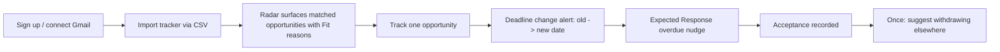
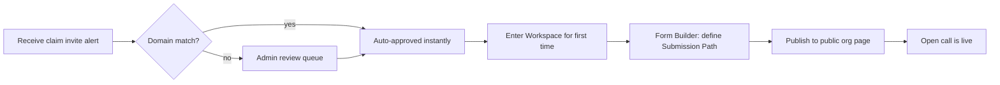

# UX Design Specification — Missa

**Author:** Synthesized autonomously — see PRD Authorship Note; same caveat applies (no live design-review session was possible).

## Executive Summary

### Project Vision

Missa gives submitters a tracker that updates itself and gives organizations an operating system for open calls — both powered by one intelligence layer (Radar) that most competitors don't have. The UX has to serve two audiences with very different mental models (a lone poet checking deadlines vs. a magazine editor running a review pipeline) without feeling like two different products wearing the same logo.

### Target Users

- **Submitters** (Missa Passport): writers, artists, filmmakers, grant applicants, researchers — wide range of technical comfort, mobile-and-desktop both common, price-sensitive (product is free to them by design).
- **Organization admins/editors** (Missa Workspace): magazine editors, grant officers, awards managers — desktop-primary, workflow-and-throughput-focused, currently using Submittable/Google Forms/email/spreadsheets and comparing Missa against that baseline.
- **Reviewers/judges**: task-focused, often occasional/volunteer users who need near-zero onboarding friction for a role they perform a few times a year.
- **Enterprise/institutional admins** (Growth tier): configuring multi-team structure, less frequent but higher-stakes interactions (seats, billing, compliance).

### Key Design Challenges

1. One brand, two registers: literary/narrative voice on marketing surfaces vs. plain industry nouns in-app (already resolved as policy in `docs/missa-naming-decisions.md` — this UX spec inherits it, doesn't re-litigate it).
2. Trust has to be visible, not just true: freshness/confidence/trust scores, "Verified" badges, and change history need to read as credible at a glance, not as raw engine internals.
3. The org side (Workspace) doesn't exist as a real UI yet — everything from Form Builder to reviewer portal needs first-pass IA and component thinking, not just a copy pass on an existing screen.
4. Occasional users (reviewers, first-time claimants) need near-zero-training flows; power users (magazine editors running dozens of calls) need density and speed. These are in tension and need different defaults, not one compromise layout.

### Design Opportunities

- The existing landing page (Vermeer/Metsu paintings, Fraunces/Instrument Sans/Fragment Mono type system, `view-timeline`-driven scroll motion) already establishes a distinctive, literary brand voice — Missa doesn't need a generic SaaS look for its marketing surface, and shouldn't lose that in the app shell either (see Design System Foundation).
- Self-explaining data (Fit Score reasons, Expected Response confidence, change-history diffs) is a genuine differentiator that most competitor UIs don't attempt — this is worth real design investment (a reusable "explained score" component), not a generic badge.
- The org side is greenfield UI — there's room to get Form Builder and reviewer workflows right from scratch rather than retrofitting.

---

## Core User Experience

### Defining Experience

For submitters: opening Missa should feel like checking a mailbox that's already been sorted — nothing to triage, just what changed and why. For organizations: Missa Workspace should feel like the moment a spreadsheet-and-email process becomes an actual pipeline — visible stages, no submission falling through the cracks.

### Platform Strategy

Desktop-primary responsive web for both Passport and Workspace at MVP (per PRD's explicit "no full mobile app" deferral). Mobile web must still work for submitters checking deadlines on the go — that's a real, common use case even without a native app — but Workspace's denser admin/reviewer surfaces can reasonably assume desktop as the primary target, with mobile web as "functional, not optimized" at MVP.

### Effortless Interactions

- Tracking an opportunity from Discover/Opportunities should be one click (already true in the existing engine API — preserve this in the new frontend).
- Changing a tracked item's status should never require leaving the list view (already true in the current minimal UI's inline `<select>` pattern — preserve, but replace raw browser `<select>` styling with a proper themed component).
- Claiming a listing should be a single "Claim your listing" action with instant feedback (approved / pending review) — already implemented at the API level.

### Critical Success Moments

1. First alert that's clearly explained (not just "something changed").
2. First Fit Score that self-explains a rejection reason (`✕ not eligible: submission closed to non-members`) — this needs to feel helpful, not cold.
3. An organization's first live-and-receiving-submissions open call, ideally under the 15-minute activation target.
4. A reviewer completing their first review without needing onboarding.

### Experience Principles

- Never show an unexplained number or unexplained status change — every score, badge, and alert carries its reason (already a strategy-doc-level non-negotiable; this UX spec makes it a component-level rule, see UX Consistency Patterns).
- Plain nouns in the UI, personality in the microcopy — inherited directly from `docs/missa-naming-decisions.md`; this spec does not introduce new naming, only visual/interaction treatment.
- Design for the occasional user first on Workspace's review/decision flows (reviewers), and for the power user first on the admin/editor's open-call management flows — because they're different people with different frequencies of use, don't force one density onto both.

---

## Desired Emotional Response

### Primary Emotional Goals

- Submitters: relief ("I don't have to keep checking this myself") and quiet confidence (never anxious "did I miss something?" dread).
- Organizations: control and competence ("I can see exactly where every submission stands").
- Reviewers: low-friction focus — get in, do the task, get out.

### Emotional Journey Mapping

Submitter: curiosity (discovering a new match) → relief (tracking it, forgetting about manual upkeep) → mild anticipation (deadline approaching, handled by reminders not dread) → either delight (acceptance, handled by tasteful Props, never mocking rejection) or calm neutrality (decline, handled by plain, respectful status language — per the naming doc's explicit rule against punitive language).

Organization admin: skepticism (evaluating Missa against Submittable) → relief (claim flow "just worked," domain-match auto-approved) → focus (building the first open call) → validation (first real submission arrives).

### Micro-Emotions

- The moment a deadline-extension alert arrives with the old/new date visible — should feel like "good, I didn't miss anything," not "wait, what changed?"
- The claim-invite alert copy ("Missa found an open call on your website...") already strikes the right tone in the existing engine copy — preserve it verbatim in the new UI rather than rewriting.

### Design Implications

- Change/diff UI (old value → new value) needs a dedicated, calm visual treatment (not a jarring red/green diff — this isn't a code review tool).
- Status changes for submitters should never use alarming color for neutral-but-final states (Declined, Withdrawn) — muted/neutral tones, reserving strong color for genuinely actionable states (Closing Soon, Needs Verification).

### Emotional Design Principles

Calm over urgent by default; reserve urgency (color, motion, prominent placement) for things that are actually time-sensitive (Closing Soon, deadline moved) — don't cry wolf with everything styled as equally urgent.

---

## UX Pattern Analysis & Inspiration

### Inspiring Products Analysis

- **Submittable / Duotrope / Chill Subs / Foundant** (direct competitors, referenced throughout the strategy doc): Duotrope and Chill Subs already use "Tracker" as a term — validates keeping it. Submittable's per-transaction fee model and heavier enterprise-only UX is exactly what Missa's pricing/UX is positioned against (lighter, undercutting fee, faster time-to-live).
- **Linear** (referenced in the handoff doc's open density question): tight information density, keyboard-first patterns — a reasonable inspiration for Workspace's admin/reviewer surfaces where power users move fast.
- **Notion**: softer, more spacious, less keyboard-centric — a reasonable inspiration for Passport's calmer, browsing-oriented surfaces.

### Transferable UX Patterns

- Linear-style command palette / keyboard shortcuts for Workspace's high-frequency admin actions (approve/reject claims, bulk decisions) — genuinely valuable given the "power user running many calls" persona.
- Submittable's status-badge-driven table view for Submissions — a proven pattern for exactly this domain, worth adapting (not copying pixel-for-pixel) for the admin inbox.

### Anti-Patterns to Avoid

- Submittable's reputation (per the strategy doc's competitive framing) for feeling enterprise-heavy and slow to set up — Missa's entire activation-metric strategy (Time to Live Open Call) is a direct rejection of this; every Workspace onboarding screen should be reviewed against "does this add friction that doesn't serve trust or correctness?"
- Do not use a bare numeric score anywhere (Fit Score, trust score) without the self-explaining reasons attached — this is the single most important anti-pattern to police, since it's a differentiator being actively protected.

### Design Inspiration Strategy

Borrow information-density patterns from Linear for Workspace/Admin, borrow calm/spacious patterns from Notion for Passport, and keep the landing page's literary voice for marketing-only surfaces (chapter narrative, painting imagery) — never let that voice leak into in-app navigation, per the naming decision doc's three-register rule.

---

## Design System Foundation

### Design System Choice

**shadcn/ui** (Radix primitives + Tailwind, copy-into-repo component model) as the base component layer for `apps/web`, on top of the existing Fraunces/Instrument Sans/Fragment Mono type system and the SaaS-redesign color tokens already specified in `docs/handoff-2026-07-07.md`.

### Rationale for Selection

- Pairs natively with the architecture doc's Next.js 16 + Tailwind decision (no separate design-system runtime dependency to maintain).
- Copy-in component model means full control over styling to match Missa's existing type/color system rather than fighting a themed component library's defaults.
- Broad coverage of exactly the primitives this product needs at scale (data tables for Submissions/Tracker, forms for Form Builder, command palette for Workspace power users, dialogs/toasts for claim/decision flows).

### Implementation Approach

Install shadcn/ui components incrementally, per-feature, rather than scaffolding the entire library up front — pull in `table`, `select`, `dialog`, `form`, `badge`, `tabs` first (covers Tracker, Discover, claim flows, and the existing tab-based nav), add `command` (palette) and `data-table` when Workspace's admin surfaces are built.

### Customization Strategy

Theme shadcn's CSS variables to the existing token set from the landing page (`--ink`, `--ink-2`, `--ink-3`, `--border`, `--accent:#C6402A`, `--accent-deep:#A93521`, `--accent-tint:#FAEEEA`, `--green:#2E5B41`, `--bg:#FAFAF9`, `--surface:#FFFFFF`) documented in the handoff doc's SaaS redesign section — do not invent a new palette; this one was already designed and screenshotted for direction review.

---

## 2. Core User Experience (Detail)

### 2.1 Defining Experience

Two distinct primary experiences under one design language: Passport (calm, browsing, low-frequency-per-session) and Workspace (dense, task-driven, high-frequency-per-session for active organizations).

### 2.2 User Mental Model

Submitters think in terms of "what am I waiting on" (a mailbox/inbox metaphor — already reflected in the naming decision's Home/Inbox split). Organizations think in terms of "what stage is each submission in" (a pipeline/kanban metaphor — already reflected in the existing Tracker's Pipeline view and the naming decision's status vocabulary).

### 2.3 Success Criteria

A submitter should be able to answer "what needs my attention today" within 5 seconds of opening the app (served by the Inbox digest, already implemented at the API level). An org admin should be able to answer "how many submissions are waiting on me" within 5 seconds of opening Workspace (served by the admin inbox — not yet built).

### 2.4 Novel UX Patterns

The self-explaining Fit Score / Expected Response Window component (✓/⚠/✕ reasons list under a plain-language tier label) is genuinely novel relative to competitors and deserves a first-class, reusable component rather than ad hoc rendering per screen (see Component Strategy).

### 2.5 Experience Mechanics

Status changes are always user-initiated or system-explained — never silent. Every list of opportunities/submissions carries a visible "why is this here" signal (fit reason, followed-org, or admin-relevant flag) rather than an undifferentiated feed.

---

## Visual Design Foundation

### Color System

Reuse the handoff doc's SaaS-redesign tokens verbatim (already screenshotted and partially direction-reviewed by the user):
`--bg:#FAFAF9 --surface:#FFFFFF --ink:#1C1815 --ink-2:#6F6862 --ink-3:#A39C94 --border:#EAE7E1 --accent:#C6402A --accent-deep:#A93521 --accent-tint:#FAEEEA --green:#2E5B41`.
Terracotta accent used sparingly (primary actions, active nav state); green reserved for positive/success states (accepted, verified); avoid red/alarm colors for anything that isn't genuinely time-sensitive (see Emotional Design Principles).

### Typography System

Fraunces for headlines only (marketing and major section headers), Instrument Sans for UI/body text throughout the app, Fragment Mono for tabular/data display (deadlines, IDs, counts) — this is the existing, already-built font system (`landing/fonts/`); the app should import the same self-hosted font files rather than introducing new ones.

### Spacing & Layout Foundation

8px spacing scale (`--s1` through `--s12`, already defined in the handoff doc's design tokens) — reuse directly rather than defining a second scale for the app shell.

### Accessibility Considerations

WCAG 2.1 AA baseline (per the PRD's NFRs): verify the terracotta accent (`#C6402A`) meets 4.5:1 contrast against both `--bg` and `--surface` for any text use (likely fine for large text/icons, needs verification for body-sized text — flag as a concrete pre-launch check, not assumed compliant).

---

## Design Direction Decision

### Design Directions Explored

The handoff doc left three concrete open questions from the in-progress SaaS landing-page redesign. Since the user is unavailable this session, I'm making provisional calls on all three so design work isn't blocked — **these are explicitly reversible and should be confirmed, not treated as final**:

1. **Whitespace/density register** — **[decision]** go with the as-delivered register (between Linear-tight and Notion-soft) for the marketing site; for the *app* (Workspace especially), lean tighter/Linear-style given the power-user persona identified above. Different registers for marketing vs. app is intentional, not an inconsistency.
2. **3 vs. 4 feature columns** — **[decision]** 3 columns. Four features diluted across a grid reads as more generic-SaaS; three lets each feature (self-updating tracker, self-explaining Fit Score, organization claim/verify) get a full sentence of real differentiation instead of a fragment.
3. **Hero screenshot: Submissions table vs. Opportunities feed with Match badges** — **[decision]** lead with the **Opportunities feed with Match/Strong Match badges**, not the Submissions table. The feed-with-fit-badges is the more legible "aha" at a glance for a first-time visitor (a magazine editor visiting the marketing site is more often evaluating it *as a submitter would first*, or comparing against Submittable's own submissions-table-first marketing) — the self-explaining Fit Score is the more novel, ownable visual, and the strategy doc repeatedly names this as a core differentiator.

### Chosen Direction

SaaS-style redesign per the handoff doc's already-approved token system, hero-first with the Opportunities/Fit feed, 3-column feature grid, standard SaaS page shape (nav → hero+screenshot → feature grid → social proof → testimonials → FAQ → footer), Sent/Waiting/Answered narrative demoted to a supporting section.

### Design Rationale

This resolves the handoff doc's blocking questions with reasoned, documented defaults rather than leaving the redesign stalled for a whole session. Every choice above is flagged **[decision]** and should be the first thing confirmed or overridden when the user returns — nothing here has been built yet, so nothing is expensive to reverse.

### Implementation Approach

Rebuild the SaaS redesign prototype (lost from scratch-only-in-scratchpad per the handoff doc) as `landing-saas/` per the handoff doc's own suggested variant path — do not overwrite `landing/index.html` until the user explicitly approves the replacement.

---

## User Journey Flows

(Same five journeys as the PRD's User Journeys section — presented here with flow diagrams for the two highest-design-effort ones.)

### Submitter — Success Path

### Organization Admin — Claim to Live Open Call

### Journey Patterns

Every journey above has an explicit "why" attached to every system-initiated event (alert reason, claim-match method, overdue-nudge basis) — this is the pattern to replicate in any new journey added later, not a one-off.

### Flow Optimization Principles

Minimize steps between "intent" and "confirmation" (claim → approved, track → tracked) with immediate, visible feedback; never make the user wait on a page reload to know an action succeeded (already true in the existing minimal UI's render-after-action pattern — preserve in the new frontend).

---

## Component Strategy

### Design System Components (from shadcn/ui)

Table, Select, Dialog, Form, Badge, Tabs, Command (palette), Toast — cover the large majority of both Passport and Workspace surfaces without custom-building primitives.

### Custom Components

#### Explained Score

**Purpose:** render any self-explaining score (Fit Score, Trust Score, Expected Response confidence) with its reasons, never as a bare number.
**Usage:** Discover/Opportunities cards, Tracker rows, Workspace claim/verification detail views.
**Anatomy:** tier label (colored) + expandable reasons list (✓/⚠/✕ icons + text).
**States:** collapsed (label only) / expanded (full reasons) / loading.
**Variants:** Fit Score (5 tiers), Trust badge (Verified/Unverified + "checked Nh ago"), Confidence range (High/Medium/Low).
**Accessibility:** icons paired with text, never color-only; expandable region uses `aria-expanded`.
**Content Guidelines:** reasons are short declarative phrases, never full sentences with punctuation-heavy hedging.
**Interaction Behavior:** click/tap to expand; keyboard-focusable.

#### Change Diff Row

**Purpose:** render an `OpportunityChange` (old value → new value) calmly, per the Emotional Design Principles above.
**Usage:** alert cards, admin verification queue, organization claimed-listing edit history.
**Anatomy:** field label, old value (struck-through/muted), arrow, new value (emphasized).
**States:** single-field change / multi-field change (stacked rows).
**Accessibility:** don't rely on strikethrough alone — pair with an "was" / "now" text label for screen readers.

#### Status Pipeline Board

**Purpose:** the Tracker's Pipeline view and Workspace's Submissions-by-stage view — both are the same underlying pattern (grouped-by-status cards), reuse one component for both rather than building two.
**Usage:** submitter Tracker (My-Status groups), org admin Submissions inbox (Review stage groups).
**States:** empty-per-column (uses the naming doc's approved empty-state copy, e.g. *"Save the calls you're not ready for yet"*), populated, loading.
**Variants:** submitter-facing (status select per row) vs. org-facing (bulk action toolbar per column).

### Component Implementation Strategy

Build Explained Score and Status Pipeline Board first — they're shared across both Passport and Workspace and unblock the largest number of screens per unit of build effort.

### Implementation Roadmap

1. Explained Score (unblocks Discover, Tracker, claim/verification detail)
2. Status Pipeline Board (unblocks Tracker and, later, Workspace Submissions inbox)
3. Change Diff Row (unblocks alert cards and verification queue)
4. Form Builder-specific components (unblocks Workspace open-call creation — no prior art to reuse, build when that epic starts)

---

## UX Consistency Patterns

### Button Hierarchy

Primary (terracotta fill) — one per view, the single most important action (Track, Claim, Publish open call). Secondary (outline) — supporting actions (Edit, Copy link). Tertiary (text-only) — low-emphasis actions (Dismiss, Cancel).

### Feedback Patterns

Toast for transient confirmations (tracked, status changed); inline error text for form validation (never a modal for a simple validation error); a persisted banner only for account-level/session-level issues (session expired, needs re-auth).

### Form Patterns

Inline validation on blur, not on every keystroke; required fields marked once at the form level ("* required") rather than repeated per field; Form Builder itself (org-facing) needs drag-or-click category/field construction — first-pass scope should be simpler (add/remove/reorder predefined field types) before any freeform field-type builder.

### Navigation Patterns

Persistent top-level nav matching the naming decision's approved labels exactly (submitter: Home · Opportunities · Tracker · Library · Calendar · Messages · Insights; org: Opportunities · Submissions · Reviews · Decisions · Messages · Delivery · Insights · Settings) — the existing minimal UI's tab bar is the right pattern, it just needs the full label set and shadcn `Tabs`/nav styling instead of raw buttons.

### Additional Patterns

Empty states always carry the approved brand-voice microcopy from `docs/missa-naming-decisions.md` (Messages/Pending/Saved examples already specified) — never a generic "No data" placeholder.

---

## Responsive Design & Accessibility

### Responsive Strategy

Passport surfaces (Discover, Tracker, Inbox) must work well on mobile web (common real use case — checking deadlines on the go). Workspace admin/reviewer surfaces (Form Builder, admin inbox, reviewer queue) target desktop-first; mobile web should not break, but is not optimized at MVP, consistent with the PRD's explicit "no full mobile app" deferral.

### Breakpoint Strategy

Standard Tailwind breakpoints (`sm`/`md`/`lg`/`xl`) — no need for a custom breakpoint system; collapse nav to a mobile drawer under `md`, collapse multi-column dashboards (Workspace analytics) to stacked single-column under `md`.

### Accessibility Strategy

WCAG 2.1 AA baseline across both products; the Explained Score and Change Diff Row components specifically must never rely on color alone (both specified above with text/icon pairing); keyboard navigation required for the Command palette and all form flows.

### Testing Strategy

No automated accessibility testing exists yet (no frontend exists yet). **[decision]** adopt axe-core (via `@axe-core/playwright` or equivalent) as part of whatever E2E testing gets set up once `apps/web` has its first real pages — don't retrofit accessibility testing after a large surface area already exists.

### Implementation Guidelines

Every new shadcn component instance gets themed via the CSS variables in Design System Foundation, not one-off Tailwind classes duplicating the palette — this is the same "single source of truth" discipline the naming-decision doc applies to vocabulary, applied here to visual tokens.
