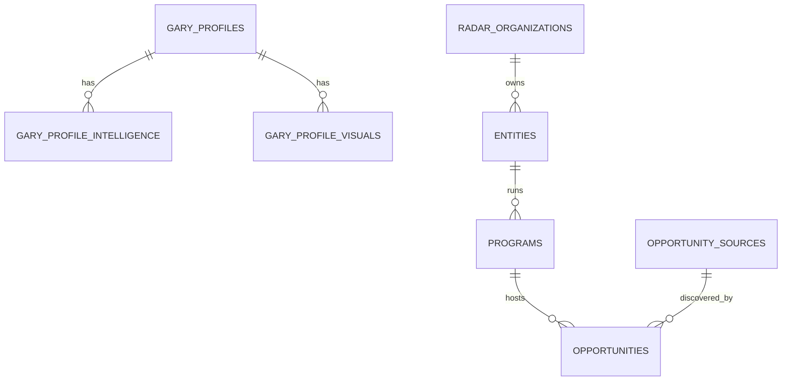
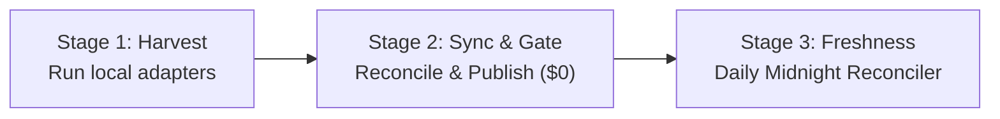

# Missa Radar Operating Manual & Architecture Guide

This document defines the production standards, database contracts, reconciliation algorithms, and operating workflows for Missa’s opportunity intelligence and institutional directory radar.

---

## 1. System Overview & Current Production State

Missa operates a high-trust radar for artists, writers, and cultural practitioners. The dataset is hosted in **Railway PostgreSQL** and queried live by `apps/web`:

- **1,870+ Live Published Opportunities** (Residencies, Fellowships, Grants, Exhibitions, Open Calls)
- **9,120+ Verified Gary Profiles**:
  - `visual_arts_organization`: Galleries, Museums, Artist Collectives
  - `residency_center`: Global Residency Centers & Retreats
  - `grant_foundation`: Cultural Foundations & Mobility Grantors
  - `literary_magazine`: Magazines & Journals
  - `small_press`: Independent & University Presses
- **8,170+ Canonical Radar Organizations**
- **$0 AI Token Consumption**: All crawlers, deduplicators, and publication gate passes run via deterministic, vectorized TypeScript/SQL pipelines locally or via automated crons.

---

## 2. Core Database Schema & Contracts



### Table Specifications
1. **`gary_profiles`**:
   - `id`: Canonical profile ID (`org_resartis_...`, `org_artconn_...`, `org_aca_...`, `org_otm_...`).
   - `profile_kind`: Restricted by CHECK constraint to:
     `'visual_arts_organization'`, `'residency_center'`, `'grant_foundation'`, `'literary_magazine'`, `'small_press'`.
   - `identity_status`: `'confirmed'` or `'needs-review'`.
   - `normalized_website_url`: Domain stripped of protocol and `www.` (e.g. `dorlandartscolony.org`).
2. **`radar_organizations`**:
   - Canonical metadata store (`data` JSONB with address, verified date, contact details, social links).
3. **`entities` & `programs`**:
   - `entities`: Operating institutional entity linked to `organization_id`.
   - `programs`: Specific initiative (e.g. *MacDowell Fellowship Program*, *Dorland Mountain Residency Program*).
4. **`opportunities`**:
   - `publication_state`: Enforced by database trigger `missa_publication_gate()`.
     - `'reviewable'`: Staged candidates waiting for gate requirements or closed cycle intake.
     - `'published'`: Active, verified opportunities visible on Missa search.
   - `status`: `'open'`, `'closing-soon'`, `'closed'`, `'archived'`.
   - `deadline_date`: ISO date (`YYYY-MM-DD`).
   - `deadline_kind`: `'fixed-deadline'`, `'rolling'`, `'year-round'`, `'seasonal'`.
   - `fee_status`: `'free'` or `'fee'`.

---

## 3. Reconciliation & Deduplication Standards

When new records are crawled across multiple sources (e.g. Res Artis, ArtConnect, ACA, On The Move), Missa enforces:

### Organization Reconciliation (3-Tier Anchor)
1. **Tier 1 (Domain)**: Match on `normalized_website_url`. If an incoming organization matches an existing website hostname, it reconciles immediately.
2. **Tier 2 (Alphanumeric Name + Location)**: Match on `name_key` (e.g. `dorland_mountain_arts`) after stripping legal entity suffixes (`Inc`, `LLC`, `Foundation`, `gGmbH`).
3. **Tier 3 (Social Handle)**: Match on official Instagram URL handle or email domain.

### Opportunity Deduplication (Triangulation Rule)
An incoming call is identified as a duplicate and merged if:
1. **Same Host Organization**: Belongs to the same reconciled `organization_id`.
2. **Deadline Proximity**: Deadlines match within $\pm 24$ hours (or both are `rolling`).
3. **Target Reconciliation**: Both point to the exact same external destination URL (or title similarity $\ge 0.70$).
- **Action on Match**: The existing record is enriched with stipends, fees, and housing data; **no duplicate row is created**.

---

## 4. The 3-Stage Operating Workflow



### Stage 1: Ingestion & Harvest (Weekly / As Needed)
Run harvesters locally to crawl external directories with zero bot blocking:
```bash
# Artist Communities Alliance (ACA)
npm --prefix packages/radar-adapters run aca:harvest
npm --prefix packages/radar-adapters run aca:review

# On The Move (OTM)
npm --prefix packages/radar-adapters run otm:harvest
npm --prefix packages/radar-adapters run otm:review

# ArtConnect Organizations
npm --prefix packages/radar-adapters run artconnect:harvest
npm --prefix packages/radar-adapters run artconnect:review

# Res Artis Residencies
npm --prefix packages/radar-adapters run resartis:harvest
npm --prefix packages/radar-adapters run resartis:review
```

### Stage 2: Synchronize & Gate Passage
Push harvested datasets to Railway PostgreSQL and promote verified calls to published state:
```bash
# Push all harvested data & promote to published in one command
npm --prefix packages/radar-adapters run radar:full-sync
```

### Stage 3: Daily Freshness & Lifecycle Maintenance (Automated Cron)
Runs daily (or via scheduled GitHub Action / Railway Cron) to:
1. Auto-close opportunities with passed deadlines (`deadline_date < CURRENT_DATE`).
2. Perform lightweight health checks on destination URLs, auto-closing confirmed 404s/dead links.
```bash
npm --prefix packages/radar-adapters run radar:freshness
```

---

## 5. Adding a New Radar Source

To onboard a new directory or grant portal into Missa:
1. **Create Parser** in `packages/radar-adapters/src/scripts/<source>Parser.ts`:
   - Must extract: `title`, `organizationName`, `deadlineDate`, `applicationUrl`, `stipend/fees`, `disciplines`.
2. **Create Harvester** in `packages/radar-adapters/src/scripts/harvest<Source>.ts`:
   - Saves clean JSON to `packages/radar-adapters/data/<source>.json`.
3. **Create Synchronizer** in `packages/radar-adapters/src/scripts/sync<Source>ToRailway.ts`:
   - Follows the reconciliation query pattern (`gary_profiles` pre-lookup).
   - Stages opportunities into `publication_state = 'reviewable'`.
4. **Register in `package.json`** and run `radar:pipeline-publish` to promote.
