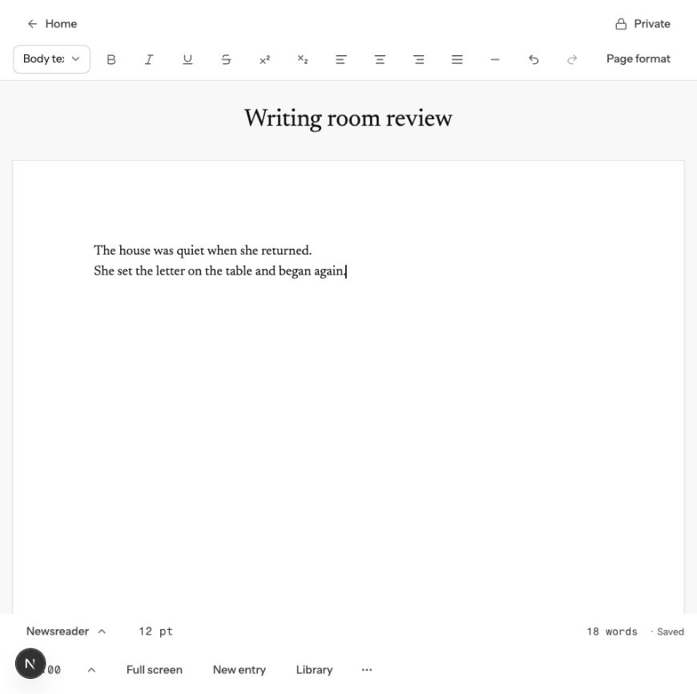

# `/doc` progress review — 2026-10-08

The writing room is a working local product with ten implemented feature groups. It is not yet the full long-form writing, research and publishing tool described by the roadmap. This review measures local behavior and repository implementation; it does not certify a production deployment.

## Checkout and preview

- Reviewed commit: `43725ae4160004c3d0e0c790f727be93de84d136` on `main`, equal to freshly fetched and remotely verified `origin/main`. The final local comparison was 0 ahead / 0 behind.
- `Somework` was preserved. Previous local main is retained as `backup/main-before-sync-20261008-170307`.
- All pre-existing untracked files were backed up with hashes before resolving overlaps. Backup manifest: `/Users/adedayoagarau/.codex/backups/usemissa-sync-20261008-170307/manifest.json`.
- Browser preview: <http://127.0.0.1:3101/doc>. The in-chat browser is signed into a synthetic sample account on a disposable local database. No user writing was required for this review.
- Dependencies were installed from the lockfile and internal workspace packages rebuilt so runtime artifacts matched the current source. No application source or committed tests were edited.
- The preview server and disposable PostgreSQL database are left running for inspection. This is a development preview, not a production build or deployment.

## Progress against the current roadmap

The count below is a count of feature groups, not a percentage of the final product. Planned stages vary considerably in scope.

| Feature group | Current evidence |
| --- | --- |
| Write mode | Blank draft, timer, ten typefaces, entries, device-first/account saving, text download. Autosave and reload were also checked manually. |
| Printed pages | Rich text, paper sizes, per-page formatting, preserved spaces/tabs, print/PDF. Browser scenario passed. |
| Projects | Templates, binder ordering, synopses/status outline, manuscript compile. Browser scenario and manual poetry-project walkthrough passed. |
| Pagination | Text flows between pages; author-added breaks remain distinct. Browser scenario passed. A paragraph taller than a page warns rather than splitting within the paragraph. |
| Free canvas | Positioned, sized and rotated text boxes. Browser scenario passed. |
| Snapshots, find, dark | Compare/restore, cross-page and box search/replace, dark appearance. Focused recheck passed after awaiting transitions. |
| Writing for a call | Tracker call association, checklist, live word-limit count and local preparation checks. Focused Mac recheck passed. These checks are not submission confirmation. |
| Editor essentials | Page/section breaks, superscript/subscript, selection count, familiar shortcuts, smart punctuation, list nesting. Focused Mac rechecks passed; page break and superscript also checked manually. |
| Quiet writing | Quiet mode, focus, typewriter scrolling, count visibility and full-screen Escape behavior. Browser scenario passed. |
| Planner cards | Piece cards, plotlines, corkboard grouping and outline totals. Plus/Pro access boundary covered by tests. Browser scenario passed. |

Canonical scope: [writing-roadmap.md](../writing-roadmap.md). Entry point: `apps/web/app/doc/page.tsx`; implementation: `apps/web/components/missa/writing-*.tsx`, `apps/web/lib/writing-*.ts`; persistence migrations: 0095–0100.

### Next and later

1. Finish stage G: custom card fields, saved views/filters, and editing multiple pieces as one text.
2. H–M: story bible; plot grid/structures; deadline goals/history; timeline/continuity; book design and DOCX/EPUB export; notes and research beside the draft.
3. Later integration: Word/Scrivener/Google Docs import, project-level call requirements, “Make this a Work” / “Send to Tracker”, and human feedback.

Current print/PDF and text download do not establish DOCX/EPUB export. Project compile does not establish editing multiple pieces as one document.

## Verification

| Check | Result |
| --- | --- |
| Writing unit/repository tests with disposable relational database | **59 passed, 0 failed, 0 skipped** |
| Workspace typecheck | **Passed**, after regenerating route types to remove stale references |
| Design-system validation | **Passed**: 58 families, 790 variants, 70 semantic mappings, 4 entrypoints |
| Changed-line language validation | **Passed**; not a full editorial review |
| Unmodified Chromium writing-room suite | **10 passed, 5 failed** |
| Focused rechecks of the five failing scenarios | **All five passed across two runs** in a temporary external harness |

The original five failures were two Axe checks run during color/sheet transitions and three scenarios using Control/Home/End selection and movement assumptions on macOS. The external harness waited for finite animations and used native Mac equivalents. The first focused run passed saving/library, snapshots/find/dark, and call-count scenarios. A second recheck passed page/section breaks and editor shortcuts after correcting the remaining bare Home/End bindings. The repository suite is still unchanged and is not green as checked in.

Commands: `tsx --test lib/writing*.test.ts` with the repository test loader and local `DATABASE_URL`; `playwright test e2e/writing-room.spec.ts --project=chromium --workers=1`; `next typegen`; `npm run typecheck`; `npm run check:design-system`. Logs are saved in [evidence](evidence/). The temporary recheck source/config is retained under `/tmp/missa-doc-qa-20261008/`.

Manual checks covered the visible editor, saved reload, library, a poetry project, dark mode, page break and superscript. A narrow browser smoke check measured 355 CSS pixels with no horizontal overflow; it does not count as exact 390px certification. Safari, Firefox, physical mobile keyboards, screen readers, 200% zoom and production account journeys remain unverified in this review.

## Immediate maintenance and next product step

- Make the checked-in browser tests portable across Mac and other hosts and wait for settled UI before contrast checks.
- Reconcile the introduction of `docs/writing-room.md`: it still says free canvas, projects and call-linked drafts are not started, and names only migrations 0095–0097. Its later sections and the current roadmap/source show these are implemented through 0100.
- Then finish stage G in the roadmap order. The next owner decisions are the default typeface and privacy-popover language; this review did not resolve them.

Additional views: [Library](library.png), [Poetry project](project.png), [Dark editor](dark.png).
