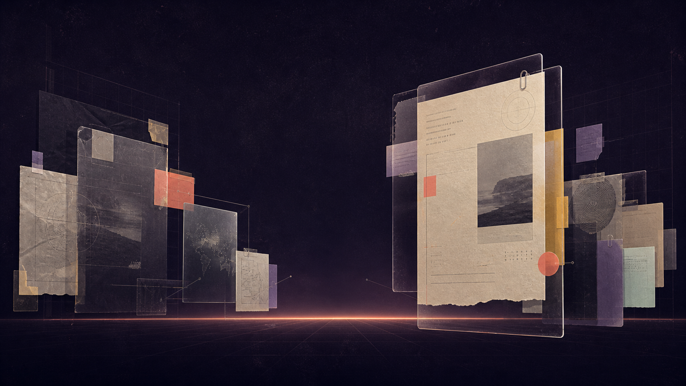

# Missa Homepage — Direction B: The Evidence Horizon

**Status:** design direction for local review only  
**Scope:** Section 1 — public shell + hero  
**Reference study:** Melius live site and the 26-section Mobbin capture in [`melius-technical-teardown-2026-08-20.md`](./melius-technical-teardown-2026-08-20.md)  
**Implementation boundary:** do not replace the production root route, proxy, Opportunity API, authentication, or waitlist behavior in this slice.

## The direction in one sentence

Missa opens on a dark, cinematic field where real Opportunities and their evidence orbit a clear central promise: **“See what’s open. Know what it asks. Keep moving.”**

The expressive layer is the horizon: cards, source fragments, connectors, and a low line of light create a living archive. The factual layer remains stable: the active Opportunity always exposes its title, organization, source state, deadline state, and one honest next action.

This borrows Melius’ visual grammar—one full-bleed scene, large editorial type, a moving media field, a compact shell, and a single access control—but translates the content into Missa’s product truth. It must never become a fake opportunity wall, a decorative source collage, or a hidden profile gate.

## Visual reference

This is an art-direction study, not a production asset. It establishes atmosphere, composition, depth, and color—not final Opportunity content.

The production implementation should use code-native surfaces and real repository data. Generated imagery is optional and must not stand in for an official source or an Opportunity record.

## Design-it-twice check

Direction B is intentionally the expressive-flexibility option. Three compositions were considered before selecting the final shape.

### B1 — Orbital records

Opportunity cards follow an elliptical orbit around the headline. Hovering or focusing a card pulls it toward the reader and rotates its evidence metadata into view.

**Strength:** most theatrical and memorable.  
**Weakness:** orbit geometry makes keyboard order, touch interaction, and readable deadlines harder to explain. It risks making Opportunities feel like objects in a gallery rather than records with consequences.

### B2 — Evidence Horizon — selected

Cards sit on three depth bands along a shallow horizon. The active record is centered or offset near the lower third; neighboring records recede left and right. Source fragments and metadata stay attached to the active record, while the background field supplies depth and motion.

**Strength:** supports many visual arrangements while preserving a simple active-card model, a predictable reading order, and a clean mobile fallback.  
**Weakness:** requires disciplined z-index, focus, and responsive rules so the scene does not become a pile of overlapping cards.

### B3 — Evidence desk

A large source document or Opportunity brief anchors the hero. Small cards, deadline marks, and source references move around it like a working desk.

**Strength:** clearest source-first metaphor and strongest fit for Missa’s editorial authority.  
**Weakness:** less flexible for multiple Opportunities and more dependent on usable source previews or document imagery.

### Selection

Choose **B2**. It gives Missa the visual richness the current prototype lacks, but it has a deep, small interface: one active record, one index, one access state, and one controlled motion system can drive desktop, tablet, mobile, and reduced-motion modes.

## Hero composition

### Desktop

The hero occupies approximately `min-height: 760px` and behaves as one scene rather than a stack of unrelated panels.

`text
┌─────────────────────────────────────────────────────────────────────┐
│ review/status strip                                    local review  │
│   MISSA                 Opportunities  Guides  ...   Sign in  Open   │
│                                                                     │
│             faint grid / grain / slow ambient glow                  │
│                                                                     │
│  receding card      SEE WHAT’S OPEN.      active Opportunity card   │
│                     KNOW WHAT IT ASKS.                              │
│                     KEEP MOVING.                                    │
│          source fragment       ───── horizon line ─────             │
│                                                                     │
│                [ state-aware access / browse bar ]                  │
└─────────────────────────────────────────────────────────────────────┘
`

The headline is centered within the scene, but the active record is allowed to break the symmetry. The active record is not a generic card; it is a readable “evidence object” with:

- Opportunity title
- organization name and verification state when available
- practice/type
- deadline state, including explicit unknown or rolling treatment
- fee state, including “Fee not listed” when unknown
- official source attached/unavailable state
- one action appropriate to access mode

The visual horizon carries secondary records only when their canonical projection is available. If there are no records, the composition retains the horizon line and a designed empty state; it does not invent silhouettes or counts.

### Tablet

Keep the same scene but reduce the horizon to two depth bands. The active card moves into the lower-right quadrant and the surrounding cards become shorter, quieter fragments. The headline remains large but uses a narrower measure. Navigation collapses into a labelled menu button before links become crowded.

### Mobile

The horizon becomes a vertical “evidence reel” rather than a miniature desktop canvas:

- one active card is fully readable;
- two adjacent cards are partially visible above/below as a deliberate carousel cue;
- no card is positioned outside the scrollable region;
- the headline comes before the card reel in DOM order;
- the access bar becomes a full-width bottom action inside the hero, not a floating overlay;
- all decorative connectors and ambient layers can disappear without losing meaning.

Mobile is not a shrunken orbit. It is the same metaphor expressed as a controlled, accessible reel.

## Public shell

### Navigation content

The shell contains:

- Missa wordmark
- Opportunities
- Guides
- For organizations
- Methodology
- Sign in
- state-aware primary access action

The local concept status strip remains visible only on the review route. It must never be mistaken for production announcement content.

### Shell behavior

The navigation is a compact floating surface over the hero scene, inspired by Melius’ compact menu treatment. It should not consume the first viewport with a traditional full-width app bar.

- Desktop: floating pill/panel, horizontal links, one primary action.
- Tablet: wordmark, two highest-value links, menu button, primary action.
- Mobile: wordmark, menu button, primary action; the menu opens a semantic disclosure panel.
- Sticky behavior: optional after the hero, with a solid/opaque surface once it leaves the atmospheric scene.
- Escape closes the menu and returns focus to the menu button.

## Typography and color

### Type roles

Use existing Missa tokens first. Do not introduce Melius font files into the repository.

- **Display:** `var(--font-heading)` or the approved Missa editorial display face. Large, slightly compressed, high-contrast, and intentionally imperfect in rhythm. The headline is the brand event.
- **Reading:** `var(--font-sans)` for supporting explanation and access copy.
- **Evidence utility:** `var(--font-mono)` for source state, deadline labels, record index, and short metadata. Never use mono for paragraphs.
- **Wordmark:** canonical `MissaWordmark`; do not recreate it with text.

Suggested desktop scale:

`css
--hero-title: clamp(4.25rem, 8.5vw, 9.5rem);
--hero-title-leading: 0.86;
--hero-copy: clamp(1rem, 1.2vw, 1.25rem);
--evidence-label: 0.68rem;
--evidence-body: 0.9rem;
`

Suggested tablet/mobile scale:

`css
--hero-title: clamp(3.2rem, 12vw, 6.5rem);
--hero-title-leading: 0.9;
--hero-copy: 1rem;
`

### Palette

Use a dominant dark field with warm evidence accents, not an evenly distributed rainbow.

`css
--horizon-ink: #100d18;
--horizon-aubergine: #21172f;
--horizon-plum: #3a284b;
--horizon-chalk: #f1ece2;
--horizon-muted: #b7afbd;
--horizon-coral: #f26a54;
--horizon-saffron: #f0b64f;
--horizon-mint: #b6d6c5;
--horizon-lilac: #b4a3d4;
`

Rules:

- Coral is the action/focus accent, not decoration everywhere.
- Saffron can mark a live/closing-soon state only when the canonical record says so.
- Mint and lilac distinguish evidence categories, not opportunity quality or eligibility.
- All text and controls must meet the project’s contrast requirements against the actual surface behind them.
- Grain, grid, and glow are atmosphere only; they must not carry semantic information.

## Motion choreography

### Motion personality

**Premium with a documentary undertone.** The field feels alive, but it never performs urgency or gamification. The motion should feel like paper, film, and a careful camera move—not a dashboard animation.

### Motion constants

`ts
const horizonMotion = {
  ease: [0.4, 0, 0.2, 1],
  quick: 160,
  standard: 360,
  dramatic: 720,
} as const;
`

### Entry sequence

1. Ambient horizon glow and grain establish the scene first.
2. Wordmark/navigation settles in from `translateY(-8px)` over `360ms`.
3. Headline enters line-by-line with a `40ms` stagger, maximum total stagger `160ms`.
4. Active Opportunity card rises `24px` and resolves from a soft blur over `720ms`.
5. Evidence metadata follows `100ms` after the card, then the access bar settles from below.
6. Secondary cards move only after the active card has landed; never animate the entire field at once.

### Interaction motion

- Hover: active card lifts `4px`, sharpens, and increases border contrast in `120ms`.
- Focus: same lift is replaced or supplemented by a visible focus ring; never make focus depend on hover-only color.
- Card change: current card exits with an accelerated `180ms` fade/slide; new card enters with `360ms` ease-out and slight scale from `.98` to `1`.
- Source reveal: evidence panel expands in `300ms`; no layout-jumping tooltip.
- Access mode change: copy crossfades and the action width interpolates over `300ms`; the whole scene must not replay.
- Ambient: horizon glow and background grain can breathe slowly, but pause under `prefers-reduced-motion`.

### Reduced motion

With `prefers-reduced-motion: reduce`:

- no continuous card drift, parallax, blur-to-sharp entrance, or automatic carousel advance;
- cards render in a stable horizontal/vertical list with the active card first;
- state changes use instant or short opacity/color transitions only;
- the horizon line and texture remain static or disappear;
- controls remain fully usable and the active card remains obvious.

## Component and data model

The public shell should consume one shared access state. The canvas should consume a normalized view model derived from `OpportunityBrowseProjection`, not a second Opportunity API.

`ts
type PublicAccessMode = "closed" | "waitlist" | "open";

type HorizonRecord = {
  id: string;
  slug: string;
  title: string;
  organization: string;
  organizationVerified: boolean | null;
  type: string;
  practice: string;
  location: string | null;
  deadline: {
    label: string;
    kind: "date" | "rolling" | "until-filled" | "unknown" | "conflicting";
    tone: "neutral" | "attention" | "unknown";
  };
  fee: {
    label: string;
    status: "no-fee" | "known" | "unknown";
  };
  source: {
    label: string;
    url: string | null;
    attached: boolean;
  };
  status: "opening-soon" | "open" | "closing-soon" | "extended" | "unknown";
  position: { band: 0 | 1 | 2; angle: number; depth: number };
};

type HorizonSceneModel = {
  accessMode: PublicAccessMode;
  records: HorizonRecord[];
  activeRecordId: string | null;
  unavailable: boolean;
  hasPublishedRecords: boolean;
};
`

### Component boundaries

`text
PublicShell
  ├─ ReviewStateStrip (local route only)
  ├─ FloatingNavigation
  │    └─ AccessAction
  └─ Main
       └─ HeroHorizon
            ├─ HorizonAtmosphere
            ├─ HeroStatement
            ├─ HorizonCanvas
            │    ├─ HorizonConnectorLayer (decorative)
            │    ├─ HorizonCard[]
            │    └─ ActiveEvidencePanel
            ├─ HorizonControls
            └─ AccessBar
`

The canvas component should hide positioning and animation internals. Its public interface should remain small:

`ts
type HeroHorizonProps = {
  scene: HorizonSceneModel;
  onActiveRecordChange?: (id: string) => void;
  onBrowse: () => void;
  onJoinWaitlist: () => void;
  onOpenMethodology: () => void;
};
`

Interaction rules:

- `open`: public reading and official source links are available; Save is not a hero action and remains an authenticated handoff elsewhere.
- `waitlist`: show the existing email-only waitlist contract; do not collect role, practice, country, preferences, or Profile data here.
- `closed`: explain the boundary and link to methodology; do not show a browse CTA that production routing will block.
- `unavailable`: preserve the scene, replace the active record with “The public field is unavailable right now,” and provide a retry or methodology action as appropriate.
- `records.length === 0`: display “No published Opportunities to show here” with a useful recovery link. Never use sample records.

## Responsive implementation rules

### Desktop: 1280–1536px

- CSS grid scene with three depth bands.
- Active card width: `min(34vw, 430px)`.
- Secondary cards may overlap but must keep at least `16px` visible hit-area separation.
- Headline max-width: `11ch` per line or an explicitly art-directed line break.
- Full navigation links visible at `>= 1180px`.

### Tablet: 768–1279px

- Two depth bands; remove distant decorative cards first.
- Active card width: `min(48vw, 420px)`.
- Menu opens before the navigation starts wrapping.
- Keep the active evidence panel in normal flow below the canvas if overlap would reduce readability.

### Mobile: 375–767px

- Use a single-column semantic order: shell → headline → explanation → active card → controls → access action.
- Implement cards with CSS scroll snap or a small controlled carousel; no absolute-positioned interaction targets.
- Minimum interactive target: `44px` square or equivalent height.
- Hide only nonsemantic decoration: connector lines, grain, distant records, and glow.
- Long titles wrap; they must not be clipped or ellipsized without an accessible full name.
- Localized strings must be allowed to grow vertically; avoid fixed hero heights on small screens.

## Accessibility contract

### Semantic structure

- `header` contains the public navigation.
- `main` contains the hero scene and has a stable `id` for skip-link targeting.
- `h1` is the single hero promise.
- Opportunity titles use `h2` only if the active record is a meaningful section heading; otherwise use a labelled article/card heading without manufacturing heading depth.
- The visual canvas is `aria-hidden="true"` only for decorative layers. The active record and controls remain in the accessibility tree.
- Use `<article>` for each Opportunity record and `<ul>/<li>` for a list or carousel of records.

### Keyboard interaction

- Skip link moves focus to `main`.
- Tab order follows navigation → hero action → active record/source → horizon controls → access action.
- Arrow keys change the active record only when focus is inside the labelled horizon carousel.
- `Home` and `End` move to the first/last record when supported.
- Enter/Space activates a focused record control.
- Escape closes navigation or evidence expansion.
- Focus rings use a high-contrast outline plus offset against the dark field.

### Screen-reader behavior

- The horizon has `aria-roledescription="carousel"` only if it behaves as a carousel; otherwise use a labelled list.
- Announce active-card changes in a polite live region: “Showing [Opportunity title], [deadline label].” Do not announce every ambient movement.
- Every source action names its destination: `Open official source for [Opportunity title]`.
- Unknown states are explicit: “Deadline not listed,” “Fee not listed,” “Official source unavailable.”
- Decorative images have empty alt text; any meaningful identity asset uses the repository-provided alt text or a truthful fallback.
- Menu button exposes `aria-expanded` and `aria-controls` pointing to an existing panel ID.

### Contrast and nonvisual fallback

The stable information must remain readable if all decoration is removed. The minimum fallback is a bordered, stacked Opportunity panel with the active record, source link, deadline, fee, and access action. This fallback is not an error state; it is a supported presentation mode for reduced motion, low-power devices, narrow screens, and high zoom.

## Dependencies

### Already available and should be reused

- Next.js App Router and the current Next.js/Turbopack setup.
- CSS Modules and existing Missa tokens.
- `motion` in `apps/web/package.json` for only the motion primitives that earn their cost.
- Existing `MissaWordmark` and public shell conventions.
- `OpportunityBrowseProjection` and the existing public Opportunity browse repository.
- Existing `PublicAccessMode` model and review-route query override.
- Existing waitlist submission behavior, validation, rate limiting, and production proxy rules.
- Existing authentication and Save-to-Tracker handoff. The hero should not reimplement Save.
- Existing icons and UI primitives where they preserve the Missa contract.

### Required engineering work for this slice

- Add a normalized `HorizonSceneModel` mapper from `OpportunityBrowseProjection`.
- Add a stable active-record controller with URL-independent local state for the hero.
- Add semantic horizon controls and an explicit mobile list/reel fallback.
- Add an asset/loading policy for identity images only; do not require image assets for the first pass.
- Add CSS variables for the dark scene, evidence accents, focus ring, and motion durations.
- Add reduced-motion handling in both CSS and the motion configuration.
- Add focused browser tests for access modes, keyboard movement, source labels, and no-record/unavailable states.
- Add visual QA at `375`, `428`, `768`, `1280`, and `1536` widths.

### Optional later dependencies—not required for Slice 1

- A licensed Missa display font if the current heading token is not expressive enough.
- A small curated set of rights-cleared identity/media assets for published Opportunities.
- `embla-carousel-react` only if the existing project already accepts the dependency and the native scroll-snap implementation cannot meet the interaction contract.
- A remote image CDN policy for responsive `srcset`, placeholders, and cache headers.

### Explicitly not needed

- A new Opportunity API.
- A CMS.
- WebGL or Three.js.
- A new animation framework.
- Generated imagery as product data.
- Pricing, testimonials, fake counts, fake freshness, or a marketing analytics dashboard.
- Changes to the production root page, proxy, database, or deployment configuration.

## Risks and mitigations

### Risk: spectacle overwhelms evidence

**Mitigation:** only the active record carries consequential metadata; all movement is subordinate to that record. The stacked accessible fallback is always available.

### Risk: overlap creates broken hit targets

**Mitigation:** only active/adjacent cards are interactive; decorative records have `pointer-events: none`. Use normal-flow evidence below the canvas on tablet/mobile when overlap becomes ambiguous.

### Risk: animation implies freshness or urgency

**Mitigation:** never use movement as a freshness indicator. Deadline tone comes from canonical `status` and `deadline.kind`, not pulsing or countdown behavior.

### Risk: real data is too sparse for the composition

**Mitigation:** design for one record, zero records, missing source, unknown fee, unknown deadline, and unavailable repository states. The scene remains authored without fabricating data.

### Risk: desktop design becomes unusable at high zoom

**Mitigation:** at narrow effective widths, the canvas switches to the normal-flow evidence panel. Test at 200% zoom and with text-only/forced-colors modes where available.

### Risk: generated or third-party imagery creates provenance problems

**Mitigation:** the generated mood study is marked design-only. Production media must come from the canonical Opportunity record or an approved rights-cleared Missa asset registry.

## Acceptance criteria for Section 1

The slice is ready for review when:

- the first viewport feels like a distinctive Missa scene, not a white dashboard;
- the hero can show one real repository-backed Opportunity without inventing content;
- all three access modes change copy and actions truthfully;
- the active record is readable without hover and without motion;
- keyboard users can navigate and change records;
- screen readers receive the active record, source action, and state changes without decorative noise;
- reduced-motion users receive a stable, equally informative composition;
- the design holds at 375, 428, 768, 1280, and 1536px;
- no production route, proxy, data schema, or waitlist contract changes;
- the route remains clearly marked as a local high-fidelity review concept.

## Next implementation slice

Implement only these components first:

1. `PublicShell`
2. `FloatingNavigation`
3. `HeroStatement`
4. `HorizonCanvas`
5. `HorizonCard`
6. `AccessBar`
7. `HorizonAtmosphere`

Do not build the rest of the homepage until this scene passes visual, accessibility, and responsive review. The page should earn its expressive identity in the first viewport before we add more sections.
