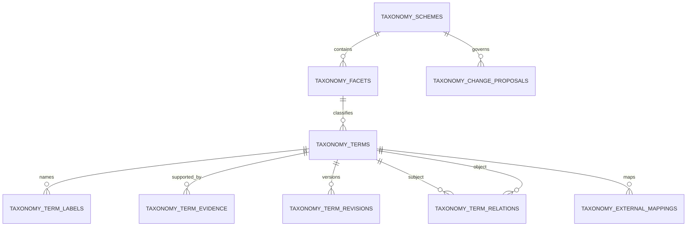
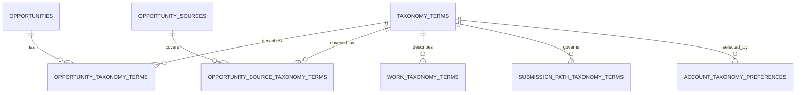
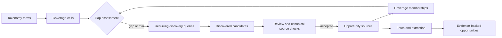

# Missa taxonomy and source-coverage schema

Status: implemented foundation; database migration not applied to production

This schema turns the practice vocabulary in `docs/missa-practice-taxonomy.md` into a durable,
versioned concept graph and uses it to drive a continuously expanding opportunity-source system.

## Design outcome

The system answers four different questions without collapsing them into one field:

1. **What is the work?** Practice family, discipline, form, genre, subgenre, medium, technique,
   mode, role, theme, audience, and language.
2. **What is the opening?** Grant, residency, festival, magazine call, award, commission, and the
   other canonical opportunity types.
3. **Who can apply?** Geography, career stage, identity, age, organisation type, education, and
   other explicit eligibility rules.
4. **Where did Missa learn this?** Official pages, application endpoints, directories, feeds,
   partner sources, source snapshots, and reviewer decisions.

No one field is allowed to substitute for another.

## Concept graph



### `taxonomy_schemes`

One named, versioned vocabulary. A scheme moves through `draft → active → superseded → archived`.
Publishing the scheme is distinct from loading seed terms.

### `taxonomy_facets`

The 12 controlled axes. Each facet has a stable key, display label, description, selection mode,
visibility, and sort order.

### `taxonomy_terms`

A stable concept record. Labels are editable; IDs are not. Terms can be active, deprecated, or
archived without breaking saved searches or historical submissions. `culturally_sensitive` marks
concepts that require community-preferred naming and provenance review.

### `taxonomy_term_labels`

Preferred labels, aliases, abbreviations, historical labels, exact source phrases, and community
names. Labels can carry language and region codes. The normalized label index powers import and
extractor resolution while preserving the displayed source phrase.

### `taxonomy_term_relations`

A directed graph rather than a single-parent tree:

- `broader` — hierarchical or contextual parent;
- `related` — useful non-hierarchical relationship;
- `exact-match` and `close-match` — vocabulary alignment;
- `replaced-by` — deprecation path;
- `requires` — a dependent concept;
- `usually-used-with` — a strong but non-mandatory pairing.

Multiple parents allow Screenwriting to belong to Writing & literature and Film & moving image,
and allow sound installation to connect sound art and installation practice.

### Provenance and governance

`taxonomy_term_evidence` stores the professional body, cultural institution, community,
publisher, academic, or official source supporting a concept or label.

`taxonomy_term_revisions` is the append-only term history. `taxonomy_change_proposals` governs
additions, renames, aliases, relation changes, deprecations, mergers, and splits. A used term is
never silently deleted.

`taxonomy_external_mappings` resolves old registry values, source phrases, external standards,
and partner vocabularies without rewriting evidence.

## Assignment model



Assignments are explicit junction tables rather than generic polymorphic rows, preserving foreign
keys and deletion behaviour.

### Opportunity assignments

Every assignment can retain:

- original source phrase and normalized phrase;
- assignment origin: source, extractor, registry, backfill, organisation, or reviewer;
- certainty: confirmed, probable, inferred, unknown, or rejected;
- primary/not-primary status;
- source evidence or snapshot;
- reviewer and review timestamp.

This permits “the publisher said speculative prose” to remain visible even when Missa maps it to
Fiction, Speculative fiction, and Hybrid writing.

### Source assignments

Source coverage is not binary. A source may specialise in, accept, sometimes carry, exclude, or
have unknown coverage of a term. Confidence and the original source phrase are retained.

### Works and submission paths

A Work can have several canonical terms. A submission path can accept, prefer, require, or exclude
terms. This supports mixed-genre portfolios, film categories, discipline-specific grant tracks,
and per-path review rules without overloading a `category` string.

### Account preferences

Preferences can include, prefer, or exclude a term and record whether the choice was explicit,
from a saved search, imported, or backfilled from the legacy arrays. This remains preference-based
matching; it is not a hidden quality or manuscript Fit score.

## Never-ending source coverage



### Coverage cells

`source_coverage_cells` represents one measurable coverage question:

```text
term set × opportunity type × geography × language × source tier
```

Example:

```text
Poetry × Grant × Nigeria × English × Tier 0 official source
```

The stable `dimension_key` prevents duplicate cells. Targets say how many total and canonical
sources are needed. Status is `unassessed`, `gap`, `thin`, `covered`, `strong`, or `blocked`.
Counts are derived from memberships so they cannot drift from reality.

### Coverage memberships

`source_coverage_memberships` links real sources to cells as canonical pages, application pages,
discovery directories, syndication feeds, professional bodies, or funders. Candidate, active,
stale, rejected, and blocked states keep source quality explicit.

### Recurring discovery

`source_discovery_queries` stores a reusable discovery instruction with locale, engine, cadence,
priority, cursor, retry state, and next-run time. It is driven by gaps, not by unbounded blind
crawling.

`source_discovery_candidates` deduplicates normalized URLs per query, scores them for review, and
records rejection, duplication, blocking, or promotion into a real source. Discovery never makes
an opportunity public by itself.

### Source health

`opportunity_sources` now separates:

- attempted, successful, and processed timestamps;
- fetched and processed content hashes;
- network and processing failure counts;
- source tier and outbound-link behaviour;
- check cadence, geography, and language;
- robots and terms-of-use status;
- health state, HTTP status, and disabling reason.

This preserves the distinction between “we checked,” “we fetched,” and “we successfully processed.”

## Seed coverage

The `@missa/taxonomy` package currently contains:

| Facet             |     Terms |
| ----------------- | --------: |
| Practice family   |        19 |
| Discipline        |       325 |
| Form              |       158 |
| Genre             |       109 |
| Subgenre          |       117 |
| Medium            |        80 |
| Technique/process |        65 |
| Mode/approach     |        40 |
| Role              |       104 |
| Theme/subject     |        40 |
| Audience          |        12 |
| Language          |        15 |
| **Total**         | **1,084** |

This is a launch seed, not a closed universe. New terms enter through governed proposals and
evidence. BCP 47 and external cultural/professional vocabularies can be mapped without changing
Missa IDs.

## Compatibility and cutover

The migration is additive. Existing fields remain:

- `opportunities.discipline`;
- `opportunities.genres[]`;
- `opportunity_call_profiles.subgenres[]`;
- `opportunity_preferences.disciplines[]` and `genres[]`;
- Radar registry `verticalId` and `disciplines`.

The seed command inserts canonical data, aliases, relations, legacy mappings, and initial revision
records. It backfills exact legacy opportunity and preference values into the junction tables while
retaining old strings for dual-read comparison.

Cutover sequence:

1. Apply `0003_canonical_taxonomy.sql` on a disposable Neon branch using the current Drizzle journal.
2. Run and audit the idempotent taxonomy seed.
3. Compare legacy arrays against canonical assignments, including ambiguous and unresolved values.
4. Add canonical read paths behind a feature flag and compare browse counts and saved searches.
5. Move extractors and source registry loading to emit source phrase plus canonical term IDs.
6. Move writes for preferences, Works, and submission paths to canonical assignments.
7. Stop writing legacy arrays only after production parity and rollback rehearsals pass.
8. Deprecate compatibility fields in a later migration; do not drop them in the expansion release.

## Operational commands

```bash
npm test --workspace=@missa/taxonomy
npm test --workspace=@missa/contracts
npm test --workspace=@missa/db

DATABASE_URL=postgresql://... npm run db:seed-taxonomy --workspace=@missa/db
```

The production seed and migration require a current live-schema inspection and a disposable-branch
rehearsal. They have not been run against production as part of this implementation.
