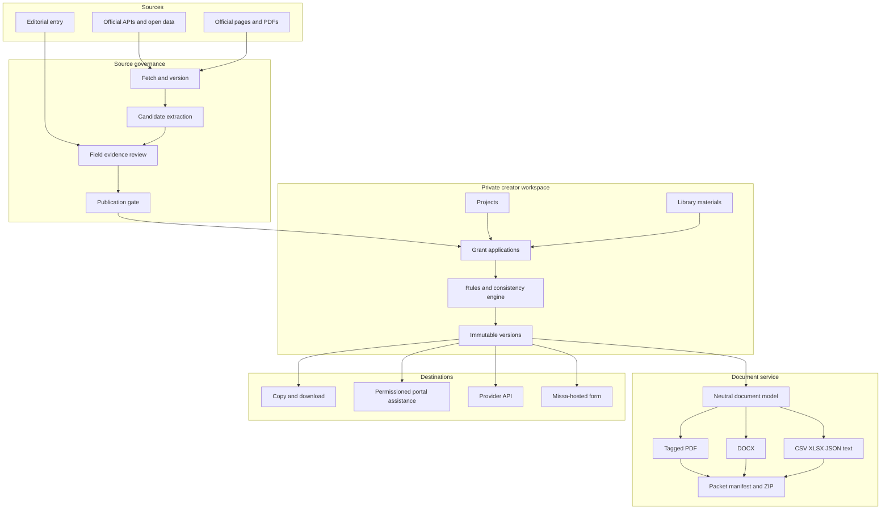

# Missa Grant Application Desk: Product and Technical Feasibility

## Executive conclusion

Missa can credibly build a grant-application product without presenting AI in the frontend and without depending on generative writing. The strongest product is a source-governed workspace that converts a published grant into a traceable requirements model, helps a creator assemble a reusable project record, checks the application for deterministic inconsistencies, produces portable documents, and preserves an immutable record of what the creator submitted.

The product should not initially promise universal in-product submission. Grant systems vary widely, authentication and registration can take weeks, multi-stage applications are common, and third-party submission interoperability is still emerging. The reliable near-term boundary is **prepare, validate, export, transfer, confirm, and track**. Direct submission should be introduced only for hosted Missa opportunities or providers with explicit, tested APIs.

The opportunity is larger than a PDF generator. It is a grant-specific extension of Missa's existing discovery, Library, Tracker, applications, reminders, source evidence, and organization identity systems. The new durable product object should be a **Project**, while each grant application is a versioned, funder-specific projection of that Project.

## 1. The problem is structural, not merely editorial

Grant applicants repeatedly encounter the same classes of difficulty:

- determining whether they are actually eligible;
- translating long or fragmented guidelines into actionable requirements;
- understanding assessment criteria;
- entering the same identity, project, budget, and evidence in different formats;
- maintaining consistency among narrative, budget, timeline, collaborators, and work samples;
- completing registrations and multi-stage portal processes;
- retaining a usable record after submission; and
- reporting on a funded project later.

This is visible in funder systems themselves. The US National Endowment for the Arts publishes separate resources for eligibility, award amounts, cost share, budgets, review criteria, discipline-specific materials, work samples, and portal use. Its current Grants for Arts Projects process can span Grants.gov and a separate NEA portal, while registrations may take several weeks.[^1] The NEA's list of common mistakes includes missing cost share, missing work samples, incomplete additional items, invalid start dates, and failure to complete both submission stages.[^2]

External research also describes duplication and administrative burden rather than writing alone. A UK study of research-funding processes found repeated information entry, inconsistent reporting requirements, complex systems, and calls for a single reusable reporting source.[^3] A 2026 UK funding-experience survey of 1,200 charity respondents found improvement in some practices but concluded that applying remained too difficult.[^4]

**Product implication:** the central value is not “better prose.” It is a coherent application system that remembers, maps, checks, and packages the creator's own work.

## 2. Recommended product definition

### The promise

> Know what the grant requires. Build your project. Leave with a complete application packet.

### The core objects

| Object | Purpose | Important boundary |
|---|---|---|
| Opportunity | Published grant facts and official destinations | Source-governed; not creator-owned |
| Guideline version | Exact source set and retrieved version used for preparation | Never silently replaced after application work begins |
| Requirement | Eligibility rule, question, attachment, budget rule, date, registration, or submission step | Carries source passage and review state |
| Project | Creator's reusable plan: premise, people, activities, budget, timeline, outcomes, evidence | Creator-owned; can serve multiple applications |
| Material | Work sample, biography, CV, letter, registration proof, quotation, or other reusable file/text | Private by default; versioned |
| Application | Mapping from one Project to one grant and guideline version | Funder-specific working object |
| Application version | Immutable snapshot of answers, numbers, mappings, and selected materials | Required for trustworthy exports and history |
| Export | PDF, DOCX, CSV/XLSX, text, JSON, or ZIP derived from a version | Records template and generation metadata |
| Submission record | Creator-confirmed or provider-confirmed event with evidence | Opening or copying to a portal is not submission |
| Outcome/report | Decision, feedback, award amount, and later reporting obligations | Private; aggregate only with consent and thresholds |

### The experience

```mermaid
flowchart LR
    A[Published grant] --> B[Save to Grant Desk]
    B --> C[Review sourced brief]
    C --> D{Fit check}
    D -->|Not eligible| E[Archive with reason]
    D -->|Unknown| F[Creator confirms facts]
    D -->|Eligible| G[Create or attach Project]
    F --> G
    G --> H[Map project to questions]
    H --> I[Budget and timeline]
    I --> J[Select evidence and files]
    J --> K[Deterministic review]
    K --> L[Freeze application version]
    L --> M[PDF / DOCX / CSV / copy / ZIP]
    M --> N[Official submission route]
    N --> O[Creator or provider confirms submission]
    O --> P[Response and reporting timeline]
    P --> Q[Outcome and learning]
```



No conversational interface is required. The frontend can be composed from a sourced grant brief, readiness checklist, Project editor, question mapper, budget table, timeline, material picker, review ledger, and export centre.

## 3. What is technically possible

### 3.1 Opportunity ingestion: feasible now

Missa can continue ingesting opportunities through a tiered source strategy:

1. official APIs and open datasets;
2. official feeds, sitemaps, and structured pages;
3. source-specific crawlers that respect site rules;
4. reviewed third-party discovery sources; and
5. manual editorial entry for high-value sources without stable machine interfaces.

Grants.gov exposes public opportunity search and detail APIs and provides staging for integrations.[^5] The UK's 360Giving standard provides structured, openly licensed award data in spreadsheets and JSON, including funder, recipient, amount, date, location, programme, and classifications.[^6] These sources are valuable but solve different problems: Grants.gov represents current opportunities; 360Giving largely describes historical awards. Historical award data can support funder and portfolio research, but does not automatically establish current eligibility or application requirements.

Crawler access must be governed per source. RFC 9309 specifies how crawlers should interpret `robots.txt`, while also clarifying that robots rules are not authorization.[^7] Missa still needs source terms, licensing, rate limits, provenance, freshness, and removal handling.

### 3.2 Guideline extraction: feasible, but must be reviewable

Grant requirements can be normalized into typed records:

- applicant type and geography;
- age, career stage, identity, discipline, and organizational-status rules;
- allowed and prohibited activities/costs;
- award range, currency, match, and co-funding rules;
- project and expenditure date windows;
- questions, word/character limits, and conditional sections;
- required and optional documents;
- work-sample types, counts, sizes, durations, and recency;
- registration and prerequisite tasks;
- assessment criteria and published weights;
- submission stages, portals, deadlines, and time zones;
- reporting and award-management obligations; and
- funder policy on AI-assisted preparation.

Extraction can use deterministic parsers, document/OCR services, or machine-assisted candidate extraction. Regardless of method, the canonical record needs the original passage, source URL/file, page or section, retrieval time, effective period, confidence type, and reviewer decision. A field without evidence should remain unknown rather than inferred.

This builds naturally on Missa's existing separation of source identity, official destination, field evidence, publication state, and human review.

### 3.3 Reusable application data: feasible and increasingly standardizable

CommonGrants is developing an open protocol for competitions, forms, application responses, and submission. Its current experimental apply routes include starting an application, retrieving forms, saving responses, and submitting; its architecture explicitly supports mapping platform-specific forms to common data models so information can be reused.[^8] This does not mean existing grant portals universally implement the protocol. It does validate Missa's proposed internal model and offers a future interoperability target.

Missa should maintain its own versioned canonical model and provide adapters rather than encoding each funder's form directly into the Project. A question mapping should record:

```text
funder question -> requested concept -> Project fields -> composed answer snapshot
```

The mapping can be manually configured at first. A shared answer is never a live reference inside a submitted application: the submitted application keeps its own immutable copy.

### 3.4 Budgets and timelines: highly feasible without generative AI

Budget assistance can be principally deterministic:

- currency and arithmetic validation;
- income equals expenditure checks where required;
- request amount within funder limits;
- percentage or fixed-match calculation;
- start/end dates within the eligible period;
- rates multiplied by units and duration;
- activities represented in both timeline and costs;
- collaborator roles represented in personnel costs;
- prohibited-cost flags;
- confirmed, pending, requested, and in-kind income separation;
- indirect-cost rule enforcement; and
- versioned assumptions and notes.

Candid describes proposal budgets as project stories told through numbers and identifies staff allocation, indirect costs, anticipated income, and in-kind support as common areas of difficulty.[^9] Missa can make these relationships explicit without judging whether a project “deserves” funding.

### 3.5 PDF and export: straightforward, with an accessibility decision

Missa can produce exports from a frozen application version on the server:

| Format | Best use | Recommended implementation |
|---|---|---|
| Accessible PDF | Review, sharing, archive, fixed presentation | Render a semantic HTML print route with Playwright/Chromium; enable tagged PDF and document outline; validate separately |
| DOCX | Collaborative editing and reuse | Generate from the same neutral document model; do not convert the PDF back into Word |
| CSV/XLSX | Budget and timeline | Typed rows, formulas or computed values, currency metadata, formula-injection protection |
| Plain text | Copying into rigid portals | Preserve question order, labels, limits, and clean line endings |
| JSON | Portability, backup, future adapters | Versioned public export schema without internal secrets |
| ZIP | Complete packet | Manifest plus explicitly selected exports and attachments; apply size and security limits |

Playwright's `page.pdf()` can generate A4 or Letter output, honor print CSS, embed an outline, and request a tagged PDF.[^10] Tagged output is necessary but not sufficient: W3C guidance emphasizes logical reading order and semantic structure.[^11] Missa should test actual text extraction, headings, tables, links, language metadata, alt text, reading order, font embedding, page breaks, and screen-reader behavior.

The application should always remain available as accessible HTML. PDF is a portable rendering, not the only accessible source.

### 3.6 External transfer and submission: possible in levels, not universally

| Level | Capability | Reliability |
|---|---|---|
| 0 | Download and copy individual answers | High |
| 1 | Copy all answers, files, and a portal checklist | High |
| 2 | Browser-assisted field matching with explicit permission | Variable; must verify saved portal state |
| 3 | Provider API starts or updates a draft | High when officially supported and tested |
| 4 | Provider API submits and returns a receipt | Highest evidence, but rare and provider-specific |
| 5 | Missa-hosted grant form | Fully controllable for participating funders |

Visible DOM filling is not proof that a controlled external form accepted or persisted data. A portal may rerender, conditionally reveal questions, reject rich-text state, require account roles, or save only after a separate action. Missa's current application-bridge experiments already show this risk. The release gate must be destination-side save-and-reopen verification, followed by a provider receipt for any submission claim.

## 4. The role of AI when the frontend has no AI

Removing AI language and chat affordances is a strong interface decision, but it does not resolve what happens to creator content behind the interface.

Current funder policies differ. UKRI expects transparency when generative AI has been used in developing an application.[^12] Canada Council acknowledges that AI may reduce application barriers while emphasizing originality, accountability, security, and concern about creators' intellectual property.[^13] NIH now says applications substantially developed by AI will not be treated as the applicant's original ideas.[^14]

Therefore Missa should classify capabilities by what they do, not whether an AI badge is visible:

| Capability | Recommended initial position |
|---|---|
| Extract public guideline facts into review candidates | Permitted internally with source evidence and human review |
| Classify grant type or requirements | Permitted with review and correction |
| Calculate budgets, dates, limits, completeness | Deterministic; preferred |
| Map a creator-selected Project field to a grant question | Deterministic or reviewed suggestion |
| Reformat creator-authored text to an exact limit | Optional later; disclose behavior and retain diff |
| Generate substantive application narrative | Exclude from the initial product |
| Predict award probability: “chance of winning” | Exclude |
| Evaluate artistic quality or creator worth | Exclude |
| Train on private applications by default | Prohibit |

Every opportunity should eventually carry a **preparation-policy record**: permitted uses, prohibited uses, disclosure requirements, source, effective date, and unknown state. The product must still work when all generative processing is disabled.

## 5. Privacy, security, and ownership

Grant applications can contain addresses, financial data, disability or health information, ethnicity, biographies, unpublished work, partner details, bank information, and identity documentation. This is not ordinary productivity data.

The baseline should be:

- private by default;
- creator ownership of authored content;
- explicit selection before any material is attached, exported, or transferred;
- encryption in transit and at rest;
- short-lived signed download URLs;
- owner-scoped authorization on every file and application query;
- retention controls and account export;
- no private content in product analytics, logs, filenames, or model training;
- separate consent for aggregate outcome learning; and
- a clear record of external processors used for OCR, document conversion, malware scanning, or any machine analysis.

For special-category data, ICO guidance emphasizes minimization, enhanced security considerations, and transparency.[^15] Data portability guidance supports providing creator data in a structured, commonly used, machine-readable form—not PDF alone.[^16]

Uploaded files require layered controls: extension allowlists, content-type and signature validation, generated storage names, size limits, authorization, storage outside the web root, malware or sandbox scanning where appropriate, and careful ZIP handling.[^17]

## 6. Using Missa to improve Missa's own grant work

Dogfooding is unusually valuable here because it can reveal both product problems and source-model gaps. It must not turn Missa's private applications into an unreviewed training set.

### A disciplined internal pilot

For every grant Missa considers applying to, record:

1. source discovery and verification time;
2. number of guideline sources and contradictions;
3. eligibility unknowns requiring human confirmation;
4. questions and conditional branches missed by extraction;
5. reusable Project fields versus grant-specific answers;
6. budget checks that caught a real inconsistency;
7. documents requested late in the process;
8. export defects and portal-copy friction;
9. actual submission evidence obtained; and
10. decision, feedback, reporting duties, and time to response.

This produces three different learning streams:

- **product telemetry:** whether features worked, using content-free event data;
- **source-quality evidence:** which grant records and requirement mappings were incomplete;
- **application outcomes:** private user data, usable in aggregate only with explicit consent and minimum cohort thresholds.

Do not infer that a phrase, budget pattern, or work sample “caused” an award. Outcomes are sparse and confounded by panel composition, applicant pool, priorities, budget, and reviewer discretion. The useful learning is operational: common missing requirements, realistic preparation time, typical stages, response timing, and which reusable materials reduce repetition.

## 7. Missa's present technical starting point

Repository inspection on 8 September 2026 shows that Missa already has substantial adjacent infrastructure:

- canonical opportunities, organization identity, guidelines and submission destinations;
- source/publication governance;
- private creator accounts and owner-scoped repositories;
- Tracker status history and user-confirmed submission state;
- Library Works, Files, and Saved Answers;
- goals, reminders, response tracking, and applications views;
- application material snapshots captured when a submission is recorded;
- private blob storage; and
- JSON/CSV Library exports.

The current `application_material_versions` model is a useful seed, but it records selected Works, Saved Answers, and Files at the submission event. It is not yet a complete authoring/version model for grant questions, budgets, timelines, guideline versions, exports, or collaborators.

Material gaps identified in current contracts and code include:

- no canonical reusable Project object;
- no typed grant-requirement schema;
- no guideline-version snapshot attached to application work;
- no versioned application-question and response model;
- no Work-version/current-version/checksum model across the full Library lifecycle;
- no export job or export artifact model;
- unresolved file upload progress, retry, duplicate detection, malware state, and transactional deletion;
- no universal external draft persistence or receipt contract; and
- no per-grant AI/preparation policy model.

The checkout is heavily modified across creator, application, design-system, ingestion, and database families. This research therefore makes no claim that observed uncommitted work is merged, deployed, or production-ready.

## 8. Proposed architecture



### Suggested service boundaries

1. **Grant source service** — existing ingestion and publication gate extended with guideline versions and requirements.
2. **Project service** — creator-owned reusable structured data and collaborators.
3. **Application service** — opportunity-specific mappings, answers, states, and immutable versions.
4. **Rules service** — typed deterministic checks with evidence and severity.
5. **Document service** — neutral document tree rendered into multiple formats.
6. **Transfer adapters** — copy package, browser helper, provider API, or hosted path.
7. **Outcome service** — private decisions, feedback, response timing, and reporting obligations.

The document service should consume a neutral document model rather than directly reading UI components. This prevents PDF, DOCX, plain-text, and portal-copy output from drifting into different application contents.

## 9. Product scope by release

### Research pilot: use Missa internally

- Choose 5–10 materially different creative grants.
- Manually produce structured requirement records with field evidence.
- Build real Missa Projects and application mappings.
- Export human-reviewable packets.
- Record every uncertainty and failure.
- Do not build universal auto-submission.

**Exit criterion:** at least three applications can be prepared from source to frozen packet without hidden spreadsheets or undocumented manual state.

### Release 1: Grant Brief and Packet

- Save a published grant to My applications.
- Sourced grant brief and requirements checklist.
- Eligibility facts separated into confirmed, creator-confirmed, unknown, and conflict.
- Link existing Works, Files, and Saved Answers.
- Simple project description, timeline, and budget.
- Deterministic completeness and arithmetic review.
- Freeze version.
- PDF, plain-text answers, budget CSV, and application JSON.
- Creator-confirmed submission and receipt upload.

### Release 2: Reusable Projects

- Canonical Project object.
- Multiple applications per Project.
- Versioned reusable narratives and materials.
- DOCX and complete packet ZIP.
- Collaborator review with scoped access.
- Guideline-change comparison.
- Reporting calendar for awarded projects.

### Release 3: Selective transfer

- Controlled browser assistance for a small audited provider set.
- Destination-side save-and-reopen verification.
- Explicit field-by-field permission and correction.
- Provider-specific failure and recovery states.
- No submission claim without a receipt or creator confirmation.

### Release 4: Grantmaker interoperability

- Missa-hosted applications for participating funders.
- CommonGrants-compatible import/export where the protocol and partner support are mature.
- Provider APIs and webhooks.
- Verified submission receipts and structured status updates.

## 10. What not to build first

- A chatbot as the primary experience.
- One-click “write my grant.”
- Probability-of-award scores.
- An unsourced eligibility verdict.
- A universal browser autofill promise.
- A single giant application form.
- PDF-only storage.
- Mutable submitted records.
- Automatic reuse of sensitive demographic answers.
- Training on private creator applications by default.
- Rankings based on a small, biased set of Missa user outcomes.

## 11. The strongest strategic position

Missa should become the **source-governed application infrastructure for creative work**, beginning with grants.

Discovery creates the acquisition loop. Projects, materials, applications, exports, submission records, and reporting create retention. Internal use creates a disciplined product-learning loop. Organization-hosted opportunities create the eventual two-sided infrastructure opportunity.

The defensible system is not an AI writer. It is the relationship among:

- verified opportunities;
- normalized requirements with field evidence;
- reusable creator Projects and materials;
- cross-document consistency;
- immutable application and submission versions;
- portable, accessible exports;
- official-destination adapters; and
- privacy-preserving outcome history.

That system remains useful if generative AI is prohibited, unavailable, distrusted, or invisible. Machine assistance can improve internal throughput later, but it should never be the foundation on which the creator's application depends.

## 12. Decisions required before implementation

1. Is Release 1 for individual creative practitioners only, or also organizations and collectives?
2. Which 5–10 grants form the internal pilot corpus across countries, disciplines, budgets, and portal types?
3. Does Missa permit any generative transformation of private application text in the first release?
4. What is the first-class Project schema, including collaborators and organizations?
5. What constitutes an approved guideline version and who reviews conflicts?
6. Which export formats are contractual for Release 1?
7. What is the retention and deletion policy for application versions, receipts, and sensitive eligibility data?
8. Which submission evidence levels may change status automatically?
9. What aggregated outcome data may be used, under what consent and cohort thresholds?
10. Is grantmaker-hosted intake a later business line, or explicitly outside the current strategy?

## Sources

[^1]: National Endowment for the Arts, [“Grants for Arts Projects”](https://www.arts.gov/grants/grants-for-arts-projects) and [Applicant Resources](https://www.arts.gov/grants/grants-for-arts-projects/applicant-resources), accessed 8 September 2026.
[^2]: National Endowment for the Arts, [“Common Application Mistakes”](https://www.arts.gov/grants/grants-for-arts-projects/common-application-mistakes), accessed 8 September 2026.
[^3]: BMJ Open, [“Online survey exploring researcher experiences of research funding processes in the UK”](https://doi.org/10.1136/bmjopen-2023-079581), 2024.
[^4]: Institute for Voluntary Action Research, [“Searching for Life Rafts: The Funding Experience Survey 2026”](https://www.ivar.org.uk/publication/funding-experience-survey-26/), May 2026.
[^5]: Grants.gov, [API Resources](https://www.grants.gov/api) and [API Guide](https://www.grants.gov/api/api-guide), accessed 8 September 2026.
[^6]: 360Giving, [“About our Data Standard”](https://www.360giving.org/about/model/our-data-standard/) and [Technical Reference](https://standard.threesixtygiving.org/en/latest/technical/reference/), accessed 8 September 2026.
[^7]: IETF, [RFC 9309: Robots Exclusion Protocol](https://www.rfc-editor.org/rfc/rfc9309.html), September 2022.
[^8]: CommonGrants, [Protocol Specification](https://commongrants.org/protocol/specification/), [Apply Models and Routes RFC](https://commongrants.org/governance/rfc/0002/), and [Apply Endpoints ADR](https://commongrants.org/governance/adr/0018-apply-endpoints/), accessed 8 September 2026. Apply endpoints are experimental.
[^9]: Candid, [“Creating a Sound Proposal Budget”](https://learning.candid.org/creating-a-sound-proposal-budget) and [“The Basics of Building a Nonprofit Budget”](https://candid.org/blogs/the-basics-of-building-a-nonprofit-budget/), accessed 8 September 2026.
[^10]: Microsoft, [Playwright `page.pdf()` documentation](https://playwright.dev/docs/api/class-page#page-pdf), accessed 8 September 2026.
[^11]: W3C Web Accessibility Initiative, [PDF Techniques](https://www.w3.org/WAI/WCAG22/Techniques/#pdf) and [PDF3: Correct Tab and Reading Order](https://www.w3.org/WAI/WCAG22/Techniques/pdf/PDF3), accessed 8 September 2026.
[^12]: UK Research and Innovation, [“Generative artificial intelligence in application and assessment policy”](https://www.ukri.org/publications/generative-artificial-intelligence-in-application-and-assessment-policy/), updated 6 July 2026.
[^13]: Canada Council for the Arts, [“Guidance on the Use of Artificial Intelligence in Grant Applications”](https://canadacouncil.ca/funding/grants/guide/apply-to-programs/guidance-on-the-use-of-artificial-intelligence-in-grant-applications), 12 December 2025.
[^14]: US National Institutes of Health, [“Supporting Fairness and Originality in NIH Research Applications”](https://grants.nih.gov/grants/guide/notice-files/NOT-OD-25-132.html), 17 July 2025.
[^15]: UK Information Commissioner's Office, [“What are the rules on special category data?”](https://ico.org.uk/for-organisations/uk-gdpr-guidance-and-resources/lawful-basis/special-category-data/what-are-the-rules-on-special-category-data/), accessed 8 September 2026.
[^16]: UK Information Commissioner's Office, [“Right to data portability”](https://ico.org.uk/for-organisations/uk-gdpr-guidance-and-resources/individual-rights/individual-rights/right-to-data-portability/), accessed 8 September 2026.
[^17]: OWASP, [“File Upload Cheat Sheet”](https://cheatsheetseries.owasp.org/cheatsheets/File_Upload_Cheat_Sheet.html), accessed 8 September 2026.
